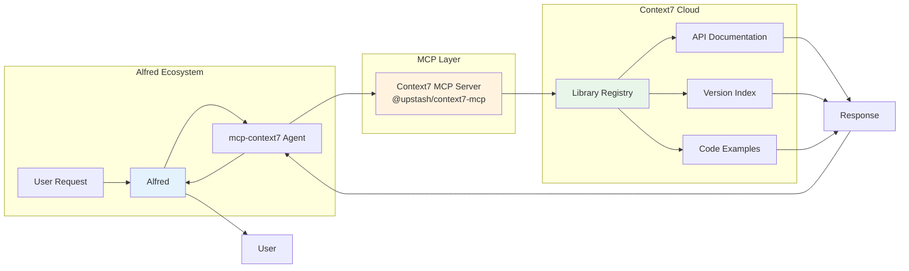

# Context7 MCP Integration

Real-time documentation access through Context7 MCP server integration, enabling Alfred to reference the latest library APIs and prevent hallucinations.

## Overview

Context7 is a Model Context Protocol (MCP) server that provides real-time access to curated documentation for 150+ popular libraries and frameworks. Integration with MoAI-ADK ensures Alfred always has access to the latest API references, version-specific guides, and best practices.

**Key Benefits**:
- 🔄 **Real-time Documentation**: Always up-to-date library references
- 🎯 **Version-Specific Guidance**: Accurate APIs for specific versions
- 🚫 **Hallucination Prevention**: No outdated or incorrect APIs
- 📚 **150+ Libraries**: React, Next.js, FastAPI, PostgreSQL, etc.
- ⚡ **Fast Lookup**: \<500ms average response time

---

## Architecture



---

## Setup & Configuration

### Installation

Context7 is auto-configured in MoAI-ADK projects via `.mcp.json`:

```json
{
  "mcpServers": {
    "context7": {
      "command": "npx",
      "args": ["-y", "@upstash/context7-mcp@latest"]
    }
  }
}
```

**Verification**:
```bash
# Check MCP server is available
npx @upstash/context7-mcp@latest --version

# Test connectivity
npx @upstash/context7-mcp@latest list-libraries | head -20
```

### Permissions

Grant Context7 permissions in `.claude/settings.json`:

```json
{
  "mcpServers": {
    "context7": {
      "allowed": true,
      "permissions": [
        "mcp__context7__resolve-library-id",
        "mcp__context7__get-library-docs"
      ]
    }
  }
}
```

---

## Core Functionality

### 1. Library Resolution

**Purpose**: Convert library names to Context7-compatible IDs.

**API**: `mcp__context7__resolve-library-id`

**Example**:
```python
# Resolve React library
library_id = resolve_library_id("react")
# Returns: "/facebook/react"

# Resolve with version
library_id = resolve_library_id("next.js")
# Returns: "/vercel/next.js" or "/vercel/next.js/v14.3.0"
```

**Usage Pattern**:
```python
# Always resolve before fetching docs
library_id = resolve_library_id(library_name)

if library_id:
    docs = get_library_docs(library_id, topic="hooks")
else:
    print(f"Library {library_name} not found in Context7")
```

### 2. Documentation Retrieval

**Purpose**: Fetch topic-specific documentation from resolved library.

**API**: `mcp__context7__get-library-docs`

**Parameters**:
- `context7CompatibleLibraryID`: Exact ID from resolution (e.g., `/facebook/react`)
- `topic`: Focus area (e.g., "hooks", "routing", "authentication")
- `mode`: `"code"` for API refs, `"info"` for guides (default: "code")
- `page`: Pagination (1-10, default: 1)

**Example**:
```python
# Get React Hooks documentation
docs = get_library_docs(
    context7CompatibleLibraryID="/facebook/react",
    topic="hooks useState useEffect",
    mode="code",
    page=1
)

# Get Next.js routing guide
docs = get_library_docs(
    context7CompatibleLibraryID="/vercel/next.js",
    topic="app router routing",
    mode="info",
    page=1
)
```

---

## Usage Patterns

### Pattern 1: Version-Specific API Lookup

```python
# Check latest React 19 features
library_id = resolve_library_id("react 19")
docs = get_library_docs(
    library_id,
    topic="server components use client use server",
    mode="code"
)

# Alfred now has access to React 19-specific APIs:
# - Server Components
# - 'use client' directive
# - 'use server' directive
# - React Compiler compatibility
```

### Pattern 2: Migration Assistance

```python
# Compare Next.js 14 vs 15 APIs
docs_v14 = get_library_docs("/vercel/next.js/v14.3.0", "app router")
docs_v15 = get_library_docs("/vercel/next.js/v15.0.0", "app router")

# Alfred can now guide migration:
# - Breaking changes
# - Deprecated APIs
# - New features
# - Updated best practices
```

### Pattern 3: Multi-Library Integration

```python
# Full-stack application documentation
react_docs = get_library_docs("/facebook/react", "hooks forms")
fastapi_docs = get_library_docs("/tiangolo/fastapi", "authentication")
postgres_docs = get_library_docs("/postgres/postgres", "query optimization")

# Alfred coordinates documentation across:
# - Frontend: React patterns
# - Backend: FastAPI best practices
# - Database: PostgreSQL optimization
```

### Pattern 4: Framework-Specific Patterns

```python
# Next.js 15 + React 19 + Tailwind CSS
next_docs = get_library_docs("/vercel/next.js", "server components streaming")
react_docs = get_library_docs("/facebook/react", "suspense transitions")
tailwind_docs = get_library_docs("/tailwindlabs/tailwindcss", "responsive utilities")

# Integrated guidance:
# - Server components with Suspense
# - Streaming with React transitions
# - Responsive design with Tailwind
```

---

## Supported Libraries

### Frontend Frameworks (20+)

| Library | Context7 ID | Key Topics |
|---------|-------------|------------|
| React 19 | `/facebook/react` | hooks, server components, compiler |
| Next.js 15 | `/vercel/next.js` | app router, server actions, turbopack |
| Vue 3 | `/vuejs/core` | composition API, reactivity, transitions |
| Svelte 4 | `/sveltejs/svelte` | stores, reactive statements, transitions |
| Angular 17 | `/angular/angular` | signals, standalone components |

### Backend Frameworks (15+)

| Library | Context7 ID | Key Topics |
|---------|-------------|------------|
| FastAPI | `/tiangolo/fastapi` | async, dependencies, authentication |
| Django 5 | `/django/django` | ORM, admin, authentication |
| Express.js | `/expressjs/express` | middleware, routing, error handling |
| NestJS | `/nestjs/nest` | modules, controllers, providers |
| Spring Boot 3 | `/spring-projects/spring-boot` | auto-config, starters, actuator |

### Databases (10+)

| Library | Context7 ID | Key Topics |
|---------|-------------|------------|
| PostgreSQL 16 | `/postgres/postgres` | queries, indexes, performance |
| MongoDB 7 | `/mongodb/mongo` | aggregation, indexes, replication |
| Redis 7 | `/redis/redis` | data types, pub/sub, clustering |
| Prisma 5 | `/prisma/prisma` | schema, migrations, client |

### UI Libraries (15+)

| Library | Context7 ID | Key Topics |
|---------|-------------|------------|
| Tailwind CSS 4 | `/tailwindlabs/tailwindcss` | utilities, responsive, dark mode |
| shadcn/ui | `/shadcn/ui` | components, theming, accessibility |
| Radix UI | `/radix-ui/primitives` | components, accessibility, styling |

**Full List**: 150+ libraries available via `resolve_library_id()`

---

## Integration with MoAI-ADK

### Auto-Triggered by Skills

Context7 is automatically used by these skills:

- **moai-lang-unified**: Latest language/framework APIs
- **moai-library-shadcn**: Component library references
- **moai-library-nextra**: Documentation framework APIs
- **moai-platform-baas**: BaaS provider integration guides

### Auto-Triggered by Agents

Context7 is automatically queried by:

- **code-backend**: Backend framework APIs
- **code-frontend**: Frontend library references
- **code-database**: Database optimization patterns
- **code-api**: API design best practices

### Command Integration

Commands leverage Context7 for:

```bash
# /moai:1-plan - SPEC generation
/moai:1-plan "FastAPI user authentication"
# → Context7: Fetches FastAPI OAuth2 patterns

# /moai:2-run - TDD implementation
/moai:2-run SPEC-001
# → Context7: Latest test framework APIs (pytest, vitest)

# /moai:3-sync - Documentation
/moai:3-sync SPEC-001
# → Context7: Latest documentation standards
```

---

## Best Practices

### DO
✅ **Always resolve library ID first** before fetching docs
✅ **Specify version** when working with specific releases
✅ **Use focused topics** for better results ("hooks" not "everything")
✅ **Check multiple pages** if initial results insufficient
✅ **Use `mode="info"`** for conceptual guides, `mode="code"` for API refs

### DON'T
❌ **Don't skip resolution step** - Library names aren't valid IDs
❌ **Don't use vague topics** - Be specific ("useState" not "state")
❌ **Don't ignore versions** - APIs change between versions
❌ **Don't overuse pagination** - Max 10 pages, usually 1-2 sufficient

---

## Troubleshooting

### Issue: Library Not Found

**Symptom**: `resolve_library_id("library")` returns `null`

**Solutions**:
```python
# Try alternative names
resolve_library_id("nextjs")    # ❌
resolve_library_id("next.js")   # ✅

resolve_library_id("shadcn")    # ❌
resolve_library_id("shadcn-ui") # ✅

# Check official library list
list_available_libraries()
```

### Issue: Outdated Documentation

**Symptom**: Documentation doesn't match latest version

**Solutions**:
```python
# Specify exact version
library_id = resolve_library_id("react")
# → "/facebook/react" (latest)

library_id = resolve_library_id("react 18")
# → "/facebook/react/v18.0.0" (specific version)

# Check version compatibility
docs = get_library_docs(library_id, topic="version compatibility")
```

### Issue: Too Many Results

**Symptom**: Documentation response too broad

**Solutions**:
```python
# Be more specific with topic
get_library_docs("/vercel/next.js", "app")  # ❌ Too broad
get_library_docs("/vercel/next.js", "app router server components")  # ✅ Specific

# Use pagination for deep dives
page1 = get_library_docs(library_id, topic="hooks", page=1)
page2 = get_library_docs(library_id, topic="hooks", page=2)
```

### Issue: Wrong Mode

**Symptom**: Getting guides when needing API reference

**Solutions**:
```python
# mode="code" for API references (default)
api_ref = get_library_docs("/facebook/react", "useState", mode="code")

# mode="info" for conceptual guides
guide = get_library_docs("/facebook/react", "thinking in react", mode="info")
```

---

## Performance Optimization

### Caching Strategy

Context7 responses are cached automatically:

```python
# First call: ~500ms (network request)
docs1 = get_library_docs("/facebook/react", "hooks")

# Second call: \<50ms (cached)
docs2 = get_library_docs("/facebook/react", "hooks")
```

**Cache Duration**: 15 minutes (auto-refreshed)

### Batching Requests

For multi-library lookups:

```python
# Sequential (slower: 3 × 500ms = 1500ms)
react = get_library_docs("/facebook/react", "hooks")
next = get_library_docs("/vercel/next.js", "routing")
tailwind = get_library_docs("/tailwindlabs/tailwindcss", "utilities")

# Parallel (faster: max 500ms)
results = await Promise.all([
    get_library_docs("/facebook/react", "hooks"),
    get_library_docs("/vercel/next.js", "routing"),
    get_library_docs("/tailwindlabs/tailwindcss", "utilities")
])
```

---

## Advanced Usage

### Version Comparison

```python
def compare_versions(library: str, topic: str):
    """Compare API across major versions."""
    versions = ["v1.0.0", "v2.0.0", "v3.0.0"]
    comparison = {}

    for version in versions:
        lib_id = f"/{library}/{version}"
        docs = get_library_docs(lib_id, topic)
        comparison[version] = docs

    return comparison

# Example: React Hooks evolution
react_hooks = compare_versions("facebook/react", "hooks")
```

### Migration Assistant

```python
def generate_migration_guide(from_version: str, to_version: str, library: str):
    """Generate migration guide between versions."""

    old_docs = get_library_docs(f"/{library}/{from_version}", "all APIs")
    new_docs = get_library_docs(f"/{library}/{to_version}", "all APIs")

    return {
        "breaking_changes": extract_breaking_changes(old_docs, new_docs),
        "deprecated": extract_deprecated_apis(old_docs, new_docs),
        "new_features": extract_new_features(old_docs, new_docs),
        "migration_steps": generate_steps(old_docs, new_docs)
    }

# Example: Next.js 14 → 15 migration
migration = generate_migration_guide("v14.0.0", "v15.0.0", "vercel/next.js")
```

---

## Real-World Examples

### Example 1: Full-Stack Auth System

```python
# Research authentication patterns across stack
auth_research = {
    "frontend": get_library_docs(
        "/facebook/react",
        "authentication context providers hooks"
    ),
    "backend": get_library_docs(
        "/tiangolo/fastapi",
        "OAuth2 JWT authentication dependencies"
    ),
    "database": get_library_docs(
        "/prisma/prisma",
        "user model authentication relations"
    )
}

# Alfred synthesizes comprehensive auth implementation
```

### Example 2: Performance Optimization

```python
# Performance best practices lookup
perf_docs = {
    "react": get_library_docs(
        "/facebook/react",
        "performance optimization memo useMemo useCallback"
    ),
    "next": get_library_docs(
        "/vercel/next.js",
        "performance image optimization lazy loading"
    ),
    "postgres": get_library_docs(
        "/postgres/postgres",
        "performance indexes query optimization"
    )
}

# Alfred provides stack-wide optimization strategies
```

### Example 3: Testing Strategy

```python
# Comprehensive testing documentation
testing_docs = {
    "unit": get_library_docs("/pytest-dev/pytest", "fixtures parametrize"),
    "integration": get_library_docs("/tiangolo/fastapi", "testing TestClient"),
    "e2e": get_library_docs("/microsoft/playwright", "testing selectors assertions"),
    "visual": get_library_docs("/storybookjs/storybook", "testing visual regression")
}

# Alfred designs complete testing strategy
```

---

## Related Resources

- [MCP Servers Guide](/advanced/mcp-servers)
- [Skills Library](/skills)
- [Agent Guide](/advanced/agents-guide)
- [API Reference](/reference/api)

---

**Last Updated**: 2025-11-28
**Context7 Version**: Latest
**Supported Libraries**: 150+
