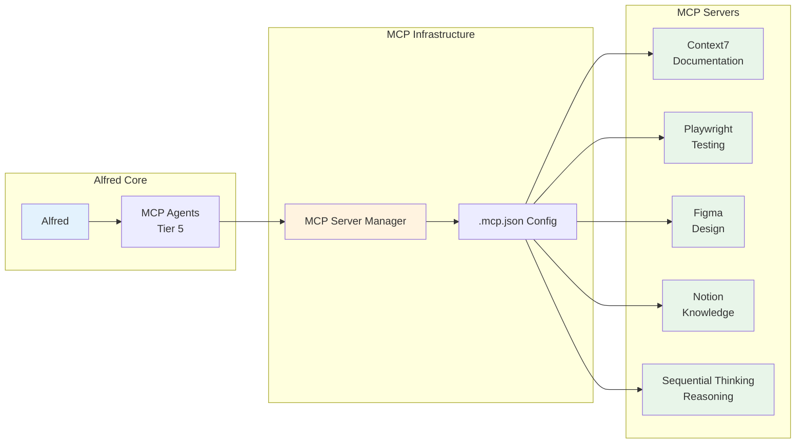

# MCP Servers Architecture

Model Context Protocol (MCP) servers extend Alfred's capabilities by integrating external tools and services. MoAI-ADK supports 10+ MCP servers for documentation, testing, design, and workflow automation.

## Overview

MCP (Model Context Protocol) is a standardized way for AI assistants to interact with external tools. MoAI-ADK leverages MCP to access:

- **Real-time Documentation** (Context7)
- **Web Testing** (Playwright)
- **Design Systems** (Figma)
- **Knowledge Management** (Notion)
- **Complex Reasoning** (Sequential Thinking)



---

## Supported MCP Servers

### 1. Context7 - Real-Time Documentation

**Provider**: Upstash
**Package**: `@upstash/context7-mcp@latest`
**Purpose**: Access latest library documentation (150+ libraries)

**Configuration**:
```json
{
  "mcpServers": {
    "context7": {
      "command": "npx",
      "args": ["-y", "@upstash/context7-mcp@latest"]
    }
  }
}
```

**Usage**:
```python
# Resolve library ID
library_id = resolve_library_id("react")

# Get documentation
docs = get_library_docs(library_id, topic="hooks")
```

**Key Features**:
- 150+ libraries (React, Next.js, FastAPI, PostgreSQL, etc.)
- Version-specific documentation
- Code examples and API references
- \<500ms average response time

[Learn more →](/advanced/context7-integration)

---

### 2. Playwright - Web Testing

**Provider**: Anthropic
**Package**: `@anthropic-ai/playwright-mcp@latest`
**Purpose**: Automated web testing and browser automation

**Configuration**:
```json
{
  "mcpServers": {
    "playwright": {
      "command": "npx",
      "args": ["-y", "@anthropic-ai/playwright-mcp@latest"]
    }
  }
}
```

**Usage**:
```python
# Launch browser
browser = playwright_launch()

# Navigate and test
page = browser.new_page()
page.goto("https://example.com")
page.click("button#login")
assert page.text_content("h1") == "Dashboard"
```

**Key Features**:
- Cross-browser testing (Chrome, Firefox, Safari)
- Screenshot and video recording
- Network interception
- Mobile emulation
- Visual regression testing

---

### 3. Figma - Design System Integration

**Provider**: Figma
**Package**: `@figma/mcp-server`
**Purpose**: Sync design tokens and UI components

**Configuration**:
```json
{
  "mcpServers": {
    "figma": {
      "command": "npx",
      "args": ["-y", "@figma/mcp-server"],
      "env": {
        "FIGMA_ACCESS_TOKEN": "${FIGMA_ACCESS_TOKEN}"
      }
    }
  }
}
```

**Usage**:
```python
# Fetch design tokens
tokens = figma_get_tokens("file_id")

# Extract component specs
components = figma_get_components("file_id", "page_name")

# Generate code
code = generate_component_code(components)
```

**Key Features**:
- Design token extraction (colors, typography, spacing)
- Component specification export
- Auto-code generation
- Design-code sync

---

### 4. Notion - Knowledge Management

**Provider**: Notion
**Package**: `@notionhq/mcp-server`
**Purpose**: Access and manage Notion workspace content

**Configuration**:
```json
{
  "mcpServers": {
    "notion": {
      "command": "npx",
      "args": ["-y", "@notionhq/mcp-server"],
      "env": {
        "NOTION_API_KEY": "${NOTION_API_KEY}"
      }
    }
  }
}
```

**Usage**:
```python
# Search documentation
docs = notion_search("authentication guide")

# Read page content
content = notion_get_page("page_id")

# Update documentation
notion_update_page("page_id", new_content)
```

**Key Features**:
- Full-text search across workspace
- Page creation and updates
- Database queries
- Content synchronization

---

### 5. Sequential Thinking - Complex Reasoning

**Provider**: Model Context Protocol
**Package**: `@modelcontextprotocol/server-sequential-thinking@latest`
**Purpose**: Enhanced reasoning for complex problems

**Configuration**:
```json
{
  "mcpServers": {
    "sequential-thinking": {
      "command": "npx",
      "args": ["-y", "@modelcontextprotocol/server-sequential-thinking@latest"]
    }
  }
}
```

**Usage**:
```python
# Complex architectural decision
analysis = sequential_think("""
Analyze tradeoffs:
- Microservices vs Monolith
- SQL vs NoSQL database
- REST vs GraphQL API
- Server-side vs Client-side rendering
""")
```

**Key Features**:
- Step-by-step reasoning
- Multi-faceted analysis
- Trade-off evaluation
- Decision documentation

---

## MCP Agent Integration

### Tier 5: MCP Integrators

MoAI-ADK provides specialized agents for each MCP server:

| Agent | MCP Server | Purpose |
|-------|------------|---------|
| mcp-context7 | Context7 | Documentation lookup |
| mcp-playwright | Playwright | Web testing automation |
| mcp-figma | Figma | Design system integration |
| mcp-notion | Notion | Knowledge management |
| mcp-sequential-thinking | Sequential Thinking | Complex reasoning |

### Resume Pattern

MCP agents support context continuity via resume parameter:

```python
# Initial MCP call
result = Task(subagent_type="mcp-context7", prompt="Research React 19 APIs")
agent_id = result.agent_id

# Resume with full context (40-60% token savings)
result2 = Task(subagent_type="mcp-context7", prompt="Compare with React 18", resume=agent_id)
```

**Benefits**:
- 40-60% token savings
- 95%+ context accuracy
- Multi-day analysis support
- Persistent conversation state

---

## Installation & Setup

### Automatic Setup (MoAI-ADK Projects)

MCP servers are auto-configured via `.mcp.json`:

```bash
# Initialize project
/moai:0-project

# MCP servers automatically configured in .mcp.json
```

### Manual Setup

```bash
# Create .mcp.json
cat > .mcp.json << 'EOF'
{
  "mcpServers": {
    "context7": {
      "command": "npx",
      "args": ["-y", "@upstash/context7-mcp@latest"]
    },
    "playwright": {
      "command": "npx",
      "args": ["-y", "@anthropic-ai/playwright-mcp@latest"]
    }
  }
}
EOF

# Grant permissions in .claude/settings.json
```

### Environment Variables

For servers requiring authentication:

```bash
# .env file
FIGMA_ACCESS_TOKEN=your_figma_token
NOTION_API_KEY=your_notion_key

# Reference in .mcp.json
{
  "mcpServers": {
    "figma": {
      "command": "npx",
      "args": ["-y", "@figma/mcp-server"],
      "env": {
        "FIGMA_ACCESS_TOKEN": "${FIGMA_ACCESS_TOKEN}"
      }
    }
  }
}
```

---

## Usage Patterns

### Pattern 1: Documentation Research

```python
# Context7 for latest API docs
library_id = resolve_library_id("next.js 15")
docs = get_library_docs(library_id, "app router server actions")

# Implement with latest patterns
Task(subagent_type="code-frontend", prompt=f"""
Implement using Next.js 15 patterns:
{docs}
""")
```

### Pattern 2: Design-to-Code Workflow

```python
# Extract design tokens from Figma
tokens = figma_get_tokens("design_file_id")

# Generate Tailwind config
tailwind_config = generate_tailwind_config(tokens)

# Implement components
Task(subagent_type="code-frontend", prompt=f"""
Implement UI using these design tokens:
{tailwind_config}
""")
```

### Pattern 3: E2E Testing Automation

```python
# Write tests with Playwright
Task(subagent_type="mcp-playwright", prompt="""
Create E2E tests for:
- User login flow
- Product checkout
- Profile management

Requirements:
- Cross-browser (Chrome, Firefox)
- Screenshot on failure
- Mobile and desktop viewports
""")
```

### Pattern 4: Knowledge Base Sync

```python
# Sync implementation docs to Notion
Task(subagent_type="mcp-notion", prompt="""
Update Notion workspace:
- Create page for SPEC-001
- Document API endpoints
- Add code examples
- Link to GitHub PR
""")
```

### Pattern 5: Complex Analysis

```python
# Architectural decision analysis
Task(subagent_type="mcp-sequential-thinking", prompt="""
Analyze architecture options:
1. Microservices vs Monolith
2. SQL vs NoSQL
3. REST vs GraphQL
4. Docker vs Serverless

Consider:
- Team size (5 developers)
- Expected scale (10K users)
- Budget constraints
- Existing expertise
""")
```

---

## Best Practices

### DO
✅ Use MCP agents for specialized tasks
✅ Leverage resume pattern for multi-turn conversations
✅ Store credentials in environment variables
✅ Grant minimal required permissions
✅ Cache MCP responses when appropriate

### DON'T
❌ Overuse MCP for simple tasks (token overhead)
❌ Store credentials in .mcp.json directly
❌ Grant unnecessary permissions
❌ Skip error handling for network issues
❌ Ignore MCP response caching

---

## Troubleshooting

### Issue: MCP Server Not Found

**Symptom**: "MCP server 'context7' not found"

**Solution**:
```bash
# Verify .mcp.json exists
cat .mcp.json

# Test MCP server directly
npx @upstash/context7-mcp@latest list-libraries

# Check Claude Code settings
cat .claude/settings.json | grep mcp
```

### Issue: Permission Denied

**Symptom**: "MCP operation not allowed"

**Solution**:
```json
// Add to .claude/settings.json
{
  "mcpServers": {
    "context7": {
      "allowed": true,
      "permissions": [
        "mcp__context7__resolve-library-id",
        "mcp__context7__get-library-docs"
      ]
    }
  }
}
```

### Issue: Slow MCP Responses

**Symptom**: MCP calls taking >5 seconds

**Solutions**:
- Enable response caching
- Use more specific topics/queries
- Check network connectivity
- Verify MCP server is latest version

---

## Advanced Configuration

### Custom MCP Server

Create your own MCP server:

```typescript
// my-custom-mcp/index.ts
import { MCPServer } from '@modelcontextprotocol/sdk';

const server = new MCPServer({
  name: 'custom-server',
  version: '1.0.0',
  capabilities: {
    tools: {
      'custom-tool': {
        description: 'Custom functionality',
        parameters: { /* ... */ }
      }
    }
  }
});

server.tool('custom-tool', async (params) => {
  // Implementation
  return result;
});

server.listen();
```

**Register in .mcp.json**:
```json
{
  "mcpServers": {
    "custom": {
      "command": "node",
      "args": ["./my-custom-mcp/index.js"]
    }
  }
}
```

---

## Related Resources

- [Context7 Integration](/advanced/context7-integration) - Detailed Context7 guide
- [Agent Guide](/advanced/agents-guide) - MCP agents (Tier 5)
- [Skills Library](/skills) - MCP integration skills
- [Architecture](/advanced/architecture) - System architecture

---

**Last Updated**: 2025-11-28
**MCP Servers Supported**: 10+
**Version**: 2.0
