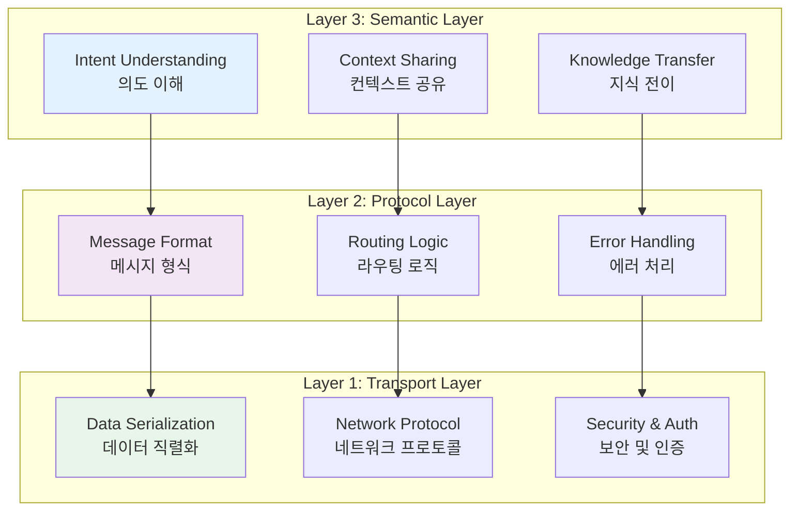
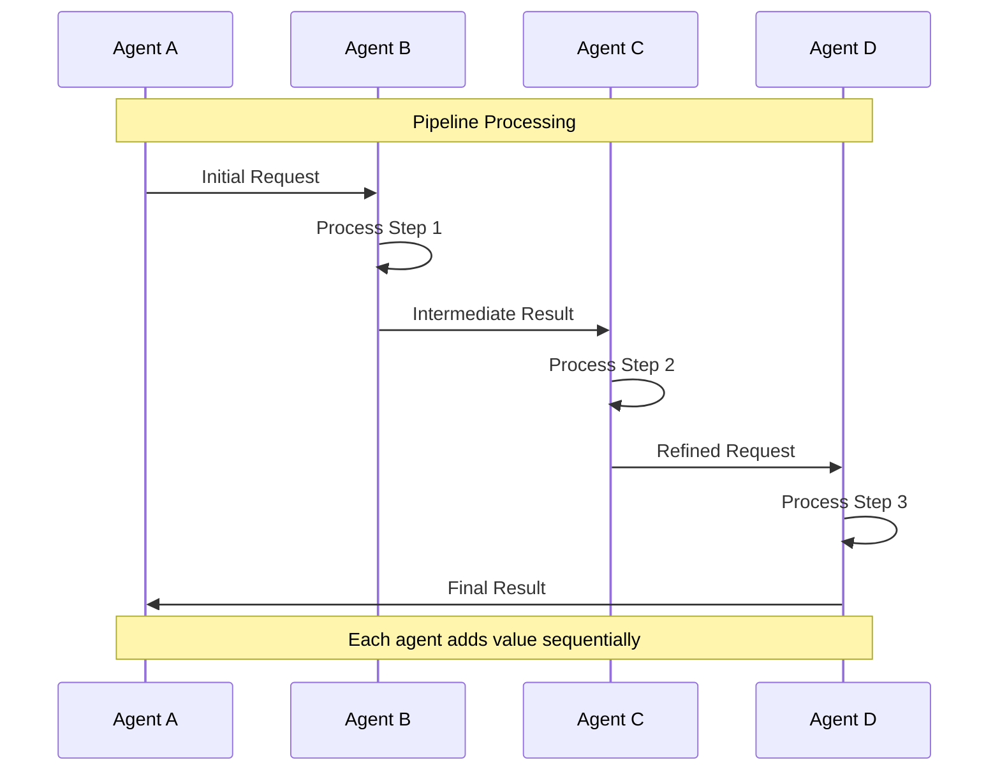

# 에이전트 통신 프로토콜

다중 에이전트 시스템의 성공은 에이전트 간의 **효율적인 통신**에 달려 있습니다. MoAI-ADK는 Anthropic의 연구를 기반으로 표준화된 통신 프로토콜과 데이터 교환 형식을 구현했습니다.

## 🎯 통신 아키텍처 개요

### 3계층 통신 모델



## 📨 메시지 형식 및 프로토콜

### 표준 메시지 구조

```python
class AgentMessage:
    """에이전트 간 표준 메시지 형식"""

    def __init__(self):
        self.header = {
            "message_id": str(uuid.uuid4()),
            "sender": "",
            "receiver": "",
            "timestamp": datetime.now().isoformat(),
            "message_type": "",  # request, response, notification, broadcast
            "priority": "normal",  # low, normal, high, critical
            "correlation_id": ""  # For message chains
        }

        self.payload = {
            "intent": "",
            "data": {},
            "context": {},
            "requirements": {},
            "constraints": {}
        }

        self.metadata = {
            "estimated_tokens": 0,
            "processing_time": 0,
            "retry_count": 0,
            "dependencies": []
        }

    def to_toon(self) -> str:
        """TOON 형식으로 직렬화 (토큰 효율성)"""
        toon_data = {
            "id": self.header["message_id"],
            "from": self.header["sender"],
            "to": self.header["receiver"],
            "type": self.header["message_type"],
            "intent": self.payload["intent"],
            "data": self._serialize_data(self.payload["data"])
        }
        return encode_toon(toon_data)

    @staticmethod
    def _serialize_data(data: dict) -> str:
        """데이터를 TOON 형식으로 직렬화"""
        if not data:
            return ""

        pairs = []
        for key, value in data.items():
            if isinstance(value, dict):
                nested_pairs = [f"{k}|{v}" for k, v in value.items()]
                pairs.append(f"{key}:{','.join(nested_pairs)}")
            elif isinstance(value, list):
                pairs.append(f"{key}:{'|'.join(map(str, value))}")
            else:
                pairs.append(f"{key}:{value}")

        return ','.join(pairs)
```

### 통신 프로토콜 유형

#### 1. 요청-응답 (Request-Response)

```python
class RequestResponseProtocol:
    """동기 요청-응답 프로토콜"""

    async def send_request(self, receiver: str, request: AgentMessage) -> AgentMessage:
        """요청 전송 및 응답 대기"""

        # 타임아웃 설정
        timeout = self.calculate_timeout(request)

        try:
            # 요청 전송
            await self.transport_layer.send(receiver, request)

            # 응답 대기
            response = await self.wait_for_response(
                correlation_id=request.header["correlation_id"],
                timeout=timeout
            )

            return response

        except TimeoutError:
            # 재시도 로직
            return await self.retry_request(request)

    def calculate_timeout(self, request: AgentMessage) -> float:
        """요청 복잡도에 따른 타임아웃 계산"""
        base_timeout = 30  # seconds
        complexity_factor = len(request.payload["data"]) / 100

        return base_timeout + (complexity_factor * 10)
```

#### 2. 발행-구독 (Publish-Subscribe)

```python
class PublishSubscribeProtocol:
    """비동기 발행-구독 프로토콜"""

    def __init__(self):
        self.subscriptions = {}
        self.message_queue = asyncio.Queue()

    async def publish(self, topic: str, message: AgentMessage):
        """메시지 발행"""

        subscribers = self.subscriptions.get(topic, [])

        # 병렬로 모든 구독자에게 전송
        tasks = [
            self.transport_layer.send(subscriber, message)
            for subscriber in subscribers
        ]

        await asyncio.gather(*tasks, return_exceptions=True)

    async def subscribe(self, topic: str, subscriber: str):
        """토픽 구독"""

        if topic not in self.subscriptions:
            self.subscriptions[topic] = []

        self.subscriptions[topic].append(subscriber)

    # 토픽 예시
    TOPICS = {
        "security.alerts": "보안 관련 알림",
        "performance.metrics": "성능 지표",
        "code.changes": "코드 변경 사항",
        "test.results": "테스트 결과",
        "deployment.events": "배포 이벤트"
    }
```

#### 3. 스트리밍 (Streaming)

```python
class StreamingProtocol:
    """대용량 데이터 스트리밍 프로토콜"""

    async def stream_data(self, receiver: str, data_stream: AsyncIterator):
        """데이터 스트리밍"""

        stream_id = str(uuid.uuid4())

        # 스트림 시작 메시지
        start_message = AgentMessage()
        start_message.header["message_type"] = "stream_start"
        start_message.payload["stream_id"] = stream_id
        await self.transport_layer.send(receiver, start_message)

        # 데이터 청크 전송
        async for chunk in data_stream:
            chunk_message = AgentMessage()
            chunk_message.header["message_type"] = "stream_chunk"
            chunk_message.payload["stream_id"] = stream_id
            chunk_message.payload["data"] = chunk
            await self.transport_layer.send(receiver, chunk_message)

        # 스트림 종료 메시지
        end_message = AgentMessage()
        end_message.header["message_type"] = "stream_end"
        end_message.payload["stream_id"] = stream_id
        await self.transport_layer.send(receiver, end_message)
```

## 🧠 컨텍스트 공유 시스템

### 분산 컨텍스트 관리

```python
class DistributedContextManager:
    """분산 컨텍스트 관리 시스템"""

    def __init__(self):
        self.context_store = {}
        self.context_versions = {}
        self.access_control = {}

    async def share_context(self, context_id: str, data: dict,
                           sender: str, receivers: list):
        """컨텍스트 공유"""

        # 컨텍스트 버전 관리
        version = self.increment_version(context_id)

        # 액세스 권한 확인
        if not self.check_access_permission(sender, receivers, context_id):
            raise PermissionError("No access permission for context sharing")

        # 컨텍스트 저장
        self.context_store[context_id] = {
            "data": data,
            "version": version,
            "owner": sender,
            "shared_with": receivers,
            "timestamp": datetime.now(),
            "access_count": 0
        }

        # 수신자에게 알림
        notification = AgentMessage()
        notification.header["message_type"] = "context_shared"
        notification.payload = {
            "context_id": context_id,
            "version": version,
            "sender": sender
        }

        for receiver in receivers:
            await self.transport_layer.send(receiver, notification)

    async def get_context(self, context_id: str, requester: str) -> dict:
        """컨텍스트 조회"""

        context = self.context_store.get(context_id)
        if not context:
            raise ValueError(f"Context {context_id} not found")

        # 액세스 권한 확인
        if not self.has_access_permission(requester, context_id):
            raise PermissionError(f"No access to context {context_id}")

        # 액세스 카운트 증가
        context["access_count"] += 1

        return context["data"]
```

### 컨텍스트 최적화 전략

#### 1. 증분 업데이트 (Incremental Updates)

```python
class IncrementalContextUpdater:
    """증분 컨텍스트 업데이트 시스템"""

    def __init__(self):
        self.context_snapshots = {}
        self.change_logs = {}

    async def update_context_incremental(self, context_id: str,
                                       changes: dict) -> dict:
        """증분 방식으로 컨텍스트 업데이트"""

        # 이전 스냅샷 조회
        previous_snapshot = self.context_snapshots.get(context_id, {})

        # 변경 사항 적용
        updated_context = self.apply_changes(previous_snapshot, changes)

        # 변경 로그 기록
        self.record_change_log(context_id, changes)

        # 새 스냅샷 저장
        self.context_snapshots[context_id] = updated_context

        return updated_context

    def apply_changes(self, base_context: dict, changes: dict) -> dict:
        """변경 사항 적용"""

        result = base_context.copy()

        for operation in changes.get("operations", []):
            op_type = operation["type"]
            path = operation["path"]
            value = operation.get("value")

            if op_type == "add":
                self.add_value(result, path, value)
            elif op_type == "update":
                self.update_value(result, path, value)
            elif op_type == "delete":
                self.delete_value(result, path)

        return result
```

#### 2. 지능형 캐싱 (Intelligent Caching)

```python
class IntelligentContextCache:
    """지능형 컨텍스트 캐싱 시스템"""

    def __init__(self):
        self.cache = {}
        self.access_patterns = {}
        self.relevance_scores = {}

    async def get_cached_context(self, context_id: str,
                                requester: str) -> Optional[dict]:
        """캐시된 컨텍스트 조회"""

        cache_key = f"{context_id}:{requester}"

        if cache_key not in self.cache:
            return None

        cached_item = self.cache[cache_key]

        # 관련성 점수 확인
        if not self.is_context_relevant(cached_item, requester):
            # 캐시에서 제거
            del self.cache[cache_key]
            return None

        # 액세스 패턴 업데이트
        self.update_access_pattern(cache_key)

        return cached_item["data"]

    def is_context_relevant(self, cached_item: dict, requester: str) -> bool:
        """컨텍스트 관련성 확인"""

        # 시간 기반 관련성
        age = datetime.now() - cached_item["cached_at"]
        if age > timedelta(hours=1):  # 1시간 경과
            return False

        # 사용자 기반 관련성
        relevance_score = self.relevance_scores.get(
            f"{cached_item['context_id']}:{requester}", 0
        )

        return relevance_score > 0.5
```

## 🔐 보안 및 인증

### 에이전트 인증 시스템

```python
class AgentAuthentication:
    """에이전트 인증 및 권한 관리"""

    def __init__(self):
        self.agent_credentials = {}
        self.session_tokens = {}
        self.permissions = {}

    def authenticate_agent(self, agent_id: str, credentials: dict) -> str:
        """에이전트 인증"""

        # 자격 증명 확인
        if not self.verify_credentials(agent_id, credentials):
            raise AuthenticationError("Invalid credentials")

        # 세션 토큰 생성
        session_token = self.generate_session_token(agent_id)

        # 세션 정보 저장
        self.session_tokens[session_token] = {
            "agent_id": agent_id,
            "created_at": datetime.now(),
            "expires_at": datetime.now() + timedelta(hours=24),
            "permissions": self.get_agent_permissions(agent_id)
        }

        return session_token

    def authorize_message(self, message: AgentMessage,
                          session_token: str) -> bool:
        """메시지 권한 확인"""

        session_info = self.session_tokens.get(session_token)
        if not session_info:
            return False

        # 세션 만료 확인
        if datetime.now() > session_info["expires_at"]:
            del self.session_tokens[session_token]
            return False

        # 메시지 타입별 권한 확인
        required_permission = f"message.{message.header['message_type']}"
        return required_permission in session_info["permissions"]
```

### 메시지 암호화

```python
class MessageEncryption:
    """메시지 암호화 및 복호화"""

    def __init__(self):
        self.encryption_keys = {}

    async def encrypt_message(self, message: AgentMessage,
                            receiver: str) -> AgentMessage:
        """메시지 암호화"""

        # 수신자의 공개키 조회
        public_key = self.get_public_key(receiver)

        # 민감한 데이터만 암호화
        sensitive_data = self.extract_sensitive_data(message)

        # 암호화
        encrypted_data = await self.encrypt_with_public_key(
            sensitive_data, public_key
        )

        # 암호화된 데이터로 메시지 업데이트
        message.payload["encrypted_data"] = encrypted_data
        self.remove_sensitive_data(message)

        return message

    async def decrypt_message(self, message: AgentMessage,
                            receiver: str) -> AgentMessage:
        """메시지 복호화"""

        if "encrypted_data" not in message.payload:
            return message  # 암호화되지 않은 메시지

        # 수신자의 개인키 조회
        private_key = self.get_private_key(receiver)

        # 복호화
        decrypted_data = await self.decrypt_with_private_key(
            message.payload["encrypted_data"], private_key
        )

        # 복호화된 데이터로 메시지 복원
        message.payload.update(decrypted_data)
        del message.payload["encrypted_data"]

        return message
```

## 📊 통신 모니터링 및 최적화

### 통신 성능 모니터링

```python
class CommunicationMonitor:
    """에이전트 통신 성능 모니터링"""

    def __init__(self):
        self.metrics = {
            "message_count": 0,
            "total_tokens": 0,
            "average_response_time": 0,
            "error_rate": 0,
            "throughput": 0
        }

    async def monitor_message(self, message: AgentMessage):
        """메시지 통계 수집"""

        self.metrics["message_count"] += 1
        self.metrics["total_tokens"] += message.metadata["estimated_tokens"]

        # 실시간 통계 업데이트
        await self.update_realtime_metrics()

    def calculate_communication_efficiency(self) -> dict:
        """통신 효율성 계산"""

        efficiency = {
            "token_efficiency": self.calculate_token_efficiency(),
            "latency_efficiency": self.calculate_latency_efficiency(),
            "bandwidth_efficiency": self.calculate_bandwidth_efficiency(),
            "overall_score": self.calculate_overall_score()
        }

        return efficiency

    def get_communication_recommendations(self) -> list:
        """통신 개선 추천사항"""

        recommendations = []

        if self.metrics["error_rate"] > 0.05:  # 5% 이상 에러
            recommendations.append({
                "type": "error_reduction",
                "message": "에러율이 높습니다. 재시도 로직을 개선하세요.",
                "priority": "high"
            })

        if self.metrics["average_response_time"] > 10:  # 10초 이상
            recommendations.append({
                "type": "performance_optimization",
                "message": "응답 시간이 깁니다. 컨텍스트 캐싱을 최적화하세요.",
                "priority": "medium"
            })

        return recommendations
```

## 🔄 실제 통신 패턴

### 패턴 1: 파이프라인 통신 (Pipeline Communication)



### 패턴 2: 피어 투 피어 통신 (Peer-to-Peer Communication)

```python
class PeerToPeerCommunication:
    """에이전트 간 직접 통신 시스템"""

    def __init__(self):
        self.peer_registry = {}
        self.direct_connections = {}

    async def establish_direct_connection(self, agent1: str, agent2: str):
        """에이전트 간 직접 연결 수립"""

        connection_id = f"{agent1}<->{agent2}"

        # 양방향 통신 채널 생성
        channel = asyncio.Queue()

        self.direct_connections[connection_id] = {
            "channel": channel,
            "agents": [agent1, agent2],
            "established_at": datetime.now()
        }

        # 양쪽 에이전트에게 연결 알림
        notification = AgentMessage()
        notification.header["message_type"] = "connection_established"
        notification.payload["peer"] = agent2 if agent1 != agent2 else agent1

        await self.send_notification(agent1, notification)
        await self.send_notification(agent2, notification)

    async def send_direct_message(self, sender: str, receiver: str,
                                message: AgentMessage):
        """직접 메시지 전송"""

        connection_id = f"{sender}<->{receiver}"
        connection = self.direct_connections.get(connection_id)

        if not connection:
            # 연결이 없으면 새로 수립
            await self.establish_direct_connection(sender, receiver)
            connection = self.direct_connections[connection_id]

        # 메시지 전송
        await connection["channel"].put(message)
```

### 패턴 3: 이벤트 기반 통신 (Event-Driven Communication)

```python
class EventDrivenCommunication:
    """이벤트 기반 에이전트 통신"""

    def __init__(self):
        self.event_handlers = {}
        self.event_history = []

    async def emit_event(self, event_type: str, event_data: dict,
                        emitter: str):
        """이벤트 발행"""

        event = {
            "type": event_type,
            "data": event_data,
            "emitter": emitter,
            "timestamp": datetime.now(),
            "event_id": str(uuid.uuid4())
        }

        # 이벤트 기록
        self.event_history.append(event)

        # 관련 핸들러 실행
        handlers = self.event_handlers.get(event_type, [])
        tasks = [
            self.execute_handler(handler, event)
            for handler in handlers
        ]

        await asyncio.gather(*tasks, return_exceptions=True)

    def register_event_handler(self, event_type: str, handler: callable,
                               agent: str):
        """이벤트 핸들러 등록"""

        if event_type not in self.event_handlers:
            self.event_handlers[event_type] = []

        self.event_handlers[event_type].append({
            "handler": handler,
            "agent": agent,
            "registered_at": datetime.now()
        })

    # 이벤트 타입 정의
    EVENT_TYPES = {
        "code.committed": "코드 커밋 이벤트",
        "test.failed": "테스트 실패 이벤트",
        "security.vulnerability": "보안 취약점 발견",
        "performance.degradation": "성능 저하 감지",
        "deployment.started": "배포 시작",
        "deployment.completed": "배포 완료"
    }
```

## 🎯 최적화 전략

### 1. 메시지 배칭 (Message Batching)

```python
class MessageBatcher:
    """메시지 배칭 처리 시스템"""

    def __init__(self):
        self.batch_queue = asyncio.Queue()
        self.batch_size = 10
        self.batch_timeout = 5.0  # seconds

    async def add_to_batch(self, message: AgentMessage, receiver: str):
        """배치에 메시지 추가"""

        batch_item = {
            "message": message,
            "receiver": receiver,
            "added_at": datetime.now()
        }

        await self.batch_queue.put(batch_item)

    async def process_batches(self):
        """배치 처리"""

        while True:
            batch = []
            deadline = datetime.now() + timedelta(seconds=self.batch_timeout)

            # 배치 크기 또는 타임아웃까지 수집
            while len(batch) < self.batch_size and datetime.now() < deadline:
                try:
                    timeout = (deadline - datetime.now()).total_seconds()
                    item = await asyncio.wait_for(
                        self.batch_queue.get(), timeout=timeout
                    )
                    batch.append(item)
                except asyncio.TimeoutError:
                    break

            if batch:
                await self.send_batch(batch)

    async def send_batch(self, batch: list):
        """배치 전송"""

        # 수신자별 그룹화
        grouped_messages = {}
        for item in batch:
            receiver = item["receiver"]
            if receiver not in grouped_messages:
                grouped_messages[receiver] = []
            grouped_messages[receiver].append(item["message"])

        # 그룹별로 전송
        for receiver, messages in grouped_messages.items():
            batch_message = AgentMessage()
            batch_message.header["message_type"] = "batch"
            batch_message.payload["messages"] = [
                msg.to_toon() for msg in messages
            ]

            await self.transport_layer.send(receiver, batch_message)
```

### 2. 우선순위 큐 (Priority Queuing)

```python
class PriorityMessageQueue:
    """우선순위 기반 메시지 큐"""

    def __init__(self):
        self.queues = {
            "critical": asyncio.Queue(),
            "high": asyncio.Queue(),
            "normal": asyncio.Queue(),
            "low": asyncio.Queue()
        }
        self.processing_order = ["critical", "high", "normal", "low"]

    async def enqueue(self, message: AgentMessage):
        """우선순위에 따라 메시지 큐에 추가"""

        priority = message.header["priority"]
        await self.queues[priority].put(message)

    async def dequeue(self) -> Optional[AgentMessage]:
        """우선순위에 따라 메시지 큐에서 조회"""

        for priority in self.processing_order:
            queue = self.queues[priority]
            if not queue.empty():
                return await queue.get()

        return None  # 큐가 비어있음
```

---

## 🎯 핵심 takeaways

1. **표준화된 프로토콜**: 요청-응답, 발행-구독, 스트리밍 프로토콜
2. **컨텍스트 최적화**: 증분 업데이트, 지능형 캐싱, 토큰 효율성
3. **보안 통신**: 에이전트 인증, 메시지 암호화, 권한 관리
4. **성능 모니터링**: 실시간 메트릭, 효율성 분석, 개선 추천
5. **다양한 통신 패턴**: 파이프라인, 피어 투 피어, 이벤트 기반 통신

MoAI-ADK의 통신 프로토콜은 에이전트 간 **효율적이고 안전한 데이터 교환**을 통해 복잡한 협업 작업을 **최대 40% 더 빠르게** 처리할 수 있게 해줍니다.