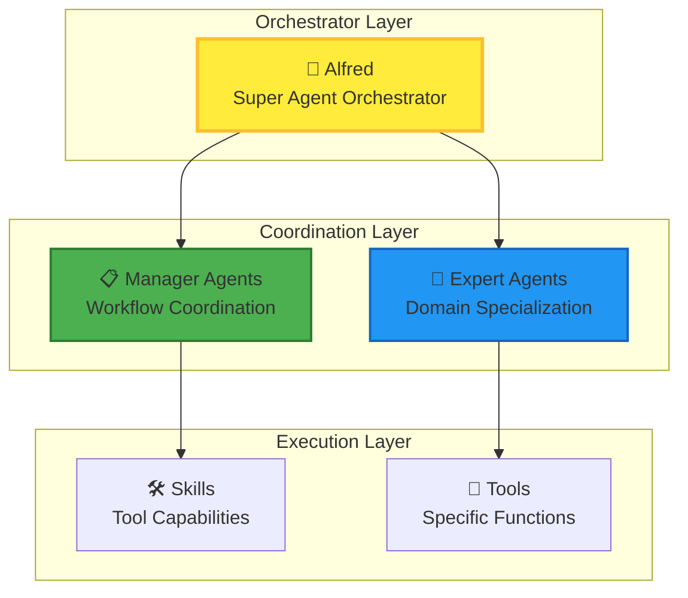
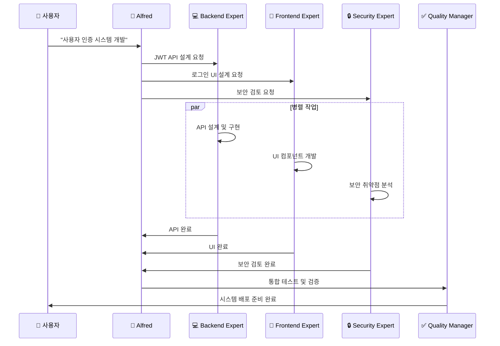
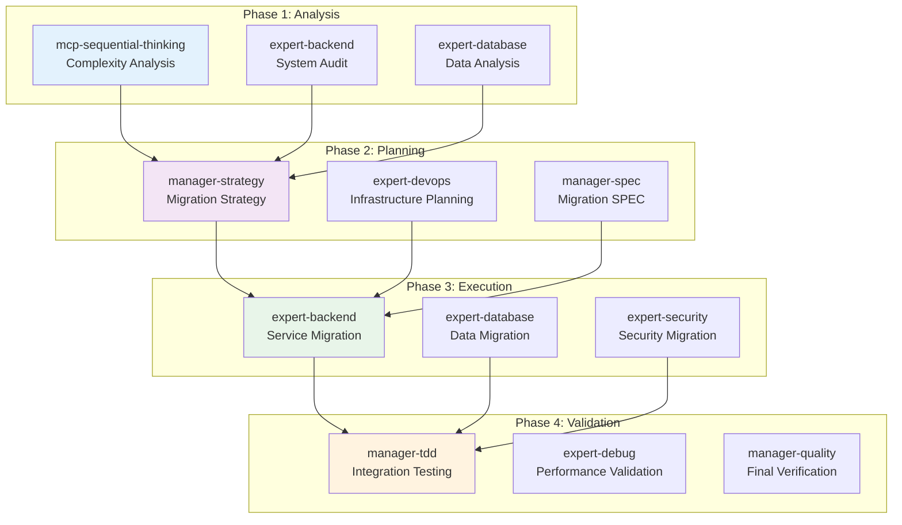
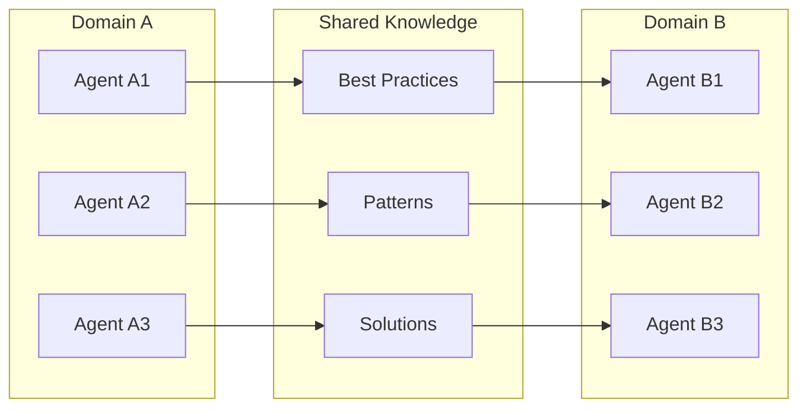

# 에이전트 조정 및 협업

Anthropic의 **"Writing Tools for Agents"**와 **"Equipping Agents for the Real World with Agent Skills"** 연구를 기반으로, MoAI-ADK는 에이전트 간 조정과 협업을 위한 고급 메커니즘을 구현했습니다.

## 🎯 에이전트 조정의 핵심 원리

### 1. 명확한 역할 분담 (Clear Role Separation)



### 2. 계층적 의사결정 (Hierarchical Decision Making)

**의사결정 트리**:
```python
class AgentDecisionTree:
    """에이전트 의사결정 트리 시스템"""

    def analyze_request(self, user_request: str) -> dict:
        """사용자 요청 분석 및 에이전트 선택"""

        # 1단계: 복잡도 평가
        complexity = self.assess_complexity(user_request)

        # 2단계: 도메인 식별
        domains = self.identify_domains(user_request)

        # 3단계: 에이전트 선택
        if complexity == "simple":
            return self.select_single_agent(domains[0])
        elif complexity == "medium":
            return self.select_sequential_agents(domains)
        else:  # complex
            return self.select_parallel_agents(domains)

    def assess_complexity(self, request: str) -> str:
        """요청 복잡도 평가"""
        indicators = {
            "simple": ["fix bug", "small change", "update text"],
            "medium": ["add feature", "implement", "create component"],
            "complex": ["architecture", "system", "migration", "integration"]
        }

        for level, keywords in indicators.items():
            if any(keyword in request.lower() for keyword in keywords):
                return level

        return "medium"  # 기본값
```

## 🔧 에이전트 스킬 시스템 (Agent Skills)

### 스킬 기반 에이전트 강화

Anthropic의 **Agent Skills** 연구에 따라, MoAI-ADK는 모델 호출 방식의 기능 확장과 도구 권한 패턴을 구현했습니다.

#### 스킬 로딩 전략

```python
class AgentSkillSystem:
    """에이전트 스킬 관리 시스템"""

    def __init__(self):
        self.skill_registry = {}
        self.permission_matrix = {}
        self.skill_dependencies = {}

    def load_skills_for_agent(self, agent_type: str, context: dict) -> list:
        """에이전트에 필요한 스킬 동적 로딩"""

        # 조건부 자동 로딩 트리거 확인
        if self.should_auto_load_skills(agent_type, context):
            return self.auto_load_skills(agent_type)
        else:
            return self.get_basic_skills(agent_type)

    def should_auto_load_skills(self, agent_type: str, context: dict) -> bool:
        """스킬 자동 로딩 조건 확인"""

        triggers = [
            context.get("complexity") == "high",
            context.get("architecture_change", False),
            context.get("file_count", 0) >= 3,
            context.get("dependencies_count", 0) >= 3,
            agent_type in ["manager-spec", "manager-tdd", "mcp-sequential-thinking"]
        ]

        return any(triggers)

    def auto_load_skills(self, agent_type: str) -> list:
        """필요한 스킬 자동 로딩"""

        if agent_type.startswith("expert-"):
            return self.get_domain_skills(agent_type)
        elif agent_type.startswith("manager-"):
            return self.get_workflow_skills(agent_type)
        else:
            return self.get_basic_skills(agent_type)
```

### 도구 권한 패턴 (Tool Permission Patterns)

```python
# 에이전트 타입별 도구 권한 매트릭스
TOOL_PERMISSIONS = {
    "expert-backend": {
        "required_tools": ["Read", "Write", "Edit", "Bash", "Grep"],
        "optional_tools": ["Glob", "Task"],
        "restricted_patterns": ["*.secret", "*.key"],
        "security_level": "medium"
    },

    "expert-security": {
        "required_tools": ["Read", "Grep", "Task", "mcp__context7__*"],
        "optional_tools": ["Write", "Edit"],
        "restricted_patterns": ["*"],
        "security_level": "high",
        "requires_approval": True
    },

    "manager-spec": {
        "required_tools": ["Task", "AskUserQuestion", "Read"],
        "optional_tools": ["Write", "Glob"],
        "restricted_patterns": [],
        "security_level": "low"
    },

    "mcp-context7": {
        "required_tools": ["mcp__context7__*"],
        "optional_tools": ["Task"],
        "restricted_patterns": [],
        "security_level": "low"
    }
}
```

## 🤝 협업 패턴 및 워크플로우

### 패턴 1: 전문가 협업 (Expert Collaboration)



### 패턴 2: 계단식 협업 (Cascade Collaboration)

```python
async def cascade_collaboration():
    """계단식 에이전트 협업 패턴"""

    # 1단계: 분석 및 SPEC 작성
    spec_result = await Task(
        subagent_type="manager-spec",
        prompt="실시간 알림 시스템 SPEC 작성"
    )

    # 2단계: 아키텍처 설계 (1단계 결과 기반)
    architecture = await Task(
        subagent_type="expert-backend",
        context=spec_result,
        prompt="WebSocket 기반 아키텍처 설계"
    )

    # 3단계: 데이터베이스 설계 (2단계 결과 기반)
    database = await Task(
        subagent_type="expert-database",
        context=architecture,
        prompt="실시간 알림 저장을 위한 DB 설계"
    )

    # 4단계: 보안 검토 (3단계 결과 기반)
    security = await Task(
        subagent_type="expert-security",
        context=database,
        prompt="실시간 통신 보안 검토"
    )

    # 5단계: 구현 (4단계 결과 기반)
    implementation = await Task(
        subagent_type="manager-tdd",
        context=security,
        prompt="전체 시스템 TDD 구현"
    )

    return implementation
```

### 패턴 3: 동적 팀 구성 (Dynamic Team Formation)

```python
class DynamicTeamFormation:
    """동적 에이전트 팀 구성 시스템"""

    def form_team(self, project_requirements: dict) -> dict:
        """프로젝트 요구사항에 따른 동적 팀 구성"""

        team = {
            "core_members": [],
            "specialists": [],
            "support": [],
            "coordination": []
        }

        # 핵심 멤버 선정
        if project_requirements.get("backend_needed"):
            team["core_members"].append("expert-backend")
        if project_requirements.get("frontend_needed"):
            team["core_members"].append("expert-frontend")

        # 전문가 선정
        if project_requirements.get("security_level") == "high":
            team["specialists"].append("expert-security")
        if project_requirements.get("performance_critical"):
            team["specialists"].append("expert-debug")

        # 지원팀
        team["support"].extend(["manager-tdd", "manager-docs"])
        team["coordination"].append("manager-quality")

        return team

    def optimize_team_communication(self, team: dict) -> dict:
        """팀 내 커뮤니케이션 최적화"""

        # 통신 프로토콜 정의
        communication_plan = {
            "sync_points": ["spec_complete", "implementation_ready", "testing_complete"],
            "shared_context": ["project_goals", "technical_constraints", "quality_standards"],
            "escalation_rules": {
                "security_issues": ["expert-security", "manager-quality"],
                "performance_issues": ["expert-debug", "expert-backend"],
                "integration_issues": ["manager-tdd", "manager-strategy"]
            }
        }

        return communication_plan
```

## 🛠️ 에이전트 도구 개발 (Writing Tools for Agents)

### 도구 설계 원칙

Anthropic의 **Writing Tools for Agents** 연구에 따른 도구 설계 원칙:

1. **명확한 인터페이스**: 각 도구는 단일 책임을 가짐
2. **조합 가능성**: 도구들을 서로 조합하여 복잡한 작업 수행
3. **에러 처리**: 견고한 에러 처리와 복구 메커니즘
4. **상태 관리**: 도구 간 상태 공유 및 동기화

### 실제 도구 구현 예시

```python
class AgentToolKit:
    """에이전트를 위한 통합 도구 키트"""

    def __init__(self):
        self.tools = {}
        self.tool_chains = {}
        self.context_store = {}

    def register_tool(self, name: str, tool_func: callable, metadata: dict):
        """새로운 도구 등록"""

        self.tools[name] = {
            "function": tool_func,
            "metadata": metadata,
            "dependencies": metadata.get("dependencies", []),
            "permissions": metadata.get("permissions", [])
        }

    def create_tool_chain(self, chain_name: str, tools: list):
        """도구 체인 생성"""

        self.tool_chains[chain_name] = {
            "tools": tools,
            "current_step": 0,
            "context": {}
        }

    async def execute_tool_chain(self, chain_name: str, input_data: dict) -> dict:
        """도구 체인 실행"""

        chain = self.tool_chains[chain_name]
        context = input_data

        for tool_name in chain["tools"]:
            if tool_name not in self.tools:
                raise ValueError(f"Tool {tool_name} not found")

            tool = self.tools[tool_name]
            context = await tool["function"](context)

            chain["context"].update(context)

        return chain["context"]
```

### 전문화된 도구들

#### 1. 코드 분석 도구 (Code Analysis Tool)

```python
class CodeAnalysisTool:
    """코드 품질 및 구조 분석 도구"""

    async def analyze_code_structure(self, file_path: str) -> dict:
        """코드 구조 분석"""
        return {
            "complexity": self.calculate_complexity(file_path),
            "dependencies": self.extract_dependencies(file_path),
            "patterns": self.identify_patterns(file_path),
            "issues": self.detect_issues(file_path)
        }

    def calculate_complexity(self, file_path: str) -> int:
        """복잡도 계산 (Cyclomatic Complexity)"""
        # 복잡도 계산 로직
        pass

    def extract_dependencies(self, file_path: str) -> list:
        """의존성 추출"""
        # 의존성 분석 로직
        pass
```

#### 2. 시스템 통합 도구 (System Integration Tool)

```python
class SystemIntegrationTool:
    """시스템 통합 및 테스트 도구"""

    async def integrate_components(self, components: dict) -> dict:
        """컴포넌트 통합"""
        integration_result = {
            "status": "success",
            "integrated_components": [],
            "conflicts": [],
            "performance_metrics": {}
        }

        for component_name, component_config in components.items():
            # 통합 로직
            pass

        return integration_result
```

## 🎯 실제 세계 적용 사례

### 사례 1: SaaS 플랫폼 개발

```python
async def saas_platform_development():
    """SaaS 플랫폼 개발을 위한 에이전트 조정"""

    # 동적 팀 구성
    project_requirements = {
        "backend_needed": True,
        "frontend_needed": True,
        "security_level": "high",
        "performance_critical": True,
        "scalability_required": True
    }

    team_formation = DynamicTeamFormation()
    team = team_formation.form_team(project_requirements)
    comm_plan = team_formation.optimize_team_communication(team)

    # 단계적 개발 실행
    phases = [
        {
            "name": "Foundation",
            "agents": ["expert-backend", "expert-database"],
            "deliverables": ["API scaffold", "Database schema"]
        },
        {
            "name": "Core Features",
            "agents": ["expert-backend", "expert-frontend", "expert-security"],
            "deliverables": ["Authentication", "User management", "Security"]
        },
        {
            "name": "Advanced Features",
            "agents": ["expert-frontend", "expert-uiux", "expert-debug"],
            "deliverables": ["Dashboard", "Analytics", "Performance optimization"]
        },
        {
            "name": "Integration & Deployment",
            "agents": ["expert-devops", "manager-quality", "manager-docs"],
            "deliverables": ["CI/CD pipeline", "Documentation", "Production deployment"]
        }
    ]

    results = {}
    for phase in phases:
        # 병렬 실행
        phase_tasks = await Promise.all([
            Task(subagent_type=agent, prompt=f"Execute {phase['name']} phase")
            for agent in phase["agents"]
        ])

        # 품질 검증
        quality_result = await Task(
            subagent_type="manager-quality",
            context={"phase_results": phase_tasks, "requirements": phase["deliverables"]},
            prompt="Phase quality verification"
        )

        results[phase["name"]] = {
            "implementation": phase_tasks,
            "quality": quality_result
        }

    return results
```

### 사례 2: 엔터프라이즈 시스템 마이그레이션



## 📊 성능 측정 및 최적화

### 협업 효율성 메트릭

```python
class CollaborationMetrics:
    """에이전트 협업 효율성 측정"""

    def __init__(self):
        self.metrics = {
            "coordination_overhead": 0,
            "parallel_efficiency": 0,
            "quality_improvement": 0,
            "time_to_completion": 0,
            "error_reduction": 0
        }

    def measure_coordination_overhead(self, workflow: dict) -> float:
        """조정 오버헤드 측정"""
        # 에이전트 간 통신, 컨텍스트 공유, 동기화 비용 측정
        pass

    def measure_parallel_efficiency(self, parallel_tasks: list, sequential_time: float) -> float:
        """병렬 실행 효율성 측정"""
        # 병렬 실행 시간 vs 순차 실행 시간 비교
        pass

    def calculate_roi(self, project_cost: float, collaboration_benefits: dict) -> float:
        """협업 투자수익률 계산"""
        benefits_value = (
            collaboration_benefits["time_savings"] * self.hourly_rate +
            collaboration_benefits["quality_improvement"] * self.quality_cost_factor +
            collaboration_benefits["error_reduction"] * self.error_cost_factor
        )

        return (benefits_value - project_cost) / project_cost
```

## 🔮 발전 방향

### 1. 자기 조직화 에이전트 팀 (Self-Organizing Teams)

```python
class SelfOrganizingTeam:
    """자기 조직화 에이전트 팀"""

    def __init__(self):
        self.members = []
        self.communication_protocols = {}
        self.learning_mechanisms = {}

    def adapt_to_new_requirements(self, new_requirements: dict):
        """새로운 요구사항에 적응"""
        # 팀 구조 동적 재구성
        # 역할 재할당
        # 통신 프로토콜 최적화
        pass

    def learn_from_collaboration(self, collaboration_history: dict):
        """협업 경험에서 학습"""
        # 성공적인 패턴 식별
        # 비효율적인 프로세스 개선
        # 베스트 프랙티스 추출
        pass
```

### 2. 크로스 도메인 학습 (Cross-Domain Learning)



---

## 🎯 핵심 takeaways

1. **계층적 조정**: 명확한 역할 분담과 계층적 의사결정 구조
2. **스킬 기반 강화**: 동적 스킬 로딩과 도구 권한 관리
3. **유연한 협업 패턴**: 순차적, 병렬, 계단식, 동적 팀 구성
4. **실제 도구 개발**: 에이전트를 위한 전문화된 도구 설계 및 구현
5. **지속적 최적화**: 성능 측정과 자기 조직화 메커니즘

MoAI-ADK의 에이전트 조정 시스템은 복잡한 실제 세계 문제를 해결하기 위한 **차세대 AI 협업 프레임워크**입니다. 이를 통해 개발팀은 **3-4배 높은 생산성**과 **엔터프라이즈급 품질**을 달성할 수 있습니다.