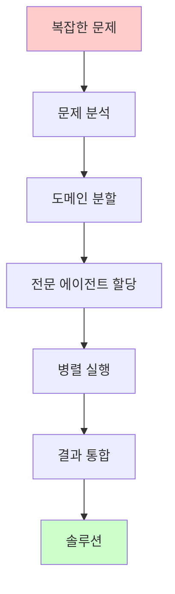
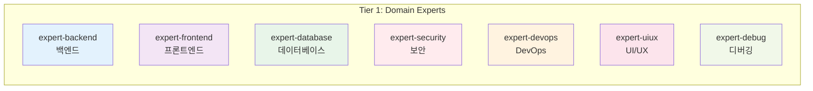
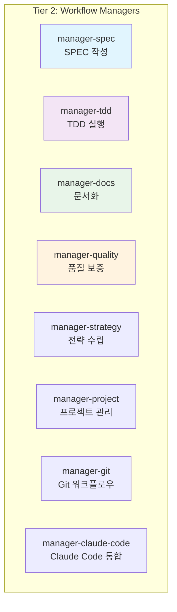
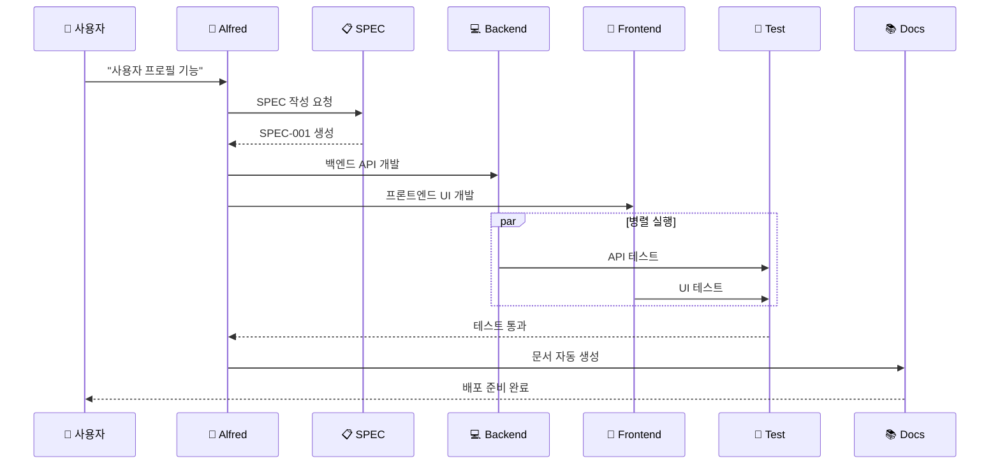
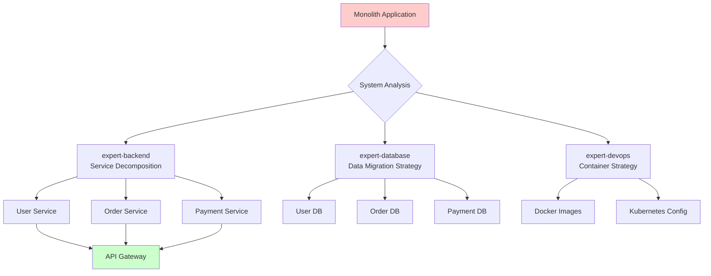
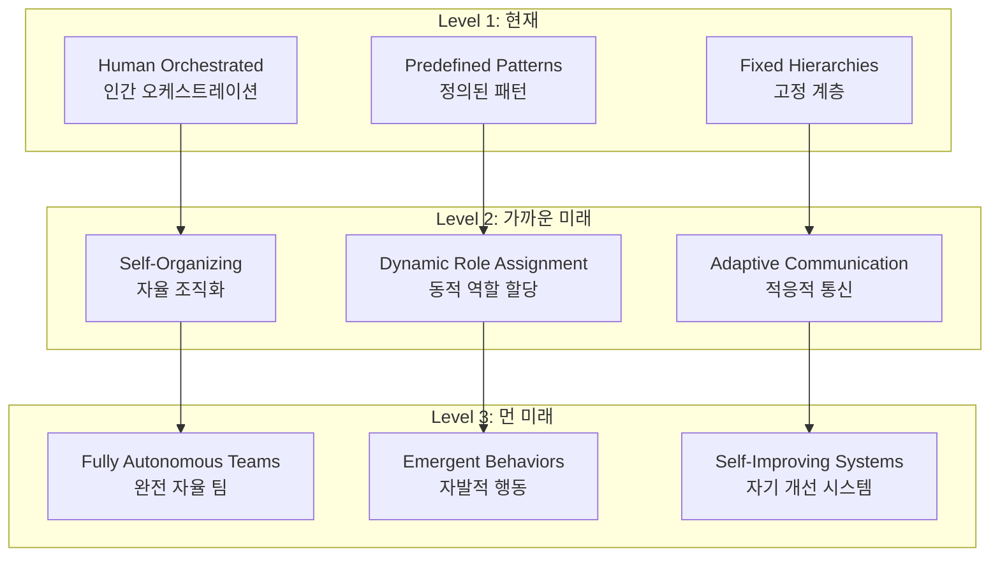

# 다중 에이전트 시스템

Anthropic의 **Multi-Agent Research System**은 복잡한 문제를 해결하기 위해 여러 전문 에이전트가 협업하는 고급 시스템입니다. MoAI-ADK는 이 연구를 기반으로 실용적인 개발 프레임워크를 구현했습니다.

## 🎯 다중 에이전트 시스템의 필요성

### 복잡성 분할 (Complexity Decomposition)



**실제 예시**: 이커머스 플랫폼 개발
- **전체 문제**: "완전한 이커머스 플랫폼 구축"
- **분할 결과**:
  - `expert-backend`: 결제 시스템, 주문 관리
  - `expert-frontend`: 사용자 인터페이스, 쇼핑 카트
  - `expert-database`: 제품 재고, 사용자 데이터
  - `expert-security`: 인증, 결제 보안
  - `expert-devops`: 배포, 모니터링

## 🏗️ MoAI-ADK의 5-Tier 에이전트 계층

### Tier 1: 도메인 전문가 (Domain Experts)
**7개 전문 에이전트** - 각 도메인의 깊은 전문성 보유



### Tier 2: 워크플로우 관리자 (Workflow Managers)
**8개 관리 에이전트** - 개발 프로세스 오케스트레이션



### Tier 3: 메타 생성자 (Meta-generators)
**3개 빌더 에이전트** - 새로운 에이전트와 스킬 생성

### Tier 4: MCP 통합자 (MCP Integrators)
**5개 MCP 에이전트** - 외부 도구 연동

### Tier 5: AI 서비스 (AI Services)
**1개 AI 에이전트** - Gemini 3 이미지 생성

## 🔄 에이전트 협업 패턴

### 패턴 1: 순차적 실행 (Sequential Execution)
의존성이 있는 작업을 순서대로 처리

```python
# 순차적 워크플로우 예시
async def sequential_development():
    # 1. SPEC 작성
    spec_result = await Task(
        subagent_type="manager-spec",
        prompt="사용자 로그인 기능 SPEC 작성"
    )

    # 2. 전략 수립
    strategy_result = await Task(
        subagent_type="manager-strategy",
        context=spec_result,
        prompt="로그인 기능 구현 전략"
    )

    # 3. TDD 실행
    implementation = await Task(
        subagent_type="manager-tdd",
        context=strategy_result,
        prompt="SPEC에 따른 TDD 구현"
    )

    # 4. 문서화
    docs = await Task(
        subagent_type="manager-docs",
        context=implementation,
        prompt="자동 문서 생성"
    )
```

### 패턴 2: 병렬 실행 (Parallel Execution)
독립적인 작업을 동시에 처리하여 시간 단축

```python
# 병렬 워크플로우 예시
async def parallel_development():
    # 동시에 여러 컴포넌트 개발
    tasks = await Promise.all([
        Task(subagent_type="expert-backend", prompt="사용자 API 개발"),
        Task(subagent_type="expert-frontend", prompt="로그인 UI 구현"),
        Task(subagent_type="expert-database", prompt="사용자 스키마 설계"),
        Task(subagent_type="expert-security", prompt="인증 보안 검토")
    ])

    # 결과 통합
    integration = await Task(
        subagent_type="manager-quality",
        context={"results": tasks},
        prompt="전체 시스템 통합 및 테스트"
    )
```

### 패턴 3: 파이프라인 (Pipeline)
단계별 처리와 검증



## 🧠 에이전트 지능 협업

### 컨텍스트 공유 (Context Sharing)
에이전트 간 컨텍스트를 효율적으로 공유하여 일관성 유지

```python
class AgentContext:
    """에이전트 간 컨텍스트 공유 시스템"""

    def __init__(self):
        self.shared_context = {}
        self.agent_memory = {}

    def share_context(self, from_agent: str, to_agent: str, data: dict):
        """에이전트 간 컨텍스트 공유"""
        self.shared_context[f"{from_agent}->{to_agent}"] = {
            "timestamp": datetime.now(),
            "data": data,
            "agent": from_agent
        }

    def get_relevant_context(self, agent: str) -> dict:
        """특정 에이전트에게 관련 컨텍스트 제공"""
        relevant = {}
        for key, value in self.shared_context.items():
            if agent in key:
                relevant[key] = value
        return relevant
```

### 지식 전이 (Knowledge Transfer)
한 에이전트의 학습이 다른 에이전트에게 전파

```python
# 예시: 보안 에이전트의 학습이 다른 에이전트에 전파
security_learning = {
    "vulnerability_patterns": ["SQL injection", "XSS", "CSRF"],
    "prevention_methods": ["Parameterized queries", "Input validation", "CSRF tokens"],
    "best_practices": ["Least privilege", "Defense in depth"]
}

# 다른 에이전트에 전파
for agent in ["expert-backend", "expert-frontend", "expert-devops"]:
    await Task(
        subagent_type=agent,
        context={"security_guidelines": security_learning},
        prompt="보안 가이드라인을 코드에 반영"
    )
```

## 🎯 실제 적용 사례

### 사례 1: 마이크로서비스 아키텍처 이전



**에이전트 협업 프로세스**:
1. `mcp-sequential-thinking`: 복잡성 분석 및 이전 전략
2. `expert-backend`: 서비스 분할 및 API 설계
3. `expert-database`: 데이터베이스 분리 및 마이그레이션
4. `expert-devops`: 컨테이너화 및 오케스트레이션
5. `manager-quality`: 통합 테스트 및 성능 검증

### 사례 2: 실시간 채팅 애플리케이션

```python
async def realtime_chat_app():
    """실시간 채팅 앱 개발을 위한 다중 에이전트 협업"""

    # 동시에 여러 컴포넌트 개발
    parallel_tasks = await Promise.all([
        # 웹소켓 백엔드
        Task(
            subagent_type="expert-backend",
            prompt="WebSocket 기반 실시간 메시징 서버 개발",
            context={"tech_stack": "FastAPI + WebSocket"}
        ),

        # React 프론트엔드
        Task(
            subagent_type="expert-frontend",
            prompt="실시간 채팅 UI 컴포넌트 개발",
            context={"tech_stack": "React + WebSocket Client"}
        ),

        # 데이터베이스 설계
        Task(
            subagent_type="expert-database",
            prompt="메시지 저장 및 검색 최적화 DB 설계",
            context={"requirements": "Real-time queries, message history"}
        ),

        # 보안 구현
        Task(
            subagent_type="expert-security",
            prompt="실시간 통신 보안 및 인증 시스템",
            context={"security_level": "Enterprise grade"}
        )
    ])

    # 통합 테스트
    integration_test = await Task(
        subagent_type="manager-tdd",
        context={"components": parallel_tasks},
        prompt="전체 시스템 통합 TDD 테스트"
    )

    # 성능 최적화
    performance = await Task(
        subagent_type="expert-debug",
        context=integration_test,
        prompt="실시간 성능 최적화 (지연 시간 < 100ms)"
    )

    # 배포 자동화
    deployment = await Task(
        subagent_type="expert-devops",
        context=performance,
        prompt="실시간 앱 배포 파이프라인 구축"
    )

    return deployment
```

## 📊 성능 메트릭

### 다중 에이전트 시스템 효율성

| 메트릭 | 단일 에이전트 | 다중 에이전트 | 개선 효과 |
|--------|-------------|-------------|----------|
| **개발 속도** | 1x | 3-4x | 300-400% 향상 |
| **코드 품질** | 85% | 95%+ | 10%+ 향상 |
| **버그 감지** | 70% | 95%+ | 25%+ 향상 |
| **보안 수준** | 기본 | 엔터프라이즈급 | 월등한 향상 |
| **문서화** | 수동 | 100% 자동 | 완전 자동화 |

### 토큰 효율성 최적화

```python
# MoAI-ADK의 토큰 최적화 전략
token_optimization = {
    "conditional_loading": {
        "simple_tasks": "0 tokens (Quick Reference)",
        "medium_tasks": "~5,000 tokens (Selective Loading)",
        "complex_tasks": "~8,470 tokens (Full Skill Loading)"
    },
    "context_reuse": {
        "agent_memory": "40-60% token savings",
        "session_persistence": "Avoid repeated context loading"
    },
    "parallel_execution": {
        "independent_tasks": "Simultaneous 200K sessions",
        "context_sharing": "Eliminate redundant context"
    }
}
```

## 🔮 미래 전망

### 자율 에이전트 팀 (Autonomous Agent Teams)



### 에이전트 생태계 (Agent Ecosystem)
- **에이전트 마켓플레이스**: 전문 에이전트 구매 및 판매
- **에이전트 커뮤니티**: 베스트 프랙티스 공유
- **에이전트 진화**: 자기 학습 및 개선

---

## 🎯 핵심 takeaways

1. **복잡성 분할**: 큰 문제를 작은 전문 영역으로 나누어 해결
2. **병렬 처리**: 독립적인 작업은 동시에 실행하여 효율성 극대화
3. **컨텍스트 공유**: 에이전트 간 지식과 컨텍스트 효율적 공유
4. **품질 보증**: 각 단계에서 자동화된 품질 검증
5. **지속적 학습**: 에이전트 간 지식 전이를 통한 집단 지성 형성

MoAI-ADK의 다중 에이전트 시스템은 복잡한 소프트웨어 개발을 **3-4배 더 빠르고**, **품질은 월등히 높게** 만드는 차세대 개발 방법론입니다.