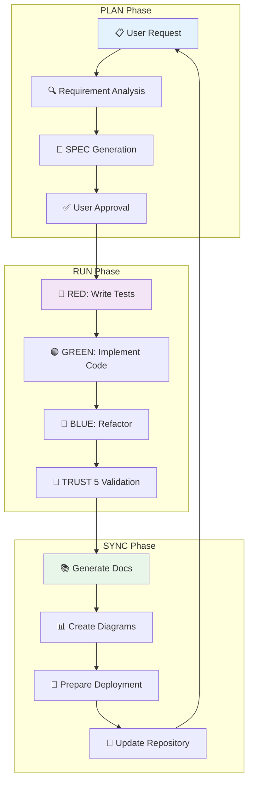
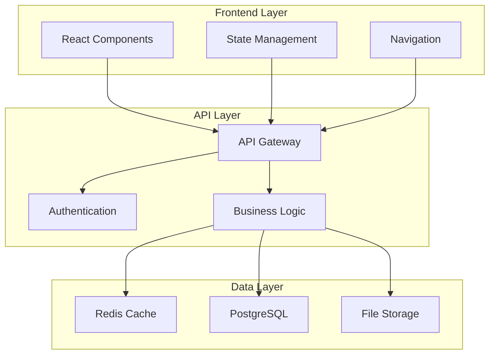

# 워크플로우 자동화

MoAI-ADK의 핵심 강점은 **완전 자동화된 워크플로우** 시스템입니다. SPEC-First 개발부터 배포까지 전체 과정을 AI 에이전트들이 자동으로 처리하여 개발자의 생산성을 극대화합니다.

## 🔄 Plan-Run-Sync 무한 루프

### 3단계 무한 루프 아키텍처



### 무한 루프의 자동화 메커니즘

```python
class AutomatedWorkflowEngine:
    """자동화된 워크플로우 엔진"""

    def __init__(self):
        self.current_phase = "plan"
        self.workflow_state = {}
        self.agent_registry = AgentRegistry()
        self.context_manager = DistributedContextManager()

    async def execute_infinite_loop(self, user_request: str):
        """무한 루프 실행"""

        while True:
            try:
                if self.current_phase == "plan":
                    await self.execute_plan_phase(user_request)
                    self.current_phase = "run"

                elif self.current_phase == "run":
                    await self.execute_run_phase()
                    self.current_phase = "sync"

                elif self.current_phase == "sync":
                    await self.execute_sync_phase()
                    self.current_phase = "idle"

                # 자동 진행 또는 사용자 입력 대기
                if not await self.should_continue_automatically():
                    break

            except WorkflowException as e:
                await self.handle_workflow_error(e)

    async def execute_plan_phase(self, request: str):
        """PLAN 단계 자동 실행"""

        # 1. 요청 분석
        analysis_result = await Task(
            subagent_type="manager-strategy",
            prompt=f"Analyze user request: {request}",
            context={"phase": "planning"}
        )

        # 2. SPEC 자동 생성
        spec_result = await Task(
            subagent_type="manager-spec",
            prompt="Generate comprehensive SPEC",
            context=analysis_result
        )

        # 3. 사용자 승인 자동 확인 (설정에 따라)
        if self.settings.get("auto_approve_specs", False):
            approval = True
        else:
            approval = await self.request_user_approval(spec_result)

        if approval:
            self.workflow_state["current_spec"] = spec_result
            await self.transition_to_next_phase()
```

## 🎯 각 단계의 자동화 상세

### PLAN 단계 자동화

#### 자동 요구사항 분석

```python
class RequirementAnalyzer:
    """자동 요구사항 분석 시스템"""

    async def analyze_requirements(self, user_request: str) -> dict:
        """사용자 요청에서 요구사항 자동 추출"""

        analysis = {
            "functional_requirements": [],
            "non_functional_requirements": [],
            "constraints": [],
            "success_criteria": [],
            "estimated_complexity": "medium",
            "required_agents": [],
            "estimated_duration": 0
        }

        # 자연어 처리로 요구사항 추출
        nlp_result = await self.process_natural_language(user_request)

        # 도메인 식별
        domains = self.identify_domains(nlp_result)
        analysis["required_agents"] = self.map_domains_to_agents(domains)

        # 복잡도 추정
        analysis["estimated_complexity"] = self.estimate_complexity(
            user_request, domains
        )

        # 기간 추정
        analysis["estimated_duration"] = self.estimate_duration(
            analysis["estimated_complexity"]
        )

        return analysis

    def map_domains_to_agents(self, domains: list) -> list:
        """도메인을 필요한 에이전트로 매핑"""

        domain_agent_map = {
            "backend": ["expert-backend", "expert-database"],
            "frontend": ["expert-frontend", "expert-uiux"],
            "security": ["expert-security"],
            "devops": ["expert-devops"],
            "api": ["expert-backend", "expert-database"],
            "ui": ["expert-frontend", "expert-uiux"],
            "database": ["expert-database"],
            "performance": ["expert-debug"],
            "testing": ["manager-tdd"]
        }

        agents = set()
        for domain in domains:
            agents.update(domain_agent_map.get(domain, []))

        return list(agents)
```

#### 자동 SPEC 생성

```python
class AutoSpecGenerator:
    """자동 SPEC 생성 시스템"""

    async def generate_complete_spec(self, analysis: dict) -> dict:
        """완전한 SPEC 문서 자동 생성"""

        spec = {
            "spec_id": f"SPEC-{self.generate_spec_id()}",
            "title": analysis.get("title", ""),
            "requirements": await self.generate_requirements(analysis),
            "constraints": await self.generate_constraints(analysis),
            "success_criteria": await self.generate_success_criteria(analysis),
            "test_scenarios": await self.generate_test_scenarios(analysis),
            "technical_specifications": await self.generate_tech_specs(analysis),
            "dependencies": await self.identify_dependencies(analysis),
            "risks": await self.identify_risks(analysis)
        }

        return spec

    async def generate_requirements(self, analysis: dict) -> list:
        """EARS 형식으로 요구사항 자동 생성"""

        requirements = []

        # 기능적 요구사항
        for func_req in analysis["functional_requirements"]:
            requirement = {
                "type": "functional",
                "format": "WHEN...IF...THEN",
                "statement": self.format_ears_requirement(func_req),
                "priority": self.determine_priority(func_req),
                "acceptance_criteria": self.generate_acceptance_criteria(func_req)
            }
            requirements.append(requirement)

        # 비기능적 요구사항
        for non_func_req in analysis["non_functional_requirements"]:
            requirement = {
                "type": "non-functional",
                "format": "system shall",
                "statement": self.format_system_requirement(non_func_req),
                "priority": self.determine_priority(non_func_req),
                "metrics": self.define_metrics(non_func_req)
            }
            requirements.append(requirement)

        return requirements
```

### RUN 단계 자동화

#### 자동 TDD 실행

```python
class AutomatedTDDExecutor:
    """자동 TDD 실행 시스템"""

    async def execute_tdd_cycle(self, spec: dict) -> dict:
        """완전한 TDD 사이클 자동 실행"""

        tdd_results = {
            "spec_id": spec["spec_id"],
            "test_results": {},
            "implementation_results": {},
            "refactoring_results": {},
            "quality_metrics": {},
            "final_status": "success"
        }

        try:
            # RED 단계: 실패하는 테스트 작성
            test_results = await self.execute_red_phase(spec)
            tdd_results["test_results"] = test_results

            # GREEN 단계: 최소 코드로 테스트 통과
            implementation_results = await self.execute_green_phase(
                test_results
            )
            tdd_results["implementation_results"] = implementation_results

            # BLUE 단계: 리팩토링 및 최적화
            refactoring_results = await self.execute_blue_phase(
                implementation_results
            )
            tdd_results["refactoring_results"] = refactoring_results

            # TRUST 5 검증
            quality_metrics = await self.execute_trust5_validation(
                refactoring_results
            )
            tdd_results["quality_metrics"] = quality_metrics

        except TDDException as e:
            tdd_results["final_status"] = "failed"
            tdd_results["error"] = str(e)

        return tdd_results

    async def execute_red_phase(self, spec: dict) -> dict:
        """RED 단계: 실패하는 테스트 자동 작성"""

        test_results = {
            "tests_written": 0,
            "test_files_created": [],
            "all_tests_failing": True
        }

        # 각 요구사항에 대한 테스트 생성
        for requirement in spec["requirements"]:
            test_code = await self.generate_test_code(requirement)

            # 테스트 파일 생성
            test_file = await self.create_test_file(
                requirement["id"], test_code
            )
            test_results["test_files_created"].append(test_file)

            # 테스트 실행 (실패 확인)
            test_result = await self.run_single_test(test_file)
            if not test_result["failed"]:
                test_results["all_tests_failing"] = False

            test_results["tests_written"] += 1

        return test_results
```

#### 자동 코드 구현

```python
class AutoCodeGenerator:
    """자동 코드 생성 시스템"""

    async def generate_implementation(self, failing_tests: dict,
                                    spec: dict) -> dict:
        """실패하는 테스트를 통과하는 최소 코드 자동 생성"""

        implementation = {
            "code_files": [],
            "all_tests_passing": False,
            "coverage_percentage": 0,
            "implementation_time": 0
        }

        start_time = time.time()

        for test_file in failing_tests["test_files_created"]:
            # 테스트 분석
            test_analysis = await self.analyze_test_requirements(test_file)

            # 최소 코드 생성
            code_file = await self.generate_minimum_code(
                test_analysis, spec
            )
            implementation["code_files"].append(code_file)

            # 테스트 재실행
            test_result = await self.run_single_test(test_file)
            if not test_result["passed"]:
                raise TDDException(f"Test {test_file} still failing")

        # 전체 테스트 실행
        all_tests_result = await self.run_all_tests()
        implementation["all_tests_passing"] = all_tests_result["all_passed"]

        # 커버리지 측정
        implementation["coverage_percentage"] = all_tests_result["coverage"]

        implementation["implementation_time"] = time.time() - start_time

        return implementation
```

### SYNC 단계 자동화

#### 자동 문서 생성

```python
class AutoDocumentationGenerator:
    """자동 문서 생성 시스템"""

    async def generate_complete_documentation(self, implementation: dict,
                                            spec: dict) -> dict:
        """완전한 문서 자동 생성"""

        documentation = {
            "api_docs": await self.generate_api_documentation(implementation),
            "architecture_diagrams": await self.generate_diagrams(implementation),
            "user_guides": await self.generate_user_guides(implementation, spec),
            "deployment_guides": await self.generate_deployment_guides(implementation),
            "changelog_entries": await self.generate_changelog_entries(implementation),
            "readme_updates": await self.update_readme(implementation, spec)
        }

        return documentation

    async def generate_api_documentation(self, implementation: dict) -> dict:
        """API 문서 자동 생성"""

        api_docs = {
            "endpoints": [],
            "data_models": [],
            "authentication": {},
            "error_handling": {},
            "examples": []
        }

        # 코드에서 API 엔드포인트 추출
        endpoints = await self.extract_api_endpoints(implementation["code_files"])

        for endpoint in endpoints:
            doc_entry = {
                "path": endpoint["path"],
                "method": endpoint["method"],
                "description": endpoint["description"],
                "parameters": endpoint["parameters"],
                "request_body": endpoint["request_body"],
                "responses": endpoint["responses"],
                "examples": await self.generate_usage_examples(endpoint)
            }
            api_docs["endpoints"].append(doc_entry)

        return api_docs

    async def generate_diagrams(self, implementation: dict) -> dict:
        """아키텍처 다이어그램 자동 생성"""

        diagrams = {
            "system_architecture": await self.generate_system_architecture_diagram(implementation),
            "data_flow": await self.generate_data_flow_diagram(implementation),
            "sequence_diagrams": await self.generate_sequence_diagrams(implementation),
            "component_diagrams": await self.generate_component_diagrams(implementation)
        }

        return diagrams

    async def generate_system_architecture_diagram(self, implementation: dict) -> str:
        """시스템 아키텍처 다이어그램 생성 (Mermaid)"""

        # 컴포넌트 분석
        components = await self.analyze_components(implementation["code_files"])

        # Mermaid 다이어그램 생성
        mermaid_diagram = """

        """

        return mermaid_diagram
```

## 🤖 워크플로우 오케스트레이션

### 워크플로우 관리자

```python
class WorkflowOrchestrator:
    """고급 워크플로우 오케스트레이터"""

    def __init__(self):
        self.active_workflows = {}
        self.workflow_templates = {}
        self.agent_pool = AgentPool()
        self.resource_manager = ResourceManager()

    async def orchestrate_complex_workflow(self, workflow_definition: dict) -> dict:
        """복잡한 워크플로우 오케스트레이션"""

        workflow_id = str(uuid.uuid4())
        workflow = {
            "id": workflow_id,
            "definition": workflow_definition,
            "status": "initializing",
            "phases": [],
            "agents_assigned": [],
            "results": {},
            "start_time": datetime.now()
        }

        self.active_workflows[workflow_id] = workflow

        try:
            # 워크플로우 초기화
            await self.initialize_workflow(workflow)

            # 단계별 실행
            for phase in workflow["phases"]:
                await self.execute_workflow_phase(workflow, phase)

            # 결과 통합
            final_result = await self.integrate_results(workflow)

            workflow["status"] = "completed"
            workflow["final_result"] = final_result

        except Exception as e:
            workflow["status"] = "failed"
            workflow["error"] = str(e)
            await self.handle_workflow_failure(workflow)

        return workflow

    async def execute_workflow_phase(self, workflow: dict, phase: dict):
        """워크플로우 단계 실행"""

        phase["status"] = "running"
        phase["start_time"] = datetime.now()

        # 필요한 에이전트 할당
        assigned_agents = await self.assign_agents_for_phase(phase)
        phase["agents_assigned"] = assigned_agents

        # 병렬 또는 순차 실행
        if phase["execution_mode"] == "parallel":
            results = await self.execute_parallel_tasks(phase, assigned_agents)
        else:
            results = await self.execute_sequential_tasks(phase, assigned_agents)

        phase["results"] = results
        phase["status"] = "completed"
        phase["end_time"] = datetime.now()
```

### 자원 관리 최적화

```python
class ResourceManager:
    """워크플로우 자원 관리 시스템"""

    def __init__(self):
        self.agent_capacity = {}
        self.resource_pools = {}
        self.allocation_history = []

    async def optimize_resource_allocation(self, workflow: dict) -> dict:
        """자원 할당 최적화"""

        optimization = {
            "agent_allocation": {},
            "resource_estimates": {},
            "bottleneck_analysis": {},
            "recommendations": []
        }

        # 에이전트 용량 분석
        agent_load = await self.analyze_agent_load()
        optimization["agent_allocation"] = agent_load

        # 리소스 병목 지점 분석
        bottlenecks = await self.identify_bottlenecks(workflow)
        optimization["bottleneck_analysis"] = bottlenecks

        # 최적화 추천
        recommendations = await self.generate_optimization_recommendations(
            agent_load, bottlenecks
        )
        optimization["recommendations"] = recommendations

        return optimization

    async def balance_workload(self, active_workflows: list) -> dict:
        """워크로드 균형 조정"""

        workload_balance = {
            "current_distribution": {},
            "imbalances": [],
            "rebalancing_actions": []
        }

        # 현재 워크로드 분포 분석
        for workflow in active_workflows:
            for agent in workflow["agents_assigned"]:
                if agent not in workload_balance["current_distribution"]:
                    workload_balance["current_distribution"][agent] = 0
                workload_balance["current_distribution"][agent] += 1

        # 불균형 식별
        max_load = max(workload_balance["current_distribution"].values())
        min_load = min(workload_balance["current_distribution"].values())

        if max_load - min_load > 3:  # 3개 이상 차이
            workload_balance["imbalances"].append({
                "type": "load_imbalance",
                "severity": "high",
                "max_load": max_load,
                "min_load": min_load
            })

        return workload_balance
```

## 📊 자동화 성능 측정

### 워크플로우 메트릭

```python
class WorkflowAnalytics:
    """워크플로우 성능 분석 시스템"""

    def __init__(self):
        self.metrics_history = []
        self.benchmark_data = {}
        self.performance_trends = {}

    def calculate_automation_efficiency(self, workflow: dict) -> dict:
        """자동화 효율성 계산"""

        efficiency = {
            "automation_score": 0,
            "time_savings": 0,
            "quality_improvement": 0,
            "error_reduction": 0,
            "consistency_score": 0
        }

        # 자동화 점수
        total_tasks = len(workflow["phases"])
        automated_tasks = sum(
            1 for phase in workflow["phases"]
            if phase.get("automated", False)
        )
        efficiency["automation_score"] = (automated_tasks / total_tasks) * 100

        # 시간 절약
        estimated_manual_time = self.estimate_manual_execution_time(workflow)
        actual_automated_time = workflow.get("execution_time", 0)
        efficiency["time_savings"] = (
            (estimated_manual_time - actual_automated_time) /
            estimated_manual_time
        ) * 100

        # 품질 향상
        quality_metrics = workflow.get("quality_metrics", {})
        efficiency["quality_improvement"] = self.calculate_quality_improvement(
            quality_metrics
        )

        return efficiency

    def generate_workflow_report(self, workflow_id: str) -> dict:
        """워크플로우 상세 리포트 생성"""

        workflow = self.active_workflows.get(workflow_id)
        if not workflow:
            return {"error": "Workflow not found"}

        report = {
            "workflow_summary": {
                "id": workflow["id"],
                "status": workflow["status"],
                "duration": self.calculate_duration(workflow),
                "phases_completed": len([p for p in workflow["phases"] if p["status"] == "completed"]),
                "total_phases": len(workflow["phases"])
            },
            "performance_metrics": self.calculate_performance_metrics(workflow),
            "agent_utilization": self.calculate_agent_utilization(workflow),
            "quality_analysis": self.analyze_quality_metrics(workflow),
            "recommendations": self.generate_workflow_recommendations(workflow)
        }

        return report
```

## 🔮 진화하는 자동화

### 학습 기반 최적화

```python
class LearningWorkflowOptimizer:
    """학습 기반 워크플로우 최적화 시스템"""

    def __init__(self):
        self.historical_data = []
        self.pattern_recognition = PatternRecognition()
        self.optimization_strategies = {}

    async def learn_from_executions(self, completed_workflows: list):
        """실행 결과에서 학습"""

        for workflow in completed_workflows:
            # 성공 패턴 식별
            if workflow["status"] == "completed":
                patterns = await self.extract_success_patterns(workflow)
                await self.update_success_patterns(patterns)

            # 실패 패턴 분석
            else:
                failure_patterns = await self.analyze_failure_patterns(workflow)
                await self.update_failure_patterns(failure_patterns)

        # 최적화 전략 업데이트
        await self.update_optimization_strategies()

    async def predict_optimal_workflow(self, requirements: dict) -> dict:
        """최적의 워크플로우 예측"""

        prediction = {
            "recommended_agents": [],
            "optimal_sequence": [],
            "estimated_duration": 0,
            "success_probability": 0,
            "risk_factors": []
        }

        # 과거 데이터 기반 예측
        similar_workflows = await self.find_similar_workflows(requirements)

        if similar_workflows:
            # 성공적인 워크플로우 패턴 적용
            successful_patterns = [
                w for w in similar_workflows if w["status"] == "completed"
            ]

            prediction["recommended_agents"] = self.extract_common_agents(
                successful_patterns
            )
            prediction["optimal_sequence"] = self.extract_common_sequence(
                successful_patterns
            )
            prediction["success_probability"] = self.calculate_success_probability(
                successful_patterns, len(similar_workflows)
            )

        return prediction
```

---

## 🎯 핵심 takeaways

1. **완전 자동화**: Plan-Run-Sync 3단계 무한 루프 자동화
2. **지능형 SPEC**: 자연어 요청에서 자동으로 완전한 SPEC 생성
3. **TDD 자동화**: RED-GREEN-BLUE 사이클 완전 자동 실행
4. **문서 자동화**: API 문서, 아키텍처 다이어그램, 배포 가이드 자동 생성
5. **학습 기반 최적화**: 과거 실행 데이터에서 학습하여 워크플로우 지속적 개선

MoAI-ADK의 워크플로우 자동화는 개발자가 **기능 요구사항에만 집중**하고 반복적인 작업은 AI에게 완전히 위임하는 **차세대 개발 패러다임**을 구현합니다. 이를 통해 개발 속도는 **3-4배 향상**되고 코드 품질은 **일관되게 유지**됩니다.