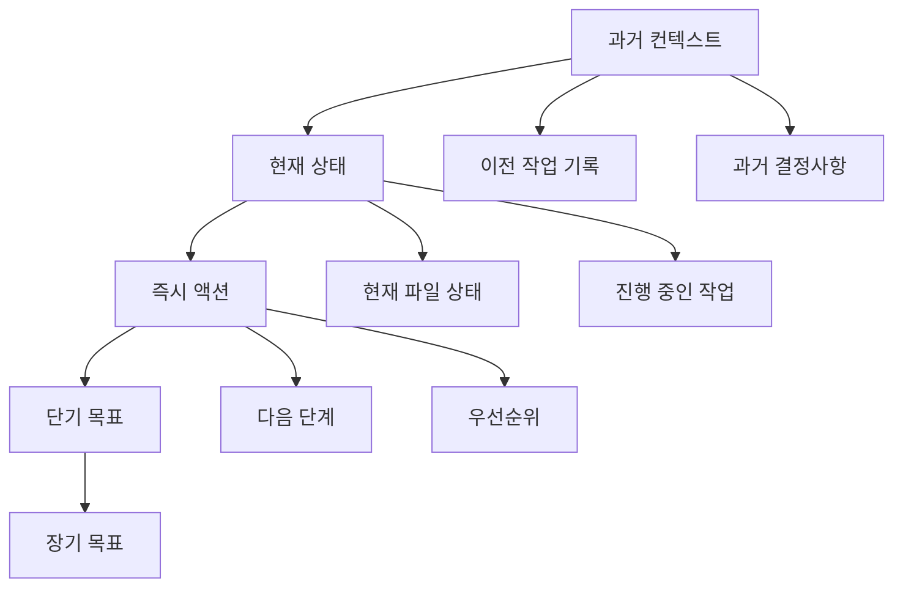

# 컨텍스트 설계

## 개요

효과적인 컨텍스트 설계는 AI 에이전트의 성능을 결정하는 핵심 요소입니다. 단순히 정보를 나열하는 것이 아니라, AI가 가장 잘 이해하고 활용할 수 있는 형태로 정보를 구성하는 예술이자 과학입니다.

## 컨텍스트 설계의 핵심 원칙

### 1. 정보 계층화 (Information Hierarchy)

모든 컨텍스트는 명확한 계층 구조를 가져야 합니다:

```typescript
interface ContextHierarchy {
  // 레벨 1: 실행 컨텍스트 (즉시 필요한 정보)
  execution: {
    currentTask: TaskDefinition;
    immediateGoal: string;
    constraints: Constraints[];
  };

  // 레벨 2: 프로젝트 컨텍스트 (작업의 배경)
  project: {
    architecture: ArchitectureOverview;
    standards: CodingStandards;
    dependencies: ProjectDependencies;
  };

  // 레벨 3: 도메인 컨텍스트 (전문 지식)
  domain: {
    bestPractices: BestPractices[];
    patterns: DesignPatterns;
    conventions: DomainConventions;
  };
}
```

### 2. 시간적 순서 (Temporal Ordering)

컨텍스트는 시간의 흐름에 따라 논리적으로 배치되어야 합니다:



### 3. 관련성 기반 필터링 (Relevance-Based Filtering)

```typescript
interface RelevanceFilter {
  // 현재 작업과의 관련성 점수
  relevanceScore: number;

  // 필터링 기준
  criteria: {
    taskSpecific: boolean;     // 작업 특정성
    frequency: number;         // 사용 빈도
    recency: number;           // 최신성
    importance: number;        // 중요도
  };

  // 동적 필터링 규칙
  filterRules: FilterRule[];
}
```

## 컨텍스트 설계 패턴

### 패턴 1: 문서-예제-작업 (Documentation-Example-Task)

가장 효과적인 컨텍스트 제공 패턴입니다:

```typescript
interface DocumentationExampleTaskPattern {
  // 1. 문서: 이론적 배경과 원칙
  documentation: {
    overview: string;
    principles: string[];
    guidelines: Guideline[];
  };

  // 2. 예제: 구체적인 구현 방법
  examples: {
    basic: CodeExample;
    advanced: CodeExample;
    edgeCase: CodeExample;
  };

  // 3. 작업: 수행해야 할 구체적 작업
  task: {
    description: string;
    requirements: Requirement[];
    constraints: Constraint[];
  };
}
```

**실제 적용 예시:**

```
# 문서: FastAPI 의존성 주입 원리
FastAPI의 의존성 주입은...

# 예제: 기본 의존성 주입
```python
from fastapi import Depends

def get_db():
    return db_session

@app.get("/users/")
def read_users(db: Session = Depends(get_db)):
    return db.query(User).all()
```

# 작업: 사용자 인증 시스템 구현
JWT 토큰을 사용한 인증 미들웨어를 구현하세요...
```

### 패턴 2: 점진적 상세화 (Progressive Disclosure)

복잡한 정보는 단계적으로 제공합니다:

```typescript
interface ProgressiveDisclosurePattern {
  // 레벨 1: 핵심 개념 (30초 이해)
  coreConcept: {
    summary: string;
    keyPoints: string[2];
  };

  // 레벨 2: 기본 구조 (5분 이해)
  basicStructure: {
    overview: string;
    components: Component[];
    relationships: Relationship[];
  };

  // 레벨 3: 상세 구현 (전체 이해)
  detailedImplementation: {
    codeExamples: CodeExample[];
    bestPractices: BestPractice[];
    commonPitfalls: Pitfall[];
  };
}
```

### 패턴 3: 컨텍스트 샌드위칭 (Context Sandwiching)

중요한 정보를 두드러지게 배치하는 패턴:

```typescript
interface ContextSandwichPattern {
  // 상단 빵: 가장 중요한 정보
  topSlice: {
    criticalInfo: string;
    immediateGoal: string;
    keyConstraints: string[];
  };

  // 중간 필링: 상세 내용
    detailedContext: {
      background: string;
      examples: Example[];
      references: Reference[];
    };

  // 하단 빵: 행동 촉구
  bottomSlice: {
    nextSteps: string[];
    successCriteria: Criteria[];
    expectedOutput: OutputFormat;
  };
}
```

## 컨텍스트 컴포넌트 설계

### 1. 작업 정의 컴포넌트 (Task Definition)

```typescript
interface TaskDefinition {
  // 작업 식별자
  taskId: string;
  taskType: 'implementation' | 'debugging' | 'refactoring' | 'design';

  // 작업 설명
  description: {
    goal: string;              // 최종 목표
    scope: string;             // 작업 범위
    deliverables: string[];    // 산출물
  };

  // 제약 조건
  constraints: {
    time?: string;             // 시간 제약
    resources: string[];       // 사용 가능한 자원
    standards: string[];       // 준수해야 할 표준
    dependencies: string[];    // 의존성
  };

  // 성공 기준
  successCriteria: {
    functional: Criteria[];    // 기능적 기준
    quality: Criteria[];       // 품질 기준
    performance?: Criteria[];  // 성능 기준
  };
}
```

### 2. 프로젝트 컨텍스트 컴포넌트

```typescript
interface ProjectContext {
  // 프로젝트 개요
  overview: {
    name: string;
    description: string;
    domain: string;
    architecture: ArchitectureType;
  };

  // 기술 스택
  techStack: {
    language: string;
    framework: string;
    database: string;
    deployment: DeploymentType;
  };

  // 코딩 표준
  standards: {
    styleGuide: StyleGuide;
    patterns: DesignPattern[];
    conventions: Convention[];
  };

  // 현재 상태
  currentState: {
    branch: string;
    recentChanges: Change[];
    issues: Issue[];
    ongoingTasks: Task[];
  };
}
```

### 3. 예제 컴포넌트 (Example Component)

```typescript
interface ExampleComponent {
  // 예제 메타데이터
  metadata: {
    title: string;
    description: string;
    difficulty: 'beginner' | 'intermediate' | 'advanced';
    tags: string[];
  };

  // 코드 예제
  code: {
    language: string;
    source: string;
    explanation: string;
    highlights: Highlight[];
  };

  // 관련 정보
  related: {
    concepts: string[];
    patterns: string[];
    alternatives: Alternative[];
  };
}
```

## 컨텍스트 최적화 기법

### 1. TOON 인코딩 활용

토큰 효율성을 높이기 위해 TOON 형식으로 컨텍스트를 압축:

```typescript
// JSON 형식 (150 토큰)
const context = {
  task: "implement authentication",
  type: "feature",
  priority: "high",
  requirements: ["JWT", "refresh token"],
  constraints: ["OWASP compliance"]
};

// TOON 형식 (80 토큰) - 47% 감소
task:implement authentication,type|feature,priority|high
requirements:JWT|refresh token,constraints:OWASP compliance
```

### 2. 스마트 프리페칭 (Smart Prefetching)

```typescript
interface PrefetchingStrategy {
  // 예측 기반 프리페칭
  predictive: {
    userPatterns: UserPattern[];
    taskSequences: TaskSequence[];
    commonWorkflows: Workflow[];
  };

  // 상황 인식 프리페칭
  contextual: {
    currentContext: Context;
    relatedTasks: Task[];
    likelyQuestions: Question[];
  };

  // 성능 기반 프리페칭
  performance: {
    loadTime: number;          // ms
    cacheHitRate: number;      // %
    memoryUsage: number;       // MB
  };
}
```

### 3. 컨텍스트 캐싱 전략

```typescript
interface CachingStrategy {
  // 레벨 1: 세션 캐시
  session: {
    duration: number;          // 분
    maxSize: number;           // MB
    evictionPolicy: 'LRU' | 'LFU';
  };

  // 레벨 2: 프로젝트 캐시
  project: {
    persistent: boolean;
    compression: boolean;
    encryption: boolean;
  };

  // 레벨 3: 전역 캐시
  global: {
    shared: boolean;
    sync: boolean;
    validation: boolean;
  };
}
```

## 실제 구현 예제

### 예제 1: API 개발 컨텍스트

```typescript
const apiDevelopmentContext = {
  // 작업 정의
  task: {
    type: "implementation",
    goal: "사용자 관리 API 엔드포인트 구현",
    endpoints: [
      "GET /api/users",
      "POST /api/users",
      "PUT /api/users/:id",
      "DELETE /api/users/:id"
    ]
  },

  // 프로젝트 컨텍스트
  project: {
    framework: "FastAPI",
    database: "PostgreSQL",
    authentication: "JWT",
    patterns: ["Repository", "DTO"]
  },

  // 예제 코드
  examples: [
    {
      title: "기본 CRUD 구조",
      code: `
@router.get("/users/", response_model=List[UserResponse])
async def get_users(
    skip: int = 0,
    limit: int = 100,
    db: Session = Depends(get_db)
):
    return user_service.get_users(db, skip=skip, limit=limit)
      `
    }
  ],

  // 표준과 관례
  standards: {
    responseFormat: "JSON API",
    errorHandling: "HTTP status codes",
    validation: "Pydantic models",
    testing: "pytest with coverage"
  }
};
```

### 예제 2: 디버깅 컨텍스트

```typescript
const debuggingContext = {
  // 문제 정의
  issue: {
    description: "사용자 인증 후 500 에러 발생",
    location: "auth.py:45",
    severity: "high",
    reproduction: "로그인 후 프로필 페이지 접근"
  },

  // 관련 정보
  context: {
    recentChanges: [
      "인증 미들웨어 리팩토링",
      "JWT 라이브러리 업데이트"
    ],
    dependencies: {
      "fastapi": "0.104.0",
      "python-jose": "3.3.0"
    },
    environment: {
      python: "3.11",
      database: "PostgreSQL 15"
    }
  },

  // 디버깅 전략
  strategy: [
    "로그 분석으로 에러 위치 확인",
    "의심스러운 함수 단위 테스트",
    "최근 변경사항 롤백 테스트"
  ]
};
```

## 컨텍스트 검증 및 품질 보증

### 1. 자동 검증 규칙

```typescript
interface ValidationRules {
  // 구조 검증
  structure: {
    hasTaskDefinition: boolean;
    hasProjectContext: boolean;
    hasExamples: boolean;
    hasConstraints: boolean;
  };

  // 내용 검증
  content: {
    taskClarity: number;        // 0-1
    contextRelevance: number;   // 0-1
    exampleQuality: number;     // 0-1
    completeness: number;       // 0-1
  };

  // 성능 검증
  performance: {
    tokenCount: number;         // 토큰 수
    loadTime: number;           // 로딩 시간
    complexity: number;         // 복잡도
  };
}
```

### 2. 품질 메트릭

```typescript
interface QualityMetrics {
  // 정보 품질
  information: {
    accuracy: number;           // 정확성
    completeness: number;       // 완전성
    relevance: number;          // 관련성
    timeliness: number;         // 시의성
  };

  // 구조 품질
  structure: {
    organization: number;       // 조직화
    clarity: number;            // 명확성
    consistency: number;        // 일관성
    maintainability: number;    // 유지보수성
  };

  // 사용성 품질
  usability: {
    effectiveness: number;      // 효과성
    efficiency: number;         // 효율성
    satisfaction: number;       // 만족도
  };
}
```

## 모범 사례 체크리스트

### 컨텍스트 설계 전
- [ ] 명확한 작업 목표 정의
- [ ] 대상 사용자와 사용 시나리오 파악
- [ ] 필요한 정보 유형과 깊이 결정
- [ ] 토큰 제약 조건 고려

### 컨텍스트 설계 중
- [ ] 정보 계층 구조 설계
- [ ] 관련성 기반 필터링 적용
- [ ] 적절한 예제 선택 및 구성
- [ ] 명확한 지시사항 작성

### 컨텍스트 설계 후
- [ ] 토큰 사용량 최적화
- [ ] 품질 메트릭 검증
- [ ] 사용자 피드백 수집
- [ ] 지속적 개선 계획 수립

---

## 다음 단계

컨텍스트 설계를 마스터했다면, 다음으로 [동적 컨텍스트 시스템](./dynamic-contexts)을 학습하여 실시간으로 변화하는 컨텍스트를 효과적으로 관리하는 방법을 알아보세요.