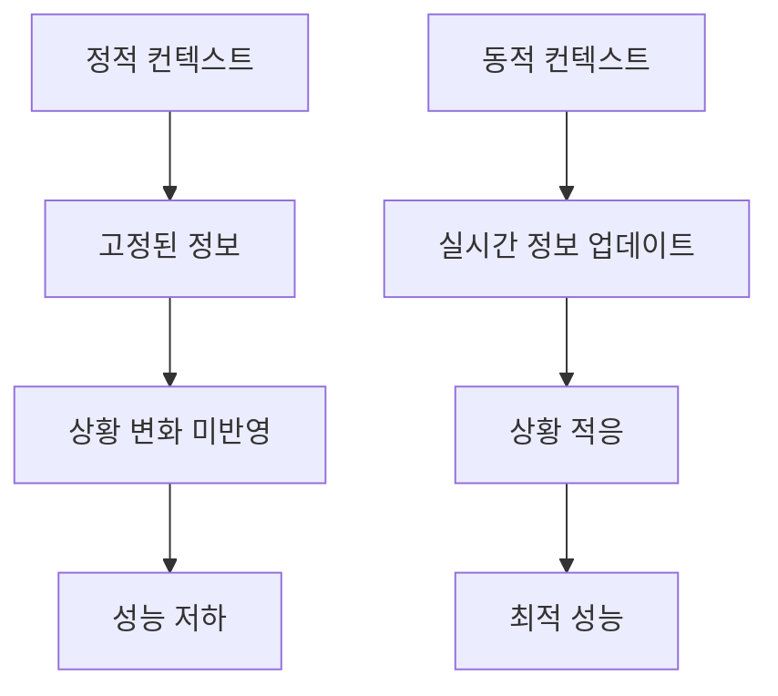
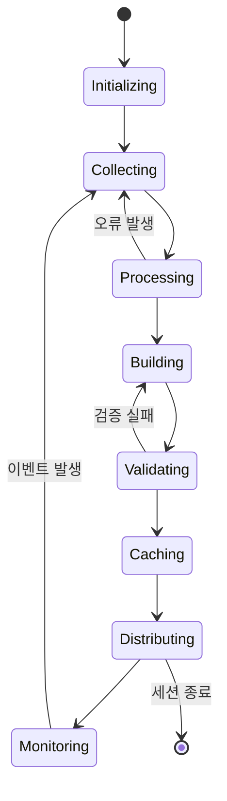

# 동적 컨텍스트

## 개요

동적 컨텍스트 시스템은 정적인 정보 제공을 넘어, 실시간으로 변화하는 상황에 맞춰 컨텍스트를 적응적으로 조정하는 고급 기술입니다. AI 에이전트가 현재 상황을 이해하고, 예측하며, 최적의 결정을 내릴 수 있게 합니다.

## 동적 컨텍스트의 필요성

### 정적 컨텍스트의 한계



### 동적 컨텍스트가 해결하는 문제
- **실시간 상태 변화**: 코드 변경, 파일 생성/삭제 등
- **사용자 인텐트 변화**: 작업 중단, 방향 전환 등
- **환경 요인**: 시스템 리소스, 네트워크 상태 등
- **협업 상황**: 다른 팀원의 작업 영향 등

## 동적 컨텍스트 아키텍처

### 1. 이벤트 기반 아키텍처

```typescript
interface DynamicContextArchitecture {
  // 이벤트 수집기
  eventCollector: {
    fileSystemEvents: FileSystemWatcher[];
    userInteractions: UserInteractionTracker[];
    systemEvents: SystemMonitor[];
    externalEvents: ExternalAPIClient[];
  };

  // 이벤트 프로세서
  eventProcessor: {
    filter: EventFilter;
    aggregator: EventAggregator;
    prioritizer: EventPrioritizer;
  };

  // 컨텍스트 업데이터
  contextUpdater: {
    relevanceEngine: RelevanceEngine;
    contextBuilder: ContextBuilder;
    cacheManager: CacheManager;
  };
}
```

### 2. 컨텍스트 생명주기 관리



### 3. 실시간 컨텍스트 스트림

```typescript
interface ContextStream {
  // 컨텍스트 스트림 소스
  sources: {
    // 파일 시스템 이벤트
    fileSystem: {
      events: FileEvent[];
      filters: FileEventFilter[];
      handlers: FileEventHandler[];
    };

    // 코드 편집기 이벤트
    editor: {
      changes: CodeChange[];
      selections: Selection[];
      navigation: NavigationEvent[];
    };

    // 사용자 인터랙션
    user: {
      commands: UserCommand[];
      queries: UserQuery[];
      feedback: UserFeedback[];
    };

    // 외부 데이터
    external: {
      apis: APIData[];
      notifications: Notification[];
      updates: Update[];
    };
  };

  // 스트림 처리
  processing: {
    buffer: CircularBuffer;
    window: SlidingWindow;
    aggregation: AggregationStrategy;
  };
}
```

## 컨텍스트 업데이트 전략

### 1. 푸시 기반 업데이트

```typescript
interface PushBasedUpdate {
  // 실시간 푸시
  realTimePush: {
    triggers: EventTrigger[];
    filters: PushFilter[];
    handlers: PushHandler[];
  };

  // 배치 푸시
  batchPush: {
    interval: number;           // ms
    batchSize: number;
    priority: PriorityLevel[];
  };

  // 조건부 푸시
  conditionalPush: {
    conditions: Condition[];
    thresholds: Threshold[];
    actions: Action[];
  };
}
```

### 2. 풀 기반 업데이트

```typescript
interface PullBasedUpdate {
  // 주기적 폴링
  periodicPull: {
    schedule: CronExpression;
    endpoints: APIEndpoint[];
    processors: DataProcessor[];
  };

  // 온디맨드 폴링
  onDemandPull: {
    triggers: PullTrigger[];
    cachePolicy: CachePolicy;
    timeout: number;
  };

  // 증분 폴링
  incrementalPull: {
    lastSync: Timestamp;
    changesOnly: boolean;
    deltaProcessing: DeltaProcessor;
  };
}
```

### 3. 하이브리드 업데이트 전략

```typescript
interface HybridUpdateStrategy {
  // 기본 전략
  defaultStrategy: 'push' | 'pull' | 'hybrid';

  // 동적 전환
  dynamicSwitching: {
    conditions: SwitchingCondition[];
    metrics: PerformanceMetric[];
    thresholds: SwitchingThreshold[];
  };

  // 부하 분산
  loadBalancing: {
    strategies: LoadBalancingStrategy[];
    failover: FailoverPlan;
    recovery: RecoveryStrategy;
  };
}
```

## 실시간 상태 모니터링

### 1. 파일 시스템 모니터링

```typescript
interface FileSystemMonitoring {
  // 파일 감시자
  watchers: {
    directories: DirectoryWatcher[];
    files: FileWatcher[];
    patterns: GlobPattern[];
  };

  // 이벤트 타입
  eventTypes: {
    created: CreateEvent[];
    modified: ModifyEvent[];
    deleted: DeleteEvent[];
    moved: MoveEvent[];
  };

  // 이벤트 처리
  processing: {
    debouncing: DebouncingStrategy;
    batching: BatchingStrategy;
    filtering: FilteringStrategy;
  };
}

// 실제 구현 예시
class ContextFileWatcher {
  private watchers: Map<string, FSWatcher> = new Map();
  private eventQueue: Queue<FileEvent> = new Queue();

  async watchProject(projectPath: string): Promise<void> {
    const watcher = chokidar.watch(projectPath, {
      ignored: /node_modules|\.git/,
      persistent: true
    });

    watcher
      .on('change', (path) => this.handleFileChange(path))
      .on('add', (path) => this.handleFileAdd(path))
      .on('unlink', (path) => this.handleFileDelete(path));

    this.watchers.set(projectPath, watcher);
  }

  private async handleFileChange(path: string): Promise<void> {
    const event: FileEvent = {
      type: 'modified',
      path,
      timestamp: Date.now(),
      metadata: await this.extractMetadata(path)
    };

    this.eventQueue.enqueue(event);
    this.processEvent(event);
  }

  private async processEvent(event: FileEvent): Promise<void> {
    // 관련성 평가
    const relevance = await this.assessRelevance(event);

    if (relevance > 0.7) {
      // 컨텍스트 업데이트
      await this.updateContext(event);

      // 구독자 알림
      await this.notifySubscribers(event);
    }
  }
}
```

### 2. 코드 편집기 통합

```typescript
interface EditorIntegration {
  // 편집기 API
  editorAPI: {
    vscode: VSCodeAPI;
    cursor: CursorPosition;
    selection: TextSelection;
    document: TextDocument;
  };

  // 이벤트 캡처
  eventCapture: {
    textChanges: TextChangeEvent[];
    navigationEvents: NavigationEvent[];
    commandEvents: CommandEvent[];
  };

  // 컨텍스트 추론
  contextInference: {
    currentTask: TaskInference;
    intentAnalysis: IntentAnalyzer;
    focusArea: FocusAreaDetector;
  };
}
```

### 3. 사용자 행동 분석

```typescript
interface UserBehaviorAnalysis {
  // 행동 패턴 추적
  patternTracking: {
    commandSequences: CommandSequence[];
    fileAccessPatterns: FileAccessPattern[];
    codingPatterns: CodingPattern[];
  };

  // 인텐트 예측
  intentPrediction: {
    nextActions: NextActionPrediction[];
    likelyTasks: TaskProbability[];
    resourceNeeds: ResourceRequirement[];
  };

  // 개인화
  personalization: {
    preferences: UserPreferences;
    workingStyle: WorkingStyle;
    productivityPatterns: ProductivityPattern[];
  };
}
```

## 컨텍스트 동기화

### 1. 다중 세션 동기화

```typescript
interface MultiSessionSync {
  // 세션 관리
  sessionManager: {
    activeSessions: ActiveSession[];
    sessionHistory: SessionHistory[];
    sessionContext: SessionContext[];
  };

  // 동기화 전략
  syncStrategy: {
    conflictResolution: ConflictResolutionStrategy;
    mergePolicy: MergePolicy;
    consistencyModel: ConsistencyModel;
  };

  // 이벤트 전파
  eventPropagation: {
    broadcasting: BroadcastingStrategy;
    routing: EventRouting;
    ordering: EventOrdering;
  };
}
```

### 2. 분산 컨텍스트 관리

```typescript
interface DistributedContext {
  // 노드 관리
  nodeManagement: {
    activeNodes: Node[];
    nodeHealth: NodeHealth[];
    loadBalancing: LoadBalancingPolicy;
  };

  // 데이터 복제
  replication: {
    primaryNode: NodeID;
    replicaNodes: NodeID[];
    consistencyLevel: ConsistencyLevel;
    syncStrategy: ReplicationStrategy;
  };

  // 장애 처리
  faultTolerance: {
    detection: FaultDetection;
    recovery: RecoveryStrategy;
    failover: FailoverPlan;
  };
}
```

## 컨텍스트 캐싱 및 최적화

### 1. 지능형 캐싱

```typescript
interface IntelligentCaching {
  // 캐시 정책
  cachePolicy: {
    evictionPolicy: 'LRU' | 'LFU' | 'TTL' | 'adaptive';
    maxSize: number;            // MB
    tieredStorage: boolean;
    compression: boolean;
  };

  // 예측적 캐싱
  predictiveCaching: {
    accessPatterns: AccessPattern[];
    prefetchStrategy: PrefetchStrategy;
    hitRateOptimization: HitRateOptimizer;
  };

  // 캐시 일관성
  consistency: {
    invalidationStrategy: InvalidationStrategy;
    updatePropagation: UpdatePropagation;
    versionControl: VersionControl;
  };
}
```

### 2. 컨텍스트 압축

```typescript
interface ContextCompression {
  // 압축 알고리즘
  algorithms: {
    statistical: StatisticalCompressor;
    dictionary: DictionaryCompressor;
    neural: NeuralCompressor;
    hybrid: HybridCompressor;
  };

  // 손실 압축
  lossyCompression: {
    relevanceThreshold: number;
    importanceWeighting: WeightingScheme;
    qualityMetrics: QualityMetric[];
  };

  // 실시간 압축
  realtimeCompression: {
    streaming: boolean;
    adaptive: boolean;
    qualityControl: QualityControl;
  };
}
```

## 실제 구현 예제

### 예제 1: 실시간 코드 컨텍스트

```typescript
class RealTimeCodeContext {
  private contextBuffer: CircularBuffer<ContextSnapshot> = new CircularBuffer(100);
  private fileWatcher: ContextFileWatcher;
  private editorIntegration: EditorIntegration;

  async initialize(): Promise<void> {
    // 파일 시스템 감시 시작
    await this.fileWatcher.watchProject(process.cwd());

    // 편집기 이벤트 구독
    this.editorIntegration.subscribeToEvents();

    // 컨텍스트 업데이트 시작
    this.startContextUpdates();
  }

  private async startContextUpdates(): Promise<void> {
    setInterval(async () => {
      const snapshot = await this.captureContextSnapshot();
      this.contextBuffer.push(snapshot);
      await this.updateRelevantContexts(snapshot);
    }, 1000); // 1초마다 업데이트
  }

  private async captureContextSnapshot(): Promise<ContextSnapshot> {
    return {
      timestamp: Date.now(),
      activeFiles: this.getActiveFiles(),
      currentTask: await this.inferCurrentTask(),
      recentChanges: this.getRecentChanges(),
      userIntent: await this.analyzeUserIntent()
    };
  }

  private async inferCurrentTask(): Promise<TaskInference> {
    const recentEvents = this.getRecentEvents();
    const filePatterns = this.analyzeFilePatterns();
    const commandSequences = this.getCommandSequences();

    return {
      type: this.classifyTaskType(recentEvents, filePatterns),
      phase: this.determineTaskPhase(commandSequences),
      complexity: this.estimateComplexity(filePatterns),
      estimatedTime: this.predictCompletionTime(recentEvents)
    };
  }
}
```

### 예제 2: 협업 컨텍스트 동기화

```typescript
class CollaborativeContextSync {
  private syncManager: SyncManager;
  private conflictResolver: ConflictResolver;

  async syncWithTeam(teamContext: TeamContext): Promise<void> {
    // 팀원들의 컨텍스트 수집
    const teamMemberContexts = await this.collectTeamContexts(teamContext);

    // 충돌 감지 및 해결
    const resolvedContext = await this.resolveConflicts(teamMemberContexts);

    // 병합된 컨텍스트 배포
    await this.distributeMergedContext(resolvedContext);
  }

  private async resolveConflicts(contexts: UserContext[]): Promise<UnifiedContext> {
    const conflicts = await this.detectConflicts(contexts);
    const resolutions: ConflictResolution[] = [];

    for (const conflict of conflicts) {
      const resolution = await this.conflictResolver.resolve(conflict);
      resolutions.push(resolution);
    }

    return this.applyResolutions(contexts, resolutions);
  }
}
```

## 성능 모니터링 및 최적화

### 1. 성능 메트릭

```typescript
interface PerformanceMetrics {
  // 응답 시간
  responseTime: {
    average: number;            // ms
    p95: number;                // ms
    p99: number;                // ms
    max: number;                // ms
  };

  // 처리량
  throughput: {
    eventsPerSecond: number;
    contextsPerSecond: number;
    updatesPerSecond: number;
  };

  // 자원 사용량
  resourceUsage: {
    memory: number;             // MB
    cpu: number;                // %
    diskIO: number;             // IOPS
    networkIO: number;          // Mbps
  };

  // 캐시 성능
  cachePerformance: {
    hitRate: number;            // %
    missRate: number;           // %
    evictionRate: number;       // /sec
    size: number;               // MB
  };
}
```

### 2. 자동 튜닝

```typescript
interface AutoTuning {
  // 성능 목표
  performanceTargets: {
    maxResponseTime: number;    // ms
    minHitRate: number;         // %
    maxResourceUsage: number;   // %
  };

  // 튜닝 파라미터
  tuningParameters: {
    cacheSize: number;
    updateInterval: number;
    batchSize: number;
    compressionLevel: number;
  };

  // 최적화 알고리즘
  optimizationAlgorithms: {
    gradientDescent: GradientDescentOptimizer;
    geneticAlgorithm: GeneticOptimizer;
    reinforcementLearning: RLOptimizer;
  };
}
```

## 모범 사례 및 팁

### 1. 이벤트 처리 최적화
- 이벤트 배칭으로 처리량 향상
- 디바운싱으로 불필요한 업데이트 방지
- 우선순위 큐로 중요한 이벤트 우선 처리

### 2. 메모리 관리
- 순환 버퍼로 메모리 사용량 제어
- 정기적인 가비지 컬렉션 실행
- 오래된 컨텍스트 자동 정리

### 3. 성능 최적화
- 비동기 처리로 응답성 향상
- 인덱싱으로 검색 성능 개선
- 압축으로 네트워크 트래픽 감소

### 4. 오류 처리
- 견고한 예외 처리 구현
- 롤백 메커니즘 제공
- 상태 복구 기능 포함

---

## 다음 단계

동적 컨텍스트 시스템을 구축했다면, [MCP 통합](./mcp-integration)을 통해 외부 서비스와 연동하여 컨텍스트의 범위를 확장하는 방법을 알아보세요.