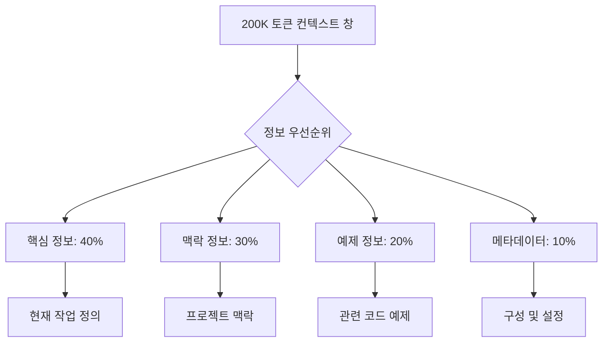
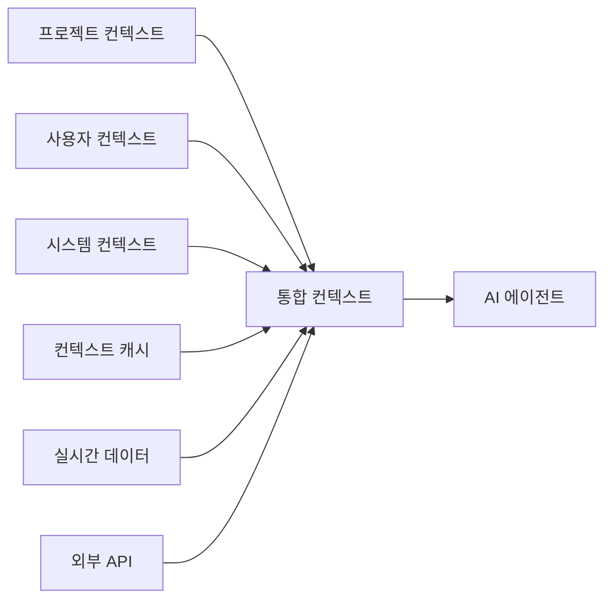

# 컨텍스트 엔지니어링

## 개요

컨텍스트 엔지니어링은 AI 에이전트의 성능을 극대화하기 위해 정보를 효과적으로 구성, 제공, 관리하는 체계적인 접근법입니다. 프롬프트 엔지니어링이 정적 지시사항에 초점을 맞춘다면, 컨텍스트 엔지니어링은 동적이고 상황에 맞는 정보 제공에 중점을 둡니다.

## 컨텍스트 엔지니어링의 진화

### 1세대: 정적 프롬프트 (2020-2022)
- 단일 프롬프트에 모든 정보 포함
- 재사용성과 확장성 제한
- 간단한 작업에만 효과적

### 2세대: 템플릿 기반 컨텍스트 (2022-2023)
- 매개변수화된 템플릿 사용
- 일부 재사용성 개선
- 여전히 정적 구조의 한계

### 3세대: 동적 컨텍스트 시스템 (2023-2024)
- 실시간 정보 통합
- 상황 인식 능력
- 메모리 관리 시스템

### 4세대: 에이전트 오케스트레이션 (2024-현재)
- 다중 에이전트 협업
- 컨텍스트 분할 및 병합
- 지능형 정보 라우팅

## 왜 컨텍스트 엔지니어링이 중요한가?

### Claude의 200K 토큰 한계
Claude는 200,000 토큰의 컨텍스트 창을 가지고 있습니다. 이 한계 안에서 최대한의 성능을 내기 위해:



### 정보 과부부 문제 해결
- **관련성 필터링**: 현재 작업에 꼭 필요한 정보만 선택
- **계층적 구조**: 중요도에 따른 정보 분류
- **동적 로딩**: 필요할 때 정보를 실시간으로 가져오기
- **압축 기술**: TOON 같은 효율적인 데이터 인코딩

## 컨텍스트 엔지니어링의 핵심 원칙

### 1. 관련성 (Relevance)
```typescript
interface ContextRelevance {
  // 현재 작업과 직접적인 관련성
  directRelevance: number; // 0-1

  // 간접적이지만 유용한 맥락
  indirectRelevance: number; // 0-1

  // 시간적 관련성 (최신 정보 우선)
  temporalRelevance: number; // 0-1
}
```

### 2. 효율성 (Efficiency)
```typescript
interface ContextEfficiency {
  // 토큰 사용량 최적화
  tokenOptimization: number;

  // 정보 밀도 (토큰 당 정보량)
  informationDensity: number;

  // 로딩 시간
  loadTime: number; // ms
}
```

### 3. 적응성 (Adaptability)
```typescript
interface ContextAdaptability {
  // 작업 유형에 따른 동적 조정
  taskTypeAdaptation: boolean;

  // 사용자 패턴 학습
  userPatternLearning: boolean;

  // 실시간 피드백 반영
  realTimeFeedback: boolean;
}
```

## MoAI-ADK의 컨텍스트 엔지니어링 접근법

### 1. 통합 컨텍스트 관리
MoAI-ADK는 여러 컨텍스트 소스를 통합하여 관리합니다:



### 2. 계층적 컨텍스트 아키텍처
```typescript
interface MoAIContext {
  // 레벨 1: 즉시 접근 가능한 컨텍스트 (50K 토큰)
  immediate: {
    currentTask: TaskDefinition;
    recentHistory: ChatHistory[];
    activeFiles: FileContext[];
  };

  // 레벨 2: 요청 시 로딩되는 컨텍스트 (100K 토큰)
  onDemand: {
    projectDocs: Documentation;
    relatedCode: CodeExamples;
    bestPractices: Guidelines;
  };

  // 레벨 3: 배경 컨텍스트 (50K 토큰)
  background: {
    projectOverview: ProjectInfo;
    userPreferences: UserSettings;
    systemConfiguration: Config;
  };
}
```

## 실제 적용 사례

### 사례 1: 대규모 프로젝트에서의 컨텍스트 관리
문제: 1000+ 파일의 프로젝트에서 관련 정보만 선택적으로 제공

해결책:
- 파일 간 의존성 분석
- 최근 변경 사항 우선순위
- 사용자 작업 패턴 기반 예측 로딩

### 사례 2: 멀티모달 컨텍스트 통합
문제: 텍스트, 이미지, 코드, 구조도 등 다양한 형태의 정보 통합

해결책:
- 각 모달리티별 최적화된 인코딩
- 크로스-레퍼런싱 시스템
- 통합 검색 및 검색 기능

### 사례 3: 실시간 협업 환경
문제: 여러 사용자의 동시 작업으로 인한 컨텍스트 충돌

해결책:
- 컨텍스트 버전 관리
- 충돌 감지 및 해결
- 증분 업데이트 시스템

## 컨텍스트 엔지니어링 도구 생태계

### 1. 컨텍스트 관리 도구
- **Context Forge**: 컨텍스트 생성 및 편집
- **CTX**: 컨텍스트 템플릿 관리
- **Context7**: 실시문서 검색 통합

### 2. 최적화 도구
- **TOON**: 토큰 효율적 데이터 인코딩
- **CompressAI**: AI 기반 텍스트 압축
- **TokenCounter**: 토큰 사용량 분석

### 3. 모니터링 도구
- **ContextMonitor**: 컨텍스트 성능 모니터링
- **UsageAnalytics**: 사용 패턴 분석
- **RelevanceScorer**: 정보 관련성 평가

## 모범 사례 가이드라인

### 1. 컨텍스트 설계 원칙
- **최소주의**: 꼭 필요한 정보만 포함
- **구조화**: 논리적 순서와 계층 구조 유지
- **재사용성**: 컴포넌트 기반의 모듈러 설계

### 2. 성능 최적화
- **사전 계산**: 가능한 정보는 미리 처리
- **캐싱 전략**: 자주 사용되는 컨텍스트 캐싱
- **로딩 전략**: 필요에 따른 점진적 로딩

### 3. 품질 관리
- **관련성 검증**: 주기적 관련성 평가
- **최신성 유지**: 자동 업데이트 시스템
- **피드백 루프**: 사용자 피드백 반영

## 다음 단계

컨텍스트 엔지니어링 마스터를 위해 다음 섹션들을 학습하세요:

1. **[컨텍스트 설계](./context-design)**: 효과적인 컨텍스트 설계 원칙과 패턴
2. **[동적 컨텍스트](./dynamic-contexts)**: 실시간 컨텍스트 시스템 구축
3. **[MCP 통합](./mcp-integration)**: MCP 서버를 통한 확장된 컨텍스트 활용
4. **[도구 관리](./tools-management)**: 컨텍스트 도구 오케스트레이션
5. **[성능 최적화](./optimization)**: 토큰 효율성과 성능 최적화 기법

---

## 추가 리소스

- [Anthropic 컨텍스트 가이드](https://docs.anthropic.com/claude/docs/context-prompts)
- [Context Forge 공식 문서](https://contextforge.io/docs)
- [컨텍스트 엔지니어링 베스트 프랙티스](https://github.com/anthropics/context-engineering-guide)
- [MoAI-ADK 컨텍스트 API 레퍼런스](../moai-adk/context-management)