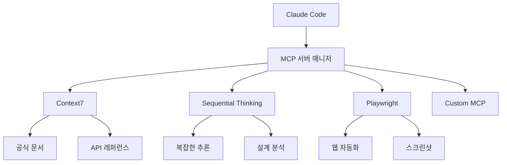
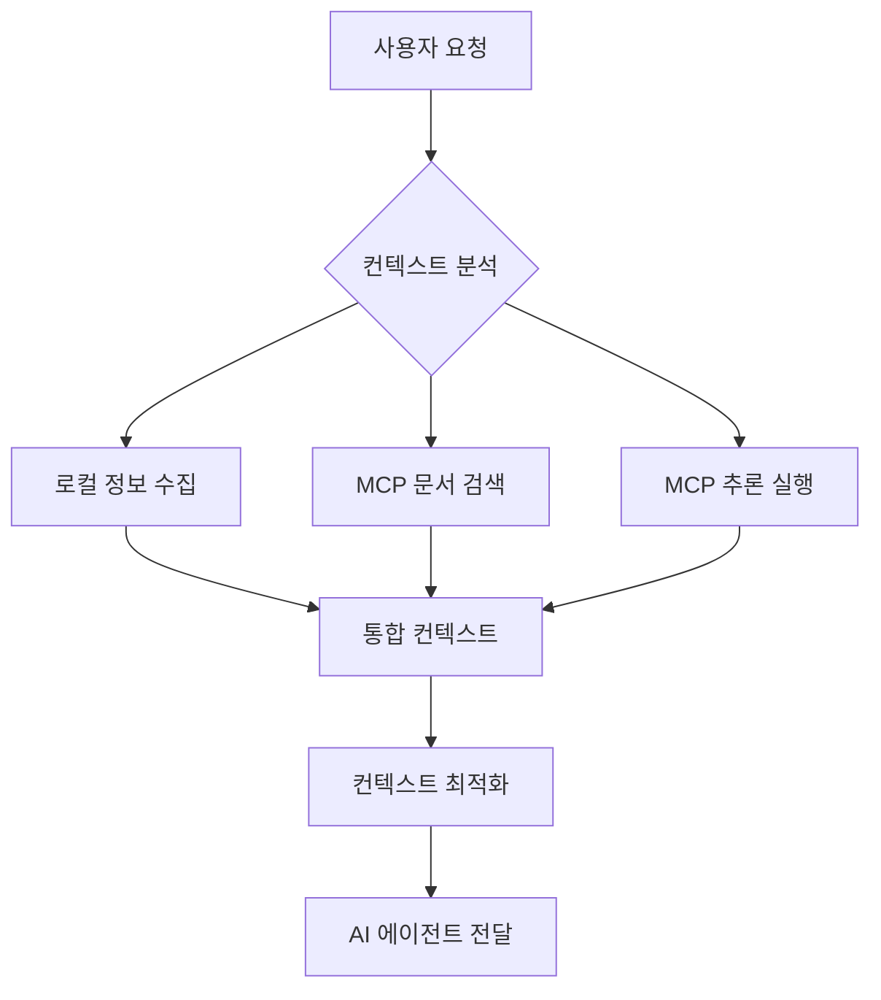

# MCP 통합

## 개요

MCP (Model Context Protocol) 통합은 컨텍스트 엔지니어링의 범위를 로컬 환경을 넘어 외부 서비스와 실시문서까지 확장하는 강력한 방법입니다. Context7, Sequential Thinking 등 MCP 서버를 통해 최신 정보와 전문 지식을 컨텍스트에 동적으로 통합할 수 있습니다.

## MCP 생태계 이해

### 1. MCP 아키텍처



### 2. 핵심 MCP 서버

#### Context7 (필수 설치)
- **목적**: 실시간 문서 검색 및 API 참조
- **기능**: 최신 라이브러리 문서, 버전 호환성 확인
- **사용 시나리오**: 코드 생성 시 최신 API 참조

```typescript
// Context7 사용 예시
const context7 = new MCPContext7();

// 라이브러리 ID 해석
const libraryInfo = await context7.resolveLibraryId("react");
// 결과: "/facebook/react"

// 최신 문서 가져오기
const docs = await context7.getLibraryDocs(
  "/facebook/react",
  { topic: "hooks", mode: "code" }
);
```

#### Sequential Thinking (권장 설치)
- **목적**: 복잡한 문제 분석 및 아키텍처 설계
- **기능**: 다단계 추론, 시스템 분석, 최적화
- **사용 시나리오**: 복잡한 알고리즘 설계, 시스템 아키텍처

```typescript
// Sequential Thinking 사용 예시
const sequential = new MCPSequentialThinking();

// 복잡한 문제 분석
const analysis = await sequential.analyzeComplexProblem({
  problem: "대규모 트래픽 처리 API 설계",
  constraints: ["성능", "확장성", "안정성"],
  context: currentArchitecture
});
```

## 컨텍스트와 MCP 통합 전략

### 1. 계층적 컨텍스트 통합

```typescript
interface MCPIntegratedContext {
  // 레벨 1: 로컬 컨텍스트
  local: {
    projectFiles: FileContext[];
    recentChanges: Change[];
    currentTask: TaskDefinition;
  };

  // 레벨 2: MCP 문서 컨텍스트
  documentation: {
    apiReferences: APIReference[];
    bestPractices: BestPractice[];
    tutorials: Tutorial[];
  };

  // 레벨 3: MCP 추론 컨텍스트
  reasoning: {
    analysis: ComplexAnalysis[];
    design: ArchitectureDesign[];
    optimization: OptimizationStrategy[];
  };
}
```

### 2. 동적 컨텍스트 구성



### 3. Context7 통합 패턴

#### 패턴 1: 실시간 API 참조
```typescript
class Context7Integrator {
  private context7: MCPContext7;
  private cache: Map<string, CachedDocumentation> = new Map();

  async enrichContext(task: TaskDefinition): Promise<EnrichedContext> {
    const enriched: EnrichedContext = {
      ...task,
      documentation: []
    };

    // 작업에 필요한 기술 스택 추출
    const technologies = this.extractTechnologies(task);

    for (const tech of technologies) {
      // 캐시 확인
      if (this.cache.has(tech)) {
        enriched.documentation.push(this.cache.get(tech)!);
        continue;
      }

      // Context7에서 최신 문서 가져오기
      try {
        const libraryId = await this.context7.resolveLibraryId(tech);
        const docs = await this.context7.getLibraryDocs(libraryId, {
          mode: 'code',
          topic: this.relevantTopic(task, tech)
        });

        // 캐싱
        this.cache.set(tech, docs);
        enriched.documentation.push(docs);
      } catch (error) {
        console.warn(`Failed to fetch docs for ${tech}:`, error);
      }
    }

    return enriched;
  }

  private extractTechnologies(task: TaskDefinition): string[] {
    // 작업 설명에서 기술 키워드 추출
    const techKeywords = ['react', 'fastapi', 'postgresql', 'docker'];
    return techKeywords.filter(tech =>
      task.description.toLowerCase().includes(tech)
    );
  }

  private relevantTopic(task: TaskDefinition, tech: string): string {
    // 작업 유형에 따른 관련 주소 결정
    switch (task.type) {
      case 'implementation':
        return 'usage examples';
      case 'debugging':
        return 'troubleshooting';
      case 'design':
        return 'architecture patterns';
      default:
        return 'getting started';
    }
  }
}
```

#### 패턴 2: 버전 호환성 검사
```typescript
class VersionCompatibilityChecker {
  async checkCompatibility(
    dependencies: Dependency[]
  ): Promise<CompatibilityReport> {
    const report: CompatibilityReport = {
      compatible: true,
      issues: [],
      recommendations: []
    };

    for (const dep of dependencies) {
      try {
        // Context7으로 최신 버전 확인
        const libraryId = await this.context7.resolveLibraryId(dep.name);
        const latestInfo = await this.context7.getLibraryDocs(libraryId, {
          mode: 'info',
          topic: 'release notes compatibility'
        });

        // 버전 호환성 검사
        if (!this.isVersionCompatible(dep.version, latestInfo.latestVersion)) {
          report.compatible = false;
          report.issues.push({
            dependency: dep.name,
            current: dep.version,
            latest: latestInfo.latestVersion,
            severity: this.assessSeverity(dep.version, latestInfo.latestVersion)
          });

          report.recommendations.push({
            action: 'upgrade',
            dependency: dep.name,
            suggestedVersion: latestInfo.recommendedVersion,
            migrationGuide: latestInfo.migrationGuide
          });
        }
      } catch (error) {
        console.warn(`Compatibility check failed for ${dep.name}:`, error);
      }
    }

    return report;
  }
}
```

### 4. Sequential Thinking 통합 패턴

#### 패턴 1: 복잡한 아키텍처 설계
```typescript
class ArchitectureDesigner {
  private sequential: MCPSequentialThinking;

  async designSystem(
    requirements: SystemRequirements
  ): Promise<ArchitectureDesign> {
    // Sequential Thinking으로 복잡한 분석 실행
    const analysis = await this.sequential.analyzeComplexProblem({
      problem: `Design ${requirements.type} system for ${requirements.domain}`,
      context: {
        scale: requirements.scale,
        constraints: requirements.constraints,
        stakeholders: requirements.stakeholders
      },
      criteria: [
        'scalability',
        'maintainability',
        'security',
        'performance',
        'cost-effectiveness'
      ]
    });

    // 분석 결과를 아키텍처 설계로 변환
    return this.convertAnalysisToDesign(analysis);
  }

  private convertAnalysisToDesign(
    analysis: SequentialAnalysis
  ): ArchitectureDesign {
    return {
      components: analysis.identifyComponents(),
      relationships: analysis.mapRelationships(),
      patterns: analysis.recommendPatterns(),
      tradeoffs: analysis.analyzeTradeoffs(),
      implementation: analysis.createImplementationPlan()
    };
  }
}
```

#### 패턴 2: 성능 최적화 분석
```typescript
class PerformanceOptimizer {
  async optimizePerformance(
    currentSystem: SystemProfile,
    bottlenecks: PerformanceBottleneck[]
  ): Promise<OptimizationPlan> {
    const optimization = await this.sequential.analyzeComplexProblem({
      problem: 'Optimize system performance',
      context: {
        currentMetrics: currentSystem.metrics,
        identifiedBottlenecks: bottlenecks,
        resourceConstraints: currentSystem.resources
      },
      criteria: ['response_time', 'throughput', 'resource_efficiency']
    });

    return {
      prioritizedOptimizations: optimization.prioritizeSolutions(),
      implementationSteps: optimization.createStepByStepPlan(),
      expectedImprovements: optimization.quantifyBenefits(),
      risks: optimization.identifyRisks()
    };
  }
}
```

## MCP 설정 및 관리

### 1. MCP 서버 설정

```json
// .claude/mcp.json
{
  "mcpServers": {
    "context7": {
      "command": "npx",
      "args": ["-y", "@upstash/context7-mcp@latest"],
      "env": {
        "CONTEXT7_API_KEY": "${CONTEXT7_API_KEY}"
      }
    },
    "sequential-thinking": {
      "command": "npx",
      "args": ["-y", "@modelcontextprotocol/server-sequential-thinking@latest"]
    },
    "playwright": {
      "command": "npx",
      "args": ["-y", "@anthropic-ai/playwright-mcp"],
      "env": {
        "PLAYWRIGHT_BROWSERS_PATH": "0"
      }
    }
  }
}
```

### 2. MoAI-ADK MCP 통합

```typescript
// MoAI-ADK MCP 매니저
class MoAIMCPManager {
  private mcpServers: Map<string, MCPServer> = new Map();
  private context7: MCPContext7;
  private sequential: MCPSequentialThinking;

  async initialize(): Promise<void> {
    // MCP 서버 초기화
    await this.initializeServers();

    // 컨텍스트 통합 레이어 설정
    await this.setupContextIntegration();
  }

  private async initializeServers(): Promise<void> {
    // Context7 서버
    this.context7 = new MCPContext7({
      apiKey: process.env.CONTEXT7_API_KEY,
      cacheSize: 1000,
      cacheTTL: 3600000 // 1시간
    });

    // Sequential Thinking 서버
    this.sequential = new MCPSequentialThinking({
      maxTokens: 50000,
      reasoningDepth: 5
    });
  }

  async enhanceContextWithMCP(
    baseContext: Context
  ): Promise<EnhancedContext> {
    const enhanced: EnhancedContext = { ...baseContext };

    // Context7으로 문서 참조 추가
    enhanced.documentation = await this.addDocumentationReferences(baseContext);

    // Sequential Thinking으로 분석 결과 추가
    enhanced.analysis = await this.addReasoningAnalysis(baseContext);

    return enhanced;
  }

  private async addDocumentationReferences(
    context: Context
  ): Promise<DocumentationReferences> {
    const technologies = this.extractTechnologiesFromContext(context);
    const references: DocumentationReference[] = [];

    for (const tech of technologies) {
      try {
        const libraryId = await this.context7.resolveLibraryId(tech);
        const docs = await this.context7.getLibraryDocs(libraryId, {
          mode: 'code',
          topic: this.determineRelevantTopic(context, tech)
        });

        references.push({
          technology: tech,
          libraryId,
          documentation: docs,
          relevanceScore: this.calculateRelevance(context, tech)
        });
      } catch (error) {
        console.warn(`Failed to get docs for ${tech}:`, error);
      }
    }

    return {
      references: references.sort((a, b) => b.relevanceScore - a.relevanceScore),
      lastUpdated: Date.now()
    };
  }
}
```

## MCP 활용 시나리오

### 시나리오 1: API 개발 시 최신 문서 통합

```typescript
// 사용자 요청: "FastAPI로 사용자 관리 API 개발"

async function developUserManagementAPI(): Promise<void> {
  // 1. 기본 컨텍스트 구성
  const baseContext = {
    task: {
      type: 'implementation',
      technology: 'FastAPI',
      goal: '사용자 관리 API 개발',
      requirements: ['CRUD', '인증', '권한 관리']
    },
    project: getCurrentProjectContext()
  };

  // 2. MCP로 컨텍스트 향상
  const enhanced = await moaiMCPManager.enhanceContextWithMCP(baseContext);

  // 3. Context7으로 FastAPI 최신 문서 가져오기
  const fastapiDocs = await enhanced.context7.getLibraryDocs(
    '/tiangolo/fastapi',
    { topic: 'user management authentication', mode: 'code' }
  );

  // 4. Sequential Thinking으로 아키텍처 설계
  const architecture = await enhanced.sequential.analyzeComplexProblem({
    problem: 'Design secure user management API',
    context: {
      framework: 'FastAPI',
      requirements: enhanced.task.requirements,
      bestPractices: fastapiDocs.bestPractices
    }
  });

  // 5. 구현
  const implementation = await implementAPI(architecture, fastapiDocs);

  return implementation;
}
```

### 시나리오 2: 디버깅 시 전문 지식 활용

```typescript
async function debugComplexIssue(issue: BugReport): Promise<DebuggingPlan> {
  // 1. 문제 컨텍스트 분석
  const problemContext = analyzeProblemContext(issue);

  // 2. Context7으로 관련 라이브러리 문서 검색
  const libraryDocs = await Promise.all(
    issue.affectedLibraries.map(lib =>
      context7.getLibraryDocs(`/library/${lib}`, {
        topic: 'troubleshooting debugging',
        mode: 'info'
      })
    )
  );

  // 3. Sequential Thinking으로 문제 분석
  const analysis = await sequential.analyzeComplexProblem({
    problem: issue.description,
    context: {
      stackTrace: issue.stackTrace,
      environment: issue.environment,
      recentChanges: issue.recentChanges,
      documentation: libraryDocs
    }
  });

  // 4. 디버깅 계획 생성
  return {
    rootCauseHypotheses: analysis.identifyRootCauses(),
    debuggingSteps: analysis.createDebuggingSteps(),
    verificationMethods: analysis.suggestVerificationMethods(),
    preventionStrategies: analysis.recommendPreventionStrategies()
  };
}
```

### 시나리오 3: 코드 리팩토링 시 모범 사례 적용

```typescript
async function refactorCodebase(
  codebase: Codebase,
  refactoringGoals: RefactoringGoal[]
): Promise<RefactoringPlan> {
  // 1. 코드베이스 분석
  const codebaseAnalysis = analyzeCodebase(codebase);

  // 2. Context7으로 리팩토링 모범 사례 검색
  const refactoringPatterns = await context7.getLibraryDocs(
    '/refactoring/guru',
    { topic: refactoringGoals.map(g => g.type).join(', '), mode: 'code' }
  );

  // 3. Sequential Thinking으로 리팩토링 전략 수립
  const strategy = await sequential.analyzeComplexProblem({
    problem: 'Design comprehensive refactoring strategy',
    context: {
      codebaseMetrics: codebaseAnalysis.metrics,
      codeSmells: codebaseAnalysis.codeSmells,
      goals: refactoringGoals,
      patterns: refactoringPatterns.patterns
    }
  });

  // 4. 우선순위화된 리팩토링 계획
  return {
    phases: strategy.createPhasedPlan(),
    priorities: strategy.prioritizeRefactorings(),
    risks: strategy.assessRisks(),
    successMetrics: strategy.defineSuccessMetrics()
  };
}
```

## 성능 최적화 및 모범 사례

### 1. MCP 호출 최적화

```typescript
class OptimizedMCPIntegration {
  private requestCache: LRUCache<string, any> = new LRUCache(1000);
  private requestQueue: Queue<MCPRequest> = new Queue();

  async optimizedContext7Call(
    libraryId: string,
    options: Context7Options
  ): Promise<any> {
    // 캐시 키 생성
    const cacheKey = `${libraryId}:${JSON.stringify(options)}`;

    // 캐시 확인
    if (this.requestCache.has(cacheKey)) {
      return this.requestCache.get(cacheKey);
    }

    // 요청 큐에 추가
    const request = { libraryId, options, cacheKey };
    this.requestQueue.enqueue(request);

    // 배치 처리
    return this.processBatch();
  }

  private async processBatch(): Promise<any[]> {
    const batch = this.requestQueue.dequeueBatch(10); // 최대 10개 배치

    if (batch.length === 0) return [];

    // 병렬 처리
    const results = await Promise.allSettled(
      batch.map(req => this.context7.getLibraryDocs(req.libraryId, req.options))
    );

    // 결과 처리 및 캐싱
    const processedResults = results.map((result, index) => {
      if (result.status === 'fulfilled') {
        this.requestCache.set(batch[index].cacheKey, result.value);
        return result.value;
      } else {
        console.error(`MCP call failed:`, result.reason);
        return null;
      }
    });

    return processedResults.filter(r => r !== null);
  }
}
```

### 2. MCP 서버 모니터링

```typescript
class MCPMonitor {
  private metrics: MCPMetrics = {
    totalCalls: 0,
    successfulCalls: 0,
    failedCalls: 0,
    averageResponseTime: 0,
    cacheHitRate: 0
  };

  async trackMCPCall(
    server: string,
    operation: string,
    fn: () => Promise<any>
  ): Promise<any> {
    const startTime = Date.now();
    this.metrics.totalCalls++;

    try {
      const result = await fn();
      this.metrics.successfulCalls++;

      const responseTime = Date.now() - startTime;
      this.updateAverageResponseTime(responseTime);

      return result;
    } catch (error) {
      this.metrics.failedCalls++;
      throw error;
    }
  }

  getMetrics(): MCPMetrics {
    return { ...this.metrics };
  }

  private updateAverageResponseTime(newTime: number): void {
    const totalCalls = this.metrics.totalCalls;
    this.metrics.averageResponseTime =
      (this.metrics.averageResponseTime * (totalCalls - 1) + newTime) / totalCalls;
  }
}
```

### 3. 에러 처리 및 장애 복구

```typescript
class MCPRobustness {
  private retryPolicy: RetryPolicy = {
    maxAttempts: 3,
    baseDelay: 1000,
    maxDelay: 10000,
    backoff: 'exponential'
  };

  async robustMCPCall<T>(
    operation: () => Promise<T>,
    fallback: () => Promise<T>
  ): Promise<T> {
    let lastError: Error;

    for (let attempt = 1; attempt <= this.retryPolicy.maxAttempts; attempt++) {
      try {
        return await operation();
      } catch (error) {
        lastError = error as Error;

        if (attempt === this.retryPolicy.maxAttempts) {
          console.error(`MCP call failed after ${attempt} attempts, using fallback`);
          return await fallback();
        }

        const delay = Math.min(
          this.retryPolicy.baseDelay * Math.pow(2, attempt - 1),
          this.retryPolicy.maxDelay
        );

        await this.sleep(delay);
      }
    }

    throw lastError!;
  }

  private sleep(ms: number): Promise<void> {
    return new Promise(resolve => setTimeout(resolve, ms));
  }
}
```

---

## 다음 단계

MCP 통합을 마스터했다면, [도구 관리](./tools-management)를 통해 컨텍스트 도구들을 효과적으로 오케스트레이션하는 방법을 알아보세요.