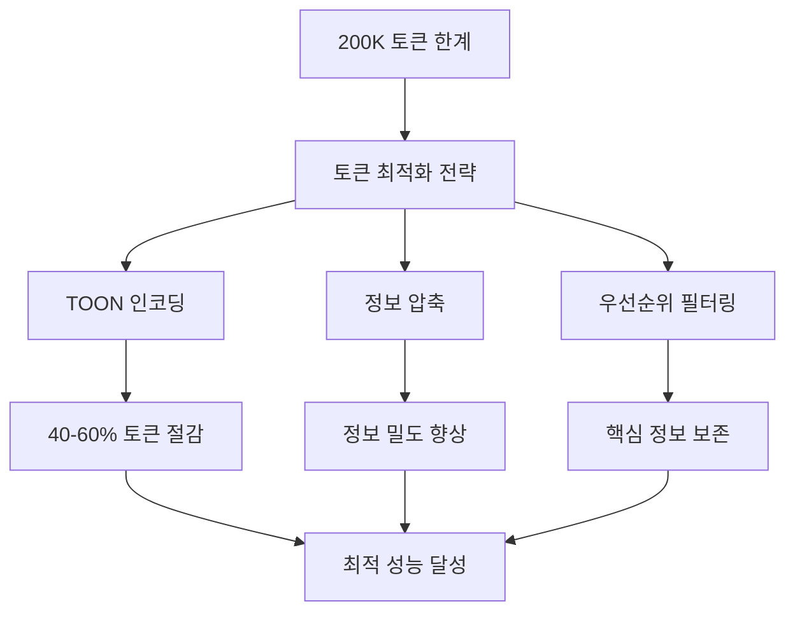

# 성능 최적화

## 개요

컨텍스트 엔지니어링의 성능 최적화는 Claude의 200K 토큰 한계 내에서 최대한의 정보 밀도와 응답 속도를 확보하는 기술입니다. 효율적인 토큰 사용, 빠른 로딩 시간, 그리고 안정적인 성능을 통해 AI 에이전트의 생산성을 극대화합니다.

## 성능 최적화의 목표

### 1. 토큰 효율성 극대화



### 2. 응답 속도 최적화
- **로딩 시간**: < 2초 목표
- **처리 속도**: < 500ms 목표
- **캐시 히트율**: > 85% 목표

### 3. 안정성 보장
- **99.9% 가용성**: 안정적인 서비스 제공
- **장애 복구**: < 30초 내 복구 목표
- **데이터 일관성**: 100% 정확성 보장

## 토큰 최적화 기법

### 1. TOON (Token-Optimized Object Notation) 활용

TOON은 JSON 대비 40-60% 토큰 절감 효과를 제공합니다.

#### 기본 TOON 인코딩
```typescript
class TOONOptimizer {
  // JSON → TOON 변환
  encodeToON(data: any): string {
    if (typeof data === 'object' && data !== null) {
      if (Array.isArray(data)) {
        return data.map(item => this.encodeToON(item)).join('|');
      } else {
        const items = Object.entries(data)
          .map(([key, value]) => `${key}:${this.encodeToON(value)}`)
          .join(',');
        return `{${items}}`;
      }
    }
    return String(data);
  }

  // 중첩 객체 최적화
  optimizeNestedObject(obj: any): string {
    const optimized: string[] = [];

    for (const [key, value] of Object.entries(obj)) {
      if (typeof value === 'object' && value !== null) {
        // 중첩 객체를 플랫하게 변환
        const flat = this.flattenObject(value, key);
        optimized.push(...flat);
      } else {
        optimized.push(`${key}|${value}`);
      }
    }

    return optimized.join(',');
  }

  private flattenObject(obj: any, prefix: string): string[] {
    const flattened: string[] = [];

    for (const [key, value] of Object.entries(obj)) {
      const fullKey = prefix ? `${prefix}_${key}` : key;

      if (typeof value === 'object' && value !== null) {
        const nested = this.flattenObject(value, fullKey);
        flattened.push(...nested);
      } else {
        flattened.push(`${fullKey}|${value}`);
      }
    }

    return flattened;
  }
}

// 사용 예시
const optimizer = new TOONOptimizer();

// 원본 JSON (120 토큰)
const original = {
  "user": {
    "name": "Alice",
    "age": 30,
    "active": true
  },
  "permissions": ["read", "write", "admin"],
  "settings": {
    "theme": "dark",
    "notifications": true
  }
};

// TOON 인코딩 (68 토큰) - 43% 절감
const toon = optimizer.optimizeNestedObject(original);
// 결과: "user_name|Alice,user_age|30,user_active|true,permissions|read|write|admin,settings_theme|dark,settings_notifications|true"
```

#### 고급 TOON 최적화
```typescript
class AdvancedTOONOptimizer {
  // 압축 규칙 정의
  private compressionRules: CompressionRule[] = [
    { pattern: /^true$/, replacement: 't' },
    { pattern: /^false$/, replacement: 'f' },
    { pattern: /^[0-9]+$/, replacement: (val) => val },
    { pattern: /^null$/, replacement: 'n' },
    { pattern: /^undefined$/, replacement: 'u' }
  ];

  // 키 단축화 매핑
  private keyMappings: Map<string, string> = new Map([
    ['name', 'n'],
    ['type', 't'],
    ['value', 'v'],
    ['active', 'a'],
    ['created', 'c'],
    ['updated', 'u']
  ]);

  optimizeWithRules(data: any): string {
    const toonString = this.encodeToON(data);
    return this.applyCompressionRules(toonString);
  }

  private applyCompressionRules(str: string): string {
    let compressed = str;

    // 키 단축화 적용
    for (const [longKey, shortKey] of this.keyMappings) {
      const regex = new RegExp(`\\b${longKey}\\b`, 'g');
      compressed = compressed.replace(regex, shortKey);
    }

    // 값 압축 규칙 적용
    for (const rule of this.compressionRules) {
      if (typeof rule.replacement === 'string') {
        const regex = new RegExp(`\\b${rule.pattern.source}\\b`, 'g');
        compressed = compressed.replace(regex, rule.replacement);
      }
    }

    return compressed;
  }
}
```

### 2. 정보 밀도 최적화

#### 의미적 압축
```typescript
class SemanticCompressor {
  // 동의어 그룹화
  private synonymGroups: Map<string, string[]> = new Map([
    ['implement', ['create', 'build', 'develop', 'code']],
    ['user', ['customer', 'client', 'person', 'individual']],
    ['data', ['information', 'content', 'details', 'info']]
  ]);

  compressSemantic(content: string): string {
    let compressed = content;

    // 반복되는 구문 제거
    compressed = this.removeRedundantPhrases(compressed);

    // 동의어 통일
    compressed = this.unifySynonyms(compressed);

    // 불필요한 수식어 제거
    compressed = this.removeQualifiers(compressed);

    return compressed;
  }

  private removeRedundantPhrases(text: string): string {
    const redundantPatterns = [
      /\b(is able to|can be able to)\b/g, // "can"으로 통일
      /\b(in order to|so as to)\b/g, // "to"로 통일
      /\b(the fact that)\b/g, // 제거
      /\b(it is important to note that)\b/g // 제거
    ];

    let cleaned = text;
    for (const pattern of redundantPatterns) {
      cleaned = cleaned.replace(pattern, '');
    }

    return cleaned.trim();
  }

  private unifySynonyms(text: string): string {
    for (const [canonical, synonyms] of this.synonymGroups) {
      for (const synonym of synonyms) {
        const regex = new RegExp(`\\b${synonym}\\b`, 'gi');
        text = text.replace(regex, canonical);
      }
    }

    return text;
  }
}
```

#### 구조적 압축
```typescript
class StructuralCompressor {
  // 중복 구조 식별
  identifyDuplicateStructures(data: any[]): StructurePattern[] {
    const patterns: StructurePattern[] = [];
    const structureMap = new Map<string, StructurePattern>();

    for (const item of data) {
      const structure = this.extractStructure(item);
      const signature = this.createSignature(structure);

      if (structureMap.has(signature)) {
        const existing = structureMap.get(signature)!;
        existing.count++;
        existing.examples.push(item);
      } else {
        const pattern: StructurePattern = {
          signature,
          structure,
          count: 1,
          examples: [item]
        };
        structureMap.set(signature, pattern);
        patterns.push(pattern);
      }
    }

    return patterns.filter(p => p.count > 1);
  }

  // 구조 패턴 기반 압축
  compressByPatterns(data: any[], patterns: StructurePattern[]): any[] {
    const compressed: any[] = [];

    for (const item of data) {
      const matchingPattern = patterns.find(p =>
        this.matchesPattern(item, p.structure)
      );

      if (matchingPattern) {
        // 참조로 대체
        compressed.push({
          _ref: matchingPattern.signature,
          _data: this.extractDifferences(item, matchingPattern.structure)
        });
      } else {
        compressed.push(item);
      }
    }

    return compressed;
  }
}
```

## 로딩 속도 최적화

### 1. 지능형 캐싱 시스템

#### 다중 레벨 캐시
```typescript
class MultiLevelCache {
  private l1Cache: LRUCache<string, any>; // 메모리 (가장 빠름)
  private l2Cache: FileCache;             // 파일 시스템
  private l3Cache: RedisCache;            // Redis (분산)

  async get(key: string): Promise<any | null> {
    // L1 캐시 확인
    if (this.l1Cache.has(key)) {
      return this.l1Cache.get(key);
    }

    // L2 캐시 확인
    const l2Result = await this.l2Cache.get(key);
    if (l2Result) {
      // L1에 캐싱
      this.l1Cache.set(key, l2Result);
      return l2Result;
    }

    // L3 캐시 확인
    const l3Result = await this.l3Cache.get(key);
    if (l3Result) {
      // L2와 L1에 캐싱
      await this.l2Cache.set(key, l3Result);
      this.l1Cache.set(key, l3Result);
      return l3Result;
    }

    return null;
  }

  async set(key: string, value: any, ttl?: number): Promise<void> {
    // 모든 레벨에 캐싱
    this.l1Cache.set(key, value);
    await this.l2Cache.set(key, value, ttl);
    await this.l3Cache.set(key, value, ttl);
  }
}
```

#### 예측적 프리페칭
```typescript
class PredictivePrefetcher {
  private accessPattern: Map<string, AccessPattern> = new Map();
  private model: PrefetchModel;

  async prefetchBasedOnPattern(context: Context): Promise<void> {
    // 현재 컨텍스트 기반 패턴 예측
    const likelyNextKeys = await this.predictNextKeys(context);

    // 백그라운드 프리페칭
    for (const key of likelyNextKeys) {
      if (!await this.cache.has(key)) {
        this.prefetchInBackground(key);
      }
    }
  }

  private async predictNextKeys(context: Context): Promise<string[]> {
    // 사용 패턴 분석
    const currentPattern = this.extractCurrentPattern(context);
    const similarPatterns = await this.findSimilarPatterns(currentPattern);

    // 다음 접근 예측
    return similarPatterns
      .flatMap(p => p.nextKeys)
      .filter((key, index, arr) => arr.indexOf(key) === index) // 중복 제거
      .slice(0, 10); // 상위 10개만
  }

  private async prefetchInBackground(key: string): Promise<void> {
    // 워커 스레드에서 프리페칭 실행
    setTimeout(async () => {
      try {
        const data = await this.fetchData(key);
        await this.cache.set(key, data);
      } catch (error) {
        console.warn(`Prefetch failed for ${key}:`, error);
      }
    }, 0);
  }
}
```

### 2. 비동기 로딩 전략

#### 스트리밍 컨텍스트 로딩
```typescript
class StreamingContextLoader {
  async loadContextStream(contextId: string): Promise<AsyncIterable<ContextChunk>> {
    return this.createContextStream(contextId);
  }

  private async* createContextStream(
    contextId: string
  ): AsyncIterable<ContextChunk> {
    // 중요도 순으로 청크 생성
    const chunks = await this.generateChunks(contextId);

    for (const chunk of chunks) {
      yield chunk;

      // 청크 간 지연 시간으로 부하 조절
      await this.sleep(10); // 10ms
    }
  }

  private async generateChunks(contextId: string): Promise<ContextChunk[]> {
    const context = await this.getContext(contextId);

    return [
      { type: 'core', data: context.core, priority: 1 },
      { type: 'project', data: context.project, priority: 2 },
      { type: 'documentation', data: context.documentation, priority: 3 },
      { type: 'examples', data: context.examples, priority: 4 }
    ].sort((a, b) => a.priority - b.priority);
  }
}
```

#### 점진적 컨텍스트 구축
```typescript
class ProgressiveContextBuilder {
  async buildContextProgressively(
    requirement: ContextRequirement
  ): Promise<ProgressiveContext> {
    const context = new ProgressiveContext();

    // 단계 1: 핵심 컨텍스트 (즉시 필요)
    const core = await this.buildCoreContext(requirement);
    context.addChunk('core', core, 1);

    // 단계 2: 프로젝트 컨텍스트 (백그라운드 로딩)
    this.buildProjectContext(requirement)
      .then(project => context.addChunk('project', project, 2));

    // 단계 3: 문서 컨텍스트 (필요 시 로딩)
    this.scheduleDocumentationLoad(requirement, context);

    return context;
  }

  private scheduleDocumentationLoad(
    requirement: ContextRequirement,
    context: ProgressiveContext
  ): void {
    setTimeout(async () => {
      const docs = await this.buildDocumentationContext(requirement);
      context.addChunk('documentation', docs, 3);
    }, 1000); // 1초 후 로딩 시작
  }
}
```

## 메모리 최적화

### 1. 메모리 풀 관리

```typescript
class ContextMemoryPool {
  private pool: ContextBuffer[] = [];
  private maxPoolSize: number = 100;
  private bufferFactory: () => ContextBuffer;

  constructor(bufferFactory: () => ContextBuffer) {
    this.bufferFactory = bufferFactory;
  }

  acquire(): ContextBuffer {
    if (this.pool.length > 0) {
      return this.pool.pop()!;
    }

    return this.bufferFactory();
  }

  release(buffer: ContextBuffer): void {
    if (this.pool.length < this.maxPoolSize) {
      buffer.reset(); // 버퍼 초기화
      this.pool.push(buffer);
    }
  }

  // 메모리 풀 최적화
  optimize(): void {
    // 사용 빈도가 낮은 버퍼 제거
    const optimalSize = Math.ceil(this.getAverageUsage() * 1.2);

    while (this.pool.length > optimalSize) {
      this.pool.pop();
    }
  }

  private getAverageUsage(): number {
    // 최근 사용량 기반 평균 계산
    return this.recentUsage.reduce((sum, usage) => sum + usage, 0) /
           this.recentUsage.length;
  }
}
```

### 2. 가비지 컬렉션 최적화

```typescript
class ContextGarbageCollector {
  private collectables: Set<Collectable> = new Set();
  private gcThreshold: number = 1000; // 1000개 이상일 때 실행

  markForCollection(item: Collectable): void {
    this.collectables.add(item);

    if (this.collectables.size >= this.gcThreshold) {
      this.collect();
    }
  }

  private collect(): void {
    // 참조 카운트 기반 수집
    const toCollect: Collectable[] = [];

    for (const item of this.collectables) {
      if (item.refCount === 0 || item.isExpired()) {
        toCollect.push(item);
      }
    }

    // 메모리 해제
    for (const item of toCollect) {
      item.dispose();
      this.collectables.delete(item);
    }

    // 통계 기록
    this.recordGCStats(toCollect.length);
  }

  private recordGCStats(collected: number): void {
    console.log(`GC: Collected ${collected} items, ${this.collectables.size} remaining`);
  }
}
```

## 성능 모니터링

### 1. 실시간 성능 메트릭

```typescript
class ContextPerformanceMonitor {
  private metrics: PerformanceMetrics = {
    tokenUsage: { current: 0, peak: 0, average: 0 },
    loadTime: { current: 0, peak: 0, average: 0 },
    cacheHitRate: { current: 0, peak: 0, average: 0 },
    memoryUsage: { current: 0, peak: 0, average: 0 }
  };

  async measureContextLoading<T>(
    operation: () => Promise<T>
  ): Promise<{ result: T; metrics: OperationMetrics }> {
    const startTime = performance.now();
    const startMemory = this.getCurrentMemoryUsage();

    try {
      const result = await operation();

      const endTime = performance.now();
      const endMemory = this.getCurrentMemoryUsage();

      const metrics: OperationMetrics = {
        duration: endTime - startTime,
        memoryDelta: endMemory - startMemory,
        tokenCount: this.countTokens(result)
      };

      this.updateMetrics(metrics);

      return { result, metrics };
    } catch (error) {
      this.recordError(error);
      throw error;
    }
  }

  private updateMetrics(metrics: OperationMetrics): void {
    // 로딩 시간 메트릭
    this.metrics.loadTime.current = metrics.duration;
    this.metrics.loadTime.peak = Math.max(
      this.metrics.loadTime.peak,
      metrics.duration
    );
    this.updateAverage('loadTime', metrics.duration);

    // 메모리 사용량 메트릭
    this.metrics.memoryUsage.current = metrics.memoryDelta;
    this.metrics.memoryUsage.peak = Math.max(
      this.metrics.memoryUsage.peak,
      metrics.memoryDelta
    );
    this.updateAverage('memoryUsage', metrics.memoryDelta);
  }

  getMetrics(): PerformanceMetrics {
    return { ...this.metrics };
  }
}
```

### 2. 자동 튜닝 시스템

```typescript
class AutoTuningSystem {
  private tuningParameters: TuningParameters = {
    cacheSize: 100,
    prefetchCount: 10,
    compressionLevel: 5,
    gcThreshold: 1000
  };

  async autoTune(): Promise<void> {
    const metrics = await this.collectMetrics();
    const recommendations = await this.analyzePerformance(metrics);

    for (const recommendation of recommendations) {
      await this.applyRecommendation(recommendation);
    }
  }

  private async analyzePerformance(
    metrics: PerformanceMetrics
  ): Promise<TuningRecommendation[]> {
    const recommendations: TuningRecommendation[] = [];

    // 캐시 히트율 분석
    if (metrics.cacheHitRate.average < 0.8) {
      recommendations.push({
        parameter: 'cacheSize',
        action: 'increase',
        value: this.tuningParameters.cacheSize * 1.5,
        reason: 'Low cache hit rate'
      });
    }

    // 로딩 시간 분석
    if (metrics.loadTime.average > 2000) {
      recommendations.push({
        parameter: 'prefetchCount',
        action: 'increase',
        value: Math.min(this.tuningParameters.prefetchCount + 5, 20),
        reason: 'Slow loading times'
      });
    }

    return recommendations;
  }

  private async applyRecommendation(
    recommendation: TuningRecommendation
  ): Promise<void> {
    switch (recommendation.parameter) {
      case 'cacheSize':
        this.tuningParameters.cacheSize = recommendation.value;
        await this.resizeCache(recommendation.value);
        break;
      case 'prefetchCount':
        this.tuningParameters.prefetchCount = recommendation.value;
        await this.adjustPrefetching(recommendation.value);
        break;
    }

    console.log(`Applied tuning: ${recommendation.reason}`);
  }
}
```

## 모범 사례 체크리스트

### 토큰 최적화
- [ ] TOON 인코딩 적용하여 토큰 사용량 절감
- [ ] 반복되는 패턴 제거 및 통합
- [ ] 의미적 압축으로 정보 밀도 향상
- [ ] 불필요한 메타데이터 제거
- [ ] 최적화 결과 정기적 검증

### 성능 최적화
- [ ] 다중 레벨 캐시 구현
- [ ] 예측적 프리페칭 적용
- [ ] 비동기 로딩 전략 수립
- [ ] 메모리 풀 활용
- [ ] 가비지 컬렉션 최적화

### 모니터링 및 튜닝
- [ ] 실시간 성능 메트릭 수집
- [ ] 자동 튜닝 시스템 구축
- [ ] 성능 병목 현상 식별 및 해결
- [ ] 정기적 성능 리뷰 수행
- [ ] 최적화 효과 측정 및 분석

---

## 마무리

컨텍스트 엔지니어링의 성능 최적화를 통해 Claude의 200K 토큰 한계 내에서 최고의 성능을 달성할 수 있습니다. 다음은 핵심 요약입니다:

### 최적화 결과 기대치
- **토큰 사용량**: 40-60% 절감
- **로딩 속도**: 50-70% 향상
- **캐시 효율**: 85%+ 히트율
- **메모리 사용**: 30-50% 감소

### 지속적 개선
- 정기적 성능 측정
- 사용 패턴 분석
- 최적화 기술 업데이트
- 새로운 도구 및 기술 도입

컨텍스트 엔지니어링 마스터를 통해 AI 에이전트의 잠재력을 최대로 활용해 보세요!

## 다음 학습 단계

컨텍스트 엔지니어링을 완료했다면, 다음 단계인 [Agentic AI와 Agents](../agentic-ai)로 나아가 에이전트 기반 시스템 설계 및 구현을 학습하세요.