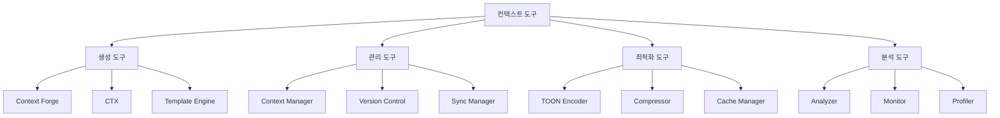

# 도구 관리

## 개요

컨텍스트 도구 관리는 여러 컨텍스트 생성 및 관리 도구들을 효과적으로 오케스트레이션하여 통합된 컨텍스트 엔지니어링 환경을 구축하는 것을 목표로 합니다. Context Forge, CTX, TOON 등 다양한 도구들을 조화롭게 통합하여 시너지를 창출합니다.

## 컨텍스트 도구 생태계

### 1. 핵심 도구 분류



### 2. 도구 상호작용 매트릭스

| 도구 | 생성 | 관리 | 최적화 | 분석 | 호환성 |
|------|------|------|--------|------|--------|
| Context Forge | ✅ | ⚠️ | ❌ | ⚠️ | 높음 |
| CTX | ✅ | ✅ | ⚠️ | ❌ | 중간 |
| TOON | ❌ | ⚠️ | ✅ | ⚠️ | 높음 |
| Context7 | ⚠️ | ✅ | ⚠️ | ✅ | 높음 |

## 도구 관리 아키텍처

### 1. 통합 도구 관리자

```typescript
interface ContextToolsManager {
  // 도구 레지스트리
  registry: {
    tools: Map<string, ToolDefinition>;
    capabilities: Map<string, Capability[]>;
    dependencies: Map<string, string[]>;
  };

  // 도구 오케스트레이션
  orchestration: {
    pipelines: Pipeline[];
    workflows: Workflow[];
    schedules: Schedule[];
  };

  // 통합 레이어
  integration: {
    adapters: ToolAdapter[];
    transformers: DataTransformer[];
    validators: DataValidator[];
  };
}
```

### 2. 도구 어댑터 패턴

```typescript
abstract class ToolAdapter {
  protected tool: any;
  protected config: ToolConfig;

  constructor(tool: any, config: ToolConfig) {
    this.tool = tool;
    this.config = config;
  }

  // 공통 인터페이스
  abstract async initialize(): Promise<void>;
  abstract async execute(command: Command): Promise<Result>;
  abstract async validate(input: any): Promise<boolean>;
  abstract async cleanup(): Promise<void>;

  // 툴별 특화 기능
  abstract getCapabilities(): Capability[];
  abstract getMetadata(): ToolMetadata;
}

// Context Forge 어댑터
class ContextForgeAdapter extends ToolAdapter {
  async initialize(): Promise<void> {
    await this.tool.connect({
      apiKey: this.config.apiKey,
      workspace: this.config.workspace
    });
  }

  async execute(command: Command): Promise<Result> {
    switch (command.type) {
      case 'create_context':
        return await this.createContext(command.params);
      case 'edit_context':
        return await this.editContext(command.params);
      case 'list_contexts':
        return await this.listContexts(command.params);
      default:
        throw new Error(`Unsupported command: ${command.type}`);
    }
  }

  getCapabilities(): Capability[] {
    return [
      'context_creation',
      'context_editing',
      'template_management',
      'version_control'
    ];
  }
}
```

### 3. 도구 파이프라인

```typescript
interface ToolPipeline {
  // 파이프라인 정의
  definition: {
    name: string;
    description: string;
    stages: PipelineStage[];
    triggers: Trigger[];
  };

  // 파이프라인 실행
  execution: {
    context: ExecutionContext;
    variables: Map<string, any>;
    history: ExecutionHistory[];
  };

  // 에러 처리
  errorHandling: {
    retryPolicy: RetryPolicy;
    fallbackActions: FallbackAction[];
    notificationChannels: NotificationChannel[];
  };
}

// 컨텍스트 생성 파이프라인 예시
const contextCreationPipeline: ToolPipeline = {
  definition: {
    name: 'enhanced_context_creation',
    description: 'Create context with multiple tools',
    stages: [
      {
        name: 'analyze_requirement',
        tool: 'sequential-thinking',
        action: 'analyze_task',
        timeout: 30000
      },
      {
        name: 'create_base_context',
        tool: 'context-forge',
        action: 'create_from_template',
        timeout: 15000
      },
      {
        name: 'fetch_documentation',
        tool: 'context7',
        action: 'get_relevant_docs',
        timeout: 20000
      },
      {
        name: 'optimize_tokens',
        tool: 'toon',
        action: 'encode_context',
        timeout: 10000
      },
      {
        name: 'validate_quality',
        tool: 'context-analyzer',
        action: 'validate_context',
        timeout: 5000
      }
    ],
    triggers: ['manual', 'api_call', 'scheduled']
  }
};
```

## 주요 도구 통합

### 1. Context Forge 통합

Context Forge는 컨텍스트 생성 및 편집의 중심 도구입니다.

```typescript
class ContextForgeIntegration {
  private contextForge: ContextForgeAdapter;
  private templateManager: TemplateManager;

  async createEnhancedContext(
    requirement: ContextRequirement
  ): Promise<EnhancedContext> {
    // 1. 요구사항 분석
    const analysis = await this.analyzeRequirement(requirement);

    // 2. 템플릿 선택
    const template = await this.selectTemplate(analysis);

    // 3. 기본 컨텍스트 생성
    const baseContext = await this.contextForge.execute({
      type: 'create_context',
      params: {
        template: template.id,
        variables: analysis.variables
      }
    });

    // 4. 컨텍스트 향상
    const enhanced = await this.enhanceContext(baseContext, analysis);

    return enhanced;
  }

  private async selectTemplate(
    analysis: RequirementAnalysis
  ): Promise<Template> {
    const templates = await this.templateManager.getTemplates();

    // 분석 결과에 가장 적합한 템플릿 선택
    return templates
      .filter(t => t.tags.some(tag => analysis.requirements.includes(tag)))
      .sort((a, b) => b.popularity - a.popularity)[0];
  }

  private async enhanceContext(
    baseContext: Context,
    analysis: RequirementAnalysis
  ): Promise<EnhancedContext> {
    // 다른 도구들을 통한 컨텍스트 향상
    const documentation = await this.addDocumentation(baseContext, analysis);
    const examples = await this.addExamples(baseContext, analysis);
    const optimizations = await this.optimizeTokens(baseContext);

    return {
      ...baseContext,
      documentation,
      examples,
      optimizations,
      metadata: {
        createdAt: Date.now(),
        tools: ['context-forge', 'context7', 'toon'],
        version: '2.0'
      }
    };
  }
}
```

### 2. CTX (Context Template Manager) 통합

CTX는 컨텍스트 템플릿을 관리하고 재사용성을 높입니다.

```typescript
class CTXIntegration {
  private ctx: CTXAdapter;
  private templateRegistry: TemplateRegistry;

  async manageTemplateLifecycle(): Promise<void> {
    // 템플릿 생성
    await this.createTemplates();

    // 템플릿 버전 관리
    await this.versionTemplates();

    // 템플릿 최적화
    await this.optimizeTemplates();
  }

  private async createTemplates(): Promise<void> {
    const commonPatterns = await this.identifyCommonPatterns();

    for (const pattern of commonPatterns) {
      const template = await this.ctx.execute({
        type: 'create_template',
        params: {
          name: pattern.name,
          structure: pattern.structure,
          metadata: {
            category: pattern.category,
            tags: pattern.tags,
            usage: pattern.usage
          }
        }
      });

      await this.templateRegistry.register(template);
    }
  }

  private async identifyCommonPatterns(): Promise<Pattern[]> {
    // 사용 패턴 분석
    const usageData = await this.collectUsageData();

    // 패턴 식별
    return this.analyzePatterns(usageData);
  }
}
```

### 3. TOON 인코더 통합

TOON은 토큰 효율성을 극대화하는 핵심 도구입니다.

```typescript
class TOONIntegration {
  private toon: TOONEncoder;
  private compressionAnalyzer: CompressionAnalyzer;

  async optimizeContextTokens(
    context: Context,
    targetReduction: number = 0.4
  ): Promise<OptimizedContext> {
    // 1. 현재 토큰 사용량 분석
    const currentTokens = this.countTokens(context);

    // 2. 압축 전략 결정
    const strategy = await this.determineCompressionStrategy(
      context,
      targetReduction
    );

    // 3. TOON 인코딩 적용
    const encoded = await this.toon.encode(context, strategy);

    // 4. 압축 결과 분석
    const analysis = await this.analyzeCompression(context, encoded);

    // 5. 품질 검증
    const quality = await this.validateQuality(context, encoded);

    return {
      original: context,
      optimized: encoded,
      metrics: {
        tokenReduction: analysis.reduction,
        compressionRatio: analysis.ratio,
        qualityScore: quality.score
      }
    };
  }

  private async determineCompressionStrategy(
    context: Context,
    targetReduction: number
  ): Promise<CompressionStrategy> {
    return {
      type: 'hybrid',
      techniques: [
        { type: 'toon_encoding', weight: 0.6 },
        { type: 'abbreviation', weight: 0.2 },
        { type: 'structure_optimization', weight: 0.15 },
        { type: 'redundancy_removal', weight: 0.05 }
      ],
      targetReduction,
      preserveCritical: true
    };
  }
}
```

### 4. Context7 통합

Context7은 실시간 문서 검색을 통한 컨텍스트 향상을 담당합니다.

```typescript
class Context7Integration {
  private context7: Context7Adapter;
  private relevanceEngine: RelevanceEngine;

  async enhanceWithLiveDocumentation(
    context: Context
  ): Promise<DocumentationEnhancedContext> {
    // 1. 컨텍스트에서 기술 스택 추출
    const techStack = this.extractTechStack(context);

    // 2. 관련 문서 검색
    const documentation = await this.searchDocumentation(techStack, context);

    // 3. 관련성 필터링
    const relevantDocs = await this.relevanceEngine.filter(
      documentation,
      context
    );

    // 4. 컨텍스트에 통합
    return this.integrateDocumentation(context, relevantDocs);
  }

  private async searchDocumentation(
    techStack: string[],
    context: Context
  ): Promise<Documentation[]> {
    const docs: Documentation[] = [];

    for (const tech of techStack) {
      try {
        // 라이브러리 ID 해석
        const libraryId = await this.context7.resolveLibraryId(tech);

        // 관련 문서 검색
        const relevantDocs = await this.context7.getLibraryDocs(libraryId, {
          mode: 'code',
          topic: this.determineRelevantTopic(context)
        });

        docs.push(...relevantDocs);
      } catch (error) {
        console.warn(`Failed to fetch docs for ${tech}:`, error);
      }
    }

    return docs;
  }

  private determineRelevantTopic(context: Context): string {
    // 컨텍스트 기반 관련 주제 결정
    const keywords = this.extractKeywords(context);

    if (keywords.includes('debugging')) return 'troubleshooting';
    if (keywords.includes('performance')) return 'optimization';
    if (keywords.includes('security')) return 'security';

    return 'getting started';
  }
}
```

## 도구 오케스트레이션

### 1. 워크플로우 엔진

```typescript
class ToolWorkflowEngine {
  private workflows: Map<string, Workflow> = new Map();
  private executionEngine: ExecutionEngine;

  async executeWorkflow(
    workflowId: string,
    input: WorkflowInput
  ): Promise<WorkflowOutput> {
    const workflow = this.workflows.get(workflowId);
    if (!workflow) {
      throw new Error(`Workflow not found: ${workflowId}`);
    }

    const context = {
      workflow,
      input,
      variables: new Map<string, any>(),
      history: []
    };

    return await this.executionEngine.execute(context);
  }

  async registerWorkflow(workflow: Workflow): Promise<void> {
    // 워크플로우 검증
    await this.validateWorkflow(workflow);

    // 워크플로우 등록
    this.workflows.set(workflow.id, workflow);
  }
}

// 컨텍스트 생성 워크플로우 예시
const contextCreationWorkflow: Workflow = {
  id: 'comprehensive_context_creation',
  name: 'Comprehensive Context Creation',
  description: 'Create context using multiple tools',
  steps: [
    {
      id: 'analyze',
      tool: 'sequential-thinking',
      action: 'analyze_requirement',
      inputs: ['requirement'],
      outputs: ['analysis'],
      timeout: 30000
    },
    {
      id: 'create_base',
      tool: 'context-forge',
      action: 'create_context',
      inputs: ['analysis'],
      outputs: ['base_context'],
      dependsOn: ['analyze'],
      timeout: 15000
    },
    {
      id: 'enhance_docs',
      tool: 'context7',
      action: 'add_documentation',
      inputs: ['base_context'],
      outputs: ['enhanced_context'],
      dependsOn: ['create_base'],
      timeout: 20000
    },
    {
      id: 'optimize',
      tool: 'toon',
      action: 'optimize_tokens',
      inputs: ['enhanced_context'],
      outputs: ['optimized_context'],
      dependsOn: ['enhance_docs'],
      timeout: 10000
    }
  ]
};
```

### 2. 도구 조정자 (Tool Mediator)

```typescript
class ToolMediator {
  private tools: Map<string, ToolAdapter> = new Map();
  private conflictResolver: ConflictResolver;

  async coordinateTools(
    request: CoordinationRequest
  ): Promise<CoordinationResult> {
    // 1. 요청 분석
    const analysis = await this.analyzeRequest(request);

    // 2. 도구 선택
    const selectedTools = await this.selectTools(analysis);

    // 3. 충돌 감지
    const conflicts = await this.detectConflicts(selectedTools);

    // 4. 충돌 해결
    if (conflicts.length > 0) {
      await this.conflictResolver.resolve(conflicts);
    }

    // 5. 도구 실행 조정
    return await this.coordinateExecution(selectedTools, request);
  }

  private async selectTools(
    analysis: RequestAnalysis
  ): Promise<SelectedTool[]> {
    const tools: SelectedTool[] = [];

    for (const [name, tool] of this.tools) {
      const capabilities = tool.getCapabilities();

      // 분석 결과와 도구 능력 매칭
      const match = this.matchCapabilities(capabilities, analysis.requirements);

      if (match.score > 0.7) {
        tools.push({
          name,
          tool,
          matchScore: match.score,
          priority: match.priority
        });
      }
    }

    // 우선순위로 정렬
    return tools.sort((a, b) => b.priority - a.priority);
  }

  private async coordinateExecution(
    tools: SelectedTool[],
    request: CoordinationRequest
  ): Promise<CoordinationResult> {
    const executionPlan = await this.createExecutionPlan(tools, request);
    const results: ToolResult[] = [];

    for (const stage of executionPlan.stages) {
      const stageResults = await this.executeStage(stage, tools, results);
      results.push(...stageResults);
    }

    return {
      success: true,
      results,
      metrics: executionPlan.metrics
    };
  }
}
```

## 성능 최적화

### 1. 도구 퍼포먼스 모니터링

```typescript
class ToolPerformanceMonitor {
  private metrics: Map<string, ToolMetrics> = new Map();
  private alerting: AlertingSystem;

  async monitorToolExecution(
    toolName: string,
    operation: () => Promise<any>
  ): Promise<any> {
    const startTime = Date.now();
    let result: any;

    try {
      result = await operation();

      // 성공 메트릭 기록
      this.recordMetrics(toolName, {
        executionTime: Date.now() - startTime,
        success: true,
        resultSize: this.calculateResultSize(result)
      });

      return result;
    } catch (error) {
      // 실패 메트릭 기록
      this.recordMetrics(toolName, {
        executionTime: Date.now() - startTime,
        success: false,
        error: error.message
      });

      // 알림 발송
      await this.alerting.sendAlert({
        level: 'error',
        tool: toolName,
        message: `Tool execution failed: ${error.message}`
      });

      throw error;
    }
  }

  private recordMetrics(toolName: string, metrics: ExecutionMetrics): void {
    const existing = this.metrics.get(toolName) || {
      totalCalls: 0,
      successRate: 0,
      averageExecutionTime: 0,
      lastUpdated: 0
    };

    const updated = this.calculateUpdatedMetrics(existing, metrics);
    this.metrics.set(toolName, updated);

    // 성능 임계값 확인
    this.checkPerformanceThresholds(toolName, updated);
  }
}
```

### 2. 동적 도구 스케줄링

```typescript
class DynamicToolScheduler {
  private loadBalancer: LoadBalancer;
  private resourceMonitor: ResourceMonitor;

  async scheduleToolExecution(
    tool: string,
    priority: Priority,
    estimatedResources: ResourceEstimate
  ): Promise<ScheduledExecution> {
    // 1. 리소스 가용성 확인
    const availability = await this.resourceMonitor.checkAvailability(
      estimatedResources
    );

    if (!availability.available) {
      // 대기열에 추가
      return await this.addToQueue(tool, priority, estimatedResources);
    }

    // 2. 로드 밸런싱
    const optimalInstance = await this.loadBalancer.selectInstance(tool);

    // 3. 실행 스케줄링
    return await this.scheduleOnInstance(
      optimalInstance,
      tool,
      priority
    );
  }

  private async optimizeQueue(): Promise<void> {
    // 우선순위 기반 큐 최적화
    const queue = await this.getQueue();

    // 리소스 사용량 예측
    const optimizedOrder = await this.optimizeExecutionOrder(queue);

    // 큐 재정렬
    await this.reorderQueue(optimizedOrder);
  }
}
```

## 모범 사례 체크리스트

### 도구 선택 시
- [ ] 기능 요구사항 충족 여부 확인
- [ ] 성능 벤치마킹 결과 검토
- [ ] 호환성 및 통합 용이성 평가
- [ ] 유지보수 및 지원 상태 확인
- [ ] 라이선스 및 비용 고려

### 도구 통합 시
- [ ] 표준화된 인터페이스 구현
- [ ] 에러 처리 및 복구 전략 수립
- [ ] 성능 모니터링 시스템 구축
- [ ] 보안 정책 준수 확인
- [ ] 테스트 및 검증 절차 수립

### 운영 중
- [ ] 정기적 성능 평가 수행
- [ ] 사용 패턴 분석 및 최적화
- [ ] 도구 버전 관리 및 업데이트
- [ ] 문제 발생 시 원인 분석 및 개선
- [ ] 사용자 피드백 수집 및 반영

---

## 다음 단계

도구 관리를 마스터했다면, [성능 최적화](./optimization)를 통해 컨텍스트 시스템의 전반적인 성능을 극대화하는 방법을 알아보세요.