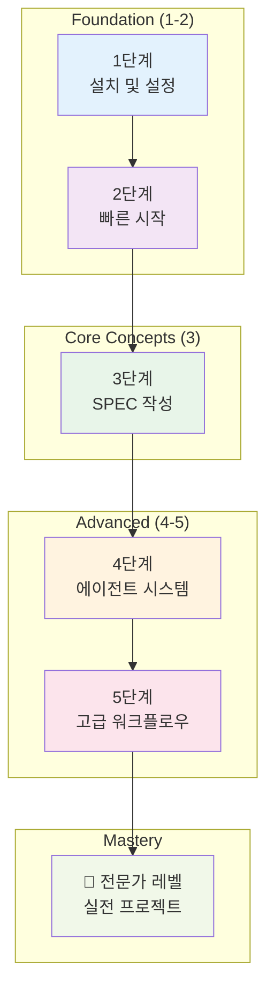
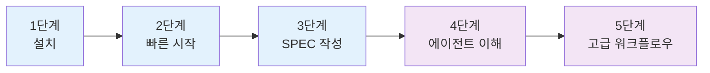
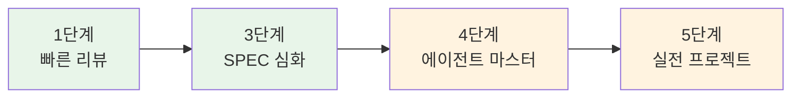
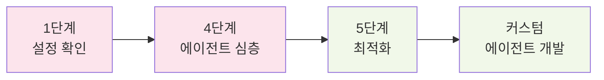

# 학습 경로 안내

MoAI-ADK는 초보자부터 전문가까지 단계적으로 학습할 수 있는 체계적인 **5단계 학습 경로**를 제공합니다. 각 단계는 이전 단계의 지식을 바탕으로 더 심화된 내용을 다룹니다.

## 🎯 학습 경로 개요



## 📋 각 단계별 상세 내용

### 단계 1: 설치 및 설정 (30분)

**학습 목표**: MoAI-ADK 개발 환경 구축

**핵심 내용**:
- ✅ uv 패키지 매니저 설치
- ✅ MoAI-ADK CLI 설치 및 설정
- ✅ Claude Code 환경 설정
- ✅ 프로젝트 초기화
- ✅ 기본 설정 파일 이해

**예상 소요 시간**: 30분
**난이도**: ⭐☆☆☆☆ (초급)

**성공 기준**:
```bash
# 성공적으로 설치 확인
moai-adk --version
# → MoAI-ADK v0.30.2

# 프로젝트 생성 성공
moai-adk init my-first-project
# → Project structure created successfully
```

**자세한 가이드**: [1단계: 설치 및 설정](./installation)

---

### 단계 2: 빠른 시작 가이드 (45분)

**학습 목표**: 기본적인 MoAI-ADK 사용법 습득

**핵심 내용**:
- ✅ Plan-Run-Sync 기본 워크플로우 이해
- ✅ 간단한 기능 구현 (Hello World)
- ✅ 기본 명령어 사용법 (`/moai:1-plan`, `/moai:2-run`, `/moai:3-sync`)
- ✅ 컨텍스트 관리 (`/clear` 명령어)
- ✅ 결과 확인 및 검증

**실습 프로젝트**: 간단한 계산기 앱
- 기능: 사칙연산 계산기
- 기술: Python + FastAPI 기본
- 테스트: 기본 단위 테스트

**예상 소요 시간**: 45분
**난이도**: ⭐⭐☆☆☆ (초급-중급)

**성공 기준**:
```bash
# SPEC 생성 성공
/moai:1-plan "create calculator app"
# → SPEC-001 generated successfully

# 구현 완료
/moai:2-run SPEC-001
# → All tests passing, 90% coverage

# 문서 생성 완료
/moai:3-sync SPEC-001
# → Documentation generated
```

**자세한 가이드**: [2단계: 빠른 시작 가이드](./quickstart)

---

### 단계 3: 첫 SPEC 작성하기 (60분)

**학습 목표**: 전문적인 SPEC 문서 작성 능력 습득

**핵심 내용**:
- ✅ EARS (Easy Approach to Requirements Syntax) 형식 이해
- ✅ 요구사항 분석 및 명세화
- ✅ 제약 조건 및 성공 기준 정의
- ✅ 테스트 시나리오 작성
- ✅ SPEC 검토 및 승인 프로세스

**실습 프로젝트**: 사용자 인증 시스템
- 기능: 회원가입, 로그인, 로그아웃
- 보안: JWT 토큰, 비밀번호 암호화
- 테스트: 8개의 상세 시나리오

**EARS 형식 예시**:
```markdown
## Requirements

- WHEN a user enters valid email and password and clicks "Login"
- IF credentials are correct
- THEN the system issues a JWT token and redirects to dashboard

## Constraints

- Password must be at least 8 characters
- Lock account after 5 consecutive failures (30 minutes)
- Response time must be under 500ms

## Success Criteria

- 100% success rate with valid credentials
- Clear error messages for invalid credentials
- Response time < 500ms
- Test coverage >= 85%
```

**예상 소요 시간**: 60분
**난이도**: ⭐⭐⭐☆☆ (중급)

**성공 기준**:
- 완전한 SPEC-002 문서 작성
- 모든 EARS 형식 요구사항 충족
- 10개 이상의 테스트 시나리오 포함
- 제약 조건 및 성공 기준 명확히 정의

**자세한 가이드**: [3단계: 첫 SPEC 작성하기](./first-spec)

---

### 단계 4: 에이전트 시스템 이해 (90분)

**학습 목표**: MoAI-ADK의 26개 에이전트와 22개 스킬 시스템 완전 이해

**핵심 내용**:
- ✅ 5-Tier 에이전트 계층 구조 이해
- ✅ 에이전트 선택 및 위임 전략
- ✅ 스킬 로딩 및 활용 방법
- ✅ 에이전트 간 협업 패턴
- ✅ MCP 서버 통합 (Context7, Sequential-Thinking)

**5-Tier 에이전트 계층**:

| Tier | 역할 | 에이전트 수 | 주요 기능 |
|------|------|------------|----------|
| **Tier 1** | Domain Experts | 7개 | 백엔드, 프론트엔드, 데이터베이스 등 |
| **Tier 2** | Workflow Managers | 8개 | SPEC, TDD, 문서화, 품질 관리 |
| **Tier 3** | Meta-generators | 3개 | 에이전트, 스킬, 명령어 생성 |
| **Tier 4** | MCP Integrators | 5개 | 외부 도구 연동 (Context7 등) |
| **Tier 5** | AI Services | 1개 | Gemini 3 이미지 생성 |

**실습 프로젝트**: 블로그 플랫폼 개발
- 에이전트 조정: 7개 에이전트 협업
- 기능: 게시물 CRUD, 댓글 시스템, 사용자 관리
- 스킬 활용: 5개 스킬 조합 사용

**예상 소요 시간**: 90분
**난이도**: ⭐⭐⭐⭐☆ (중급-고급)

**성공 기준**:
- 각 티어의 에이전트 기능 완전 이해
- 적절한 에이전트 선택 및 위임 가능
- 에이전트 협업 패턴 실제 적용
- MCP 서버 활용 능력 습득

**자세한 가이드**: [4단계: 에이전트 시스템 이해](./understanding-agents)

---

### 단계 5: 고급 워크플로우 (120분)

**학습 목표**: 복잡한 프로젝트의 워크플로우 자동화 및 최적화

**핵심 내용**:
- ✅ 복잡한 워크플로우 설계 및 오케스트레이션
- ✅ 다중 에이전트 협업 패턴 (병렬, 순차, 파이프라인)
- ✅ 에이전트 통신 프로토콜 및 컨텍스트 공유
- ✅ 자동화된 품질 보증 (TRUST 5)
- ✅ 성능 최적화 및 모니터링

**고급 패턴**:

1. **병렬 개발 패턴**:
```python
# 동시에 여러 컴포넌트 개발
parallel_tasks = await Promise.all([
    Task(subagent_type="expert-backend", prompt="API 개발"),
    Task(subagent_type="expert-frontend", prompt="UI 개발"),
    Task(subagent_type="expert-database", prompt="DB 설계")
])
```

2. **파이프라인 패턴**:
```python
# 단계별 처리 및 검증
spec → architecture → implementation → testing → deployment
```

**실습 프로젝트**: 이커머스 플랫폼
- 규모: 10+ 마이크로서비스
- 복잡도: 결제, 재고, 배송 시스템 통합
- 팀: 5개 에이전트 동시 협업

**예상 소요 시간**: 120분
**난이도**: ⭐⭐⭐⭐⭐ (고급)

**성공 기준**:
- 복잡한 워크플로우 자동 설계
- 다중 에이전트 효율적 조정
- 성능 병목 현상 식별 및 해결
- 엔터프라이즈급 품질 보증 적용

**자세한 가이드**: [5단계: 고급 워크플로우](./advanced-workflows)

---

## 🎯 학습 경로 추천

### 초보자 (개발 경험 0-2년)



**추천 학습 속도**: 1-2주에 1단계
**총 학습 기간**: 5-10주
**목표**: MoAI-ADK 기본 사용 능력 습득

### 중급자 (개발 경험 3-5년)



**추천 학습 속도**: 1주에 1-2단계
**총 학습 기간**: 3-4주
**목표**: MoAI-ADK 전문가 수준 습득

### 고급자 (개발 경험 5+년)



**추천 학습 속도**: 집중 학습 (1-2주)
**총 학습 기간**: 1-2주
**목표**: MoAI-ADK 커스터마이징 및 확장 능력 습득

---

## 📊 학습 진도 측정

### 단계별 평가 기준

#### 단계 1 평가 (설치 및 설정)
- [ ] MoAI-ADK CLI 정상 설치
- [ ] 프로젝트 초기화 성공
- [ ] 기본 설정 파일 이해
- [ ] Claude Code 연동 확인

#### 단계 2 평가 (빠른 시작)
- [ ] Plan-Run-Sync 기본 흐름 이해
- [ ] 간단한 기능 구현 완료
- [ ] 기본 명령어 사용 능력
- [ ] 결과 확인 및 검증

#### 단계 3 평가 (SPEC 작성)
- [ ] EARS 형식 완전 이해
- [ ] 복잡한 요구사항 명세화
- [ ] 테스트 시나리오 작성
- [ ] SPEC 품질 검토 능력

#### 단계 4 평가 (에이전트 시스템)
- [ ] 5-Tier 계층 구조 이해
- [ ] 적절한 에이전트 선택 능력
- [ ] 스킬 조합 활용
- [ ] 에이전트 협업 패턴 적용

#### 단계 5 평가 (고급 워크플로우)
- [ ] 복잡한 워크플로우 설계
- [ ] 다중 에이전트 조정
- [ ] 성능 최적화
- [ ] 실전 프로젝트 완수

### 역량 매트릭스

| 역량 | 단계 1 | 단계 2 | 단계 3 | 단계 4 | 단계 5 |
|------|--------|--------|--------|--------|--------|
| **기본 설정** | ★★★★★ | ★★★★★ | ★★★★★ | ★★★★★ | ★★★★★ |
| **SPEC 작성** | ★☆☆☆☆ | ★★☆☆☆ | ★★★★★ | ★★★★★ | ★★★★★ |
| **에이전트 활용** | ★☆☆☆☆ | ★★☆☆☆ | ★★★☆☆ | ★★★★★ | ★★★★★ |
| **워크플로우 설계** | ★☆☆☆☆ | ★★☆☆☆ | ★★★☆☆ | ★★★★☆ | ★★★★★ |
| **프로젝트 관리** | ★★☆☆☆ | ★★★☆☆ | ★★★★☆ | ★★★★★ | ★★★★★ |

---

## 🎓 학습 자료 및 지원

### 필수 학습 자료
1. **공식 문서**: 모든 단계의 상세 가이드
2. **예제 프로젝트**: 단계별 실습용 코드
3. **비디오 튜토리얼**: 시각적 학습 자료 (준비 중)
4. **커뮤니티 포럼**: 질문과 답변 공간

### 실습 환경
- **샌드박스 프로젝트**: 안전한 실습 환경 제공
- **단계별 체크포인트**: 진도 확인용 마일스톤
- **자동 평가 시스템**: 과제 제출 및 피드백

### 지원 채널
- **질의응답**: [Discord 커뮤니티](https://discord.gg/moai-adk)
- **이메일 지원**: [support@mo.ai.kr](mailto:support@mo.ai.kr)
- **주간 Q&A 세션**: 온라인 라이브 세션

---

## 🚀 다음 단계

### 학습 완료 후 가능한 역할

1. **MoAI-ADK 개발자**: AI 기반 개발 전문가
2. **에이전트 아키텍트**: 복잡한 에이전트 시스템 설계자
3. **워크플로우 엔지니어**: 자동화 프로세스 전문가
4. **AI 솔루션 컨설턴트**: 기업 AI 도입 컨설턴트

### 심화 학습 경로
1. **커스텀 에이전트 개발**: 조직 특화 에이전트 제작
2. **MCP 서버 개발**: 새로운 외부 도구 연동
3. **연구 참여**: Anthropic 에이전트 연구 기여
4. **커뮤니티 리더**: 지식 공유 및 멘토링

---

## 🎯 핵심 takeaways

1. **체계적 학습**: 5단계 구조로 점진적 능력 향상
2. **실습 중심**: 모든 이론은 실제 프로젝트로 적용
3. **유연한 진도**: 개인 경험에 따른 맞춤 학습 속도
4. **지속적 평가**: 단계별 명확한 성공 기준
5. **실전 준비**: 완료 후 즉시 실제 프로젝트 적용 가능

MoAI-ADK 학습 경로는 **단순한 도구 사용법**을 넘어 **AI 기반 개발 패러다임**을 완전히 습득하도록 설계되었습니다. 이 과정을 완료하면 **3-4배 더 높은 개발 생산성**과 **엔터프라이즈급 코드 품질**을 자신감 있게 달성할 수 있습니다.