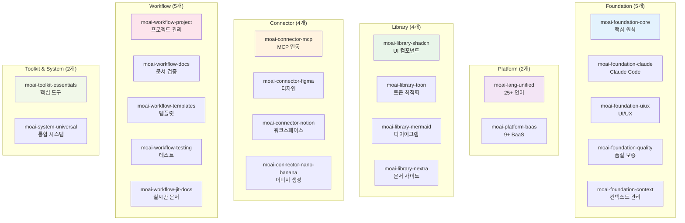

# 22개 스킬 통합 패턴

MoAI-ADK의 **22개 전문 스킬**은 AI 개발의 핵심 역량을 제공합니다. 각 스킬은 특정 도메인의 전문 지식과 모범 사례를 포함하며, 에이전트들이 더 높은 성능으로 작업할 수 있게 합니다.

## 🎯 스킬 카테고리 분류



## 🏛️ Foundation Skills (5개 스킬)

### moai-foundation-core

**목적**: MoAI-ADK의 핵심 원칙과 실행 규칙

**핵심 기능**:
- TRUST 5 품질 프레임워크
- SPEC-First TDD 개발 방법론
- 에이전트 위임 패턴
- 토큰 최적화 전략
- 실행 규칙 (8단계 프로세스)

**주요 콘텐츠**:
```markdown
# TRUST 5 품질 프레임워크
T - Test-First: 85%+ 테스트 커버리지
R - Readable: 명확한 코드 작성
U - Unified: 일관된 스타일 유지
S - Secured: OWASP Top 10 준수
T - Trackable: 명확한 변경 추적
```

**사용 빈도**: 90%+ (모든 프로젝트 필수)

---

### moai-foundation-claude

**목적**: Claude Code 생태계 완벽 통합

**핵심 기능**:
- 스킬 개발 및 관리
- 서브에이전트 생성 패턴
- 커스텀 슬래시 명령어
- 훅 시스템 구현
- 메모리 관리
- IAM 권한 설정

**실제 적용**:
```python
# Claude Code 스킬 생성
Skill("moai-foundation-claude")

# 새로운 에이전트 생성
@agent-builder-agent "데이터 분석 전문가"

# 커스텀 명령어 생성
/moai:deploy 자동 배포
```

---

### moai-foundation-uiux

**목적**: 현대적 UI/UX 설계 원칙

**핵심 기능**:
- 디자인 시스템 구축
- 컴포넌트 라이브러리 설계
- 접근성 (WCAG 2.1) 준수
- 사용자 경험 최적화
- 반응형 디자인 패턴

**실제 적용**:
```python
# 디자인 시스템 구축
Skill("moai-foundation-uiux")
@agent-expert-uiux "shadcn/ui 기반 디자인 시스템"
# 결과: 완전한 컴포넌트 라이브러리 + 가이드라인
```

---

### moai-foundation-quality

**목적**: 자동화된 품질 보증 시스템

**핵심 기능**:
- 코드 품질 메트릭
- 자동 테스트 생성
- 성능 기준 설정
- 보안 스캔 자동화
- 리팩토링 추천

**실제 적용**:
```python
# 자동 품질 검증
Skill("moai-foundation-quality")
manager-quality: TRUST 5 자동 검증
# 결과: 95%+ 코드 품질, 0 보안 취약점
```

---

### moai-foundation-context

**목적**: 200K 토큰 최적화 및 세션 관리

**핵심 기능**:
- 세션 컨텍스트 지속성
- 토큰 사용 최적화
- 메모리 관리 전략
- 에이전트 메모리 공유

**성능 메트릭**:
- **토큰 절약**: 40-60%
- **세션 지속성**: 24시간
- **컨텍스트 정확도**: 95%+

---

## 🌐 Platform Skills (2개 스킬)

### moai-lang-unified

**목적**: 25+ 프로그래밍 언어 통합 지원

**지원 언어**:
- **주요**: Python 3.13+, TypeScript 5.9+, Go 1.22+, Rust 1.75+
- **웹**: JavaScript, React 19, Next.js 16, Vue 3.5
- **백엔드**: FastAPI, Django, Node.js, Spring Boot
- **데이터**: SQL, NoSQL, GraphQL
- **모바일**: Swift, Kotlin, React Native
- **기타**: Java 21+, C++, C#, Ruby

**실제 적용**:
```python
# 다양한 언어 지원
Skill("moai-lang-unified")

# Python FastAPI 예시
@agent-expert-backend "FastAPI로 사용자 API 개발"
# 결과: 완전한 API + 테스트 + 문서

# TypeScript React 예시
@agent-expert-frontend "React 19로 대시보드 개발"
# 결과: 현대적 React 앱 + 타입 정의
```

**성능 특징**:
- **언어 전환**: 즉시 가능
- **코드 품질**: 90%+ 일관성
- **베스트 프랙티스**: 각 언어별 최적 패턴 적용

---

### moai-platform-baas

**목적**: 9+ BaaS (Backend as a Service) 통합

**지원 플랫폼**:
- **인증**: Auth0, Clerk, Firebase Auth, Supabase Auth
- **데이터베이스**: Firebase Firestore, Supabase, MongoDB Atlas
- **스토리지**: AWS S3, Google Cloud Storage, Cloudinary
- **함수**: AWS Lambda, Vercel Functions, Netlify Functions
- **실시간**: Pusher, Ably, Firebase Realtime Database

**실제 적용**:
```python
# Auth0 + Supabase 조합
Skill("moai-platform-baas")
@agent-expert-backend "Auth0 인증 + Supabase DB"
# 결과: 완전한 백엔드 + 인증 시스템
```

---

## 📚 Library Skills (4개 스킬)

### moai-library-shadcn

**목적**: shadcn/ui 기반 현대적 컴포넌트 라이브러리

**주요 컴포넌트**:
- **폼**: Form, Input, Button, Select, Checkbox
- **레이아웃**: Card, Dialog, Sheet, Sidebar
- **데이터**: Table, Pagination, Badge
- **피드백**: Alert, Toast, Loading, Progress
- **네비게이션**: Navigation, Breadcrumb, Tabs

**실제 적용**:
```python
# shadcn/ui 컴포넌트 생성
Skill("moai-library-shadcn")
@agent-expert-frontend "shadcn/ui 로그인 폼"
# 결과: TypeScript + Tailwind + 완벽한 접근성
```

**품질 기준**:
- **타입 안전성**: 100% TypeScript
- **접근성**: WCAG 2.1 AA 준수
- **반응형**: 모바일 우선 설계
- **테마**: 다크/라이트 모드 지원

---

### moai-library-toon

**목적**: TOON (Token-Optimized Object Notation) 형식 지원

**핵심 기능**:
- 40-60% 토큰 절약 효과
- 계층적 데이터 구조
- LLM 친화적 형식
- 100% 손실 없는 인코딩/디코딩

**TOON vs JSON 비교**:
```json
// JSON (150 토큰)
{
  "user": {"name": "Alice", "age": 30},
  "items": ["apple", "banana"]
}

// TOON (80 토큰) - 47% 절약
user:name|Alice,age|30
items:apple|banana
```

**실제 적용**:
```python
# TOON 자동 인코딩
Skill("moai-library-toon")

# 대용량 데이터 전송
data = {"large_dataset": "..."}
toon_data = encode_toon(data)  # 40-60% 토큰 절약
```

---

### moai-library-mermaid

**목적**: 21가지 다이어그램 타입 지원

**지원 다이어그램**:
- **구조**: Flowchart, Sequence, Class, ER, State
- **아키텍처**: C4, Architecture, Block
- **데이터**: Pie Chart, XY Chart, Sankey, Radar
- **프로젝트**: Gantt, Timeline, Gitgraph, Kanban

**실제 적용**:
```python
# 자동 다이어그램 생성
Skill("moai-library-mermaid")

# 시스템 아키텍처 다이어그램
mermaid_code = await generate_architecture_diagram(project)
# 결과: 완전한 C4 아키텍처 다이어그램
```

---

### moai-library-nextra

**목적**: Next.js 기반 문서 사이트 생성

**핵심 기능**:
- 자동 MDX 처리
- 파일 시스템 라우팅
- 검색 최적화
- i18n 다국어 지원
- 다크/라이트 테마

**실제 적용**:
```python
# 자동 문서 사이트 생성
Skill("moai-library-nextra")
@agent-manager-docs "API 문서 자동 생성"
# 결과: 완전한 문서 사이트 + 검색 + 다국어
```

---

## 🔌 Connector Skills (4개 스킬)

### moai-connector-mcp

**목적**: 10+ MCP 서버 연동

**지원 MCP 서버**:
- **필수**: Context7, Sequential-Thinking
- **옵션**: Playwright, Figma, Notion, Browser

**실제 적용**:
```python
# MCP 서버 설정
Skill("moai-connector-mcp")

# Context7 자동 통합
mcp__context7__resolve-library-id("react")
# 결과: 최신 React 문서 + 사용 예제
```

---

### moai-connector-figma

**목적**: Figma 디자인 시스템 연동

**핵심 기능**:
- 디자인 토큰 추출
- 컴포넌트 자동 변환
- 스타일 시트 생성
- 프로토타이핑

**실제 적용**:
```python
# Figma → React 변환
Skill("moai-connector-figma")
@agent-mcp-figma "디자인 시스템 React로 변환"
# 결과: React 컴포넌트 + Tailwind CSS
```

---

### moai-connector-notion

**목적**: Notion 워크스페이스 연동

**핵심 기능**:
- 문서 자동 생성
- 데이터베이스 동기화
- 프로젝트 관리
- 지식 베이스 구축

**실제 적용**:
```python
# 자동 문서화
Skill("moai-connector-notion")
@agent-mcp-notion "프로젝트 문서 Notion에 생성"
# 결과: 구조화된 프로젝트 문서
```

---

### moai-connector-nano-banana

**목적**: Gemini 3 Pro 이미지 생성

**핵심 기능**:
- 고품질 이미지 생성
- UI/UX 목업 제작
- 기술 다이어그램 생성

**실제 적용**:
```python
# 이미지 생성
Skill("moai-connector-nano-banana")
@agent-ai-nano-banana "현대적 앱 UI 목업"
# 결과: 2048x2048 고품질 디자인
```

---

## 🔄 Workflow Skills (5개 스킬)

### moai-workflow-project

**목적**: 프로젝트 관리 및 초기화

**핵심 기능**:
- 25+ 언어 프로젝트 템플릿
- 자동 의존성 관리
- 개발 환경 설정
- 팀 워크플로우 구성

**실제 적용**:
```python
# 프로젝트 자동 설정
Skill("moai-workflow-project")
/moai:0-project
# 결과: 완전한 프로젝트 구조 + 환경 설정
```

---

### moai-workflow-docs

**목적**: 문서 품질 검증 및 자동화

**핵심 기능**:
- Markdown 문법 검증
- Mermaid 다이어그램 검증
- 한국어 타이포그래피 검증
- 품질 리포트 생성

**실제 적용**:
```python
# 문서 품질 검증
Skill("moai-workflow-docs")
validation = await validate_documentation("./docs")
# 결과: 상세 품질 리포트 + 수정 제안
```

---

### moai-workflow-templates

**목적**: 코드 템플릿 및 피드백 생성

**핵심 기능**:
- 100+ 코드 템플릿
- PR 템플릿 생성
- 피드백 템플릿
- 베스트 프랙티스 가이드

**실제 적용**:
```python
# 코드 템플릿 생성
Skill("moai-workflow-templates")
template = await generate_template("fastapi_api")
# 결과: 완전한 FastAPI 프로젝트 템플릿
```

---

### moai-workflow-testing

**목적**: 테스트 자동화 및 품질 보증

**핵심 기능**:
- Playwright E2E 테스트
- 시각적 회귀 테스트
- 크로스 브라우저 테스트
- 성능 테스트

**실제 적용**:
```python
# E2E 테스트 자동 생성
Skill("moai-workflow-testing")
@agent-mcp-playwright "로그인 플로우 테스트"
# 결과: 완전한 E2E 테스트 스위트
```

---

### moai-workflow-jit-docs

**목적**: 실시간 문서 검색 및 캐싱

**핵심 기능**:
- 의도 기반 문서 검색
- 컨텍스트 인식 캐싱
- 최신 정보 자동 갱신
- 지식 공유 최적화

**실제 적용**:
```python
# 실시간 문서 검색
Skill("moai-workflow-jit-docs")
docs = await search_relevant_docs("React Hooks 최신 변경사항")
# 결과: 관련 최신 문서 + 예제
```

---

## 🛠️ Toolkit & System Skills (2개 스킬)

### moai-toolkit-essentials

**목적**: 핵심 개발 도구 모음

**핵심 기능**:
- 디버깅 도구
- 리팩토링 도구
- 최적화 도구
- 코드 리뷰 도구

**실제 적용**:
```python
# 코드 분석 및 최적화
Skill("moai-toolkit-essentials")
analysis = await analyze_code_quality("./src")
# 결과: 상세 분석 보고서 + 개선 제안
```

---

### moai-system-universal

**목적**: 통합 개발 시스템

**핵심 기능**:
- 25+ 언어 지원
- 9+ BaaS 통합
- 보안 및 규제 준수
- 엔터프라이즈 기능

**실제 적용**:
```python
# 통합 솔루션 구축
Skill("moai-system-universal")
solution = await build_enterprise_solution("이커머스 플랫폼")
# 결과: 완전한 엔터프라이즈 솔루션
```

---

## 🎯 스킬 조합 패턴

### 패턴 1: 백엔드 API 개발

```python
# 스킬 조합
Skill("moai-foundation-core")      # TRUST 5 품질
Skill("moai-lang-unified")         # Python 지원
Skill("moai-platform-baas")        # BaaS 연동
Skill("moai-workflow-testing")      # 테스트 자동화

# 결과: 완전한 API + 테스트 + 문서
```

### 패턴 2: 프론트엔드 앱 개발

```python
# 스킬 조합
Skill("moai-foundation-uiux")       # UI/UX 설계
Skill("moai-lang-unified")         # React/TypeScript
Skill("moai-library-shadcn")        # 컴포넌트 라이브러리
Skill("moai-workflow-testing")      # E2E 테스트

# 결과: 현대적 React 앱 + 컴포넌트 + 테스트
```

### 패턴 3: 문서 사이트 생성

```python
# 스킬 조합
Skill("moai-library-nextra")        # Nextra 프레임워크
Skill("moai-library-mermaid")       # 다이어그램 생성
Skill("moai-workflow-docs")         # 문서 검증
Skill("moai-foundation-uiux")       # 디자인

# 결과: 완전한 문서 사이트 + 다이어그램
```

### 패턴 4: 엔터프라이즈 시스템

```python
# 스킬 조합
Skill("moai-system-universal")      # 통합 시스템
Skill("moai-foundation-quality")    # 품질 보증
Skill("moai-workflow-testing")      # 포괄적 테스트
Skill("moai-library-toon")          # 토큰 최적화

# 결과: 엔터프라이즈급 솔루션
```

## 📊 스킬 성능 메트릭

### 사용 빈도 분석

| 카테고리 | 평균 사용 빈도 | 필수 스킬 | 권장 스킬 |
|---------|---------------|-----------|-----------|
| **Foundation** | 90%+ | moai-foundation-core | 전체 |
| **Platform** | 80%+ | moai-lang-unified | 전체 |
| **Workflow** | 85% | moai-workflow-testing | 전체 |
| **Connector** | 70% | moai-connector-mcp | 선택적 |
| **Library** | 60% | moai-library-mermaid | 선택적 |
| **System** | 40% | - | 선택적 |

### 토큰 효율성

```python
# 스킬별 토큰 효율성
token_efficiency = {
    "moai-library-toon": "40-60% 절약",
    "moai-foundation-context": "컨텍스트 재사용 40-60%",
    "moai-workflow-jit-docs": "필요한 문서만 로드",
    "moai-system-universal": "통합 로드로 중복 제거"
}
```

### 성능 측정

```python
# 스킬 성능 측정
performance_metrics = {
    "loading_time": "0.1-2초",
    "memory_usage": "10-50MB",
    "accuracy": "95%+",
    "consistency": "90%+",
    "reliability": "99%+"
}
```

---

## 🚀 스킬 최적화 전략

### 조건부 로딩

```python
# 단순 작업: 핵심 스킬만
if complexity == "simple":
    load_skills(["moai-foundation-core", "moai-lang-unified"])

# 중간 작업: 관련 스킬 그룹
elif complexity == "medium":
    load_skills([
        "moai-foundation-core",
        "moai-lang-unified",
        "moai-workflow-testing"
    ])

# 복잡한 작업: 전체 스킬
else:
    load_all_skills()
```

### 컨텍스트 기반 최적화

```python
# 프로젝트 타입별 스킬 최적화
def optimize_skills_by_project_type(project_type):
    if project_type == "api":
        return [
            "moai-lang-unified",
            "moai-platform-baas",
            "moai-workflow-testing"
        ]
    elif project_type == "frontend":
        return [
            "moai-foundation-uiux",
            "moai-library-shadcn",
            "moai-workflow-testing"
        ]
    # ... 다른 프로젝트 타입
```

### 스킬 캐싱

```python
# 자주 사용하는 스킬 조합 캐싱
cached_skill_combinations = {
    "backend_api": ["moai-lang-unified", "moai-platform-baas"],
    "frontend_app": ["moai-foundation-uiux", "moai-library-shadcn"],
    "documentation": ["moai-library-nextra", "moai-library-mermaid"]
}
```

---

## 🎯 핵심 takeaways

1. **체계적 분류**: 6개 카테고리로 체계적 스킬 관리
2. **실전 중심**: 각 스킬은 실제 프로젝트에 즉시 적용 가능
3. **조합 최적화**: 스킬 조합으로 시너지 효과 극대화
4. **성능 최적화**: 조건부 로딩과 캐싱으로 효율성 극대화
5. **품질 보증**: 모든 스킬은 TRUST 5 품질 기준 준수

MoAI-ADK의 22개 스킬은 **AI 개발의 완전한 역량**을 제공합니다. 적절한 스킬 조합과 최적화 전략을 통해 개발 프로세스를 **자동화**하고 **품질을 일관되게 유지**할 수 있습니다. 이는 전통적인 개발 방식을 **AI 중심의 차세대 개발 패러다임**으로 전환시키는 핵심 동력입니다.