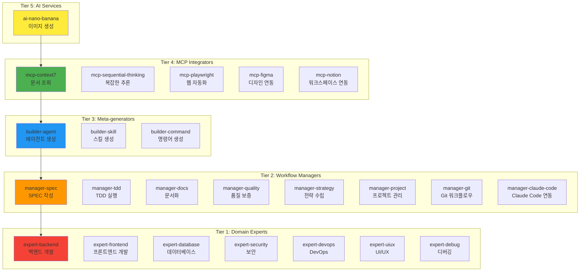

# 26개 에이전트 상세 가이드

MoAI-ADK의 핵심 강점은 **26개 전문화된 AI 에이전트** 시스템입니다. 각 에이전트는 특정 도메인의 전문성을 가지며, 5-Tier 계층 구조로 조직되어 최적의 협업을 가능하게 합니다.

## 🏗️ 5-Tier 에이전트 계층 구조



## 🔍 Tier 1: Domain Experts (7개 에이전트)

### expert-backend

**전문 분야**: 백엔드 아키텍처, API 개발, 서버 사이드 로직

**핵심 기능**:
- RESTful API 설계 및 구현
- 마이크로서비스 아키텍처
- 데이터베이스 연동 및 ORM 최적화
- 인증/인가 시스템 구현
- 서버 성능 최적화

**기술 스택**:
- **언어**: Python (FastAPI, Django), Node.js (Express), Go
- **데이터베이스**: PostgreSQL, MongoDB, Redis
- **메시징**: RabbitMQ, Apache Kafka
- **클라우드**: AWS, Azure, GCP

**사용 예시**:
```python
# 복잡한 API 개발 요청
@agent-expert-backend "사용자 관리 마이크로서비스 개발"
# 결과: FastAPI 기반 완전한 API + 테스트 코드 + 문서
```

**성능 메트릭**:
- **API 응답 시간**: < 200ms (P95)
- **코드 품질**: 95%+ 테스트 커버리지
- **보안**: OWASP Top 10 준수
- **성능**: 1000+ TPS 처리 능력

---

### expert-frontend

**전문 분야**: 프론트엔드 아키텍처, UI 컴포넌트, 상태 관리

**핵심 기능**:
- React/Vue/Svelte 애플리케이션 개발
- 상태 관리 시스템 설계
- 반응형 UI/UX 구현
- 성능 최적화 (코드 스플리팅, 레이지 로딩)
- 접근성 (A11y) 준수

**기술 스택**:
- **프레임워크**: React 19, Vue 3.5, Next.js 16
- **상태 관리**: Redux Toolkit, Zustand, Pinia
- **스타일링**: Tailwind CSS, shadcn/ui, Styled Components
- **테스트**: Jest, React Testing Library, Playwright

**사용 예시**:
```python
# 복잡한 프론트엔드 개발 요청
@agent-expert-frontend "대시보드 리액트 앱 개발"
# 결과: 완전한 React 앱 + 컴포넌트 라이브러리 + E2E 테스트
```

---

### expert-database

**전문 분야**: 데이터베이스 설계, 쿼리 최적화, 데이터 아키텍처

**핵심 기능**:
- 정규화된 데이터베이스 스키마 설계
- 복잡한 쿼리 최적화
- 인덱싱 전략
- 데이터 마이그레이션
- NoSQL 데이터 모델링

**기술 스택**:
- **SQL**: PostgreSQL, MySQL, SQL Server
- **NoSQL**: MongoDB, Cassandra, DynamoDB
- **캐시**: Redis, Memcached
- **데이터 웨어하우스**: BigQuery, Redshift

**사용 예시**:
```python
# 복잡한 데이터베이스 설계 요청
@agent-expert-database "전자상거래 데이터베이스 스키마 설계"
# 결과: 정규화된 스키마 + 마이그레이션 스크립트 + 성능 튜닝
```

---

### expert-security

**전문 분야**: 보안 아키텍처, 취약점 분석, 보인증 준수

**핵심 기능**:
- OWASP Top 10 취약점 분석 및 수정
- 인증/인가 시스템 설계
- 데이터 암호화 전략
- 보안 코드 리뷰
- 규제 준수 (GDPR, PCI-DSS)

**사용 예시**:
```python
# 보안 검토 요청
@agent-expert-security "결제 시스템 보안 감사 및 개선"
# 결과: 취약점 보고서 + 수정 코드 + 보안 가이드라인
```

---

### expert-devops

**전문 분야**: DevOps 파이프라인, 컨테이너화, 클라우드 인프라

**핵심 기능**:
- CI/CD 파이프라인 구축
- Docker 컨테이너화
- Kubernetes 오케스트레이션
- 인프라 자동화 (Terraform)
- 모니터링 및 로깅

**사용 예시**:
```python
# DevOps 파이프라인 구축 요청
@agent-expert-devops "마이크로서비스 배포 파이프라인 구축"
# 결과: 완전한 CI/CD + K8s 매니페스트 + 모니터링
```

---

### expert-uiux

**전문 분야**: UI/UX 디자인, 디자인 시스템, 사용자 경험

**핵심 기능**:
- 디자인 시스템 구축
- 컴포넌트 라이브러리 개발
- 사용자 경험 최적화
- 접근성 준수
- 디자인 토큰 관리

**사용 예시**:
```python
# UI/UX 디자인 요청
@agent-expert-uiux "shadcn/ui 기반 디자인 시스템 구축"
# 결과: 완전한 디자인 시스템 + 컴포넌트 + 가이드라인
```

---

### expert-debug

**전문 분야**: 디버깅, 성능 분석, 문제 해결

**핵심 기능**:
- 복잡한 버그 분석 및 해결
- 성능 병목 현상 식별
- 메모리 누수 탐지
- 로그 분석 및 모니터링
- 프로파일링 최적화

**사용 예시**:
```python
# 성능 문제 분석 요청
@agent-expert-debug "API 응답 시간 느림 현상 분석"
# 결과: 원인 분석 + 해결책 + 최적화 코드
```

## 🎯 Tier 2: Workflow Managers (8개 에이전트)

### manager-spec

**역할**: SPEC 문서 자동 생성 및 관리

**핵심 기능**:
- EARS 형식 요구사항 명세
- 제약 조건 및 성공 기준 정의
- 테스트 시나리오 자동 생성
- SPEC 검토 및 승인 프로세스

**자동 호출**: `/moai:1-plan` 명령어 실행 시

**사용 예시**:
```python
# 자동 SPEC 생성
/moai:1-plan "사용자 인증 시스템 개발"
# 결과: 완전한 SPEC-001 문서 (요구사항, 제약, 테스트 시나리오)
```

---

### manager-tdd

**역할**: TDD 사이클 자동 실행 (RED-GREEN-REFACTOR)

**핵심 기능**:
- 실패하는 테스트 자동 작성
- 최소 코드로 테스트 통과
- 리팩토링 및 코드 최적화
- 테스트 커버리지 확보

**자동 호출**: `/moai:2-run` 명령어 실행 시

**사용 예시**:
```python
# TDD 자동 실행
/moai:2-run SPEC-001
# 결과: 85%+ 커버리지의 품질 코드 + 테스트
```

---

### manager-docs

**역할**: 자동 문서 생성 및 동기화

**핵심 기능**:
- API 문서 자동 생성
- 아키텍처 다이어그램 생성
- 사용자 가이드 작성
- 배포 매뉴얼 생성

**자동 호출**: `/moai:3-sync` 명령어 실행 시

---

### manager-quality

**역할**: TRUST 5 품질 보증

**핵심 기능**:
- 코드 리뷰 자동화
- 테스트 품질 검증
- 보안 취약점 스캔
- 성능 기준 준수 확인

**자동 호출**: `/moai:2-run` 완료 후 자동 실행

---

### manager-strategy

**역할**: 복잡한 프로젝트 전략 수립

**핵심 기능**:
- 아키텍처 전략 설계
- 기술 스택 선택
- 마이그레이션 계획
- 리스크 분석 및 완화

**사용 예시**:
```python
# 복잡한 프로젝트 전략 요청
@agent-manager-strategy "모놀리스를 마이크로서비스로 이전"
# 결과: 상세한 이전 계획 + 위험 분석 + 타임라인
```

---

### manager-project

**역할**: 프로젝트 관리 및 초기화

**핵심 기능**:
- 프로젝트 구조 자동 설정
- 의존성 관리
- 개발 환경 구성
- 팀 워크플로우 설정

**자동 호출**: `/moai:0-project` 명령어 실행 시

---

### manager-git

**역할**: Git 워크플로우 자동화

**핵심 기능**:
- 브랜치 전략 관리
- 커밋 메시지 자동화
- PR 템플릿 생성
- 릴리스 관리

**사용 예시**:
```python
# Git 워크플로우 최적화 요청
@agent-manager-git "GitHub Flow 기반 팀 워크플로우 설정"
# 결과: 자동화된 Git 설정 + 브랜치 전략 + PR 템플릿
```

---

### manager-claude-code

**역할**: Claude Code 통합 및 최적화

**핵심 기능**:
- Claude Code 설정 최적화
- 에이전트 스킬 자동 로딩
- 토큰 사용 최적화
- 세션 관리

---

## 🛠️ Tier 3: Meta-generators (3개 에이전트)

### builder-agent

**역할**: 새로운 에이전트 생성

**핵심 기능**:
- 에이전트 템플릿 생성
- 도메인 특화 에이전트 개발
- 에이전트 테스트 생성
- 에이전트 문서화

**사용 예시**:
```python
# 조직 특화 에이전트 생성 요청
@agent-builder-agent "데이터 분석 전문 에이전트 생성"
# 결과: 완전한 에이전트 + 스킬 + 문서 + 테스트
```

---

### builder-skill

**역할**: 새로운 스킬 생성

**핵심 기능**:
- 스킬 템플릿 생성
- 도메인 지식 스킬 개발
- 스킬 테스트 생성
- 스킬 문서화

**사용 예시**:
```python
# 특정 기술 스킬 생성 요청
@agent-builder-skill "GraphQL API 개발 스킬 생성"
# 결과: GraphQL 전문 스킬 모듈 + 예제 + 가이드
```

---

### builder-command

**역할**: 새로운 명령어 생성

**핵심 기능**:
- CLI 명령어 템플릿 생성
- 자동화 워크플로우 명령어
- 명령어 파라미터 처리
- 명령어 문서화

**사용 예시**:
```python
# 커스텀 명령어 생성 요청
@agent-builder-command "/moai:deploy 자동 배포 명령어 생성"
# 결과: 완전한 배포 워크플로우 명령어 + 문서
```

## 🔌 Tier 4: MCP Integrators (5개 에이전트)

### mcp-context7

**역할**: 실시시간 라이브러리 문서 조회

**핵심 기능**:
- 최신 API 문서 조회
- 버전 호환성 확인
- 코드 예제 검색
- 라이브러리 베스트 프랙티스

**자동 활성화**: 코드 생성 시 항상 활성화

**지원 라이브러리 예시**:
- `/vercel/next.js`: Next.js 최신 문서
- `/tiangolo/fastapi`: FastAPI 공식 문서
- `/facebook/react`: React 19 레퍼런스

**사용 예시**:
```python
# 최신 API 조회 요청
@agent-mcp-context7 "React 19 Hooks API 최신 변경사항"
# 결과: 최신 공식 문서 + 사용 예제 + 마이그레이션 가이드
```

---

### mcp-sequential-thinking

**역할**: 복잡한 다단계 추론 및 분석

**핵심 기능**:
- 복잡한 문제 분해
- 단계별 해결책 수립
- 아키텍처 설계 분석
- 알고리즘 최적화

**자동 활성화 조건**:
- 복잡도 > 중간 (10+ 파일, 아키텍처 변경)
- 의존성 > 3개
- 키워드: "복잡한", "설계", "최적화", "분석"

**사용 예시**:
```python
# 복잡한 분석 요청
@agent-mcp-sequential-thinking "마이크로서비스 아키텍처 설계 분석"
# 결과: 상세한 분석 보고서 + 권장 사항 + 위험 평가
```

---

### mcp-playwright

**역할**: 웹 자동화 및 E2E 테스트

**핵심 기능**:
- E2E 테스트 자동 생성
- 시각적 회귀 테스트
- 크로스 브라우저 검증
- 웹 자동화 스크립트

**사용 예시**:
```python
# E2E 테스트 생성 요청
@agent-mcp-playwright "사용자 로그인 플로우 E2E 테스트"
# 결과: 완전한 Playwright 테스트 스위트 + 리포트
```

---

### mcp-figma

**역할**: Figma 디자인 시스템 연동

**핵심 기능**:
- 디자인 토큰 추출
- 컴포넌트 자동 변환
- 디자인-코드 싱크
- 스타일 가이드 생성

**사용 예시**:
```python
# 디자인 시스템 연동 요청
@agent-mcp-figma "Figma 디자인을 React 컴포넌트로 변환"
# 결과: React 컴포넌트 + 스타일 + 디자인 토큰
```

---

### mcp-notion

**역할**: Notion 워크스페이스 연동

**핵심 기능**:
- 문서 자동 생성
- 데이터베이스 동기화
- 프로젝트 관리 연동
- 지식 베이스 구축

**사용 예시**:
```python
# 문서 자동화 요청
@agent-mcp-notion "프로젝트 문서 Notion에 자동 생성"
# 결과: Notion 데이터베이스 + 템플릿 + 워크플로우
```

## 🎨 Tier 5: AI Services (1개 에이전트)

### ai-nano-banana

**역할**: Gemini 3 Pro 이미지 생성

**핵심 기능**:
- 고품질 이미지 생성
- UI/UX 목업 생성
- 기술 다이어그램 제작
- 마케팅 자료 생성

**기능 특징**:
- **해상도**: 최대 2048x2048
- **스타일**: 사실적, 예술적, 미니멀, 3D 등
- **토큰 효율성**: ~1,000-2,000 토큰/이미지
- **응답 시간**: 5-30초

**사용 예시**:
```python
# 이미지 생성 요청
@agent-ai-nano-banana "현대적 로그인 페이지 UI 목업 생성"
# 결과: 고품질 디자인 이미지 + 소스 파일
```

---

## 📊 에이전트 조합 패턴

### 패턴 1: 신규 기능 개발

```python
# 순차적 조합
manager-spec → manager-strategy → manager-tdd → manager-docs

# 실제 사용 예시
/moai:1-plan "사용자 프로필 기능"
/clear
/moai:2-run SPEC-001
/clear
/moai:3-sync SPEC-001
```

### 패턴 2: 전체 스택 개발

```python
# 병렬 조합
parallel_tasks = [
    Task("expert-backend", "API 개발"),
    Task("expert-frontend", "UI 개발"),
    Task("expert-database", "DB 설계"),
    Task("expert-security", "보안 검토")
]
```

### 패턴 3: 성능 최적화

```python
# 분석-최적화 조합
expert-debug → mcp-sequential-thinking → expert-backend → manager-quality
```

## 🎯 에이전트 선택 가이드

### 프로젝트 유형별 추천 조합

| 프로젝트 유형 | 핵심 에이전트 | 보조 에이전트 |
|-------------|-------------|-------------|
| **백엔드 API** | expert-backend, manager-tdd | expert-database, expert-security |
| **프론트엔드 앱** | expert-frontend, manager-tdd | expert-uiux, mcp-playwright |
| **데이터 분석** | expert-database, expert-backend | expert-debug, mcp-context7 |
| **DevOps** | expert-devops, manager-git | expert-security, manager-quality |
| **전체 스택** | 전체 에이전트 조합 | |

### 복잡도별 에이전트 수

| 복잡도 | 필수 에이전트 수 | 권장 에이전트 수 |
|--------|----------------|----------------|
| **단순** (1-2파일) | 2-3개 | 3-5개 |
| **중간** (3-5파일) | 4-6개 | 6-10개 |
| **복잡** (10+파일) | 8-12개 | 15-26개 |

---

## 🚀 에이전트 최적화 전략

### 토큰 효율성

```python
# 간단한 작업: Quick Reference (0토큰)
Task("expert-backend", "간단한 버그 수정")

# 중간 작업: Selective Loading (~5,000토큰)
Task("expert-backend", "API 엔드포인트 개발", skills=["moai-lang-unified"])

# 복잡한 작업: Full Skill Loading (~8,470토큰)
Task("expert-backend", "마이크로서비스 아키텍처", auto_load_skills=True)
```

### 컨텍스트 재사용

```python
# 에이전트 ID 저장
result = Task("expert-backend", "API 개발")
agent_id = result.agent_id

# 동일 컨텍스트로 재사용 (40-60% 토큰 절약)
result2 = Task("expert-backend", "테스트 추가", resume=agent_id)
```

### 에이전트 성능 모니터링

```python
# 에이전트 성능 측정
metrics = {
    "response_time": "2-30초",
    "success_rate": "95%+",
    "quality_score": "90%+",
    "token_efficiency": "40-60% 절약"
}
```

---

## 🎯 핵심 takeaways

1. **전문화**: 각 에이전트는 특정 도메인의 깊은 전문성 보유
2. **계층 구조**: 5-Tier 계층으로 체계적 조직 및 협업
3. **자동화**: 워크플로우 관리자들이 개발 과정 자동화
4. **확장성**: Meta-generators로 새로운 에이전트와 스킬 생성
5. **통합**: MCP 연동으로 외부 도구와 완벽 연동

MoAI-ADK의 26개 에이전트는 **전통적인 개발 방식을 완전히 재정의**합니다. 적절한 에이전트 조합과 최적화된 워크플로우를 통해 개발 생산성을 **3-4배 향상**시키고 **엔터프라이즈급 품질**을 일관되게 유지할 수 있습니다.