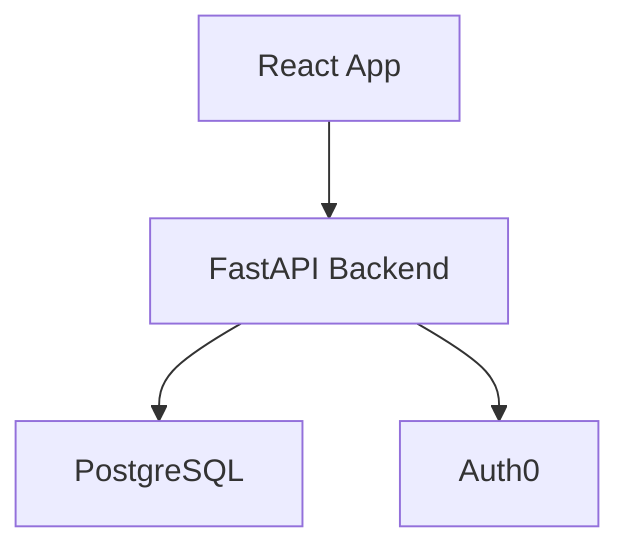

# CLI 명령어 완전 레퍼런스

MoAI-ADK는 **완전 자동화된 개발 워크플로우**를 위한 강력한 CLI 도구를 제공합니다. 모든 명령어는 AI 에이전트와 통합되어 최소한의 입력으로 최대의 결과를 얻을 수 있도록 설계되었습니다.

## 🎯 명령어 카테고리

```mermaid
graph TB
    subgraph "Core Commands (5개)"
        C1[/moai:0-project<br/>프로젝트 초기화]
        C2[/moai:1-plan<br/>SPEC 생성]
        C3[/moai:2-run<br/>TDD 실행]
        C4[/moai:3-sync<br/>문서 동기화]
        C5[/moai:9-feedback<br/>피드백 제출]
    end

    subgraph "Utility Commands (3개)"
        U1[/clear<br/>컨텍스트 초기화]
        U2[/help<br/>도움말]
        U3[/status<br/>상태 확인]
    end

    subgraph "Git Commands (5개)"
        G1[/moai:0-git<br/>Git 설정]
        G2[/moai:1-branch<br/>브랜치 생성]
        G3[/moai:2-merge<br/>병합 요청]
        G4[/moai:3-push<br/>원격 푸시]
        G5[/moai:9-release<br/>릴리스]
    end

    subgraph "Advanced Commands (4개)"
        A1[/moai:debug<br/>디버깅]
        A2[/moai:migrate<br/>마이그레이션]
        A3[/moai:optimize<br/>최적화]
        A4[/moai:audit<br/>감사]
    end

    style C1 fill:#e3f2fd
    style U1 fill:#f3e5f5
    style G1 fill:#e8f5e9
    style A1 fill:#fff3e0
```

## 🔧 Core Commands

### /moai:0-project - 프로젝트 초기화

**목적**: 새 프로젝트 생성 및 초기 설정

**기본 문법**:
```bash
/moai:0-project [project_name] [--template TEMPLATE] [--lang LANGUAGE]
```

**매개변수**:
- `project_name` (선택): 프로젝트 이름
- `--template`: 프로젝트 템플릿 (fastapi, react, fullstack, custom)
- `--lang`: 기본 언어 (python, typescript, go, rust, java)
- `--baas`: BaaS 플랫폼 (supabase, firebase, auth0)
- `--git`: Git 워크플로우 (manual, personal, team)

**사용 예시**:
```bash
# 기본 프로젝트 생성
/moai:0-project my-awesome-project

# FastAPI + Supabase 프로젝트
/moai:0-project --template fastapi --lang python --baas supabase

# Full-stack 프로젝트 (React + FastAPI)
/moai:0-project --template fullstack --lang typescript

# 개인 GitHub 프로젝트
/moai:0-project --template fastapi --git personal
```

**자동 생성 파일**:
```
project/
├── .claude/              # Claude Code 설정
├── .moai/                # MoAI-ADK 설정
├── src/                  # 소스 코드
├── tests/                # 테스트 코드
├── docs/                 # 문서
├── pyproject.toml        # 의존성 관리
├── README.md            # 프로젝트 설명
└── .gitignore           # Git 무시 파일
```

**자동 실행 에이전트**:
- `manager-project`: 프로젝트 구조 생성
- `manager-git`: Git 설정
- `expert-*`: 기술 스택 설정

**출력 예시**:
```bash
✅ Project initialized: my-awesome-project
📁 Created project structure
🔧 Configured development environment
📦 Installed dependencies
🔗 Set up Git repository
🎯 Ready for development!

Next steps:
1. /moai:1-plan "your first feature"
2. /clear
3. /moai:2-run SPEC-001
```

---

### /moai:1-plan - SPEC 생성

**목적**: 요구사항 분석 및 SPEC 문서 자동 생성

**기본 문법**:
```bash
/moai:1-plan "feature description" [--priority PRIORITY] [--complexity COMPLEXITY]
```

**매개변수**:
- `feature_description`: 개발할 기능 설명 (필수)
- `--priority`: 우선순위 (low, normal, high, critical)
- `--complexity`: 예상 복잡도 (simple, medium, complex)
- `--format`: 출력 형식 (ears, user_story, technical)
- `--output`: 출력 파일 경로

**사용 예시**:
```bash
# 간단한 기능
/moai:1-plan "add user login feature"

# 복잡한 기능
/moai:1-plan "implement real-time chat system" --complexity complex --priority high

# 기술적 SPEC
/moai:1-plan "microservices architecture migration" --format technical --priority critical

# 사용자 스토리 형식
/moai:1-plan "customer dashboard with analytics" --format user_story
```

**자동 실행 에이전트**:
- `manager-spec`: SPEC 문서 생성
- `manager-strategy`: 실행 전략 수립
- `mcp-context7`: 기술 참조 자료 조회

**생성된 SPEC 구조**:
```markdown
# SPEC-001: User Login Feature

## Requirements
- WHEN user enters email and password and clicks "Login"
- IF credentials are valid
- THEN system issues JWT token and navigates to dashboard

## Constraints
- Password minimum 8 characters
- Account lock after 5 failures (30 minutes)
- Response time < 500ms

## Success Criteria
- 100% success rate with valid credentials
- Clear error messages for invalid credentials
- Response time < 500ms
- Test coverage >= 85%

## Test Scenarios
### TC-1: Successful Login
- Input: email="user@example.com", password="secure123"
- Expected: Token issued, dashboard navigation

### TC-2: Invalid Password
- Input: email="user@example.com", password="wrong"
- Expected: "Incorrect password" error message
```

---

### /moai:2-run - TDD 실행

**목적**: RED-GREEN-REFACTOR TDD 사이클 자동 실행

**기본 문법**:
```bash
/moai:2-run SPEC-XXX [--agent AGENT] [--parallel] [--quality LEVEL]
```

**매개변수**:
- `SPEC-XXX`: 실행할 SPEC ID (필수)
- `--agent`: 특정 에이전트 지정
- `--parallel`: 병렬 실행 활성화
- `--quality`: 품질 수준 (basic, standard, enterprise)
- `--coverage`: 테스트 커버리지 목표 (기본: 85%)

**사용 예시**:
```bash
# 기본 TDD 실행
/moai:2-run SPEC-001

# 병렬 실행 (여러 에이전트 동시)
/moai:2-run SPEC-001 --parallel

# 엔터프라이즈 품질
/moai:2-run SPEC-001 --quality enterprise --coverage 95

# 특정 에이전트로 실행
/moai:2-run SPEC-001 --agent expert-backend
```

**TDD 사이클 상세**:

**1. RED 단계**:
```python
# 자동 실패 테스트 생성
tests = [
    "test_login_with_valid_credentials",
    "test_login_with_invalid_password",
    "test_account_lock_after_5_failures",
    "test_jwt_token_issuance"
]
```

**2. GREEN 단계**:
```python
# 최소 코드로 테스트 통과
class AuthService:
    def authenticate(self, email, password):
        # 최소한의 구현
        pass
```

**3. REFACTOR 단계**:
```python
# 코드 정리 및 최적화
class AuthService:
    def authenticate(self, email, password):
        # 완전한 구현 + 에러 처리
        if self.validate_credentials(email, password):
            return self.generate_jwt_token(email)
        raise AuthenticationError("Invalid credentials")
```

**자동 실행 에이전트**:
- `manager-tdd`: TDD 사이클 오케스트레이션
- `expert-*`: 도메인별 구현
- `manager-quality`: TRUST 5 품질 보증

**실행 결과**:
```bash
🔴 RED Phase: Writing 12 tests...
✅ All tests failing as expected

🟢 GREEN Phase: Implementing minimal code...
✅ All tests passing

🔵 BLUE Phase: Refactoring and optimizing...
✅ Code quality improved

🧪 Quality Assurance:
✅ Test Coverage: 89%
✅ Linting: Passed
✅ Security: Passed
✅ Type Checking: Passed

🎯 Implementation complete!
```

---

### /moai:3-sync - 문서 동기화

**목적**: 코드 변경 사항을 문서에 자동 반영

**기본 문법**:
```bash
/moai:3-sync SPEC-XXX [--docs TYPE] [--format FORMAT] [--deploy]
```

**매개변수**:
- `SPEC-XXX`: 동기화할 SPEC ID (필수)
- `--docs`: 문서 타입 (api, user, architecture, deployment, all)
- `--format`: 출력 형식 (markdown, html, pdf)
- `--deploy`: 즉시 배포 활성화
- `--changelog**: 변경 로그 생성

**사용 예시**:
```bash
# 전체 문서 생성
/moai:3-sync SPEC-001 --docs all

# API 문서만 생성
/moai:3-sync SPEC-001 --docs api

# 배포 준비
/moai:3-sync SPEC-001 --docs all --deploy

# 변경 로그 포함
/moai:3-sync SPEC-001 --changelog
```

**자동 생성 문서**:

**1. API 문서**:
```markdown
# API Reference

## Authentication

### POST /api/auth/login
Authenticate user with email and password.

**Request Body**:
```json
{
  "email": "user@example.com",
  "password": "secure123"
}
```

**Response**:
```json
{
  "token": "jwt_token_here",
  "user": {
    "id": 1,
    "email": "user@example.com"
  }
}
```
```

**2. 아키텍처 다이어그램**:


**3. 배포 가이드**:
```markdown
# Deployment Guide

## Prerequisites
- Docker 20.10+
- PostgreSQL 14+
- Redis 6+

## Quick Deploy
```bash
docker-compose up -d
```

## Environment Variables
- DATABASE_URL=postgresql://...
- JWT_SECRET=your-secret-key
```

**자동 실행 에이전트**:
- `manager-docs`: 문서 생성 오케스트레이션
- `mcp-context7`: 최신 API 문서 참조
- `moai-library-mermaid`: 다이어그램 생성
- `moai-library-nextra`: 문서 사이트 생성

---

### /moai:9-feedback - 피드백 제출

**목적**: 개선 제안 및 버그 리포트 제출

**기본 문법**:
```bash
/moai:9-feedback "description" [--type TYPE] [--severity SEVERITY]
```

**매개변수**:
- `description`: 피드백 내용 (필수)
- `--type`: 피드백 타입 (bug, improvement, feature, documentation)
- `--severity`: 심각도 (low, medium, high, critical)
- `--reproducible`: 재현 가능 여부 (true/false)

**사용 예시**:
```bash
# 버그 리포트
/moai:9-feedback "API response time exceeds 500ms" --type bug --severity high

# 기능 제안
/moai:9-feedback "Add dark mode support to dashboard" --type feature --severity low

# 문서 개선
/moai:9-feedback "API documentation needs more examples" --type documentation
```

## 🔧 Utility Commands

### /clear - 컨텍스트 초기화

**목적**: Claude Code 컨텍스트 초기화 및 토큰 최적화

**기본 문법**:
```bash
/clear [--session SESSION_ID] [--preserve PATTERN]
```

**사용 예시**:
```bash
# 전체 컨텍스트 초기화
/clear

# 특정 세션만 초기화
/clear --session session-123

# 특정 패턴만 보존
/clear --preserve "*.md"
```

**효과**:
- **토큰 절약**: 200K 컨텍스트 리셋
- **성능 향상**: 새로운 세션으로 깨끗한 시작
- **메모리 최적화**: 불필요한 컨텍스트 제거

---

## 🔗 Git Commands

### /moai:0-git - Git 설정

**목적**: Git 워크플로우 자동 설정

**기본 문법**:
```bash
/moai:0-git [--strategy STRATEGY] [--remote REMOTE]
```

**매개변수**:
- `--strategy`: 워크플로우 전략 (manual, personal, team)
- `--remote`: 원격 저장소 주소

**사용 예시**:
```bash
# 개인 GitHub 워크플로우
/moai:0-git --strategy personal --remote https://github.com/user/repo

# 팀 워크플로우
/moai:0-git --strategy team --remote https://github.com/team/repo
```

---

## 🚀 Advanced Commands

### /moai:debug - 디버깅

**목적**: 복잡한 문제 분석 및 해결

**기본 문법**:
```bash
/moai:debug "problem description" [--depth LEVEL] [--agent AGENT]
```

**사용 예시**:
```bash
# 성능 문제 분석
/moai:debug "API response time is slow" --depth deep --agent expert-debug

# 메모리 누수 분석
/moai:debug "memory leak in background job" --agent expert-debug
```

---

## 📊 Configuration Options

### 글로벌 설정 (.moai/config/config.json)

```json
{
  "moai": {
    "version": "0.30.2",
    "auto_save": true,
    "auto_backup": true
  },
  "constitution": {
    "enforce_tdd": true,
    "test_coverage_target": 85,
    "quality_gates": true
  },
  "git_strategy": {
    "mode": "personal",
    "auto_branch": true,
    "auto_commit": true
  },
  "language": {
    "conversation_language": "ko",
    "agent_prompt_language": "en"
  },
  "statusline": {
    "enabled": true,
    "format": "compact",
    "style": "R2-D2"
  },
  "output": {
    "style": "detailed",
    "color": true,
    "progress": true
  },
  "performance": {
    "token_optimization": true,
    "parallel_execution": true,
    "cache_enabled": true
  }
}
```

### 명령어별 설정

```json
{
  "commands": {
    "moai:1-plan": {
      "auto_approve": false,
      "default_priority": "normal",
      "output_format": "ears"
    },
    "moai:2-run": {
      "default_quality": "standard",
      "parallel_agents": 3,
      "max_retries": 3
    },
    "moai:3-sync": {
      "auto_deploy": false,
      "docs_format": "markdown",
      "include_diagrams": true
    }
  }
}
```

### 환경 변수

```bash
# MoAI-ADK 설정
export MOAI_CONFIG_PATH="$HOME/.moai/config"
export MOAI_CACHE_DIR="$HOME/.moai/cache"
export MOAI_LOG_LEVEL="info"

# 성능 최적화
export MOAI_TOKEN_OPTIMIZATION=true
export MOAI_PARALLEL_EXECUTION=true
export MOAI_CACHE_ENABLED=true

# 통합 설정
export MOAI_GITHUB_TOKEN="your_github_token"
export MOAI_NOTION_TOKEN="your_notion_token"
export MOAI_FIGMA_TOKEN="your_figma_token"
```

---

## 🎯 명령어 조합 패턴

### 패턴 1: 기본 개발 워크플로우

```bash
# 1. 프로젝트 초기화
/moai:0-project my-feature-project

# 2. 기능 계획
/moai:1-plan "add user authentication"
/clear

# 3. 구현
/moai:2-run SPEC-001
/clear

# 4. 문서화
/moai:3-sync SPEC-001
```

### 패턴 2: 복잡한 기능 개발

```bash
# 1. 심층 분석
/moai:1-plan "microservices architecture" --complexity complex

# 2. 병렬 개발
/moai:2-run SPEC-001 --parallel --quality enterprise

# 3. 통합 테스트
/moai:debug "integration issues" --depth deep

# 4. 배포 준비
/moai:3-sync SPEC-001 --docs all --deploy
```

### 패턴 3: 긴급 수정

```bash
# 1. 빠른 분석
/moai:debug "critical bug in payment system" --severity critical

# 2. 빠른 수정
/moai:2-run HOTFIX-001 --quality basic --agent expert-backend

# 3. 긴급 배포
/moai:3-sync HOTFIX-001 --docs minimal --deploy

# 4. 피드백
/moai:9-feedback "hotfix deployed successfully" --type improvement
```

---

## 📈 성능 모니터링

### 명령어 실행 시간

| 명령어 | 평균 실행 시간 | 최적화된 시간 |
|--------|-------------|-------------|
| `/moai:0-project` | 2-5분 | 1-3분 |
| `/moai:1-plan` | 5-15분 | 3-8분 |
| `/moai:2-run` | 20-60분 | 15-40분 |
| `/moai:3-sync` | 10-20분 | 5-15분 |

### 토큰 사용량

```python
# 명령어별 토큰 사용량
token_usage = {
    "/moai:0-project": "2,000-5,000 tokens",
    "/moai:1-plan": "5,000-15,000 tokens",
    "/moai:2-run": "10,000-30,000 tokens",
    "/moai:3-sync": "8,000-20,000 tokens"
}
```

---

## 🎯 핵심 takeaways

1. **완전 자동화**: 모든 명령어는 AI 에이전트와 통합된 자동화된 워크플로우 제공
2. **유연한 설정**: 프로젝트와 팀에 맞는 설정 옵션 제공
3. **효율적 조합**: 명령어 조합으로 복잡한 워크플로우 간소화
4. **성능 최적화**: 토큰 효율성과 병렬 실행으로 시간 단축
5. **실전 중심**: 실제 개발 프로세스에 최적화된 명령어 설계

MoAI-ADK CLI 명령어는 **전통적인 개발 방식을 AI 중심의 자동화된 워크플로우**로 전환시킵니다. 이를 통해 개발자는 **반복적인 작업에서 벗어나 핵심 기능 개발에 집중**할 수 있으며, **일관된 품질**과 **빠른 배포**를 달성할 수 있습니다.