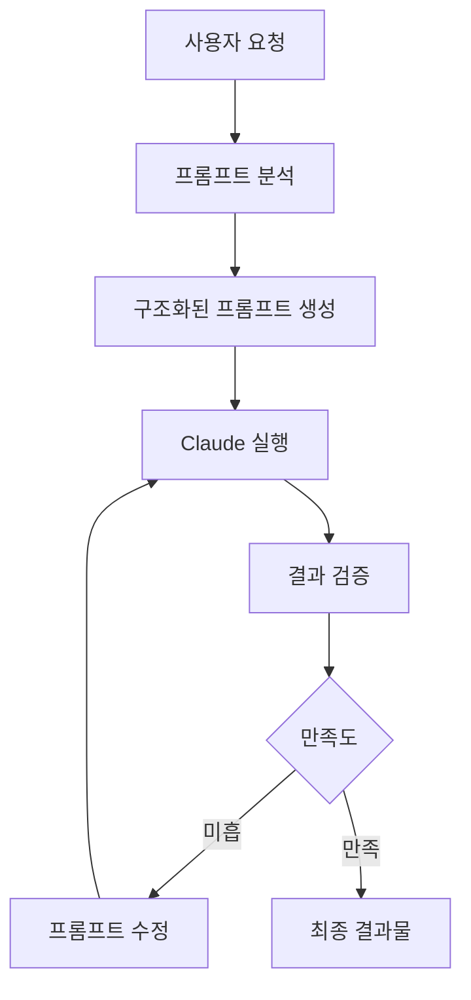

# 프롬프트 엔지니어링 가이드

프롬프트 엔지니어링은 Claude와 같은 AI 언어 모델의 성능을 극대화하는 핵심 기술입니다. 올바른 프롬프트 설계를 통해 더 정확하고, 일관되며, 유용한 결과물을 얻을 수 있습니다.

## 🎯 프롬프트 엔지니어링의 중요성

### 왜 프롬프트 엔지니어링이 중요한가?

**1. 정확성 향상**
- 잘 구조화된 프롬프트는 Claude가 요구사항을 정확하게 이해하도록 돕습니다
- 맥락을 명확히 제공하여 오해를 줄이고 결과물의 질을 높입니다

**2. 일관성 보장**
- 일관된 프롬프트 패턴은 비슷한 유형의 작업에서 안정적인 결과를 보장합니다
- 팀 전체가 표준화된 프롬프트를 사용하여 결과물의 품질을 유지할 수 있습니다

**3. 효율성 증대**
- 명확한 프롬프트는 불필요한 수정과 재작업을 줄여줍니다
- 시행착오를 최소화하여 개발 속도를 높입니다

### MoAI-ADK에서의 역할

MoAI-ADK는 프롬프트 엔지니어링을 핵심적인 워크플로우로 통합합니다:



## 📚 학습 목표

이 가이드를 통해 다음을 학습할 수 있습니다:

### 기초 (Basic Techniques)
- 롤플레잉 프롬프트 작성법
- 예시 기반 학습(Example-based) 프롬프트
- 단계별 지시 프롬프트 설계
- 제약 조건과 가이드라인 설정

### 중급 (Structured Prompts)
- 구조화된 프롬프트 템플릿 설계
- 변수와 파라미터 활용
- 다단계 프롬프트 체인 구성
- 컨텍스트 관리 최적화

### 고급 (Common Patterns)
- 코딩 전용 프롬프트 패턴
- 디버깅 및 문제 해결 프롬프트
- 문서화 및 테스트 생성 패턴
- 아키텍처 설계 프롬프트

### 실전 (Best Practices)
- Claude 4.5 최적화 기법
- 토큰 효율성 극대화
- 에러 처리 및 회복 전략
- 성능 측정 및 개선

## 🚀 빠른 시작

### 기본 프롬프트 구조

```python
# 1. 역할 정의
당신은 전문적인 [전문분야] 전문가입니다.

# 2. 맥락 제공
[프로젝트 배경, 목표, 제약사항]

# 3. 명확한 작업 지시
[구체적으로 수행해야 할 작업]

# 4. 출력 형식 지정
[결과물의 형식, 스타일, 구조]

# 5. 예시 제공 (선택사항)
[원하는 결과물의 예시]
```

### 실용적인 예시

```python
# 나쁜 예시
코드 작성해줘

# 좋은 예시
당신은 10년 경험의 Python 백엔드 개발자입니다.
FastAPI를 사용하여 JWT 인증 시스템을 구현해야 합니다.

요구사항:
- OAuth2를 통한 JWT 토큰 발급
- 토큰 검증 미들웨어
- 사용자 모델 (email, password_hash)
- 단위 테스트 포함

출력 형식:
- 완전한 Python 모듈 구조
- 각 함수에 대한 타입 힌트
- docstring 포함
- pytest 테스트 케이스

시작하세요.
```

## 📊 프롬프트 품질 측정

### 성능 메트릭

**1. 정확도 (Accuracy)**
- 요구사항 충족률: 95%+
- 오류 발생률: < 5%

**2. 효율성 (Efficiency)**
- 평균 수정 횟수: 1-2회
- 재작업 시간: < 10%

**3. 일관성 (Consistency)**
- 동일 입력에 대한 결과 변동성: < 10%
- 품질 점수 표준편차: < 0.5

### 품질 점수 계산

```python
def calculate_prompt_quality(prompt):
    """프롬프트 품질 점수 계산"""

    score = 0

    # 명확성 (30%)
    if has_clear_instructions(prompt): score += 30
    if has_specific_format(prompt): score += 15

    # 맥락 (25%)
    if provides_background(prompt): score += 15
    if defines_role(prompt): score += 10

    # 구조화 (20%)
    if is_well_organized(prompt): score += 20

    # 예시 (15%)
    if includes_examples(prompt): score += 15

    # 제약사항 (10%)
    if defines_constraints(prompt): score += 10

    return min(score, 100)
```

## 🛠️ MoAI-ADK 통합

### 자동 프롬프트 생성

MoAI-ADK는 다음 명령어를 통해 최적화된 프롬프트를 자동으로 생성합니다:

```bash
# SPEC 기반 프롬프트 생성
/moai:1-plan "API 개발 프로젝트"

# 자동 코드 생성 프롬프트
/moai:2-run SPEC-001

# 문서화 프롬프트
/moai:3-sync SPEC-001
```

### 프롬프트 템플릿 관리

```python
# .moai/templates/prompt-templates/
templates = {
    "api_development": {
        "role": "senior_backend_developer",
        "structure": "spec_first",
        "requirements": ["tests", "docs", "validation"]
    },
    "frontend_ui": {
        "role": "react_expert",
        "structure": "component_based",
        "requirements": ["responsive", "accessible", "testable"]
    }
}
```

## 📖 다음 단계

1. **[기본 기법](./basic-techniques)** - 롤플레잉, 예시 기반, 단계별 지시 학습
2. **[구조화된 프롬프트](./structured-prompts)** - 체계적인 프롬프트 설계 패턴
3. **[일반적인 패턴](./common-patterns)** - 코딩, 디버깅, 문서화용 패턴
4. **[문제 해결](./troubleshooting)** - 일반적인 문제와 해결 방법
5. **[모범 사례](./best-practices)** - Claude 4.5 최적화와 전문가 팁

---

## 🔗 관련 자료

- [Anthropic Claude 공식 문서](https://docs.anthropic.com/claude)
- [MoAI-ADK 코어 개념](../core-concepts/agents)
- [워크플로우 가이드](../core-concepts/workflow)
- [커맨드 참조](../commands)