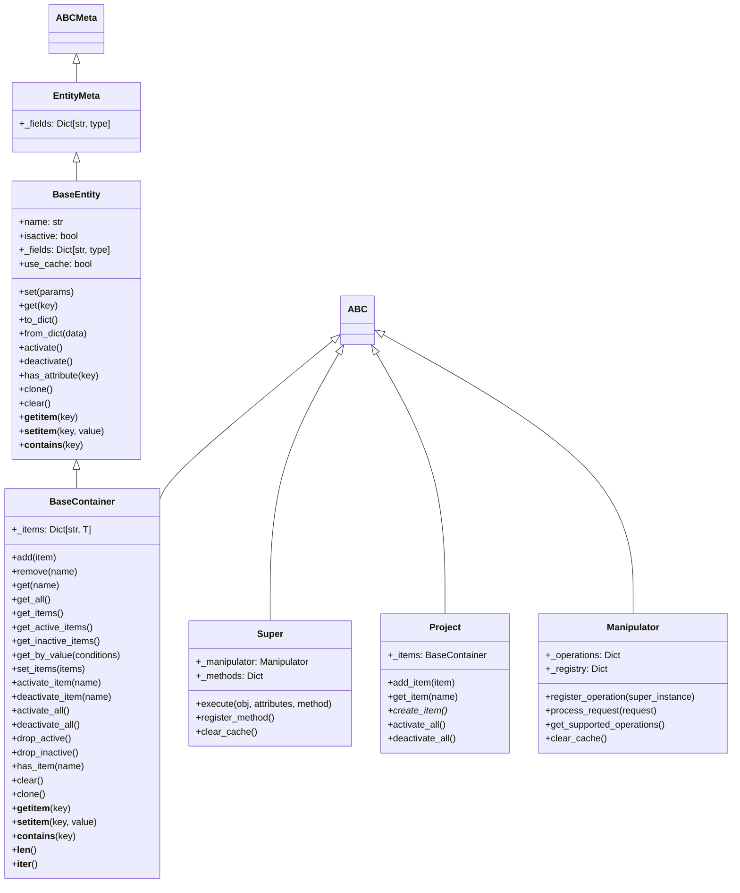
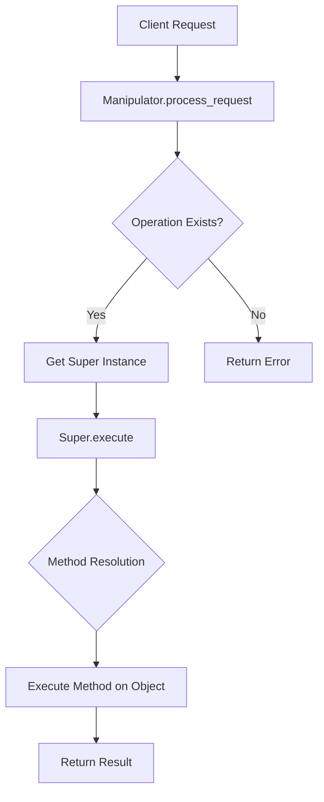
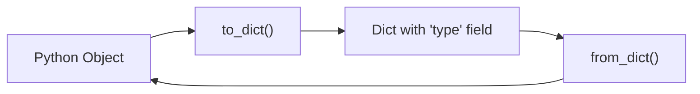

# MSB Framework Architecture

## Overview

The MSB (Mega-Super-Base) Framework is designed with a layered architecture that separates concerns into four main modules: Base, Super, Mega, and Utils. This modular design allows for flexibility, extensibility, and maintainability.

## Architecture Layers

### 1. Base Layer

The foundation layer provides core abstractions for data management:

- **BaseEntity**: Abstract base class for all entities with type validation, serialization, and attribute management
- **BaseContainer**: Generic container class for managing collections of BaseEntity objects

### 2. Super Layer

The operation layer handles business logic and project management:

- **Super**: Abstract base class for operation handlers with method resolution and execution
- **Project**: Abstract class for managing collections of entities within a project context

### 3. Mega Layer

The orchestration layer coordinates operations and manages object interactions:

- **Manipulator**: Central class for registering operations, managing objects, and processing requests

### 4. Utils Layer

The utility layer provides supporting functionality:

- **logging_setup**: Configurable logging system
- **validation**: Data validation functions

## Class Hierarchy

## Data Flow

## Key Design Patterns

### 1. Template Method Pattern
- BaseEntity and BaseContainer use template methods for serialization and validation
- Super classes define operation templates that subclasses implement

### 2. Strategy Pattern
- Manipulator uses different Super instances as strategies for different operations
- Method resolution in Super allows pluggable behavior

### 3. Composite Pattern
- BaseContainer manages collections of BaseEntity objects
- Project composes multiple entities and containers

### 4. Factory Pattern
- Project.create_item() is an abstract factory method
- BaseContainer._create_container() creates typed containers

### 5. Observer Pattern (Implicit)
- Logging system observes operations and state changes
- Validation functions observe data changes

### 6. Facade Pattern
- Manipulator provides simplified facade methods for registered operations
- Project and Super classes provide high-level interfaces to complex subsystems

## Type System

The framework uses Python's type hints extensively:

- Generic types for BaseContainer[T]
- Union types for flexible method parameters
- Forward references for circular dependencies
- TypeVar for generic constraints

## Serialization Strategy

Entities support bidirectional serialization:

- Handles cyclic references with "mark", "ignore", or "raise" options
- Preserves type information for deserialization
- Supports nested entity serialization

## Error Handling

- Validation errors use TypeError and ValueError with descriptive messages
- Operation errors return structured response dictionaries
- Logging captures all operations and errors for debugging

## Extensibility

The framework is designed for extension:

- Abstract base classes allow custom implementations
- Method registration enables adding new operations
- Type validation supports custom validators
- Modular structure allows selective usage

## Performance Considerations

- Caching in to_dict() and method resolution
- Lazy loading of type information
- Optimized container operations with dictionary-based storage
- Configurable logging levels to reduce overhead