# MSB Framework Diagrams

This document contains detailed Mermaid diagrams illustrating the architecture, data flows, and relationships within the MSB Framework.

## Architecture Overview

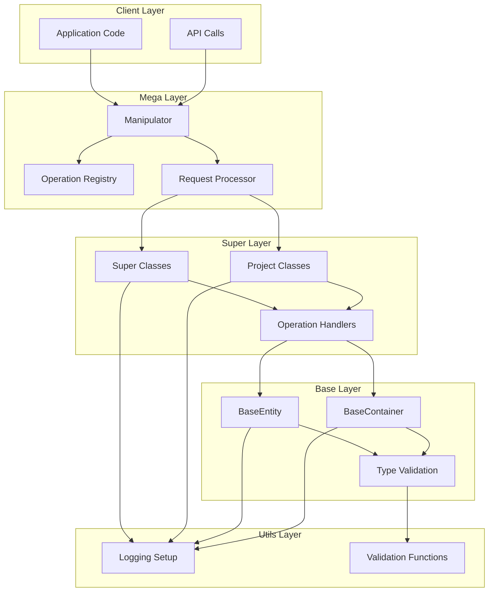

## Class Hierarchy

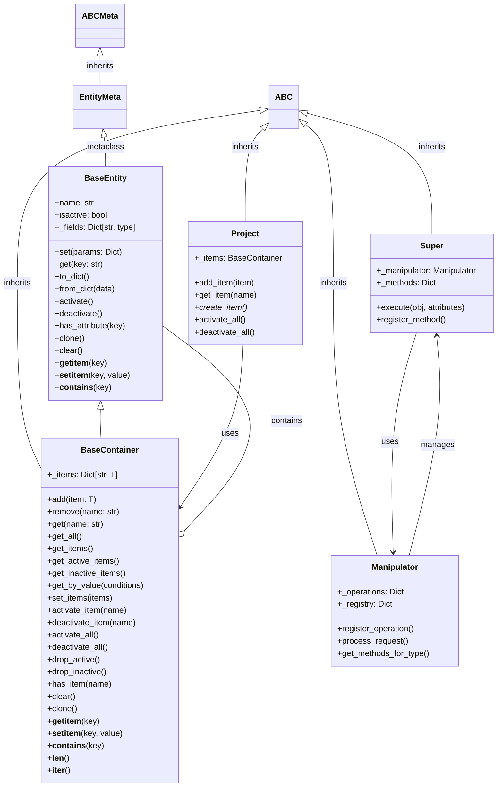

## Data Flow: Request Processing

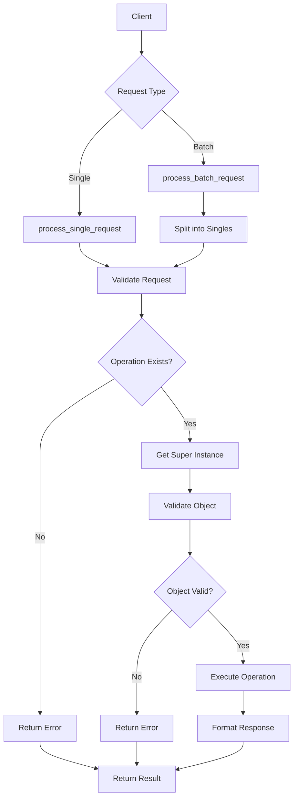

## Method Resolution Flow

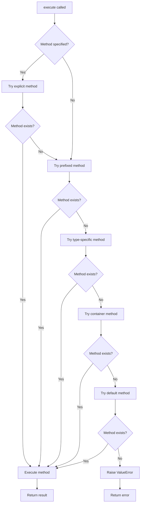

## Serialization Flow

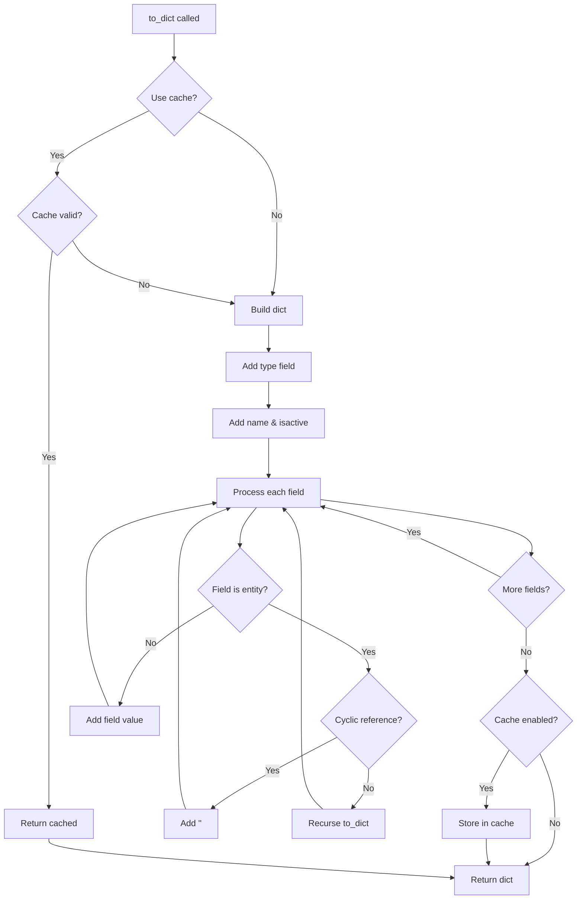

## Type Validation Flow

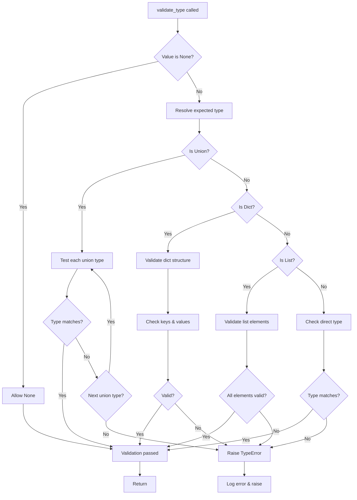

## Container Operations

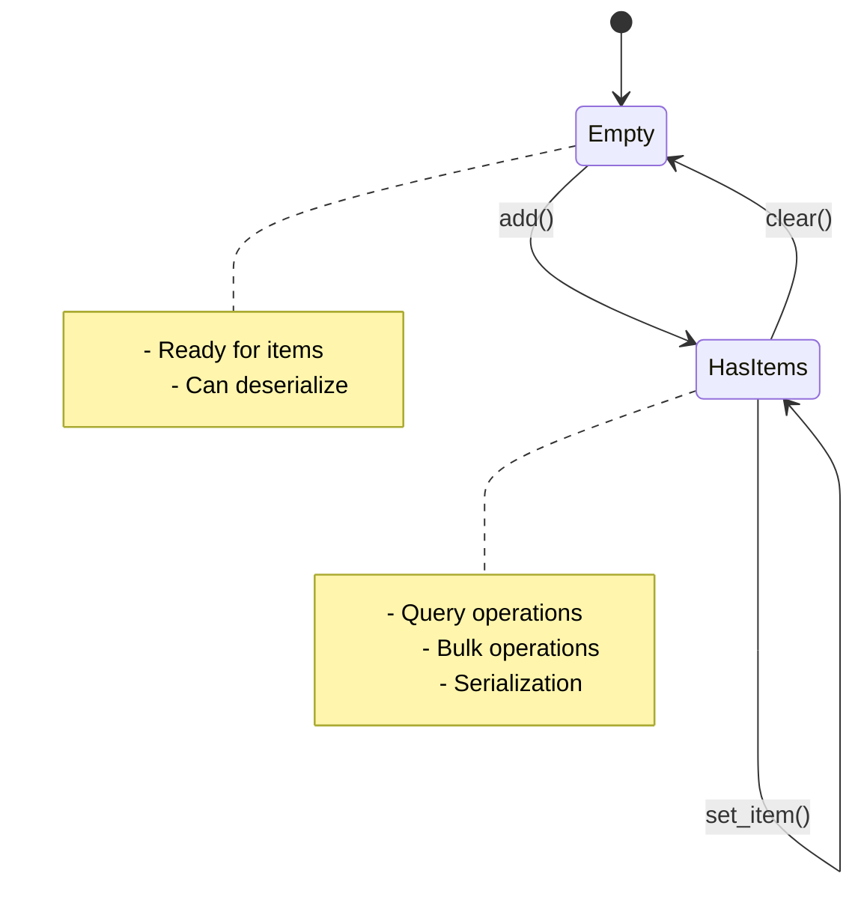

## Project Lifecycle

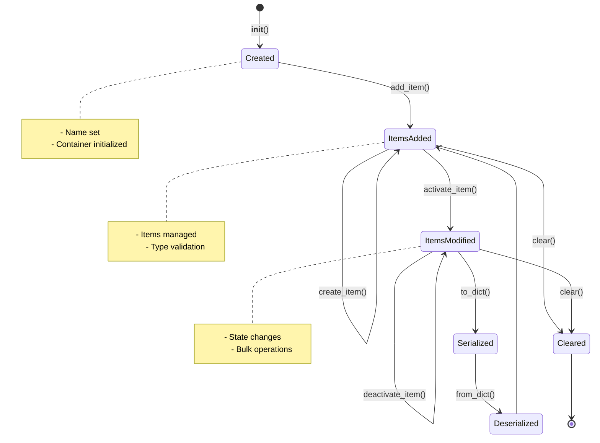

## Manipulator Workflow

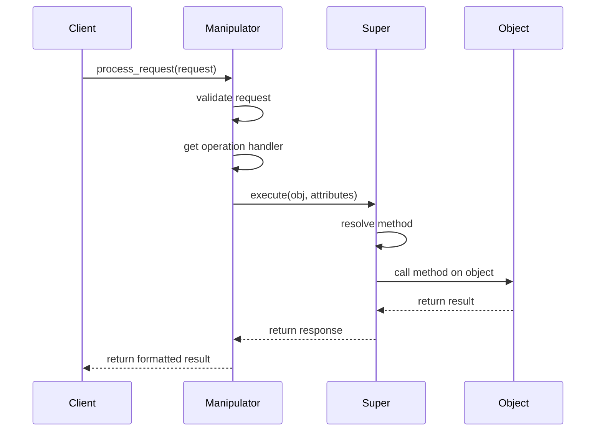

## Error Handling Flow

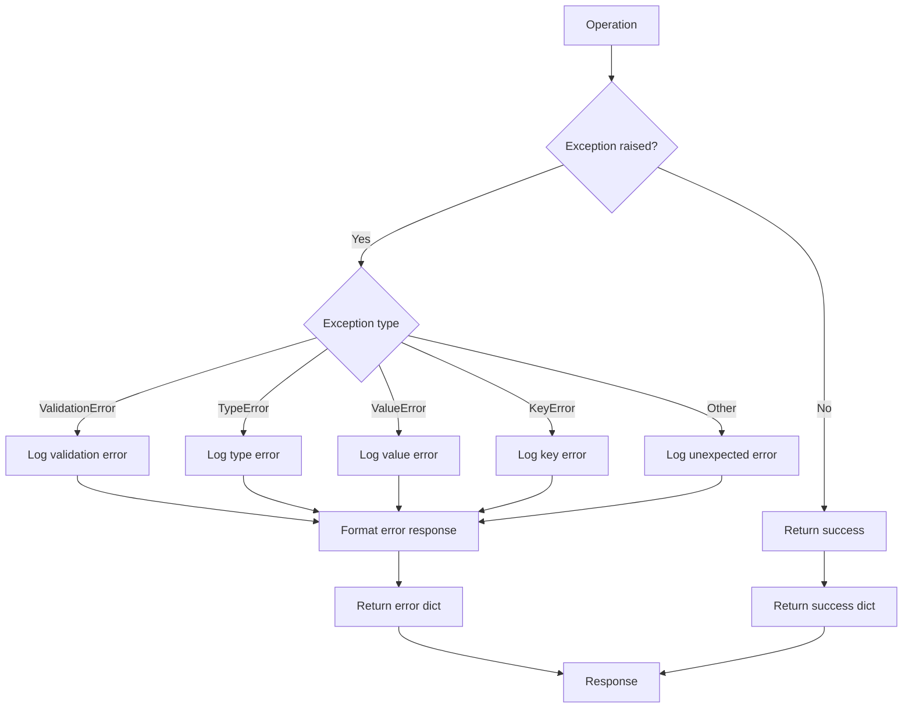

## Caching Strategy

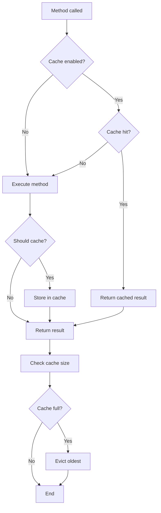

## Module Dependencies

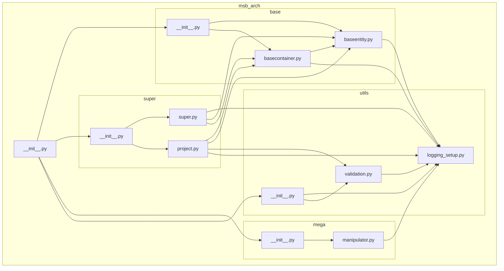