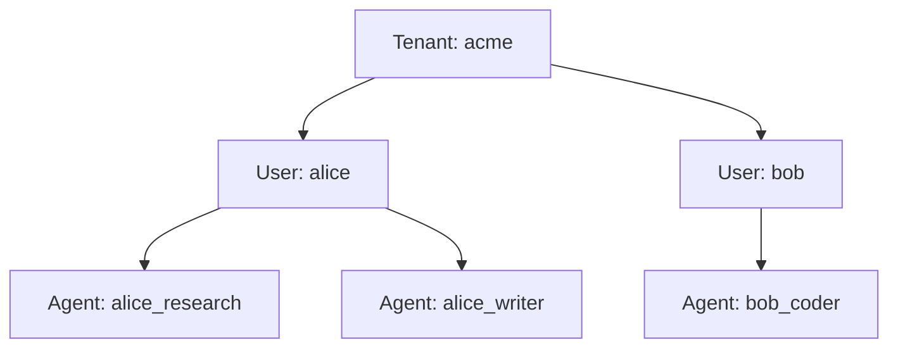
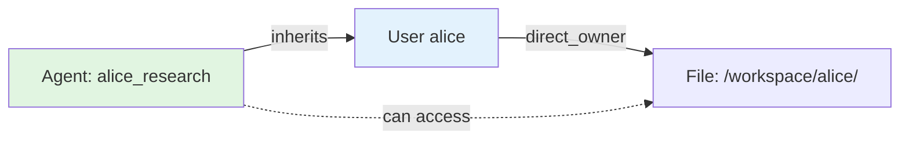

# Agent Permissions

## What are Agent Permissions?

In Nexus, **agents** are AI systems (CrewAI agents, LangGraph graphs, Claude SDK bots, OpenAI Agents, etc.) that operate on behalf of users. Agent permissions control:

- 🔐 **Authentication** - How agents prove their identity
- 🔑 **Authorization** - What agents can access
- 👥 **Inheritance** - How agents inherit permissions from their owner users
- 🎯 **Direct Grants** - Additional permissions granted specifically to agents

Nexus uses **ReBAC (Relationship-Based Access Control)** to manage agent permissions, with automatic inheritance from owner users.

---

## Key Concepts

### 1. Agent Ownership (Agent → User Hierarchy)

Every agent is **owned by a user**. This ownership is tracked in the Entity Registry:



**Key principle:** Agents inherit ALL permissions from their owner user.

---

### 2. Two Authentication Models

#### Model 1: User Auth + X-Agent-ID Header (Recommended v0.5.0+)

Agent uses **owner's API key** and identifies itself via header:

```bash
# Alice's API key
export NEXUS_API_KEY="sk_alice_..."

# Agent identifies itself via X-Agent-ID header
curl -H "Authorization: Bearer $NEXUS_API_KEY" \
     -H "X-Agent-ID: alice_research" \
     http://localhost:8080/api/nfs/list
```

**Why this is better:**
- ✅ No separate API key management
- ✅ Agent inherits user's permissions automatically
- ✅ Centralized auth (revoke user = revoke all agents)
- ✅ Simpler security model

#### Model 2: Agent API Key (Legacy)

Agent has **its own API key** (independent authentication):

```bash
# Agent's own API key
export NEXUS_API_KEY="sk_agent_alice_research_..."

curl -H "Authorization: Bearer $NEXUS_API_KEY" \
     http://localhost:8080/api/nfs/list
```

**When to use:**
- Long-running services (background jobs, daemons)
- Agents that need independent lifecycle from user
- Agent-specific rate limits or quotas

---

## Agent Registration

### Register Agent (No API Key)

**Recommended for most agents:**

```bash
# Register agent owned by alice
nexus agent register alice_research "Research Agent"

# Verify registration
nexus agent list
```

**Python API:**

```python
from nexus.core.agents import register_agent

register_agent(
    user_id="alice",
    agent_id="alice_research",
    name="Research Agent",
    tenant_id="default",
    entity_registry=registry
)
```

---

### Create Agent with API Key (Optional)

**For independent agent services:**

```bash
# Create agent API key via admin
nexus admin create-agent-key alice alice_research --expires-days 90

# Output:
# ✓ Created API key for agent alice_research
# API Key: sk_agent_alice_research_abc123...
# Expires: 2025-04-15T00:00:00Z
```

**Python API:**

```python
from nexus.core.agents import create_agent_with_api_key
from datetime import timedelta, datetime, UTC

agent, raw_key = create_agent_with_api_key(
    session,
    user_id="alice",
    agent_id="alice_research",
    name="Research Agent",
    expires_at=datetime.now(UTC) + timedelta(days=90),
    entity_registry=registry
)

print(f"API Key: {raw_key}")  # Save this - only shown once!
```

---

## Permission Inheritance

### How Inheritance Works

Agents **automatically inherit ALL permissions** from their owner user:



**Permission Check Flow:**

1. **Direct check**: Does agent have explicit grant? → Yes = ✅ ALLOW
2. **Inheritance check**: Look up agent's owner user
3. **User check**: Does owner user have permission? → Yes = ✅ ALLOW (agent inherits)
4. Otherwise → ❌ DENY

**Example:**

```python
# Alice owns /workspace/alice/
nx.rebac.create("user", "alice", "direct_owner", "file", "/workspace/alice/")

# Register agent owned by alice
register_agent(user_id="alice", agent_id="alice_research", ...)

# Agent inherits alice's permissions
ctx = OperationContext(
    user="alice",
    agent_id="alice_research",
    subject_type="agent",
    subject_id="alice_research"
)

# Permission check
can_read = enforcer.check("/workspace/alice/data.txt", Permission.READ, ctx)
# ✅ True - agent inherits from alice
```

---

### Inheritance Code Implementation

**File:** `src/nexus/core/permissions_enhanced.py:737-784`

```python
# Check if agent inherits from user
if (
    not result  # Direct check failed
    and context.subject_type == "agent"
    and context.agent_id
    and self.entity_registry
):
    # Look up agent's owner
    parent = self.entity_registry.get_parent(
        entity_type="agent",
        entity_id=context.agent_id
    )

    if parent and parent.entity_type == "user":
        # Check if user has permission
        user_result = self.rebac_manager.rebac_check(
            subject=("user", parent.entity_id),
            permission=permission_name,
            object=(object_type, object_id),
            tenant_id=tenant_id,
        )
        if user_result:
            # ✅ Agent inherits user's permission
            return True
```

---

## Direct ReBAC Grants to Agents

In addition to inherited permissions, agents can receive **direct grants**:

### Grant Agent Permission

```bash
# Grant agent editor permission on specific file
nexus rebac create agent alice_research direct_editor file /shared/report.txt

# Grant agent viewer permission on directory
nexus rebac create agent alice_research direct_viewer directory /workspace/shared/

# Grant agent owner permission on specific resource
nexus rebac create agent alice_research direct_owner memory user_preferences
```

**Permission Hierarchy:**
- `direct_owner` → read, write, execute
- `direct_editor` → read, write
- `direct_viewer` → read only

---

### Combined Permissions (Inherited + Direct)

Agents can have **BOTH** inherited and direct permissions:

```mermaid
graph TB
    A[Agent: alice_research]

    U[User alice<br/>owns /workspace/alice/]
    G1[Direct Grant:<br/>editor on /shared/]
    G2[Direct Grant:<br/>viewer on /logs/]

    F1[/workspace/alice/data.txt]
    F2[/shared/report.txt]
    F3[/logs/system.log]

    A -->|inherits from| U
    A -->|direct grant| G1
    A -->|direct grant| G2

    U -.->|can access| F1
    G1 -.->|can access| F2
    G2 -.->|can access| F3

    style A fill:#e1f5e1
    style U fill:#e3f2fd
    style G1 fill:#fff3e0
    style G2 fill:#fff3e0
```

**Example:**

```bash
# Alice owns /workspace/alice/
nexus rebac create user alice direct_owner file /workspace/alice/

# Grant agent ADDITIONAL access to /shared/
nexus rebac create agent alice_research direct_editor file /shared/

# Agent can now access:
# ✅ /workspace/alice/* (inherited from alice)
# ✅ /shared/* (direct grant)
```

---

## Complete Workflow Example

### 1. Setup User and Agent

```bash
# Create user alice
nexus admin create-user alice --name "Alice Smith" --expires-days 90
# Output: API_KEY_ALICE="sk_user_alice_..."

# Save admin key
export ADMIN_KEY="sk_admin_..."

# Register agent owned by alice (no API key)
export NEXUS_API_KEY="$ADMIN_KEY"
nexus agent register alice_research "Research Agent"

# Verify registration
nexus agent list
# Output:
# alice_research (owner: alice) - Research Agent
```

---

### 2. Grant User Permissions

```bash
# Grant alice ownership of her workspace
nexus rebac create user alice direct_owner file /workspace/alice/

# Grant alice viewer on shared workspace
nexus rebac create user alice direct_viewer file /workspace/shared/
```

---

### 3. Test Agent Inheritance

```bash
# Use alice's API key + X-Agent-ID header
export NEXUS_API_KEY="$API_KEY_ALICE"

# Agent can list alice's workspace (inherited)
nexus ls /workspace/alice/ --agent-id alice_research
# ✅ Works! (inherited from alice)

# Agent can write to alice's workspace
echo "research data" | nexus write /workspace/alice/research.txt --input - --agent-id alice_research
# ✅ Works! (inherited owner permission)

# Agent can READ shared workspace (inherited viewer permission)
nexus cat /workspace/shared/doc.txt --agent-id alice_research
# ✅ Works! (inherited viewer permission)

# Agent CANNOT write to shared workspace (only has viewer)
echo "new data" | nexus write /workspace/shared/new.txt --input - --agent-id alice_research
# ❌ Fails! (no write permission on /shared/)
```

---

### 4. Grant Agent Direct Permission

```bash
# Admin grants agent editor permission on shared workspace
export NEXUS_API_KEY="$ADMIN_KEY"
nexus rebac create agent alice_research direct_editor file /workspace/shared/

# Now agent can write to shared workspace
export NEXUS_API_KEY="$API_KEY_ALICE"
echo "new data" | nexus write /workspace/shared/new.txt --input - --agent-id alice_research
# ✅ Works! (direct grant overrides inherited viewer)
```

---

### 5. Create Agent with Its Own API Key (Optional)

```bash
# Create agent API key
export NEXUS_API_KEY="$ADMIN_KEY"
AGENT_KEY=$(nexus admin create-agent-key alice alice_research --expires-days 1)

# Agent authenticates independently
export NEXUS_API_KEY="$AGENT_KEY"
nexus ls /workspace/alice/
# ✅ Works! (still inherits from alice)
```

---

## Permission Check Examples

### Example 1: Inherited Permission

```
Request: Agent alice_research wants to READ /workspace/alice/data.txt

1. Extract subject: ("agent", "alice_research")

2. Direct ReBAC check:
   ├─ alice_research has direct_owner on /workspace/alice/? → No
   ├─ alice_research has direct_editor on /workspace/alice/? → No
   └─ alice_research has direct_viewer on /workspace/alice/? → No

3. Inheritance check:
   ├─ Find agent's owner: alice_research.parent → ("user", "alice")
   ├─ Check if alice has permission on /workspace/alice/:
   │  ├─ alice has direct_owner on /workspace/alice/? → Yes! ✓
   │  └─ alice is owner → has READ permission
   │
   └─ Result: ALLOW (agent inherits from user)

4. Return: ✅ GRANTED
```

---

### Example 2: Direct Permission

```
Request: Agent alice_research wants to WRITE /shared/report.txt

1. Extract subject: ("agent", "alice_research")

2. Direct ReBAC check:
   ├─ alice_research has direct_editor on /shared/report.txt? → Yes! ✓
   └─ direct_editor includes WRITE permission

3. Return: ✅ GRANTED (no need to check inheritance)
```

---

### Example 3: Permission Denied

```
Request: Agent alice_research wants to WRITE /workspace/bob/data.txt

1. Extract subject: ("agent", "alice_research")

2. Direct ReBAC check:
   ├─ alice_research has direct_owner on /workspace/bob/? → No
   ├─ alice_research has direct_editor on /workspace/bob/? → No
   └─ alice_research has direct_viewer on /workspace/bob/? → No

3. Inheritance check:
   ├─ Find agent's owner: alice_research.parent → ("user", "alice")
   ├─ Check if alice has permission on /workspace/bob/:
   │  ├─ alice has direct_owner on /workspace/bob/? → No
   │  ├─ alice has direct_editor on /workspace/bob/? → No
   │  └─ alice has direct_viewer on /workspace/bob/? → No
   │
   └─ Result: DENY (neither agent nor user has permission)

4. Return: ❌ DENIED
```

---

## Multi-Tenant Isolation

All agent permissions are **tenant-scoped**:

```bash
# Create agent in tenant "acme"
nexus admin create-agent-key alice alice_research --tenant-id acme

# Permission only applies in tenant "acme"
nexus rebac create agent alice_research direct_editor file /data.txt \
    --tenant-id acme

# Same agent in different tenant is ISOLATED
nexus rebac create agent alice_research direct_editor file /data.txt \
    --tenant-id techcorp
# → Different permissions for different tenants!
```

**Key points:**
- Agents are registered per tenant
- ReBAC tuples are tenant-scoped
- Same agent_id in different tenants = different agents
- No cross-tenant access (unless explicitly granted via global scope)

---

## CLI Reference

### Agent Management

```bash
# Register agent (no API key)
nexus agent register <agent_id> <name>

# List all agents
nexus agent list

# Show agent details
nexus agent info <agent_id>

# Delete agent
nexus agent delete <agent_id> --yes
```

---

### Admin Commands

```bash
# Create agent API key
nexus admin create-agent-key <user_id> <agent_id> [--expires-days N]

# List all users and agents
nexus admin list-users

# Get detailed info
nexus admin get-user --user-id <user_id>

# Revoke API key
nexus admin revoke-key <key_id>

# Update API key
nexus admin update-key <key_id> --expires-days 180
```

---

### ReBAC Commands

```bash
# Grant agent permission
nexus rebac create agent <agent_id> <relation> <object_type> <object_id>

# Examples
nexus rebac create agent alice_research direct_owner file /workspace/data/
nexus rebac create agent alice_research direct_editor file /shared/doc.txt
nexus rebac create agent alice_research direct_viewer directory /logs/

# Check agent permission
nexus rebac check agent <agent_id> <permission> <object_type> <object_id>

# Example
nexus rebac check agent alice_research write file /shared/doc.txt
# Output: ✅ Granted

# List agent's permissions
nexus rebac list-tuples --subject-type agent --subject-id alice_research

# Revoke permission
nexus rebac delete <tuple_id>
```

---

## Python SDK Examples

### Example 1: CrewAI Agent with Permissions

```python
from crewai import Agent, Task, Crew
from nexus import connect
from nexus.core.agents import register_agent

# Setup Nexus
nx = connect()

# Register agent
register_agent(
    user_id="alice",
    agent_id="crewai_researcher",
    name="CrewAI Research Agent",
    tenant_id="default",
    entity_registry=nx.entity_registry
)

# Grant agent permissions
nx.rebac.create(
    subject=("agent", "crewai_researcher"),
    relation="direct_editor",
    object=("file", "/workspace/research/"),
    tenant_id="default"
)

# Create CrewAI agent with Nexus tools
def write_research(content: str) -> str:
    """Write research findings"""
    ctx = OperationContext(
        user="alice",
        agent_id="crewai_researcher",
        subject_type="agent",
        subject_id="crewai_researcher"
    )
    nx.write("/workspace/research/findings.txt", content.encode(), context=ctx)
    return "✓ Research saved"

researcher = Agent(
    role="Research Agent",
    goal="Gather and store research findings",
    tools=[write_research]
)
```

---

### Example 2: LangGraph Agent with Inheritance

```python
from langgraph.prebuilt import create_react_agent
from nexus import connect
from nexus.core.permissions import OperationContext

nx = connect()

# Agent inherits from user "alice"
def read_user_files() -> str:
    """Read files from user's workspace"""
    ctx = OperationContext(
        user="alice",
        agent_id="langgraph_agent",
        subject_type="agent",
        subject_id="langgraph_agent"
    )

    # Agent inherits alice's permissions
    files = nx.readdir("/workspace/alice/", context=ctx)
    return "\n".join([f.name for f in files])

agent = create_react_agent(model, tools=[read_user_files])
```

---

### Example 3: OpenAI Agents with API Key

```python
from agents import Agent, function_tool
from nexus.remote import RemoteNexusFS
import os

# Agent authenticates with its own API key
nx = RemoteNexusFS(
    server_url=os.environ['NEXUS_URL'],
    api_key=os.environ['AGENT_API_KEY']  # Agent's own key
)

@function_tool
async def store_data(data: str) -> str:
    """Store data in Nexus"""
    # Agent has direct_editor permission on /data/
    nx.write("/data/output.txt", data.encode())
    return "✓ Data stored"

agent = Agent(
    name="StorageAgent",
    instructions="Store data in Nexus filesystem",
    tools=[store_data],
    model="gpt-4o"
)
```

---

## Best Practices

### 1. Use User Auth + X-Agent-ID for Most Agents

```bash
# ✅ Recommended
export NEXUS_API_KEY="$USER_API_KEY"
curl -H "X-Agent-ID: alice_research" ...

# ❌ Avoid (unless agent needs independent lifecycle)
export NEXUS_API_KEY="$AGENT_API_KEY"
curl ...
```

**Why:** Simpler security, centralized auth, automatic inheritance.

---

### 2. Grant Minimum Permissions

```bash
# ✅ Good: Grant specific permissions
nexus rebac create agent alice_research direct_viewer file /logs/system.log

# ❌ Bad: Grant broad permissions
nexus rebac create agent alice_research direct_owner file /
```

---

### 3. Use Expiring API Keys

```bash
# ✅ Good: Short-lived keys
nexus admin create-agent-key alice alice_research --expires-days 1

# ❌ Bad: Permanent keys
nexus admin create-agent-key alice alice_research  # No expiration
```

---

### 4. Register Agents in Entity Registry

```python
# ✅ Good: Register agent with owner
register_agent(user_id="alice", agent_id="alice_research", ...)

# ❌ Bad: Skip registration (no inheritance)
# Agent won't inherit user permissions!
```

---

### 5. Use Tenant Isolation for Multi-Org

```bash
# ✅ Good: Separate tenants
nexus rebac create agent alice_research direct_owner file /data.txt --tenant-id acme
nexus rebac create agent bob_coder direct_owner file /code.txt --tenant-id techcorp

# ❌ Bad: Mix tenants
nexus rebac create agent alice_research direct_owner file /data.txt  # Default tenant
# All agents can see each other!
```

---

## Demo Scripts

### Run Agent Permissions Demo

```bash
./examples/cli/agent_permissions_demo.sh
```

**Tests:**
- ✅ Agent registration
- ✅ Agent API key creation
- ✅ Permission inheritance from user
- ✅ File operations (list, read, write)
- ✅ Permission isolation
- ✅ Direct ReBAC grants

---

### Run Inheritance Demo

```bash
./examples/cli/agent_permissions_inheritance_demo.sh
```

**Tests:**
- ✅ User directory visibility
- ✅ Agent registration under user
- ✅ Agent inherits user permissions
- ✅ Multi-level permission checking

---

## Troubleshooting

### Agent Can't Access Files

**Problem:** Agent gets "Permission denied" errors.

**Check:**
1. Is agent registered in Entity Registry?
   ```bash
   nexus agent list | grep alice_research
   ```

2. Does agent's owner user have permission?
   ```bash
   nexus rebac check user alice read file /workspace/data.txt
   ```

3. Does agent have direct grant (if needed)?
   ```bash
   nexus rebac list-tuples --subject-type agent --subject-id alice_research
   ```

---

### Agent Inherits Too Many Permissions

**Problem:** Agent has more access than intended.

**Solution:** Use agent-specific API key with direct grants (don't inherit from user):
```bash
# Create agent API key
nexus admin create-agent-key alice alice_research --expires-days 1

# Grant ONLY specific permissions (no inheritance)
nexus rebac create agent alice_research direct_viewer file /logs/
```

---

### Can't Create Agent API Key

**Problem:** `nexus admin create-agent-key` fails.

**Check:**
1. Is user registered?
   ```bash
   nexus admin list-users | grep alice
   ```

2. Are you using admin API key?
   ```bash
   echo $NEXUS_API_KEY  # Should be admin key
   ```

3. Is agent registered?
   ```bash
   nexus agent register alice_research "Research Agent"
   ```

---

## FAQ

### Q: When should agents have their own API keys?

**A**: Only when they need independent lifecycle:
- Long-running background services
- Scheduled jobs (cron, celery)
- Agent-specific rate limits

Otherwise, use user auth + `X-Agent-ID` header.

---

### Q: Can agents grant permissions to other agents?

**A**: Only if agent has `admin` privilege or is owner of the resource:
```bash
# Grant agent admin privilege
nexus admin create-agent-key alice alice_admin --admin

# Now agent can grant permissions
export NEXUS_API_KEY="$AGENT_ADMIN_KEY"
nexus rebac create agent bob_research direct_viewer file /shared/
```

---

### Q: What happens when user is deleted?

**A**: All owned agents lose access (inheritance breaks). Best practice:
```bash
# Before deleting user, reassign agents or revoke permissions
nexus agent delete alice_research --yes
nexus admin delete-user alice
```

---

### Q: Can agents in different tenants share files?

**A**: No, unless explicitly granted via global scope. Tenants are isolated by design.

---

## Next Steps

- **[ReBAC Explained](rebac-explained.md)** - Deep dive into Relationship-Based Access Control
- **[Memory System](memory-system.md)** - Agent memory and context
- **[Learning Loops](learning-loops.md)** - Agent self-improvement
- **[Multi-Tenancy](multi-tenancy.md)** - Tenant isolation patterns

---

## Related Files

- Core: `src/nexus/core/agents.py:1`
- Permissions: `src/nexus/core/permissions_enhanced.py:737`
- Entity Registry: `src/nexus/core/entity_registry.py:1`
- CLI Agent: `src/nexus/cli/commands/agent.py:1`
- CLI Admin: `src/nexus/cli/commands/admin.py:1`
- CLI ReBAC: `src/nexus/cli/commands/rebac.py:1`
- Demo 1: `examples/cli/agent_permissions_demo.sh:1`
- Demo 2: `examples/cli/agent_permissions_inheritance_demo.sh:1`
- Tests: `tests/unit/core/test_agents.py:1`
