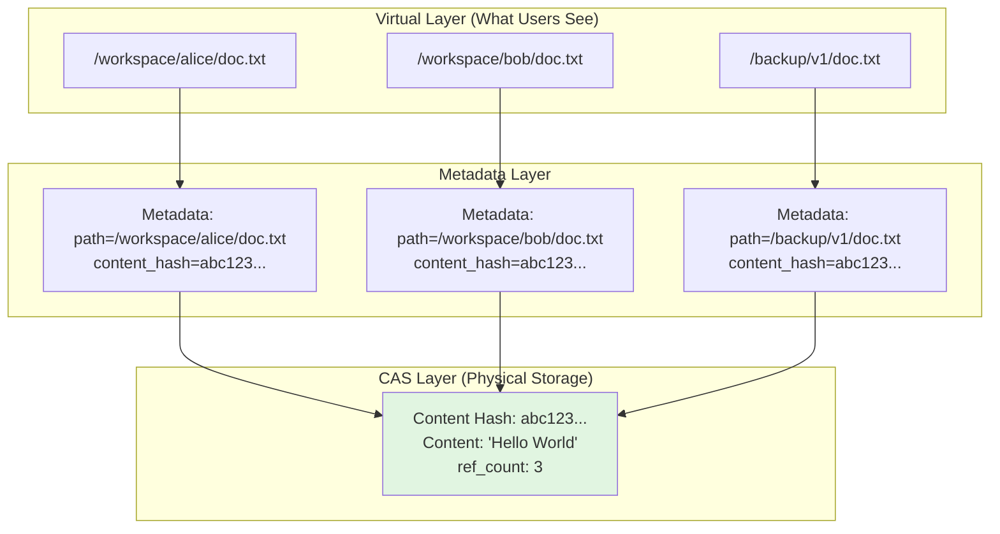

# Content-Addressable Storage (CAS)

## What is Content-Addressable Storage?

**Content-Addressable Storage (CAS)** is a storage system where content is identified by its **cryptographic hash** (SHA-256) instead of its location (path). In Nexus, every file's content is stored once based on its hash, enabling automatic deduplication and immutable version history.

### Traditional Storage vs CAS

| Traditional Storage | Content-Addressable Storage (CAS) |
|---------------------|----------------------------------|
| File identified by path (`/workspace/file.txt`) | Content identified by hash (`abc123...`) |
| Same content at 10 paths = 10 copies | Same content at 10 paths = 1 copy |
| Modify file = overwrite content | Modify file = new hash, old content preserved |
| No built-in versioning | Automatic immutable version history |
| Manual deduplication (complex) | Automatic deduplication (transparent) |

**Key Innovation:** Store once, reference many times.

---

## How CAS Works in Nexus

### Architecture: Two-Layer System



**Key Components:**

1. **Virtual Layer**: Paths users see (`/workspace/file.txt`)
2. **Metadata Layer**: Maps paths to content hashes
3. **CAS Layer**: Physical storage indexed by SHA-256 hash

---

## Content Hashing

### SHA-256 Hash Computation

```python
import hashlib

def compute_hash(content: bytes) -> str:
    """Compute SHA-256 hash of content."""
    return hashlib.sha256(content).hexdigest()

# Example
content = b"Hello World"
hash = compute_hash(content)
# Result: "a591a6d40bf420404a011733cfb7b190d62c65bf0bcda32b57b277d9ad9f146e"
```

**Hash Properties:**
- **Algorithm**: SHA-256 (256-bit hash)
- **Output**: 64 hexadecimal characters
- **Deterministic**: Same content always produces same hash
- **Collision-free**: Practically impossible for different content to have same hash
- **One-way**: Cannot reverse hash to recover content

---

### Storage Layout

Content is organized in a **two-level directory structure** to prevent filesystem bottlenecks:

```
backend_root/
├── cas/                          # Content-Addressable Storage
│   ├── ab/                       # First 2 chars of hash
│   │   ├── cd/                   # Next 2 chars of hash
│   │   │   ├── abcd1234...ef56   # Actual content file
│   │   │   └── abcd1234...ef56.meta  # Metadata (ref count, size)
│   │   └── de/
│   │       └── abde5678...gh12
│   └── ef/
│       └── ...
```

**Example:**
```
Hash: "a591a6d40bf420404a011733cfb7b190d62c65bf0bcda32b57b277d9ad9f146e"

Storage path:
  cas/a5/91/a591a6d40bf420404a011733cfb7b190d62c65bf0bcda32b57b277d9ad9f146e
  cas/a5/91/a591a6d40bf420404a011733cfb7b190d62c65bf0bcda32b57b277d9ad9f146e.meta
```

**Why two levels?**
- **First 2 chars**: Distributes across 256 directories (00-ff)
- **Next 2 chars**: Further distribution (65,536 leaf directories max)
- **Prevents**: Single directory with millions of files (filesystem bottleneck)
- **Used by**: Git, Docker, many production storage systems

---

## Write Operations and Deduplication

### Write Flow

```python
def write_content(content: bytes) -> str:
    """
    Write content to CAS storage.

    Returns content hash (SHA-256).
    If content already exists, increments reference count.
    """
    # 1. Compute hash
    content_hash = hashlib.sha256(content).hexdigest()

    # 2. Check if content already exists
    content_path = _hash_to_path(content_hash)
    if content_path.exists():
        # Content exists! Increment ref count (deduplication)
        metadata = _read_metadata(content_hash)
        metadata["ref_count"] += 1
        _write_metadata(content_hash, metadata)
        return content_hash  # Return immediately (no disk write!)

    # 3. Content doesn't exist - write atomically
    # Write to temp file first (atomic operation)
    tmp_path = write_to_temp_file(content)

    # Atomic move to final location
    os.replace(tmp_path, content_path)

    # 4. Create metadata
    metadata = {"ref_count": 1, "size": len(content)}
    _write_metadata(content_hash, metadata)

    return content_hash
```

---

### Automatic Deduplication

**Example Scenario:**

```python
# 100 users upload the same file
content = b"Python is great!"

hashes = []
for user in range(100):
    hash = backend.write_content(content)
    hashes.append(hash)

# All hashes are identical
assert len(set(hashes)) == 1  # Only 1 unique hash

# Disk usage: ~15 bytes (not 1,500 bytes)
# Reference count: 100
```

**Real-World Benefits:**

| Scenario | Without CAS | With CAS | Savings |
|----------|------------|----------|---------|
| 100 copies of 10MB file | 1 GB | 10 MB | **99% saved** |
| Document versions (80% unchanged) | 500 MB | 100 MB | **80% saved** |
| AI agent logs (repetitive patterns) | 2 GB | 400 MB | **80% saved** |

---

## Reference Counting

### Metadata Format

Each content item has a metadata file (`.meta` suffix):

```json
{
    "ref_count": 3,
    "size": 1024
}
```

**Fields:**
- `ref_count`: Number of files/paths referencing this content
- `size`: Size of content in bytes

---

### Safe Deletion with Reference Counting

```python
def delete_content(content_hash: str) -> None:
    """Delete content with reference counting."""
    metadata = _read_metadata(content_hash)
    ref_count = metadata["ref_count"]

    if ref_count <= 1:
        # Last reference - delete file and metadata
        content_path = _hash_to_path(content_hash)
        content_path.unlink()  # Delete content

        meta_path = _get_meta_path(content_hash)
        meta_path.unlink()  # Delete metadata

        # Clean up empty directories
        _cleanup_empty_dirs(content_path.parent)
    else:
        # Decrement reference count
        metadata["ref_count"] = ref_count - 1
        _write_metadata(content_hash, metadata)
```

---

### Deletion Example

```
Initial State:
  content_hash="abc123..." has ref_count=3
  Paths: /file1.txt, /file2.txt, /file3.txt (all same hash)

Step 1: Delete /file1.txt
  - ref_count decremented to 2
  - Content remains on disk
  - Other files unaffected

Step 2: Delete /file2.txt
  - ref_count decremented to 1
  - Content remains on disk
  - /file3.txt still accessible

Step 3: Delete /file3.txt
  - ref_count is 1, this is the last reference
  - Content file deleted from CAS
  - Metadata file deleted
  - Empty directories cleaned up

Result: Zero disk usage for this content
```

---

## Version History and Immutability

### Immutable Content

Once content is written to CAS, it **cannot be modified**:

```python
# Write content
hash1 = backend.write_content(b"Version 1")
# hash1 = "a1b2c3..."

# "Modify" content = write new version
hash2 = backend.write_content(b"Version 2")
# hash2 = "d4e5f6..." (different hash)

# Original content is IMMUTABLE
content = backend.read_content(hash1)
# Still returns b"Version 1"
```

**Key Properties:**
1. **Content hash is permanent**: Once created, hash never changes
2. **Content is read-only**: Different content = different hash
3. **No destructive updates**: Old versions preserved
4. **Guaranteed integrity**: Hash mismatch = corrupted content

---

### Version History

Nexus tracks all versions of a file in `version_history` table:

```python
class VersionHistoryModel:
    version_id: str           # Unique version ID
    resource_id: str          # Path ID
    version_number: int       # 1, 2, 3, ...
    content_hash: str         # SHA-256 hash (CAS key)
    size_bytes: int           # File size at this version
    created_at: datetime      # When version created
    created_by: str           # User/agent who created it
```

**Example History:**

```
File: /workspace/doc.txt

Version 3 (current):
  content_hash: "abc123..."
  size: 1024 bytes
  created_at: 2025-01-15 10:30:00
  created_by: alice

Version 2:
  content_hash: "def456..."
  size: 512 bytes
  created_at: 2025-01-15 10:00:00
  created_by: alice

Version 1:
  content_hash: "789ghi..."
  size: 256 bytes
  created_at: 2025-01-15 09:00:00
  created_by: alice
```

---

### Time Travel

Access any previous version using version notation:

```bash
# Read current version
nexus cat /workspace/doc.txt

# Read version 2
nexus cat /workspace/doc.txt@2

# Read version 1
nexus cat /workspace/doc.txt@1
```

**Python API:**

```python
# Get version history
versions = nx.stat("/workspace/doc.txt").versions

for v in versions:
    print(f"v{v['version']}: {v['size']} bytes, {v['created_at']}")

# Read specific version
meta = nx.metadata.get("/workspace/doc.txt@2")
content = nx.backend.read_content(meta.etag)  # Read from CAS
```

---

## Read Operations

### Read Flow

```python
def read(path: str) -> bytes:
    """
    Read file content by path.

    Process:
    1. Get metadata for path
    2. Extract content_hash from metadata
    3. Read from CAS using content_hash
    """
    # 1. Get metadata
    meta = metadata_store.get(path)
    if meta is None:
        raise FileNotFoundError(path)

    # 2. Extract content hash
    content_hash = meta.etag  # SHA-256 hash

    # 3. Read from CAS
    content = backend.read_content(content_hash)

    return content
```

**Key Insight:**
- Virtual path → metadata lookup → content_hash → CAS read
- Multiple paths can share same content (deduplication)

---

### Content Cache

Nexus includes an **LRU content cache** to speed up repeated reads:

```python
class ContentCache:
    """LRU cache for file content indexed by content hash."""

    def __init__(self, max_size_mb: int = 256):
        """Default: 256MB cache."""
        self._max_size_bytes = max_size_mb * 1024 * 1024
        self._cache: OrderedDict[str, bytes] = OrderedDict()

    def get(self, content_hash: str) -> bytes | None:
        """Get from cache (thread-safe LRU)."""
        if content_hash in self._cache:
            # Move to end (most recently used)
            self._cache.move_to_end(content_hash)
            return self._cache[content_hash]
        return None

    def put(self, content_hash: str, content: bytes) -> None:
        """Add to cache with size-based eviction."""
        # Evict LRU items until space available
        while self._current_size + len(content) > self._max_size_bytes:
            # Remove least recently used item
            _, evicted = self._cache.popitem(last=False)
            self._current_size -= len(evicted)

        self._cache[content_hash] = content
        self._current_size += len(content)
```

**Cache Benefits:**
- **Fast reads**: Avoid disk I/O for popular content
- **Size-based eviction**: Default 256MB (configurable)
- **Thread-safe**: Multiple concurrent reads
- **Transparent**: Automatic caching on read/write

---

### Batch Read Optimization

Read multiple content items efficiently:

```python
def batch_read_content(content_hashes: list[str]) -> dict[str, bytes | None]:
    """Batch read multiple content items."""
    result = {}

    # First pass: check cache
    uncached = []
    for hash in content_hashes:
        cached = content_cache.get(hash)
        if cached:
            result[hash] = cached
        else:
            uncached.append(hash)

    # Second pass: read uncached from disk
    for hash in uncached:
        try:
            content = read_content(hash)
            result[hash] = content
        except:
            result[hash] = None  # Missing

    return result
```

---

## Streaming for Large Files

For very large files (GB+), use **streaming** to avoid loading entire file into memory:

```python
def stream_content(content_hash: str, chunk_size: int = 8192):
    """Stream content in chunks (memory-efficient)."""
    content_path = _hash_to_path(content_hash)

    with open(content_path, "rb") as f:
        while True:
            chunk = f.read(chunk_size)
            if not chunk:
                break
            yield chunk

# Example: Process 10GB file with 1MB memory usage
for chunk in stream_content(hash, chunk_size=1024*1024):
    process_chunk(chunk)  # Memory = 1MB, not 10GB
```

---

## Backend Integration

### Unified Backend Interface

All backends implement the same CAS interface:

```python
class Backend(ABC):
    """Unified backend interface."""

    @abstractmethod
    def write_content(self, content: bytes) -> str:
        """Write content, return hash."""
        pass

    @abstractmethod
    def read_content(self, content_hash: str) -> bytes:
        """Read content by hash."""
        pass

    @abstractmethod
    def delete_content(self, content_hash: str) -> None:
        """Delete content (ref counting)."""
        pass

    @abstractmethod
    def content_exists(self, content_hash: str) -> bool:
        """Check if content exists."""
        pass
```

---

### LocalBackend (Filesystem)

**Storage Structure:**
```
/var/nexus/backend/
├── cas/
│   ├── a5/
│   │   └── 91/
│   │       ├── a591a6d40bf420...  # Content file
│   │       └── a591a6d40bf420....meta  # Metadata
```

**Features:**
- Thread-safe file locking
- Windows/macOS/Linux compatible
- Atomic writes (temp file + rename)
- Automatic directory cleanup

---

### GCSBackend (Google Cloud Storage)

**Storage Structure:**
```
gs://my-bucket/
├── cas/ab/cd/abcd1234...ef56        # Content blob
└── cas/ab/cd/abcd1234...ef56.meta   # Metadata blob
```

**Features:**
- Unlimited scalability
- Global distribution
- Automatic redundancy
- Pay-per-byte pricing
- Same CAS interface as LocalBackend

**Switching Backends (Zero Code Changes):**
```python
# Local development
nx = NexusFS(backend=LocalBackend("/tmp/nexus"))

# Production (cloud)
nx = NexusFS(backend=GCSBackend("my-bucket", "my-project"))

# All file operations work identically!
nx.write("/workspace/data.txt", b"content")
content = nx.read("/workspace/data.txt")
```

---

## Real-World Examples

### Example 1: Document Backups

```python
# User saves document 5 times
v1 = b"Draft 1"
v2 = b"Draft 2"
v3 = b"Draft 3"
v4 = b"Draft 3"  # Accidentally same as v3
v5 = b"Final"

# Write all versions
hash1 = nx.backend.write_content(v1)  # ref_count=1
hash2 = nx.backend.write_content(v2)  # ref_count=1
hash3 = nx.backend.write_content(v3)  # ref_count=1
hash4 = nx.backend.write_content(v4)  # hash3 again! ref_count=2 (deduped)
hash5 = nx.backend.write_content(v5)  # ref_count=1

# Disk usage
# v1: 7 bytes
# v2: 7 bytes
# v3: 7 bytes
# v4: 0 bytes (deduped with v3)
# v5: 5 bytes
# Total: 26 bytes (not 31 bytes)
```

---

### Example 2: AI Agent Logs

```python
# 100 agents log the same error message
error_msg = b"Connection timeout to database"

hashes = []
for agent_id in range(100):
    hash = nx.backend.write_content(error_msg)
    hashes.append(hash)

    # Store metadata pointing to hash
    nx.metadata.put({
        "path": f"/logs/agent_{agent_id}/error.log",
        "content_hash": hash
    })

# All hashes identical
assert len(set(hashes)) == 1

# Disk usage
# 100 files pointing to 1 content blob
# Storage: ~29 bytes (not 2,900 bytes)
# 99% deduplication!
```

---

### Example 3: Shared Team Files

```python
# Alice creates a file
nx_alice.write("/workspace/alice/doc.txt", b"Team document")

# Bob copies it
content = nx_alice.read("/workspace/alice/doc.txt")
nx_bob.write("/workspace/bob/doc.txt", content)

# Charlie copies it
nx_charlie.write("/workspace/charlie/doc.txt", content)

# Behind the scenes:
# - 3 metadata entries (different paths)
# - 1 content blob in CAS
# - ref_count = 3
# - Storage: 1× size, not 3× size
```

---

## Performance Characteristics

### Write Performance

| Operation | Cost | Notes |
|-----------|------|-------|
| Hash computation | O(n) | n = file size, ~200 MB/s on modern CPU |
| Duplicate check | O(1) | Hash lookup in filesystem |
| New content write | O(n) | Write to disk |
| Metadata write | O(1) | Small JSON file |

**Benchmark (Local SSD):**
- 1KB file: ~0.5ms (hash + write)
- 1MB file: ~5ms (hash + write)
- 100MB file: ~500ms (hash + write)

---

### Read Performance

| Operation | Cost | Notes |
|-----------|------|-------|
| Metadata lookup | O(1) | Database index |
| Cache hit | O(1) | ~0.1ms |
| Cache miss (disk) | O(n) | n = file size |

**Benchmark (with cache):**
- Cached read (1MB): ~0.1ms
- Uncached read (1MB): ~5ms
- Batch read (100 files): ~50ms (cache) or ~500ms (disk)

---

## Best Practices

### 1. Use Batch Reads for Multiple Files

```python
# ✅ Good: Batch read
hashes = [meta.etag for meta in file_metas]
contents = backend.batch_read_content(hashes)

# ❌ Bad: Individual reads
for meta in file_metas:
    content = backend.read_content(meta.etag)  # N round trips!
```

---

### 2. Stream Large Files

```python
# ✅ Good: Stream large file
for chunk in backend.stream_content(hash, chunk_size=1024*1024):
    process_chunk(chunk)  # Memory = 1MB

# ❌ Bad: Load entire file
content = backend.read_content(hash)  # Memory = file_size
process(content)
```

---

### 3. Enable Content Cache

```python
# ✅ Good: Enable cache for read-heavy workloads
backend = LocalBackend(
    root_dir="/tmp/nexus",
    content_cache=ContentCache(max_size_mb=512)  # 512MB cache
)

# ❌ Bad: No cache (repeated disk reads)
backend = LocalBackend(root_dir="/tmp/nexus")  # No cache
```

---

### 4. Monitor Reference Counts

```bash
# Check ref count for content
nexus backend ref-count abc123...

# Find content with zero refs (garbage)
nexus backend list-unreferenced

# Cleanup (manual GC)
nexus backend gc --dry-run
```

---

## Troubleshooting

### Content Not Found

**Problem:** `backend.read_content(hash)` raises `FileNotFoundError`

**Check:**
1. Verify hash exists:
   ```python
   exists = backend.content_exists(hash)
   ```

2. Check ref count:
   ```python
   ref_count = backend.get_ref_count(hash)
   # ref_count=0 means content was garbage collected
   ```

3. Check metadata consistency:
   ```sql
   SELECT * FROM file_paths WHERE content_hash = 'abc123...';
   ```

---

### Disk Usage Growing

**Problem:** CAS directory growing too large

**Solutions:**

1. **Check deduplication rate:**
   ```bash
   # Total files
   SELECT COUNT(*) FROM file_paths;

   # Unique content blobs
   SELECT COUNT(DISTINCT content_hash) FROM file_paths;

   # Dedup rate
   dedup_rate = 1 - (unique_blobs / total_files)
   ```

2. **Run garbage collection:**
   ```bash
   # Find unreferenced content
   nexus backend list-unreferenced

   # Delete unreferenced (dry run first!)
   nexus backend gc --dry-run
   nexus backend gc
   ```

3. **Check for large files:**
   ```sql
   SELECT content_hash, size_bytes
   FROM file_paths
   ORDER BY size_bytes DESC
   LIMIT 10;
   ```

---

### Hash Mismatch

**Problem:** Content corruption detected (hash doesn't match)

**Causes:**
- Disk corruption
- Incomplete write (power failure)
- Backend storage issue

**Recovery:**
```python
# Verify content integrity
content = backend.read_content(hash)
computed_hash = hashlib.sha256(content).hexdigest()

if computed_hash != hash:
    # CORRUPTED!
    # Restore from backup or re-upload
    pass
```

---

## FAQ

### Q: Can I modify content in-place?

**A**: No. CAS content is **immutable**. Modifying a file creates a new version with a new hash. Old versions are preserved in version history.

---

### Q: What happens if I delete a file but other paths reference it?

**A**: Reference count is decremented. Content remains until `ref_count` reaches 0.

---

### Q: How much storage overhead does CAS add?

**A**: Minimal. Metadata is ~100 bytes per file. For large files, overhead is <0.1%.

---

### Q: Can I use CAS with S3 or Azure?

**A**: Yes! Implement the `Backend` interface for your storage:
- `S3Backend`: Use S3 bucket with hash-based keys
- `AzureBackend`: Use Azure Blob Storage
- Same CAS benefits (deduplication, versioning)

---

### Q: How does CAS compare to Git?

**A**: Git uses CAS for commits and trees. Nexus uses CAS for file content. Similar benefits (deduplication, immutability), different scope (filesystems vs version control).

---

## Next Steps

- **[Mounts & Backends](mounts-and-backends.md)** - Multi-backend routing
- **[Memory System](memory-system.md)** - CAS for agent memory
- **[Version History](version-history.md)** - Time-travel with CAS
- **[API Reference: Backend API](/api/backend-api/)** - Complete API docs

---

## Related Files

- Interface: `src/nexus/backends/backend.py:1`
- Local: `src/nexus/backends/local.py:81`
- GCS: `src/nexus/backends/gcs.py:1`
- Models: `src/nexus/storage/models.py:346`
- Cache: `src/nexus/storage/content_cache.py:1`
- Tests: `tests/unit/backend/test_local_backend.py:172`
