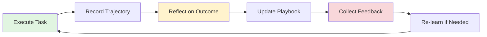
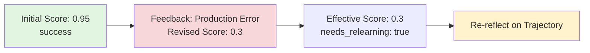

# Learning Loops

## What are Learning Loops?

**Learning loops** are systems that enable AI agents to **improve over time** by recording experiences, extracting lessons, and applying insights to future tasks. Nexus provides algorithm-agnostic learning primitives that work with any learning approach: fine-tuning, reinforcement learning, RAG, or behavioral cloning.

### Core Idea: Learn from Experience



**Components:**
1. **Trajectories** - Record what happened (actions, decisions, outcomes)
2. **Reflection** - Analyze why it worked/failed (extract patterns)
3. **Playbooks** - Store learned strategies (best practices)
4. **Feedback** - Collect production outcomes (update scores)
5. **Consolidation** - Merge redundant memories (prevent context collapse)

---

## Why Algorithm-Agnostic?

Nexus doesn't dictate *how* agents learn. It provides **primitives** that work with any learning method:

| Learning Method | How It Uses Nexus |
|-----------------|-------------------|
| **Fine-tuning** | Trajectories = training examples, Reflections = labels |
| **Reinforcement Learning** | Trajectories = episodes, Feedback = reward signal |
| **RAG (Retrieval)** | Playbooks = context, Memories = knowledge base |
| **Behavioral Cloning** | Helpful strategies = demonstrations |
| **Few-shot Prompting** | Playbook strategies = in-context examples |

**Key insight:** Nexus focuses on **what happened** and **what we learned**, not **how to learn**.

---

## 1. Trajectories: Recording Agent Execution

### What is a Trajectory?

A **trajectory** is a complete execution trace of a task:

```python
{
    "task_description": "Deploy caching strategy",
    "task_type": "infrastructure",
    "steps": [
        {"type": "action", "description": "Configured cache with 5min TTL"},
        {"type": "decision", "description": "Chose exponential backoff for retries"},
        {"type": "observation", "description": "Detected high error rate in API responses"}
    ],
    "status": "success",
    "success_score": 0.95,
    "duration_ms": 2500,
    "metrics": {"rows_processed": 1000}
}
```

---

### Recording Trajectories

```python
from nexus.core.memory_api import Memory

memory = Memory(
    session=db_session,
    backend=storage_backend,
    user_id="alice",
    agent_id="agent1"
)

# 1. Start trajectory
traj_id = memory.start_trajectory(
    task_description="Deploy caching strategy",
    task_type="infrastructure"
)

# 2. Log steps during execution
memory.log_step(
    trajectory_id=traj_id,
    step_type="action",  # 'action', 'decision', 'observation'
    description="Configured cache with 5min TTL",
    result={"ttl_seconds": 300}
)

memory.log_step(
    trajectory_id=traj_id,
    step_type="decision",
    description="Chose exponential backoff for retries",
    result={"max_retries": 5, "base_delay_ms": 100}
)

memory.log_step(
    trajectory_id=traj_id,
    step_type="observation",
    description="Detected high error rate in API responses",
    result={"error_rate": 0.15}
)

# 3. Complete trajectory
memory.complete_trajectory(
    trajectory_id=traj_id,
    status="success",
    success_score=0.95,
    metrics={"duration_ms": 2500, "rows_processed": 1000}
)
```

---

### Trajectory Data Model

```python
class TrajectoryModel:
    trajectory_id: str          # Unique ID
    user_id: str                # Owner
    agent_id: str               # Agent that executed
    task_description: str       # What was being done
    task_type: str              # Category (e.g., "api_call", "data_processing")

    # Execution trace (stored in CAS)
    trace_hash: str             # Points to JSON with steps/decisions/observations

    # Outcome tracking
    status: str                 # 'success', 'failure', 'partial'
    success_score: float        # 0.0-1.0 initial score
    error_message: str          # Error if failed

    # Performance metrics
    duration_ms: int
    tokens_used: int
    cost_usd: float

    # Feedback loop integration
    feedback_count: int         # How many feedback entries
    effective_score: float      # Updated score from feedback
    needs_relearning: bool      # Flag for re-reflection
    relearning_priority: int    # 0-10 urgency
```

---

## 2. Reflection: Learning from Experience

### What is Reflection?

**Reflection** analyzes completed trajectories to extract structured lessons:

```python
{
    "helpful_strategies": [
        {
            "description": "Validate age values: check for missing age and age range 0-100",
            "evidence": "Successfully detected age errors in validation step",
            "confidence": 0.75
        }
    ],
    "harmful_patterns": [
        {
            "description": "Need to add sex validation: check categorical values",
            "evidence": "Missed sex field errors in 45 samples",
            "impact": "Lower detection accuracy",
            "confidence": 0.75
        }
    ],
    "observations": [
        {
            "description": "Data quality improved over time",
            "relevance": "May indicate need for progressive validation"
        }
    ]
}
```

---

### Single Trajectory Reflection

```python
# Reflect on a completed trajectory
reflection = memory.reflect(
    trajectory_id="traj_123",
    context="This was a data validation task"  # Optional context
)

# Returns:
{
    "memory_id": "mem_456",  # Stored as memory for later use
    "trajectory_id": "traj_123",
    "helpful_strategies": [...],
    "harmful_patterns": [...],
    "observations": [...],
    "confidence": 0.8
}
```

---

### Batch Reflection (Multiple Trajectories)

```python
# Analyze many trajectories together for patterns
patterns = memory.batch_reflect(
    agent_id="agent1",
    since="2025-10-01T00:00:00Z",  # Filter by date
    min_trajectories=10,
    task_type="data_processing"  # Filter by task type
)

# Returns aggregate insights:
{
    "trajectories_analyzed": 47,
    "common_patterns": [
        {
            "description": "Always validate input before processing",
            "frequency": 42  # Appeared in 42 trajectories
        }
    ],
    "common_failures": [
        {
            "description": "Missing null checks cause runtime errors",
            "frequency": 15
        }
    ],
    "reflection_ids": ["mem_1", "mem_2", "mem_3", ...]
}
```

---

### How Reflection Works

1. **Trajectory Loading** - Reads complete trace from content-addressed storage
2. **Prompt Building** - Constructs LLM prompt with task description, steps, outcome
3. **LLM Analysis** - Calls language model to identify patterns
4. **Response Parsing** - Extracts JSON with helpful/harmful/observations
5. **Fallback Logic** - If LLM fails, creates basic reflection from trajectory data
6. **Storage** - Saves reflection as a memory for later use

---

## 3. Playbooks: Learned Strategy Guides

### What is a Playbook?

A **playbook** is a versioned collection of learned strategies:

```python
{
    "name": "API Error Handling",
    "version": 3,
    "strategies": [
        {
            "type": "helpful",
            "description": "Use exponential backoff for rate limit errors",
            "evidence": ["Successfully retried 95% of rate-limited requests"],
            "confidence": 0.9
        },
        {
            "type": "harmful",
            "description": "AVOID aggressive caching without TTL validation",
            "evidence": "Caused 15% stale data rate",
            "impact": "User-visible errors and trust loss",
            "confidence": 0.85
        }
    ],
    "usage_count": 47,
    "success_rate": 0.92,
    "avg_improvement": 0.15
}
```

---

### Playbook API

```python
# 1. Get playbook
playbook = memory.get_playbook("default")

# 2. Update with new strategies
memory.update_playbook([
    {
        "category": "helpful",
        "pattern": "Always validate input before processing",
        "context": "Data processing tasks",
        "confidence": 0.9
    }
])

# 3. Auto-curate from reflections
result = memory.curate_playbook(
    reflections=["mem_123", "mem_456", "mem_789"],  # Reflection memory IDs
    playbook_name="default"
)

# Returns:
{
    "playbook_id": "pb_789",
    "strategies_added": 5,
    "strategies_merged": 2  # Combined similar strategies
}
```

---

### Playbook Data Model

```python
class PlaybookModel:
    playbook_id: str            # Unique ID
    name: str                   # "API Error Handling", "Data Validation", etc.
    version: int                # Auto-incremented on updates
    content_hash: str           # Points to JSON in CAS

    # Metrics
    usage_count: int            # Times playbook was used
    success_rate: float         # Running average of success
    avg_improvement: float      # Average improvement score

    # Scope and sharing
    scope: str                  # 'agent', 'user', 'tenant', 'global'
    visibility: str             # 'private', 'shared', 'public'

    # Tracking
    created_at: datetime
    updated_at: datetime
    last_used_at: datetime
```

---

## 4. Feedback: Production Insights

### What is Feedback?

**Feedback** updates trajectory scores based on real-world outcomes:



---

### Feedback Collection

```python
# Add feedback after deployment
memory.add_feedback(
    trajectory_id="traj_123",
    feedback_type="monitoring",  # 'human', 'monitoring', 'ab_test', 'production'
    score=0.3,  # Revised from 0.95 → 0.3 (found issues!)
    source="datadog_monitor",
    message="Error rate spiked to 15%",
    metrics={
        "error_rate": 0.15,
        "alert_count": 47,
        "affected_users": 234
    }
)

# Get effective score (composite of all feedback)
effective_score = memory.get_effective_score(
    "traj_123",
    strategy="weighted"  # 'latest', 'average', or 'weighted'
)

# Mark for re-learning if score drops significantly
if effective_score < 0.5:
    memory.mark_for_relearning(
        "traj_123",
        reason="production_failure",
        priority=9  # 1-10, higher = more urgent
    )
```

---

### Feedback Scenarios

**Scenario 1: Human Feedback**
```python
# User rates agent performance
memory.add_feedback(
    trajectory_id="traj_123",
    feedback_type="human",
    score=0.5,  # User says "could be better"
    source="user:alice",
    message="Generated report had formatting issues"
)
```

**Scenario 2: Production Monitoring**
```python
# Automated monitoring detects issues
memory.add_feedback(
    trajectory_id="traj_123",
    feedback_type="production",
    score=0.2,  # Task failed in production
    source="monitoring:prometheus",
    message="Alert: High error rate after deployment",
    metrics={"error_rate": 0.22, "p99_latency_ms": 5000}
)
```

**Scenario 3: A/B Testing**
```python
# A/B test results
memory.add_feedback(
    trajectory_id="traj_123",
    feedback_type="ab_test",
    score=0.8,  # Variant performed well
    source="ab_testing_framework",
    message="Variant B had 15% higher conversion",
    metrics={"conversion_lift": 0.15, "confidence": 0.95}
)
```

**Scenario 4: Long-term Metrics**
```python
# Metrics collected weeks later
memory.add_feedback(
    trajectory_id="traj_123",
    feedback_type="monitoring",
    score=0.3,  # Initially looked good, but degraded
    source="monitoring:datadog",
    message="Performance regression detected",
    metrics={"p50_increase": 0.40, "sustained_days": 7}
)
```

---

### Feedback Data Model

```python
class TrajectoryFeedbackModel:
    feedback_id: str            # Unique ID
    trajectory_id: str          # Which trajectory

    # Feedback details
    feedback_type: str          # 'human', 'monitoring', 'ab_test', 'production'
    revised_score: float        # Updated score (0.0-1.0)
    source: str                 # Who/what gave feedback
    message: str                # Human explanation

    # Additional metrics as JSON
    metrics_json: str           # Extra structured data
    created_at: datetime        # When feedback was received
```

---

## 5. Memory Consolidation: Preventing Context Collapse

### What is Consolidation?

As agents accumulate experiences, memory grows. **Consolidation** merges related low-importance memories into high-quality summaries.

**Benefits:**
- ✅ Reduces context size (fewer tokens)
- ✅ Improves retrieval (fewer duplicates)
- ✅ Preserves knowledge (high-quality summaries)
- ✅ Automatic cleanup (LRU-style)

---

### Consolidation API

```python
# Consolidate memories in specific namespace
report = memory.consolidate(
    namespace_prefix="knowledge/",  # Consolidate knowledge memories
    preserve_high_importance=True,  # Keep important originals
    importance_threshold=0.8        # Only consolidate < 0.8
)

# Returns:
{
    "memories_consolidated": 47,
    "consolidations_created": 5,  # 5 new consolidated memories
    "space_saved": 42  # ~42 fewer individual memories
}
```

---

### Consolidation Workflow

1. **Query** - Find memories matching criteria
2. **Filter** - Only consolidate low-importance memories
3. **Group** - Batch into groups of N memories
4. **Summarize** - LLM creates high-quality summary
5. **Store** - Save consolidated memory with higher importance
6. **Mark** - Tag source memories as consolidated
7. **Preserve** - Keep high-importance originals untouched

---

## Complete Learning Loop: End-to-End

### Automatic Learning Loop

```python
# Execute task with automatic trajectory + reflection + curation
async def process_customer_data(filename):
    """Task function - normal business logic."""
    # ... actual work ...
    return {"rows_processed": 1000, "errors": 5}

result = await memory.execute_with_learning(
    task_description="Process customer orders",
    task_fn=process_customer_data,
    task_type="data_processing",
    playbook_id="playbook_123",  # Auto-update this playbook
    enable_reflection=True,      # Auto-reflect on outcome
    enable_curation=True,        # Auto-curate playbook
    filename="orders.csv"        # Task arguments
)

# Returns:
{
    "result": {"rows_processed": 1000, "errors": 5},
    "trajectory_id": "traj_abc123",
    "success": True,
    "reflection_id": "mem_def456",
    "duration_ms": 2345
}
```

---

### Manual Learning Loop (Fine-grained Control)

```python
# 1. Execution
traj_id = memory.start_trajectory("Process reports")
memory.log_step(traj_id, "action", "Loaded data file", {"rows": 1000})
memory.log_step(traj_id, "decision", "Applied filtering", {"remaining": 950})
memory.log_step(traj_id, "observation", "Noticed pattern X", {"frequency": 45})
memory.complete_trajectory(traj_id, "success", 0.92)

# 2. Reflection
reflection = memory.reflect(traj_id, context="Production use case")
print(f"Learned: {reflection['helpful_strategies']}")

# 3. Playbook Update
memory.update_playbook([
    {
        "category": "helpful",
        "pattern": reflection['helpful_strategies'][0],
        "confidence": 0.9
    }
])

# 4. Feedback (later, in production)
memory.add_feedback(
    traj_id,
    "monitoring",
    score=0.3,  # Oops, found issues!
    source="datadog"
)

# 5. Re-learn
if memory.get_effective_score(traj_id) < 0.5:
    memory.mark_for_relearning(traj_id, "production_failure", priority=8)

# 6. Process relearning queue
results = memory.process_relearning()
# Re-reflects on trajectories with significant feedback changes
```

---

## Integration with Learning Algorithms

### Fine-tuning (Supervised Learning)

```python
# Use trajectories as training examples
trajectories = memory.query_trajectories(
    agent_id="agent1",
    status="success",
    min_score=0.8
)

training_data = []
for traj in trajectories:
    reflection = memory.get_reflection(traj.trajectory_id)
    training_data.append({
        "input": traj.task_description,
        "steps": traj.trace["steps"],
        "output": reflection["helpful_strategies"]
    })

# Fine-tune model
model.fit(training_data)
```

---

### Reinforcement Learning

```python
# Trajectories = episodes, Feedback = reward signal
for trajectory in memory.query_trajectories(limit=100):
    # Initial reward
    reward = trajectory.success_score

    # Updated reward from feedback
    feedback = memory.get_trajectory_feedback(trajectory.trajectory_id)
    if feedback:
        reward = feedback[-1]["revised_score"]  # Latest feedback

    # Learn from trajectory
    agent.update(
        state=trajectory.trace["steps"],
        action=trajectory.trace["decisions"],
        reward=reward
    )
```

---

### RAG (Retrieval-Augmented Generation)

```python
# Use playbook + memories as context
playbook = memory.get_playbook()
strategies = playbook["strategies"][:5]  # Top 5 strategies

# Search relevant memories
relevant_memories = memory.search(
    query="API error handling",
    memory_type="reflection",
    limit=5
)

# Build prompt with context
context = "\n".join([s["description"] for s in strategies])
context += "\n" + "\n".join([m["content"] for m in relevant_memories])

prompt = f"{context}\n\nTask: {task_description}"
response = llm.generate(prompt)
```

---

### Behavioral Cloning

```python
# Use helpful strategies as demonstrations
reflections = memory.query(memory_type="reflection", limit=100)

demonstrations = []
for reflection in reflections:
    for strategy in reflection["helpful_strategies"]:
        demonstrations.append({
            "context": reflection["trajectory_id"],
            "action": strategy["description"],
            "confidence": strategy["confidence"]
        })

# Learn policy from demonstrations
policy.learn_from_demonstrations(demonstrations)
```

---

## Best Practices

### 1. Record All Significant Actions

```python
# ✅ Good: Log key decisions
memory.log_step(traj_id, "decision", "Chose caching strategy", {"ttl": 300})

# ❌ Bad: Skip logging
# (No record of decisions made)
```

---

### 2. Use Meaningful Task Descriptions

```python
# ✅ Good: Specific description
traj_id = memory.start_trajectory(
    "Deploy caching layer for user API with 5min TTL"
)

# ❌ Bad: Vague description
traj_id = memory.start_trajectory("Deploy stuff")
```

---

### 3. Collect Feedback from Production

```python
# ✅ Good: Monitor and collect feedback
if error_rate > 0.1:
    memory.add_feedback(
        traj_id,
        "production",
        score=0.3,
        source="monitoring",
        metrics={"error_rate": error_rate}
    )

# ❌ Bad: Ignore production outcomes
# (No feedback loop, can't improve)
```

---

### 4. Consolidate Regularly

```python
# ✅ Good: Periodic consolidation
if memory.count(scope="agent") > 1000:
    memory.consolidate(importance_threshold=0.5)

# ❌ Bad: Let memories grow unbounded
# (Context collapse, slow retrieval)
```

---

### 5. Use Playbooks for Consistency

```python
# ✅ Good: Query playbook before task
strategies = memory.get_playbook()["strategies"]
# Apply strategies to task

# ❌ Bad: Ignore past learnings
# (Repeat same mistakes)
```

---

## Performance Considerations

### Trajectory Storage

- **Trace size**: Average 5-50KB per trajectory
- **Storage**: Content-addressable (CAS) with deduplication
- **Retention**: Configurable (default: keep all)

### Reflection Performance

- **LLM latency**: 1-5 seconds per reflection
- **Batch reflection**: Process 10-100 trajectories in parallel
- **Caching**: Reflections stored as memories (retrieved instantly)

### Memory Consolidation

- **Frequency**: Weekly or when memory > 1000 items
- **Processing**: 10-50 memories per consolidation batch
- **Savings**: 70-90% reduction in low-importance memories

---

## FAQ

### Q: Do I need to use all components?

**A**: No! Use what you need:
- **Minimum**: Trajectories (just record what happened)
- **Recommended**: Trajectories + Reflection (learn patterns)
- **Full loop**: All components (continuous improvement)

---

### Q: Can I use this without LLM reflection?

**A**: Yes! Trajectories and playbooks work without LLM:
- Record trajectories
- Manually add playbook strategies
- Use feedback to update scores
- Implement your own learning algorithm

---

### Q: How does this compare to fine-tuning?

**A**: Complementary approaches:
- **Fine-tuning**: Updates model weights (expensive, slow)
- **Learning loops**: Updates knowledge/context (cheap, fast)
- **Best**: Use both (fine-tune + playbook context)

---

### Q: What if my agent makes mistakes?

**A**: Feedback loop handles this:
1. Initial score might be high (0.95)
2. Production feedback reveals issues
3. Effective score drops (0.3)
4. Agent marked for re-learning
5. Re-reflection extracts correct lessons

---

## Next Steps

- **[Memory System](memory-system.md)** - Where trajectories and reflections are stored
- **[Agent Permissions](agent-permissions.md)** - Control who can learn from what
- **[Content-Addressable Storage](content-addressable-storage.md)** - How traces are stored efficiently
- **[API Reference: Memory API](/api/memory-api/)** - Complete API docs

---

## Related Files

- API: `src/nexus/core/memory_api.py:556`
- Trajectory: `src/nexus/core/ace/trajectory.py:81`
- Reflection: `src/nexus/core/ace/reflection.py:54`
- Playbook: `src/nexus/core/ace/playbook.py:98`
- Feedback: `src/nexus/core/ace/feedback.py:33`
- Consolidation: `src/nexus/core/ace/consolidation.py:50`
- Models: `src/nexus/storage/models.py:1442`
- Tests: `tests/unit/core/test_memory_api.py:1`
