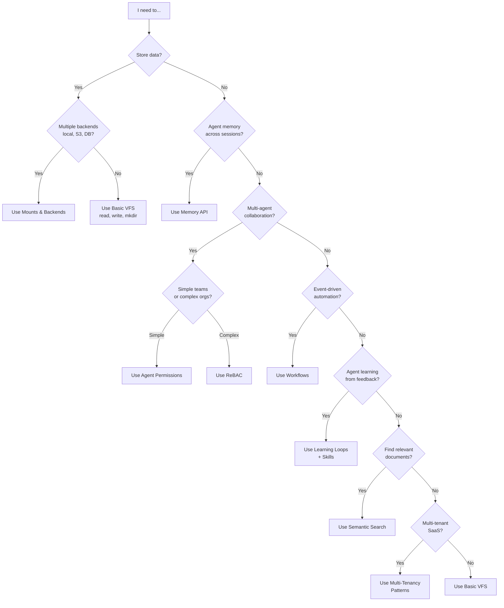
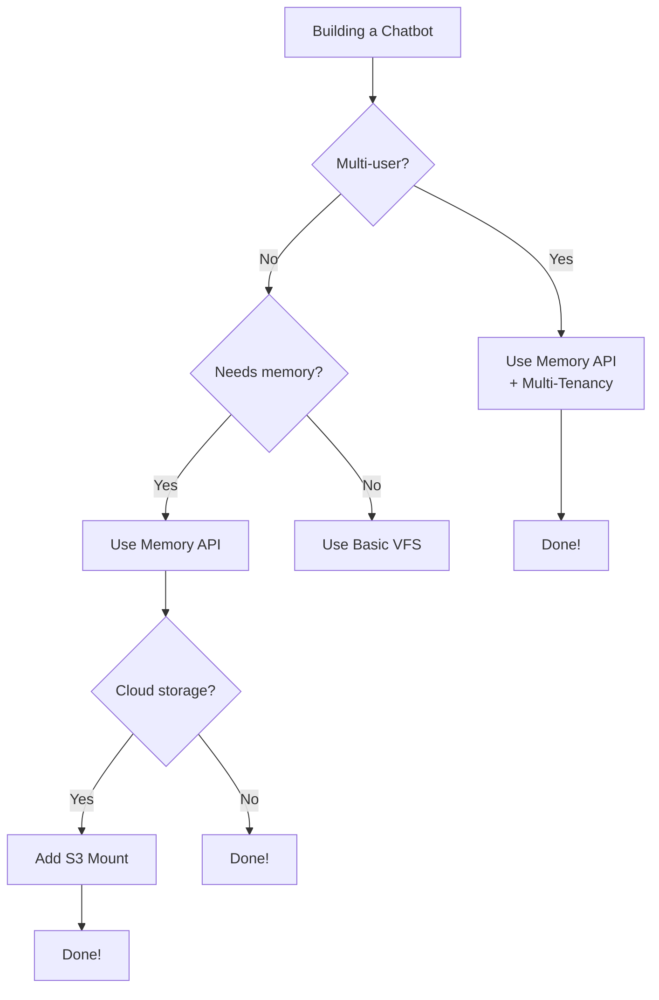
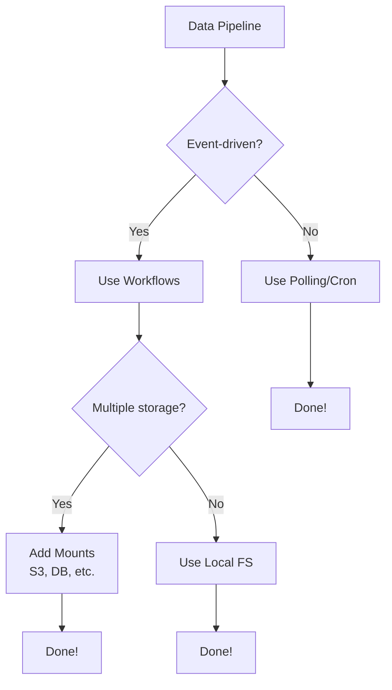

# When to Use What: Feature Decision Guide

## The Big Picture

Nexus offers many features - memory, permissions, workflows, mounts, search, skills, and more. **Which ones should you use?** This guide helps you choose the right Nexus features for your use case, avoiding over-engineering while ensuring you don't miss critical capabilities.

**Think of this as a flowchart for Nexus architecture decisions.**

---

## Quick Decision Tree



---

## Feature Selection Matrix

| Your Need | Use This Feature | Alternative | When to Upgrade |
|-----------|-----------------|-------------|-----------------|
| **Store files locally** | Basic VFS (`read`, `write`) | - | When you need cloud storage |
| **Store files in cloud (S3, GCS)** | Mounts + S3Backend | Basic VFS | Immediately if using cloud |
| **Query databases as files** | Mounts + PostgreSQLBackend | Direct SQL | When agents need DB access |
| **Agent remembers context** | Memory API | In-memory dict | When sessions end |
| **Multi-agent teams (2-5 agents)** | Agent Permissions | Manual permission checks | When you have >1 agent |
| **Multi-agent orgs (10+ agents)** | ReBAC | Agent Permissions | When you need hierarchies |
| **Find documents by meaning** | Semantic Search | Grep/glob | When keyword search fails |
| **Trigger actions on file changes** | Workflows | Polling/cron | When you need real-time |
| **Agents improve from feedback** | Learning Loops + Skills | Manual updates | When agents repeat tasks |
| **Multi-tenant SaaS** | Multi-Tenancy Patterns | Separate deployments | When you have >1 customer |
| **Version control for files** | CAS (built-in) | Git | Already built-in |
| **Deduplication** | CAS (built-in) | Manual hashing | Already built-in |

---

## Use Case Scenarios

### Scenario 1: Simple Chatbot with Memory

**Need**: A chatbot that remembers user preferences across sessions

**Use**:
- ✅ **Memory API** (store/recall user preferences)
- ✅ **Basic VFS** (store conversation logs)
- ❌ **NOT needed**: ReBAC (single user), Workflows, Mounts

```python
from nexus import NexusFS, LocalBackend

backend = LocalBackend(root_path="/tmp/nexus-data")
nx = NexusFS(backend=backend, is_admin=True)

# Store user preferences
nx.memory.store("user123", "preferences", {"lang": "python", "theme": "dark"})

# Later session - recall preferences
prefs = nx.memory.retrieve("user123", "preferences")
print(prefs)  # {"lang": "python", "theme": "dark"}
```

**Why this works**: Memory API is designed for session persistence. No need for complex features.

---

### Scenario 2: Multi-Agent Research Team

**Need**: 3 agents (Researcher, Writer, Reviewer) collaborate on reports

**Use**:
- ✅ **Agent Permissions** (control who can read/write)
- ✅ **Memory API** (each agent remembers tasks)
- ✅ **Basic VFS** (shared workspace)
- ❌ **NOT needed**: ReBAC (simple team), Workflows (manual coordination)

```python
backend = LocalBackend(root_path="/tmp/nexus-data")
nx = NexusFS(backend=backend, is_admin=True)

# Create agents
nx.admin.create_user("agent-researcher", subject_type="agent")
nx.admin.create_user("agent-writer", subject_type="agent")
nx.admin.create_user("agent-reviewer", subject_type="agent")

# Grant permissions
nx.rebac.grant("agent-researcher", "reader", "file", "/workspace/research")
nx.rebac.grant("agent-writer", "owner", "file", "/workspace/research")
nx.rebac.grant("agent-reviewer", "reader", "file", "/workspace/research")

# Researcher reads, Writer writes, Reviewer reviews
```

**Why this works**: Agent Permissions handles simple role-based access. Lightweight and easy to debug.

---

### Scenario 3: Document Processing Pipeline

**Need**: Auto-process uploaded PDFs, extract text, store in database

**Use**:
- ✅ **Workflows** (trigger on PDF upload)
- ✅ **Mounts** (S3 for PDFs, PostgreSQL for extracted text)
- ❌ **NOT needed**: Memory (stateless processing), ReBAC (single agent)

```python
# Mount S3 for uploads
nx.mount("/workspace/uploads", S3Backend(bucket="my-bucket"))

# Mount PostgreSQL for extracted text
nx.mount("/workspace/db", PostgreSQLBackend(db="documents"))

# Create workflow
nx.workflows.create(
    name="pdf-processor",
    trigger="write:/workspace/uploads/*.pdf",
    action=lambda event: process_pdf(event.path)
)

def process_pdf(pdf_path: str):
    # Extract text from PDF
    text = extract_text(nx.read(pdf_path))

    # Store in database
    nx.write(f"/workspace/db/extracted/{pdf_path.split('/')[-1]}.txt", text.encode())
```

**Why this works**: Workflows enable event-driven automation. Mounts abstract storage backends.

---

### Scenario 4: Enterprise Multi-Tenant SaaS

**Need**: 100 customers, each with isolated workspaces, agents, and permissions

**Use**:
- ✅ **Multi-Tenancy Patterns** (tenant isolation)
- ✅ **ReBAC** (complex org hierarchies per tenant)
- ✅ **Memory API** (tenant-scoped memory)
- ✅ **Mounts** (per-tenant databases)
- ✅ **Workflows** (tenant-scoped automation)

```python
# Tenant A: Create workspace
nx.mount("/workspace/tenant-a", PostgreSQLBackend(db="tenant_a"))
nx.rebac.create_namespace("tenant:tenant-a")

# Tenant A: Create agents
nx.admin.create_user("agent-a1", subject_type="agent")
nx.rebac.grant("agent-a1", "owner", "file", "/workspace/tenant-a/*")

# Tenant A: Isolated memory
nx.memory.store(
    identity="agent-a1",
    key="preferences",
    value={"model": "gpt-4"},
    namespace="tenant:tenant-a"
)

# Tenant B: Completely isolated (same pattern)
nx.mount("/workspace/tenant-b", PostgreSQLBackend(db="tenant_b"))
nx.rebac.create_namespace("tenant:tenant-b")
```

**Why this works**: Multi-tenancy ensures complete isolation. ReBAC handles complex permissions. Mounts provide per-tenant storage.

---

### Scenario 5: AI Agent that Improves Over Time

**Need**: Code review agent that learns from developer feedback

**Use**:
- ✅ **Learning Loops** (track feedback)
- ✅ **Skills** (versioned review capabilities)
- ✅ **Memory API** (remember code patterns)
- ❌ **NOT needed**: Workflows (feedback is manual), Multi-Tenancy (single team)

```python
# Create skill for code review
skill = nx.skills.create("code-reviewer", version="1.0")

# Agent performs review
review_result = agent.review_code("/workspace/src/app.py")

# Developer gives feedback
nx.learning.record_feedback(
    agent_id="agent-code-reviewer",
    task_id="review-123",
    feedback_type="thumbs_down",
    correction="Missed null pointer check on line 45"
)

# Agent retrieves feedback for next review
feedback_history = nx.learning.get_feedback(agent_id="agent-code-reviewer")

# Update skill with learned patterns
nx.skills.update("code-reviewer", version="1.1", improvements=feedback_history)
```

**Why this works**: Learning Loops track feedback over time. Skills version improvements.

---

## Feature Comparison

### Memory vs. Basic VFS

| Aspect | Memory API | Basic VFS (write/read) |
|--------|-----------|------------------------|
| **Use case** | Agent context, user preferences | General file storage |
| **Lifetime** | Long-lived, session-based | File-based, manual management |
| **API** | `store()`, `recall()`, `forget()` | `write()`, `read()`, `rm()` |
| **Namespacing** | Built-in (identity, namespace) | Manual (path-based) |
| **Search** | Key-based, namespace-scoped | Semantic, path-based |
| **When to use** | Session persistence, agent memory | Document storage, logs |

**Example**:
```python
# Memory API: Agent remembers user preference
nx.memory.store("user123", "theme", "dark")
theme = nx.memory.retrieve("user123", "theme")  # "dark"

# Basic VFS: Store conversation log
nx.write("/workspace/user123/conversations/2024-01-01.txt", b"User said: Hello")
log = nx.read("/workspace/user123/conversations/2024-01-01.txt")
```

**Decision**: Use Memory API for ephemeral, session-based data. Use VFS for persistent files.

---

### Agent Permissions vs. ReBAC

| Aspect | Agent Permissions | ReBAC |
|--------|------------------|-------|
| **Complexity** | Simple (role-based) | Complex (relationship-based) |
| **Use case** | Small teams (2-10 agents) | Large orgs (10+ agents, hierarchies) |
| **Setup** | Quick (grant/revoke) | Detailed (namespaces, relations) |
| **Flexibility** | Fixed roles (reader, writer, owner) | Custom relations (parent, member, admin) |
| **When to use** | Straightforward access control | Dynamic, hierarchical permissions |

**Example**:
```python
# Agent Permissions: Simple role assignment
nx.rebac.grant("agent1", "reader", "file", "/workspace/docs")
nx.rebac.grant("agent2", "owner", "file", "/workspace/docs")

# ReBAC: Complex org hierarchy
nx.rebac.create_namespace("org:engineering")
nx.rebac.grant("user:alice", "admin", "namespace", "org:engineering")
nx.rebac.grant("team:backend", "member", "namespace", "org:engineering")
nx.rebac.grant("agent1", "member", "team", "team:backend")
```

**Decision**: Start with Agent Permissions. Upgrade to ReBAC when you need hierarchies (teams, departments, groups).

---

### Workflows vs. Polling

| Aspect | Workflows (Event-Driven) | Polling (Cron/Loop) |
|--------|--------------------------|---------------------|
| **Latency** | Real-time (milliseconds) | Delayed (polling interval) |
| **Resource usage** | Low (triggered on event) | High (constant checks) |
| **Complexity** | Setup triggers, actions | Write polling loop |
| **When to use** | React to file changes | Scheduled batch jobs |

**Example**:
```python
# Workflows: Trigger on file write (real-time)
nx.workflows.create(
    trigger="write:/workspace/uploads/*.csv",
    action=lambda event: process_csv(event.path)
)

# Polling: Check every 5 minutes (delayed)
import time
while True:
    files = nx.ls("/workspace/uploads", pattern="*.csv")
    for file in files:
        process_csv(file)
    time.sleep(300)  # 5 minutes
```

**Decision**: Use Workflows for real-time automation. Use polling for scheduled batch jobs.

---

### Semantic Search vs. Grep/Glob

| Aspect | Semantic Search | Grep/Glob |
|--------|----------------|-----------|
| **Search type** | Meaning-based (embeddings) | Exact match (regex, patterns) |
| **Use case** | "Find docs about authentication" | "Find files named `auth*.py`" |
| **Accuracy** | Contextual, fuzzy | Precise, literal |
| **Performance** | Slower (embedding computation) | Faster (string matching) |
| **When to use** | Natural language queries | Known patterns, file names |

**Example**:
```python
# Semantic Search: Find by meaning
results = nx.semantic_search(
    "/workspace/docs",
    query="How do I authenticate users?"
)
# Returns: ["auth-guide.md", "oauth-setup.md", "jwt-tutorial.md"]

# Grep: Find by pattern
files = nx.search.grep("/workspace/docs", pattern="def authenticate")
# Returns: Files containing exact string "def authenticate"

# Glob: Find by file pattern
files = nx.glob("/workspace/docs/**/*auth*.md")
# Returns: ["oauth-guide.md", "auth-setup.md"]
```

**Decision**: Use Semantic Search for natural language queries. Use Grep/Glob for precise pattern matching.

---

### Mounts vs. Single Backend

| Aspect | Mounts (Multi-Backend) | Single Backend |
|--------|------------------------|----------------|
| **Complexity** | Higher (configure mounts) | Lower (one backend) |
| **Flexibility** | Multiple backends (S3 + DB + local) | One backend (e.g., local only) |
| **Performance** | Optimized per backend | Uniform |
| **When to use** | Hybrid storage (cloud + DB) | Simple deployments |

**Example**:
```python
# Mounts: Route paths to different backends
nx.mount("/workspace/local", LocalBackend())
nx.mount("/workspace/s3", S3Backend(bucket="my-bucket"))
nx.mount("/workspace/db", PostgreSQLBackend(db="nexus"))

# Write to S3
nx.write("/workspace/s3/report.pdf", pdf_bytes)

# Query database as file
nx.read("/workspace/db/users/123")  # Returns user record as JSON

# Single Backend: All data in local filesystem
backend = LocalBackend(root_path="/tmp/nexus-data")
nx = NexusFS(backend=backend, is_admin=True)  # Defaults to local
nx.write("/workspace/report.pdf", pdf_bytes)
```

**Decision**: Use Mounts when you need hybrid storage (cloud + local + database). Use single backend for simple deployments.

---

## Decision Flowchart by Use Case

### Use Case: Building a Chatbot



### Use Case: Building Multi-Agent System

```mermaid
graph TD
    Start[Multi-Agent System] --> Q1{Team size?}
    Q1 -->|2-5 agents| Simple[Agent Permissions]
    Q1 -->|10+ agents| Complex[ReBAC]

    Simple --> Q2{Shared workspace?}
    Q2 -->|Yes| VFS[Use Basic VFS]
    Q2 -->|No| Isolated[Use Multi-Tenancy]

    Complex --> Q3{Hierarchies?}
    Q3 -->|Yes| Namespaces[Use ReBAC Namespaces]
    Q3 -->|No| Flat[Use ReBAC (flat)]

    VFS --> Done1[Done!]
    Isolated --> Done2[Done!]
    Namespaces --> Done3[Done!]
    Flat --> Done4[Done!]
```

### Use Case: Building Data Pipeline



---

## Common Patterns

### Pattern 1: Simple Agent (No Collaboration)

**Use**:
- Basic VFS
- Memory API (optional, for session persistence)

```python
backend = LocalBackend(root_path="/tmp/nexus-data")
nx = NexusFS(backend=backend, is_admin=True)
nx.write("/workspace/data.txt", b"Hello")
nx.memory.store("agent1", "state", {"step": 1})
```

**Don't use**: ReBAC, Workflows, Multi-Tenancy

---

### Pattern 2: Multi-Agent Collaboration (Small Team)

**Use**:
- Agent Permissions
- Memory API (per-agent memory)
- Basic VFS (shared workspace)

```python
nx.admin.create_user("agent1", subject_type="agent")
nx.admin.create_user("agent2", subject_type="agent")
nx.rebac.grant("agent1", "reader", "file", "/workspace/shared")
nx.rebac.grant("agent2", "owner", "file", "/workspace/shared")
```

**Don't use**: ReBAC (overkill for small teams)

---

### Pattern 3: Multi-Agent Org (Large Team)

**Use**:
- ReBAC (with namespaces)
- Memory API (namespace-scoped)
- Mounts (separate team storage)

```python
nx.rebac.create_namespace("team:backend")
nx.rebac.create_namespace("team:frontend")
nx.rebac.grant("user:alice", "admin", "namespace", "team:backend")
nx.mount("/workspace/backend", S3Backend(bucket="backend-team"))
nx.mount("/workspace/frontend", S3Backend(bucket="frontend-team"))
```

**Don't use**: Simple Agent Permissions (too limited)

---

### Pattern 4: SaaS Multi-Tenant

**Use**:
- Multi-Tenancy Patterns
- ReBAC (per-tenant namespaces)
- Mounts (per-tenant databases)
- Memory API (tenant-scoped)
- Workflows (tenant-scoped)

```python
# Per tenant
nx.mount(f"/workspace/{tenant_id}", PostgreSQLBackend(db=f"tenant_{tenant_id}"))
nx.rebac.create_namespace(f"tenant:{tenant_id}")
nx.memory.store("agent1", "state", {...}, namespace=f"tenant:{tenant_id}")
```

**Don't use**: Single namespace (security risk)

---

### Pattern 5: Learning Agent

**Use**:
- Learning Loops
- Skills (versioned capabilities)
- Memory API (remember learned patterns)

```python
nx.learning.record_feedback("agent1", "task-123", "thumbs_down", "Missed edge case")
feedback = nx.learning.get_feedback("agent1")
nx.skills.update("code-reviewer", "1.1", improvements=feedback)
```

**Don't use**: Manual version tracking

---

## Feature Combinations (Recommended Stacks)

### Stack 1: Basic Agent
- **Features**: Basic VFS, Memory API
- **Use case**: Single-agent chatbot
- **Complexity**: Low

### Stack 2: Multi-Agent Team
- **Features**: Agent Permissions, Memory API, Basic VFS
- **Use case**: Collaborative agents (2-10)
- **Complexity**: Medium

### Stack 3: Enterprise Platform
- **Features**: ReBAC, Multi-Tenancy, Mounts, Memory API, Workflows
- **Use case**: Multi-tenant SaaS
- **Complexity**: High

### Stack 4: Data Pipeline
- **Features**: Workflows, Mounts, Semantic Search
- **Use case**: Event-driven document processing
- **Complexity**: Medium

### Stack 5: Learning System
- **Features**: Learning Loops, Skills, Memory API, Basic VFS
- **Use case**: Self-improving agents
- **Complexity**: High

---

## Red Flags: When You're Over-Engineering

### 🚩 Red Flag 1: Using ReBAC for Single Agent
**Problem**: Setting up namespaces, relations for one agent
**Fix**: Use Basic VFS or simple Agent Permissions

### 🚩 Red Flag 2: Using Multi-Tenancy for Single User
**Problem**: Creating tenant namespaces for one customer
**Fix**: Use Basic VFS

### 🚩 Red Flag 3: Using Workflows for Manual Tasks
**Problem**: Creating workflows for actions triggered manually
**Fix**: Use direct API calls

### 🚩 Red Flag 4: Using Semantic Search for Exact Matches
**Problem**: Embedding "auth.py" to find file named "auth.py"
**Fix**: Use Glob (`nx.glob("**/auth.py")`)

### 🚩 Red Flag 5: Using Mounts for Single Backend
**Problem**: Mounting local FS to `/workspace/local`
**Fix**: Use Basic VFS (defaults to local)

---

## Migration Paths

### From Basic VFS → Mounts
**When**: Need cloud storage or databases
```python
# Before
backend = LocalBackend(root_path="/tmp/nexus-data")
nx = NexusFS(backend=backend, is_admin=True)
nx.write("/workspace/data.txt", b"...")

# After
nx.mount("/workspace/s3", S3Backend(bucket="my-bucket"))
nx.write("/workspace/s3/data.txt", b"...")  # Now in S3
```

---

### From Agent Permissions → ReBAC
**When**: Need hierarchies (teams, departments)
```python
# Before
nx.rebac.grant("agent1", "reader", "file", "/workspace/docs")

# After
nx.rebac.create_namespace("team:engineering")
nx.rebac.grant("agent1", "member", "team", "team:engineering")
nx.rebac.grant("team:engineering", "reader", "file", "/workspace/docs")
```

---

### From Polling → Workflows
**When**: Need real-time automation
```python
# Before (polling every 5 mins)
while True:
    files = nx.ls("/workspace/uploads")
    for file in files:
        process(file)
    time.sleep(300)

# After (event-driven)
nx.workflows.create(
    trigger="write:/workspace/uploads/*",
    action=lambda event: process(event.path)
)
```

---

## FAQ

### Q: Should I use Memory API or just write files?
**A**: Use Memory API for session-based data (user preferences, agent state). Use files for persistent documents (reports, logs).

### Q: When do I need ReBAC vs. simple permissions?
**A**: Use ReBAC when you have >10 agents or need hierarchies (teams, groups). Otherwise, Agent Permissions suffice.

### Q: Can I mix local and cloud storage?
**A**: Yes! Use Mounts. Example: `/workspace/local/*` → Local FS, `/workspace/s3/*` → S3.

### Q: Should I use Workflows or cron jobs?
**A**: Use Workflows for real-time triggers (file uploads). Use cron for scheduled batch jobs (nightly reports).

### Q: Do I need Multi-Tenancy for 2-3 customers?
**A**: No, but it's good to start with tenant-scoped paths (e.g., `/workspace/customer1/`) to ease future migration.

---

## Next Steps

- **[What is Nexus?](what-is-nexus.md)** - Understand core concepts
- **[Memory System](memory-system.md)** - Deep dive on Memory API
- **[Agent Permissions](agent-permissions.md)** - Set up multi-agent teams
- **[Mounts & Backends](mounts-and-backends.md)** - Configure hybrid storage
- **[Multi-Tenancy](multi-tenancy.md)** - Build multi-tenant SaaS

For hands-on examples:
- **[Quick Start Guide](../getting-started/quickstart.md)** - 5-minute tutorial
- **[Learning Paths](../learning-paths/)** - Structured tutorials
- **[Examples](../examples/)** - Real-world use cases
