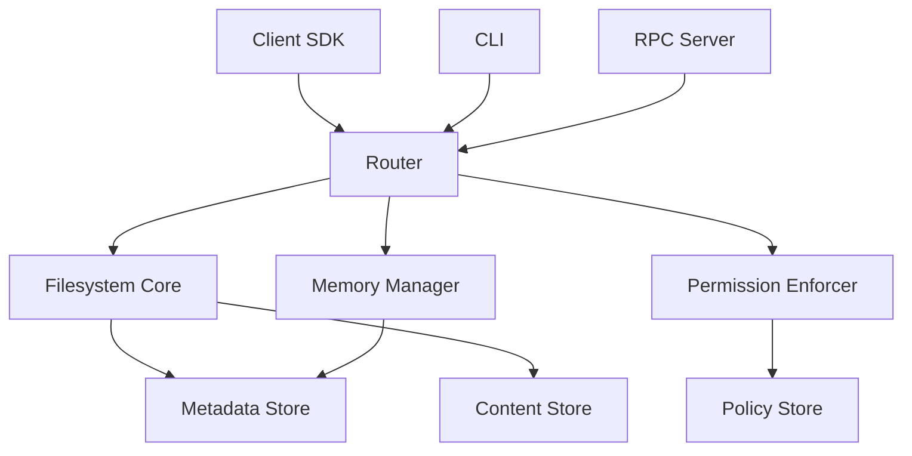

# Development Guide

Contributing to Nexus and building on top of it.

---

## For Contributors

<div class="features-grid" markdown>

<div class="feature-card" markdown>
### :material-code-braces: Contributing
Learn how to contribute to Nexus development.

[Contributing Guide →](development.md){ .md-button }
</div>

<div class="feature-card" markdown>
### :material-database-cog: Database Schema
Understand the database architecture.

[Database Schema →](DATABASE_COMPATIBILITY.md){ .md-button }
</div>

<div class="feature-card" markdown>
### :material-shield-lock: Permissions
Deep dive into permission implementation.

[Permissions Guide →](PERMISSIONS_IMPLEMENTATION.md){ .md-button }
</div>

<div class="feature-card" markdown>
### :material-puzzle: Plugins
Build plugins to extend Nexus.

[Plugin Development →](PLUGIN_DEVELOPMENT.md){ .md-button }
</div>

</div>

---

## Development Setup

### Prerequisites

```bash
# Python 3.11+
python --version

# Git
git --version

# Poetry (optional but recommended)
pip install poetry
```

### Clone and Setup

```bash
# Clone the repository
git clone https://github.com/nexi-lab/nexus.git
cd nexus

# Create virtual environment
python -m venv .venv
source .venv/bin/activate  # On Windows: .venv\Scripts\activate

# Install dependencies
pip install -e ".[dev]"

# Run tests
pytest
```

---

## Architecture Overview



### Core Components

| Component | Purpose | Location |
|-----------|---------|----------|
| **Router** | Request routing and orchestration | `src/nexus/core/router.py` |
| **Filesystem Core** | File operations and tree management | `src/nexus/core/nexus_fs_core.py` |
| **Permission Enforcer** | ReBAC authorization | `src/nexus/core/memory_permission_enforcer.py` |
| **Memory Manager** | Agent memory APIs | `src/nexus/core/memory_api.py` |
| **Metadata Store** | Metadata persistence | `src/nexus/storage/metadata_store.py` |

---

## Testing

### Run Tests

```bash
# All tests
pytest

# Unit tests only
pytest tests/unit/

# Integration tests
pytest tests/integration/

# With coverage
pytest --cov=src/nexus --cov-report=html
```

### Write Tests

```python
import pytest
from nexus import connect

def test_write_and_read():
    """Test basic write and read operations."""
    with connect(config={"data_dir": ":memory:"}) as nx:
        # Write
        nx.write("/test.txt", b"hello")

        # Read
        content = nx.read("/test.txt")
        assert content == b"hello"

def test_permission_denied(nx_with_auth):
    """Test permission enforcement."""
    with pytest.raises(PermissionDeniedError):
        nx_with_auth.read("/forbidden.txt")
```

---

## Code Style

### Format Code

```bash
# Format with black
black src/ tests/

# Sort imports
isort src/ tests/

# Lint with ruff
ruff check src/ tests/

# Type check
mypy src/
```

### Pre-commit Hooks

```bash
# Install pre-commit
pip install pre-commit

# Set up hooks
pre-commit install

# Run manually
pre-commit run --all-files
```

---

## Building Plugins

### Create a Plugin

```python
# my_plugin/plugin.py
from nexus.plugins import NexusPlugin

class MyPlugin(NexusPlugin):
    """Custom Nexus plugin."""

    name = "my-plugin"
    version = "0.1.0"

    def initialize(self, nx):
        """Initialize plugin with Nexus instance."""
        self.nx = nx

    def on_write(self, path: str, content: bytes):
        """Hook called after file write."""
        print(f"File written: {path}")

    def on_read(self, path: str, content: bytes):
        """Hook called after file read."""
        print(f"File read: {path}")
```

### Register Plugin

```python
from nexus import connect
from my_plugin import MyPlugin

nx = connect(
    config={"data_dir": "./data"},
    plugins=[MyPlugin()]
)
```

---

## Performance Guidelines

!!! tip "Best Practices"
    - **Batch operations**: Use bulk APIs when processing multiple files
    - **Lazy loading**: Don't load metadata unless needed
    - **Connection pooling**: Reuse connections, avoid creating new ones
    - **Caching**: Cache frequently accessed metadata
    - **Indexing**: Ensure proper database indexes for queries

### Performance Profiling

```python
import cProfile
import pstats

# Profile your code
profiler = cProfile.Profile()
profiler.enable()

# Your code here
for i in range(1000):
    nx.write(f"/file{i}.txt", b"content")

profiler.disable()

# Print stats
stats = pstats.Stats(profiler)
stats.sort_stats('cumulative')
stats.print_stats(20)
```

---

## Debugging

### Enable Debug Logging

```python
import logging

logging.basicConfig(
    level=logging.DEBUG,
    format='%(asctime)s - %(name)s - %(levelname)s - %(message)s'
)

# Now all Nexus operations will be logged
nx = connect(config={"data_dir": "./data"})
```

### Common Debug Scenarios

=== "Permission Issues"

    ```python
    # Enable ReBAC explain mode
    result = nx.rebac.check("user:alice", "read", "file:/data.txt")
    explanation = nx.rebac.explain("user:alice", "read", "file:/data.txt")
    print(explanation)
    ```

=== "Performance Issues"

    ```python
    # Enable query logging
    import logging
    logging.getLogger('sqlalchemy.engine').setLevel(logging.INFO)
    ```

=== "Connection Issues"

    ```python
    # Test connection
    try:
        nx = connect(remote_url="http://localhost:8080")
        health = nx.health()
        print(f"Server healthy: {health}")
    except Exception as e:
        print(f"Connection failed: {e}")
    ```

---

## Release Process

1. **Update version** in `pyproject.toml`
2. **Update CHANGELOG.md**
3. **Run full test suite**: `pytest`
4. **Build package**: `python -m build`
5. **Test installation**: `pip install dist/nexus-ai-fs-*.whl`
6. **Create PR** and get review
7. **Merge to main**
8. **Create release tag**: `git tag v0.x.x`
9. **Upload to PyPI**: `twine upload dist/*`
10. **Update documentation**

---

## Getting Help

<div class="value-prop-grid" markdown>

<div class="value-prop" markdown>
#### For Bug Reports
Open an issue on [GitHub](https://github.com/nexi-lab/nexus/issues) with reproduction steps.
</div>

<div class="value-prop" markdown>
#### For Feature Requests
Start a [discussion](https://github.com/nexi-lab/nexus/discussions) to gather feedback.
</div>

<div class="value-prop" markdown>
#### For Questions
Join our [Slack community](https://nexus-community.slack.com) for real-time help.
</div>

</div>
