# Claude Agent SDK Integration

Learn how to integrate Anthropic's Claude Agent SDK with Nexus to build powerful AI agents with persistent memory, file operations, and semantic search capabilities.

## 🎯 What is Claude Agent SDK?

**Claude Agent SDK** is Anthropic's official Python SDK for building agentic applications with Claude. It provides:

- **Built-in ReAct loop** - Automatic reasoning and tool calling
- **Custom tools** - Define Python functions as in-process MCP servers
- **Streaming responses** - Real-time agent interactions
- **Hooks** - Intercept and control agent execution
- **Async-first design** - Native async/await support

Combined with **Nexus**, Claude agents gain:

- ✅ **Persistent memory** across sessions (Memory API)
- ✅ **File operations** with versioning and permissions (read/write/search)
- ✅ **Semantic search** for RAG applications
- ✅ **Multi-tenancy** for isolated agent workspaces
- ✅ **Workflow automation** triggered by file events

## 📊 Why Nexus + Claude Agent SDK?

### The Problem

Traditional AI agents are **stateless** - they forget everything between sessions:

```python
# ❌ Without Nexus: No memory, no persistence
async for msg in query("What did we discuss yesterday?"):
    print(msg)
# Claude has no context from previous conversations
```

### The Solution

Nexus provides **persistent memory and context**:

```python
# ✅ With Nexus: Full memory and file access
nx = nexus.connect()

@tool("recall_memory", "Recall past conversations", {"query": str})
async def recall_memory(args):
    results = nx.memory.query(args["query"], scope="agent")
    return {"content": [{"type": "text", "text": "\n".join([m.content for m in results])}]}

# Claude can now remember!
async for msg in query(prompt="What did we discuss yesterday?", options=options):
    print(msg)
```

## 🚀 Quick Start

### Installation

```bash
# Install packages
pip install nexus-ai-fs claude-agent-sdk

# Set API key
export ANTHROPIC_API_KEY="sk-ant-..."

# Run the demo
cd examples/claude_agent_sdk
python claude_agent_react_demo.py
```

### Basic Example

```python
from claude_agent_sdk import query, tool, create_sdk_mcp_server, ClaudeAgentOptions
import nexus

# Connect to Nexus
nx = nexus.connect()

# Define tools with @tool decorator
@tool("read_file", "Read file from Nexus", {"path": str})
async def read_file(args):
    content = nx.read(args["path"])
    if isinstance(content, bytes):
        content = content.decode('utf-8')
    return {"content": [{"type": "text", "text": content}]}

@tool("write_file", "Write file to Nexus", {"path": str, "content": str})
async def write_file(args):
    nx.write(args["path"], args["content"].encode('utf-8'))
    return {"content": [{"type": "text", "text": f"Wrote to {args['path']}"}]}

# Bundle into MCP server
server = create_sdk_mcp_server(
    name="nexus-tools",
    version="1.0.0",
    tools=[read_file, write_file]
)

# Configure options
options = ClaudeAgentOptions(
    mcp_servers={"nexus": server},
    allowed_tools=["mcp__nexus__read_file", "mcp__nexus__write_file"]
)

# Run agent (ReAct loop is automatic!)
async for message in query(
    prompt="Read /workspace/data.json and create a summary in /reports/summary.md",
    options=options
):
    print(message)
```

## 🔬 How It Works

### The ReAct Pattern

Claude Agent SDK implements the **ReAct pattern** (Reasoning + Acting) automatically:

```mermaid
graph TB
    Start([🎯 User Prompt]) --> Think[🤔 Claude Thinks<br/>Reason about task]

    Think --> Decide{Need<br/>Tools?}

    Decide -->|Yes| CallTool[🔧 Call Tool<br/>e.g., read_file]
    Decide -->|No| Respond[💬 Final Response]

    CallTool --> Execute[⚙️ Execute Tool<br/>Nexus operation]

    Execute --> Result[📊 Tool Result]

    Result --> Think

    Respond --> Done([✅ Complete])

    style Start fill:#e1f5ff,stroke:#0288d1,stroke-width:3px
    style Think fill:#fff3e0,stroke:#f57c00,stroke-width:2px
    style CallTool fill:#e8f5e9,stroke:#388e3c,stroke-width:2px
    style Execute fill:#f3e5f5,stroke:#7b1fa2,stroke-width:2px
    style Done fill:#a5d6a7,stroke:#2e7d32,stroke-width:3px
```



### Tool Definition Pattern

Claude Agent SDK tools follow this pattern:

```python
@tool(
    "tool_name",           # Tool identifier
    "Tool description",    # What it does (shown to Claude)
    {                      # Input schema
        "param1": str,
        "param2": int,
    }
)
async def tool_name(args):
    """Tool implementation."""
    # Extract parameters
    param1 = args.get("param1", "")
    param2 = args.get("param2", 0)

    # Do work with Nexus
    result = nx.some_operation(param1, param2)

    # MUST return this format
    return {
        "content": [
            {"type": "text", "text": str(result)}
        ]
    }
```

## 📝 Integration Patterns

### Pattern 1: File Operations

Enable Claude to read, write, and search files:

```python
@tool("grep_files", "Search file content", {"pattern": str, "path": str})
async def grep_files(args):
    results = nx.grep(args["pattern"], args["path"])
    formatted = "\n".join([
        f"{r['file']}:{r['line']}: {r['content']}"
        for r in results[:50]
    ])
    return {"content": [{"type": "text", "text": formatted}]}

@tool("glob_files", "Find files by pattern", {"pattern": str})
async def glob_files(args):
    files = nx.glob(args["pattern"])
    return {"content": [{"type": "text", "text": "\n".join(files)}]}
```

### Pattern 2: Persistent Memory

Give Claude long-term memory across conversations:

```python
@tool("store_memory", "Store information", {"content": str, "memory_type": str})
async def store_memory(args):
    nx.memory.store(
        content=args["content"],
        scope="agent",
        memory_type=args.get("memory_type", "fact"),
        importance=0.8
    )
    return {"content": [{"type": "text", "text": "Memory stored"}]}

@tool("recall_memory", "Recall information", {"query": str})
async def recall_memory(args):
    results = nx.memory.query(args["query"], scope="agent", limit=5)
    memories = "\n".join([m.content for m in results])
    return {"content": [{"type": "text", "text": memories}]}
```

### Pattern 3: Document Analysis

Use Nexus's LLM document reading for complex formats:

```python
@tool("analyze_document", "Ask questions about documents", {"path": str, "question": str})
async def analyze_document(args):
    # Nexus handles PDF, DOCX, images, etc.
    answer = nx.llm_read(args["path"], args["question"])
    return {"content": [{"type": "text", "text": answer}]}
```

### Pattern 4: Semantic Search

Enable RAG with semantic similarity search:

```python
@tool("semantic_search", "Search by meaning", {"query": str})
async def semantic_search(args):
    results = nx.semantic_search(args["query"], limit=10)
    formatted = "\n".join([
        f"{r.path}: {r.snippet}"
        for r in results
    ])
    return {"content": [{"type": "text", "text": formatted}]}
```

## 🎨 Demo: ReAct Agent

The included demo (`examples/claude_agent_sdk/claude_agent_react_demo.py`) shows:

1. **Search files** - Find Python files with async/await patterns
2. **Read content** - Analyze code structure
3. **Generate report** - Write markdown summary
4. **Pretty output** - Clean, emoji-enhanced display

### Running the Demo

```bash
cd examples/claude_agent_sdk

# Run with local Nexus (no server needed)
export ANTHROPIC_API_KEY="sk-ant-..."
python claude_agent_react_demo.py
```

### Example Output

```
🤖 Claude:
   I'll search for Python files with async/await patterns.

🔧 Calling tool: mcp__nexus__grep_files
   • pattern: async def
   • path: /workspace

   ✓ Result:
      Found 15 matches for 'async def' in /workspace:

      /workspace/src/api.py:
        Line 23: async def fetch_data():
      ...

🤖 Claude:
   Now I'll create the summary report.

🔧 Calling tool: mcp__nexus__write_file
   • path: /reports/async-patterns.md
   • content: # Async/Await Patterns Summary...

   ✓ Result:
      Successfully wrote 1234 bytes to /reports/async-patterns.md

======================================================================
✅ Task Complete!
======================================================================

📄 Report generated: /reports/async-patterns.md
```

## 🔑 Key Differences from LangGraph

| Aspect | Claude Agent SDK | LangGraph |
|--------|------------------|-----------|
| **Setup** | `query(prompt=..., options=...)` | Build StateGraph with nodes |
| **Code** | ~30 lines | ~100 lines |
| **Tools** | Plain async functions with `@tool` | `@tool` decorated functions |
| **LLM** | Claude (Anthropic) | Any LangChain LLM |
| **ReAct Loop** | Built-in automatic | Manual graph definition |
| **Streaming** | Async generator | State-based |
| **Best For** | Claude-specific, simple setup | Multi-LLM, complex flows |

**Bottom line**: Use Claude Agent SDK for simpler code and faster prototyping with Claude. Use LangGraph for multi-LLM support and complex graph-based workflows.

## 🛠️ Advanced Features

### Multi-Agent System

Each agent gets its own isolated workspace:

```python
# Agent 1: Researcher
nx1 = nexus.connect()
nx1.tenant_id = "research-team"
nx1.agent_id = "researcher-001"

# Agent 2: Writer
nx2 = nexus.connect()
nx2.tenant_id = "research-team"
nx2.agent_id = "writer-001"

# Agents can share files in /shared/ but have private workspaces
```

### Version Control

Track file history and time-travel:

```python
@tool("get_versions", "Get file version history", {"path": str})
async def get_versions(args):
    versions = nx.list_versions(args["path"])
    history = "\n".join([
        f"v{v.version} ({v.timestamp}): {v.hash}"
        for v in versions
    ])
    return {"content": [{"type": "text", "text": history}]}

@tool("read_version", "Read specific version", {"path": str, "version": int})
async def read_version(args):
    content = nx.read(args["path"], version=args["version"])
    return {"content": [{"type": "text", "text": content.decode('utf-8')}]}
```

### Workflow Automation

Trigger Claude agents from file events:

```yaml
# .nexus/workflows/auto-review.yml
name: Auto Code Review
trigger:
  event: FILE_WRITE
  pattern: "**/*.py"
actions:
  - type: python
    code: |
      from claude_agent_sdk import query
      import nexus

      nx = nexus.connect()
      code = nx.read(event.path).decode('utf-8')

      async for msg in query(
          prompt=f"Review this code for issues:\n\n{code}",
          options=options
      ):
          # Process review feedback
          pass
```

## 📚 Additional Resources

- **Full Example**: [`examples/claude_agent_sdk/`](../../examples/claude_agent_sdk/)
- **Quick Start Guide**: [`QUICK_START.md`](../../examples/claude_agent_sdk/QUICK_START.md)
- **Tool Patterns**: [`PROPER_AUTH_WORKFLOW.md`](../../examples/claude_agent_sdk/PROPER_AUTH_WORKFLOW.md)
- **Comparison with LangGraph**: [`COMPARISON.md`](../../examples/claude_agent_sdk/COMPARISON.md)

## 🤝 Integration with Other Examples

Combine Claude Agent SDK with other Nexus features:

- **ACE** - Use ACE's reflection and playbook APIs with Claude agents
- **LangGraph** - Compare patterns and migrate workflows
- **Skill Seekers** - Discover and install Claude Skills from Nexus

## 🐛 Troubleshooting

### Import Error

```python
# ❌ Wrong
from claude_sdk import query

# ✅ Correct
from claude_agent_sdk import query
```

### Tool Call Error

```python
# ❌ Wrong (positional args)
query("prompt", options=options)

# ✅ Correct (keyword args)
query(prompt="prompt", options=options)
```

### Tool Return Format

```python
# ❌ Wrong
return "result"

# ✅ Correct
return {"content": [{"type": "text", "text": "result"}]}
```

## 💡 Next Steps

1. **Try the demo** - Run `claude_agent_react_demo.py`
2. **Add custom tools** - Extend with your own Nexus operations
3. **Enable memory** - Use the Memory API for persistent agents
4. **Deploy with auth** - Follow the [authentication guide](../../examples/claude_agent_sdk/PROPER_AUTH_WORKFLOW.md)
5. **Build multi-agent systems** - Create specialized agents with shared context

---

**Ready to build?** Check out the [full example code](../../examples/claude_agent_sdk/) and start building intelligent agents with Claude + Nexus! 🚀
