# OpenAI Agents SDK Integration

Build production-ready ReAct agents using the OpenAI Agents SDK with Nexus filesystem - same capabilities as LangGraph but with 70% less code and automatic ReAct loop handling.

## 🎯 What is OpenAI Agents SDK + Nexus?

The **OpenAI Agents SDK** is a production-ready framework for building agentic AI applications. When combined with **Nexus**, you get intelligent agents that can:

- **Search and analyze files** using grep, glob, and semantic search
- **Read and write files** with persistent storage across runs
- **Remember information** using Nexus Memory API
- **Reason and act** automatically with built-in ReAct loop
- **Collaborate** via shared filesystem and multi-tenancy

### Why This Matters

Traditional file agents require:
- Manual ReAct loop implementation (~100 lines)
- State management boilerplate
- Session persistence logic
- Memory storage setup

**OpenAI Agents SDK + Nexus** handles all of this automatically:

```python
# Just define tools and run!
@function_tool
async def grep_files(pattern: str, path: str = "/") -> str:
    """Search file content."""
    return nx.grep(pattern, path)

agent = Agent(name="FileAgent", tools=[grep_files])
result = Runner.run_sync(agent, "Find all async/await patterns")
```

## 📊 Demo: Code Analysis Agent

The demo shows an agent that analyzes Python codebases for async patterns. It automatically searches files, reads relevant code, analyzes patterns, and generates a summary report.

### What the Demo Shows

An AI agent that:

1. **Searches** for files containing async/await patterns
2. **Reads** relevant Python files to understand usage
3. **Analyzes** patterns and identifies common practices
4. **Writes** a comprehensive markdown report
5. **All automatically** through ReAct loop reasoning

### Quick Start

**Option A: All-in-one script (Recommended)**

```bash
cd examples/openai_agents

# Set OpenAI API key
export OPENAI_API_KEY="sk-..."

# Run complete demo (starts server, creates files, runs agent)
./openai_agent_react_demo.sh
```

**Option B: Manual execution**

```bash
# Install dependencies
cd examples/openai_agents
pip install -r requirements.txt

# Set API keys
export OPENAI_API_KEY="sk-..."

# Run demos
python openai_agent_react_demo.py  # File analysis
python memory_agent_demo.py        # Persistent memory
```

!!! tip "First Run"
    The all-in-one script automatically starts a Nexus server, creates sample Python files with async patterns, and runs the agent to analyze them.

## 🔬 How It Works

### The Automatic ReAct Loop

Unlike LangGraph where you manually build the ReAct loop, OpenAI Agents SDK handles it automatically:

```mermaid
graph TB
    Start([🎯 Start<br/>User Task]) --> Agent[🤖 Agent Reasoning<br/>GPT-4 thinks about task]

    Agent --> Decide{Need<br/>Tools?}

    Decide -->|Yes| Select[🔧 Select Tool<br/>grep_files, read_file, etc.]
    Decide -->|No| Done([✅ Complete<br/>Return response])

    Select --> Execute[⚙️ Execute Tool<br/>Search/read files via Nexus]

    Execute --> Observe[👁️ Observe Results<br/>Tool returns data]

    Observe --> Agent

    style Start fill:#e1f5ff,stroke:#0288d1,stroke-width:3px
    style Agent fill:#e8f5e9,stroke:#388e3c,stroke-width:2px
    style Execute fill:#fff9c4,stroke:#f57c00,stroke-width:2px
    style Observe fill:#fce4ec,stroke:#c2185b,stroke-width:2px
    style Done fill:#a5d6a7,stroke:#2e7d32,stroke-width:3px
```



**What happens automatically:**

1. **Agent Reasoning** - LLM thinks about the task
2. **Tool Selection** - Decides which tool to call (grep_files, read_file, etc.)
3. **Tool Execution** - Nexus tools run and return results
4. **Observation** - Agent sees results and reasons about next step
5. **Loop** - Repeats until task is complete

**All without writing state management code!**

### Core Components

#### 1. Nexus Tools (`@function_tool`)

Transform Nexus filesystem operations into agent tools:

```python
from agents import function_tool

@function_tool
async def grep_files(pattern: str, path: str = "/") -> str:
    """Search file content using grep patterns."""
    results = nx.grep(pattern, path)
    # Format and return results
    return formatted_results

@function_tool
async def read_file(path: str, preview: bool = False) -> str:
    """Read file content."""
    content = nx.read(path).decode('utf-8')
    return content if not preview else content[:1000]

@function_tool
async def write_file(path: str, content: str) -> str:
    """Write content to file."""
    nx.write(path, content.encode('utf-8'))
    return f"Wrote to {path}"
```

#### 2. Agent Creation

Create an agent with tools and instructions:

```python
from agents import Agent

agent = Agent(
    name="FileAnalyzer",
    instructions="""You are a code analysis assistant.

    Use grep_files to search for patterns.
    Use read_file to examine code.
    Use write_file to save reports.""",
    tools=[grep_files, read_file, write_file],
    model="gpt-4o"
)
```

#### 3. Execution

Run the agent with automatic ReAct loop:

```python
from agents import Runner

result = Runner.run_sync(
    agent,
    "Find all async/await patterns and create a summary"
)
print(result.final_output)
```

## 💡 Use Cases

### 1. Code Analysis & Documentation

Automatically analyze codebases and generate documentation:

```python
agent = Agent(
    name="CodeAnalyzer",
    instructions="Analyze code structure and generate documentation",
    tools=[grep_files, glob_files, read_file, write_file]
)

Runner.run_sync(agent, """
Find all API endpoint definitions in /src and create
comprehensive API documentation in /docs/api.md
""")
```

### 2. TODO/FIXME Tracker

Scan codebase for TODOs and generate task lists:

```python
Runner.run_sync(agent, """
Find all TODO and FIXME comments in the codebase.
Categorize by priority and create a task list in /reports/todos.md
""")
```

### 3. Research Agent with Memory

Agent that remembers findings across sessions:

```python
@function_tool
async def store_memory(content: str, memory_type: str = "fact") -> str:
    """Store information in persistent memory."""
    nx.memory.store(content, scope="agent", memory_type=memory_type)
    return f"Stored {memory_type}"

@function_tool
async def recall_memory(query: str) -> str:
    """Query stored memories."""
    results = nx.memory.query(query, scope="agent")
    return format_memories(results)

# Agent remembers across sessions!
agent = Agent(
    name="ResearchAgent",
    instructions="Research topics and remember key findings",
    tools=[grep_files, read_file, store_memory, recall_memory]
)
```

### 4. Migration Assistant

Find and update deprecated patterns:

```python
Runner.run_sync(agent, """
Find all uses of deprecated function 'old_api()'.
Read the files, understand context, and create a migration
plan in /docs/migration-plan.md
""")
```

## 📊 Comparison with Other Frameworks

| Feature | LangGraph | Claude SDK | OpenAI SDK |
|---------|-----------|------------|------------|
| **ReAct Loop** | Manual | Automatic | Automatic |
| **Code Lines** | ~370 | ~280 | ~300 |
| **Tool Decorator** | `@tool` | None | `@function_tool` |
| **Multi-LLM** | ✅ Yes | ❌ Claude only | ❌ OpenAI only |
| **Streaming** | Events | Native | Callbacks |
| **Handoffs** | Manual | Via tools | ✅ Built-in |
| **Best For** | Complex workflows | Rapid prototyping | Production agents |

See [COMPARISON.md](../../examples/openai_agents/COMPARISON.md) for detailed side-by-side comparison with code examples and migration guides.

## ⚙️ Configuration

### Remote Nexus Server

```bash
export NEXUS_SERVER_URL="http://your-server:8080"
export NEXUS_API_KEY="your-api-key"
```

### Multi-Tenancy

```bash
export NEXUS_TENANT_ID="my-team"
export NEXUS_AGENT_ID="file-analyzer"
```

### Local Testing

```bash
# Terminal 1: Start Nexus server
nexus serve --port 8080

# Terminal 2: Run agent
export NEXUS_SERVER_URL="http://localhost:8080"
python openai_agent_react_demo.py
```

## 🔧 Available Tools

### File Operations

| Tool | Description | Example |
|------|-------------|---------|
| `grep_files` | Search content | `grep_files("async def", "/workspace")` |
| `glob_files` | Find by name | `glob_files("*.py", "/workspace")` |
| `read_file` | Read content | `read_file("/path/to/file.py")` |
| `write_file` | Write content | `write_file("/reports/summary.md", content)` |

### Memory Operations

| Tool | Description | Example |
|------|-------------|---------|
| `store_memory` | Save information | `store_memory("API uses JWT", "fact")` |
| `recall_memory` | Query memories | `recall_memory("authentication")` |
| `list_all_memories` | View all memories | `list_all_memories()` |

## 🔍 Troubleshooting

### "OPENAI_API_KEY not found"

```bash
export OPENAI_API_KEY="sk-..."
```

### "Error connecting to Nexus"

1. Check server: `curl http://your-server:8080/health`
2. Try local: `nexus serve`
3. Set URL: `export NEXUS_SERVER_URL="http://localhost:8080"`

### "Module not found"

```bash
pip install -r requirements.txt
```

## 📦 Example Files

All examples are in [`examples/openai_agents/`](../../examples/openai_agents/):

- **`openai_agent_react_demo.py`** - File operations demo (port of LangGraph demo)
- **`memory_agent_demo.py`** - Persistent memory demo
- **`nexus_tools.py`** - Reusable tool definitions
- **`COMPARISON.md`** - Detailed framework comparison
- **`README.md`** - Complete setup guide

## ✨ Key Benefits

✅ **Automatic ReAct** - No manual state management
✅ **70% Less Code** - vs. LangGraph implementation
✅ **Persistent Memory** - Nexus Memory API integration
✅ **Agent Handoffs** - Native multi-agent collaboration
✅ **Production Ready** - Guardrails, validation, error handling
✅ **Multi-Tenancy** - Isolated workspaces per team
✅ **Semantic Search** - Find files by meaning

## 🚀 Next Steps

- **[Run the Examples](../../examples/openai_agents/)** - Try the demos
- **[Read COMPARISON.md](../../examples/openai_agents/COMPARISON.md)** - Compare frameworks
- **[Explore LangGraph](langgraph.md)** - Alternative approach
- **[Nexus API Reference](../api/index.md)** - Full API documentation

## 📚 Resources

- [OpenAI Agents SDK Documentation](https://openai.github.io/openai-agents-python/)
- [Nexus GitHub Repository](https://github.com/nexi-lab/nexus)
- [Example Source Code](../../examples/openai_agents/)
