# Skill Seekers - Auto-Generate Skills from Documentation

Learn how to automatically generate Claude skills from any documentation URL using Nexus Skill Seekers - a plugin that transforms online docs into AI-readable skills with optional AI enhancement.

## 🎯 What is Skill Seekers?

**Skill Seekers** is a Nexus plugin that automatically generates skills from documentation URLs:

- **Scrape any docs URL** into structured SKILL.md format
- **AI-enhanced generation** with Claude, GPT, or OpenRouter
- **llms.txt detection** for 10x faster scraping
- **Firecrawl integration** for multi-page documentation
- **Three-tier system** (agent/tenant/system) with ReBAC permissions
- **Skills CLI** for easy management and discovery

Nexus Skill Seekers provides:

- **Tiered scraping** - llms.txt → Firecrawl → Basic scraping
- **AI enhancement** - Professional structure with examples and best practices
- **Permission system** - ReBAC integration with approval workflow
- **Discovery** - Search and manage skills via CLI or Python SDK

## 📊 Demo: Generate Skills from Python Docs

The Skill Seekers demo shows how to generate skills from official Python documentation, transforming web pages into structured skills that Claude can use.

### What the Demo Shows

Automatic skill generation that:

1. Fetches documentation from **any URL**
2. Detects **llms.txt** for optimized scraping (10x faster)
3. Falls back to **Firecrawl** for comprehensive extraction
4. **AI-enhances** content with Claude/GPT (optional)
5. Creates **structured SKILL.md** with metadata

### Quick Start

```bash
# Install the plugin
pip install nexus-ai-fs nexus-plugin-skill-seekers

# Start Nexus server
./scripts/init-nexus-with-auth.sh

# Load credentials
source .nexus-admin-env

# Optional: Enable AI enhancement
export OPENROUTER_API_KEY="your-key"

# Run the demo
./examples/cli/skill_seekers_demo.sh
```

!!! tip "AI Enhancement"
    Set `OPENROUTER_API_KEY`, `ANTHROPIC_API_KEY`, or `OPENAI_API_KEY` to enable AI-enhanced generation with professional structure and code examples.

## 🔬 How It Works

### Tiered Scraping Strategy

```mermaid
graph TB
    Start([📄 Documentation URL]) --> Check1{llms.txt<br/>available?}

    Check1 -->|Yes| LLMS[⚡ llms.txt<br/>10x faster<br/>411KB in <1s]
    Check1 -->|No| Check2{Firecrawl<br/>API key?}

    Check2 -->|Yes| Fire[🔥 Firecrawl<br/>Multi-page<br/>Comprehensive]
    Check2 -->|No| Basic[📋 Basic<br/>Single page<br/>BeautifulSoup]

    LLMS --> AI{AI<br/>enhancement?}
    Fire --> AI
    Basic --> AI

    AI -->|Yes| Enhanced[🤖 AI-Enhanced<br/>Professional structure<br/>Code examples]
    AI -->|No| Simple[📝 Basic<br/>Simple formatting]

    Enhanced --> Output([✅ SKILL.md<br/>Ready to use])
    Simple --> Output

    style Start fill:#e1f5ff,stroke:#0288d1,stroke-width:3px
    style LLMS fill:#c8e6c9,stroke:#388e3c,stroke-width:3px
    style Fire fill:#ffecb3,stroke:#f57c00,stroke-width:2px
    style Basic fill:#e0e0e0,stroke:#616161,stroke-width:2px
    style Enhanced fill:#ce93d8,stroke:#7b1fa2,stroke-width:3px
    style Output fill:#a5d6a7,stroke:#2e7d32,stroke-width:3px
```



### Core APIs

#### 1. Generate Skill from URL

Create a skill from documentation:

```python
import asyncio
from nexus.remote import RemoteNexusFS
from nexus_skill_seekers.plugin import SkillSeekersPlugin

async def main():
    # Connect to Nexus
    nx = RemoteNexusFS("http://localhost:8080", api_key="your-key")

    # Initialize plugin
    plugin = SkillSeekersPlugin(nx)

    # Generate skill
    skill_path = await plugin.generate_skill(
        url="https://docs.python.org/3/library/json.html",
        name="json-module",
        tier="agent",
        use_ai=True  # Enable AI enhancement
    )

    print(f"✓ Skill created: {skill_path}")
    # /workspace/.nexus/skills/json-module/SKILL.md

asyncio.run(main())
```

#### 2. Discover and List Skills

Find all available skills:

```python
from nexus.skills.registry import SkillRegistry

# Create registry
registry = SkillRegistry(filesystem=nx)

# Discover skills from all tiers
count = await registry.discover(tiers=["agent", "tenant", "system"])
print(f"Found {count} skills")

# List skills by tier
agent_skills = registry.list_skills(tier="agent")
for skill_name in agent_skills:
    print(f"  • {skill_name}")
```

#### 3. Read Skill Content

Access skill metadata and content:

```python
# Get skill with full content
skill = await registry.get_skill("json-module")

print(f"Name: {skill.metadata.name}")
print(f"Version: {skill.metadata.version}")
print(f"Description: {skill.metadata.description}")
print(f"Source: {skill.metadata.source_url}")

# Read the markdown content
print(skill.content)
```

#### 4. Search Skills

Find skills by keyword:

```python
# Search via CLI
$ nexus skills search json

# Or via Python
from nexus.skills.search import search_skills

results = search_skills(registry, query="json", limit=5)
for result in results:
    print(f"{result.name}: {result.score:.2f}")
```

## 📈 Expected Results

### Without AI Enhancement

Basic generation creates simple, functional skills:

```markdown
---
name: json-module
version: 1.0.0
description: Skill generated from https://docs.python.org/3/library/json.html
tier: agent
---

# Json Module

## Overview

This skill was automatically generated from documentation.

## Description

[Raw documentation content...]
```

**Scraping Speed**: 2-5 seconds (basic) | <1 second (llms.txt)

### With AI Enhancement

AI-enhanced generation creates professional, structured skills:

```markdown
---
name: json-module
version: 1.0.0
description: Python's json module for encoding/decoding JSON data
tier: agent
---

# JSON Processing in Python

## Overview
Python's json module provides functionality to encode Python objects...

## Key Concepts
- JSON data types map to Python types (dict → object, list → array)
- Encoding (serialization): Python objects → JSON string
- Decoding (deserialization): JSON string → Python objects

## Usage Examples

### Basic Encoding
\```python
import json
data = ['foo', {'bar': ('baz', None, 1.0, 2)}]
json_string = json.dumps(data)
\```

### Basic Decoding
\```python
data = json.loads('["foo", {"bar":["baz", null, 1.0, 2]}]')
\```

## API Reference
- `json.dumps()` - Serialize object to JSON string
- `json.loads()` - Deserialize JSON string to Python object
- `json.dump()` - Serialize to file
- `json.load()` - Deserialize from file
```

**Enhancement Time**: +3-5 seconds with OpenRouter/Anthropic

## 🛠️ Customization

### Custom Skill Names

```python
# Auto-generate name from URL
await plugin.generate_skill(
    url="https://docs.python.org/3/library/json.html"
    # name auto-generated: "json-html"
)

# Or specify custom name
await plugin.generate_skill(
    url="https://docs.python.org/3/library/json.html",
    name="python-json-complete-guide"
)
```

### Multi-Tier System

```python
# Agent tier - personal skills
await plugin.generate_skill(
    url="...",
    tier="agent"  # /workspace/.nexus/skills/
)

# Tenant tier - team skills (requires approval)
await plugin.generate_skill(
    url="...",
    tier="tenant",  # /shared/skills/
    creator_id="alice",
    tenant_id="acme-corp"
)

# System tier - global skills (admin only)
await plugin.generate_skill(
    url="...",
    tier="system"  # /system/skills/
)
```

### AI Model Selection

```python
import os

# Use OpenRouter (default: Claude 3.5 Sonnet)
os.environ["OPENROUTER_API_KEY"] = "sk-or-v1-..."
os.environ["OPENROUTER_MODEL"] = "anthropic/claude-3.5-sonnet"

# Or use Anthropic directly
os.environ["ANTHROPIC_API_KEY"] = "sk-ant-..."

# Or use OpenAI
os.environ["OPENAI_API_KEY"] = "sk-..."
```

### Firecrawl Integration

```python
# Enable multi-page crawling with Firecrawl
os.environ["FIRECRAWL_API_KEY"] = "fc-..."

# Plugin automatically uses Firecrawl when:
# 1. llms.txt not found
# 2. FIRECRAWL_API_KEY is set
# Falls back to basic scraping otherwise
```

## 💡 Real-World Applications

### API Documentation Skills

Generate skills for your team's internal APIs:

```python
# Generate skills from internal API docs
await plugin.generate_skill(
    url="https://api.company.com/docs/v2/users",
    name="api-users-v2",
    tier="tenant",
    creator_id="engineering",
    tenant_id="company"
)

# Claude can now understand your API
# "How do I create a new user via API?"
# Claude references the skill and provides accurate code
```

### Library Documentation

Create skills for popular libraries:

```python
libraries = [
    "https://docs.python.org/3/library/json.html",
    "https://requests.readthedocs.io/en/latest/",
    "https://pandas.pydata.org/docs/",
    "https://numpy.org/doc/stable/",
]

for url in libraries:
    await plugin.generate_skill(url=url, tier="system")
```

### Team Knowledge Base

Transform company docs into searchable skills:

```python
# Knowledge base URLs
docs = {
    "deployment": "https://wiki.company.com/deployment",
    "security": "https://wiki.company.com/security",
    "architecture": "https://wiki.company.com/architecture",
}

for name, url in docs.items():
    await plugin.generate_skill(
        url=url,
        name=f"kb-{name}",
        tier="tenant",
        tenant_id="engineering"
    )
```

## 📚 Skills CLI Reference

### List Skills

```bash
# List all skills
nexus skills list

# List by tier
nexus skills list --tier agent

# With metadata
nexus skills list --verbose
```

### Skill Info

```bash
# Get detailed information
nexus skills info json-module

# Output:
# Name: json-module
# Version: 1.0.0
# Description: Python's json module...
# Tier: agent
# Source: https://docs.python.org/3/library/json.html
```

### Search Skills

```bash
# Search by keyword
nexus skills search json

# Search with limit
nexus skills search api --limit 10

# Search in specific tier
nexus skills search --tier system validation
```

### Export Skills

```bash
# Export single skill
nexus skills export json-module --output json-module.zip

# Export all agent skills
nexus skills export-all --tier agent --output my-skills.zip
```

## 🐛 Troubleshooting

### llms.txt Not Found

Most sites don't have llms.txt yet. Plugin automatically falls back:

```bash
# Expected output when llms.txt not available:
→ Checking for llms.txt...
⚠ llms.txt not found
→ Using Firecrawl for multi-page crawl...
```

### Firecrawl 400 Error

Free tier limitations - plugin gracefully falls back:

```bash
# Expected output:
→ Scraping with Firecrawl...
⚠ Firecrawl error: 400 Bad Request
→ Falling back to basic scraping (limited)
```

### CAS Content Not Found

If skills CLI fails after server restart:

```bash
# Clean restart to clear stale CAS references
pkill -f "nexus.cli serve"
rm -rf nexus-data/
./scripts/init-nexus-with-auth.sh
```

See `KNOWN_ISSUES.md` for permanent fixes.

### AI Enhancement Fails

Check API key and model availability:

```python
# Debug AI enhancement
import os

print("API Keys:")
print(f"  OpenRouter: {bool(os.getenv('OPENROUTER_API_KEY'))}")
print(f"  Anthropic: {bool(os.getenv('ANTHROPIC_API_KEY'))}")
print(f"  OpenAI: {bool(os.getenv('OPENAI_API_KEY'))}")

# Plugin auto-falls back to basic generation if AI fails
```

## 🎓 Understanding Skill Seekers

### Why Tiered Scraping?

1. **llms.txt** (fastest) - 411KB in <1 second
   - Industry standard for AI-optimized docs
   - Perfect for sites that support it (anthropic.com, etc.)

2. **Firecrawl** (comprehensive) - Multi-page crawling
   - Handles complex documentation sites
   - Requires API key (paid service)

3. **Basic** (fallback) - Single page scraping
   - Works on any site
   - Limited to current page

### Key Principles

- **Smart scraping** - Try fastest methods first, fallback gracefully
- **AI-optional** - Works with or without AI enhancement
- **Permission-aware** - ReBAC integration for team skills
- **Tier-based** - Agent (personal), Tenant (team), System (global)

### llms.txt Standard

`llms.txt` is an emerging standard for AI-readable documentation:

```bash
# Example llms.txt structure
$ curl https://docs.anthropic.com/llms.txt

# Claude API Documentation
# Version: 2024-06

## Overview
Claude is an AI assistant created by Anthropic...

## API Reference
...
```

**Benefits**: 10x faster, AI-optimized, always up-to-date

## 🚀 Next Steps

1. **Generate your first skill** - Try with Python or Requests docs
2. **Enable AI enhancement** - Set API key for better quality
3. **Build team library** - Create tenant-tier skills for your team
4. **Integrate with Claude** - Use skills in your AI workflows

### Example Workflow

```bash
# 1. Generate skills for your project's dependencies
python << 'EOF'
import asyncio
from nexus.remote import RemoteNexusFS
from nexus_skill_seekers.plugin import SkillSeekersPlugin

async def main():
    nx = RemoteNexusFS("http://localhost:8080", api_key="...")
    plugin = SkillSeekersPlugin(nx)

    # Your project's dependencies
    libraries = [
        "https://fastapi.tiangolo.com/",
        "https://docs.pydantic.dev/",
        "https://www.sqlalchemy.org/docs/",
    ]

    for url in libraries:
        print(f"Generating skill for {url}...")
        await plugin.generate_skill(url=url, use_ai=True)

asyncio.run(main())
EOF

# 2. Verify skills created
nexus skills list

# 3. Use in Claude conversations
# "How do I create a FastAPI endpoint with Pydantic validation?"
# Claude can now reference your generated skills!
```

## 📖 Learn More

- **Plugin Repository**: [nexus-plugin-skill-seekers](https://github.com/nexi-intra/nexus-plugin-skill-seekers)
- **llms.txt Standard**: [llmstxt.org](https://llmstxt.org/)
- **Firecrawl**: [firecrawl.dev](https://firecrawl.dev/)
- **Skills System**: See `docs/api/skills.md`

---

**Powered by Nexus Skill Seekers** 🔍 - Transform any documentation into Claude skills
