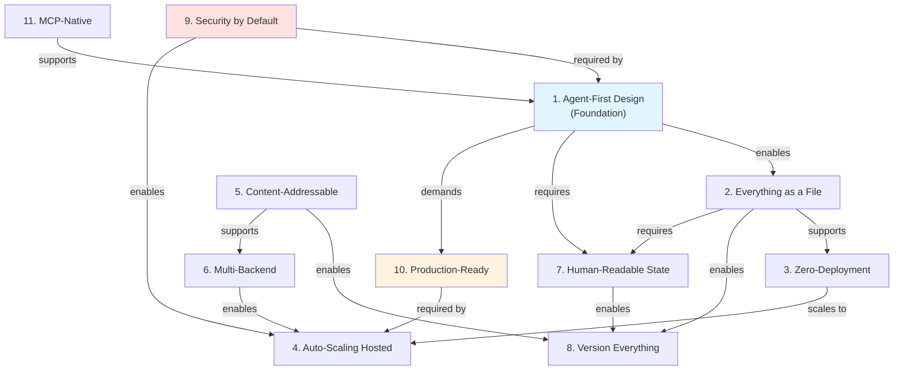

# Nexus Core Tenets

This document defines the foundational principles that guide all design decisions in Nexus. When evaluating features, resolving tradeoffs, or reviewing contributions, these tenets serve as our north star.

---

## Table of Contents

1. [Agent-First Design](#1-agent-first-design)
2. [Everything as a File](#2-everything-as-a-file)
3. [Zero-Deployment Option](#3-zero-deployment-option)
4. [Auto-Scaling Hosted Mode](#4-auto-scaling-hosted-mode)
5. [Content-Addressable by Default](#5-content-addressable-by-default)
6. [Multi-Backend Abstraction](#6-multi-backend-abstraction)
7. [Human-Readable State](#7-human-readable-state)
8. [Version Everything](#8-version-everything)
9. [Security by Default](#9-security-by-default)
10. [Production-Ready](#10-production-ready)
11. [MCP-Native](#11-mcp-native)
12. [How Tenets Connect](#how-tenets-connect)
13. [When to Break the Rules](#when-to-break-the-rules)
14. [Using These Tenets](#using-these-tenets)

---

## 1. Agent-First Design

**Principle:** Optimize for AI agent workflows, not just human developers.

**Why:** Nexus is infrastructure for AI agents. This is our foundational philosophy - every design decision should prioritize:
- Easy programmatic access (SDK-first, then CLI)
- Semantic operations (semantic search, LLM-powered reads)
- Agent workspace isolation and safety
- Memory management and consolidation
- Debugging and observability of agent behavior

**Examples:**
- ✅ `nx.semantic_search()` - AI-native operation
- ✅ `nx.llm_read()` with KV cache - Optimize for AI usage patterns
- ✅ Agent workspace versioning - Time-travel debugging for agents
- ✅ Operation logs - "What did my agent do 10 steps ago?"
- ✅ Multi-agent collaboration patterns built-in
- ⚠️ Human-only features (e.g., fancy TUI) - Lower priority than agent features
- ❌ Sacrificing programmatic APIs for CLI convenience

**Guiding Questions:**
- Does this make agents more effective?
- Can an agent use this programmatically?
- Does this help debug agent behavior?
- Would this work in a multi-agent environment?

---

## 2. Everything as a File

**Principle:** Configuration, memory, jobs, commands, and state are stored as files in the filesystem.

**Why:** Files are universal, version-controllable, human-readable, and tool-friendly. They enable:
- Zero-deployment extensibility (drop a markdown file → new command)
- Version control with external tools (Git, if desired)
- Inspection and editing with standard tools
- Natural integration with MCP and file-based tooling

**Examples:**
- ✅ Agent config: `/workspace/{agent}/.nexus/agent.yaml`
- ✅ Custom commands: `/workspace/{agent}/.nexus/commands/analyze.md`
- ✅ Agent memory: `/workspace/{agent}/.nexus/memory/knowledge.md`
- ✅ Jobs: `/workspace/{agent}/.nexus/jobs/daily-report.yaml`
- ❌ Database-only configuration (not human-readable, not version-controllable)
- ❌ Binary config formats (not editable with vim/vscode)

**Guiding Questions:**
- Can this be represented as a file that humans can read/edit?
- Can this be version-controlled (externally, if user chooses)?
- Does this work with standard file tools (grep, find, diff)?

---

## 3. Zero-Deployment Option

**Principle:** Nexus must work as a library with zero deployment.

**Why:** Developers should be able to:
- `pip install nexus-ai-fs` and start coding immediately
- Run locally for development without servers
- Embed Nexus in applications without infrastructure
- Prototype agents on their laptop

**Examples:**
- ✅ `nx = nexus.connect()` works immediately with local backend
- ✅ SQLite metadata store (no PostgreSQL required locally)
- ✅ In-memory caching (no Redis required locally)
- ✅ Local filesystem backend (no S3 required locally)
- ❌ Requiring PostgreSQL for basic operations
- ❌ Requiring Redis for caching in local mode
- ❌ Requiring network calls for local operations

**Guiding Questions:**
- Can this work with SQLite + local filesystem?
- Does this require external services to function?
- Can a developer use this on their laptop without Docker?

---

## 4. Auto-Scaling Hosted Mode

**Principle:** Hosted mode infrastructure scales automatically from startup to enterprise. Users don't choose architecture—Nexus scales under the hood.

**Why:** Users should focus on building agents, not managing infrastructure. Nexus handles:
- Automatic migration from monolithic to distributed
- Infrastructure decisions based on usage patterns
- Seamless scaling without user intervention
- Single API across all deployment scales

**Examples:**
- ✅ Monolithic server → distributed cluster (automatic transition)
- ✅ Same API for 1 user and 10,000 users
- ✅ Automatic sharding/replication as needed
- ❌ Forcing users to choose "standard" vs "enterprise" architecture
- ❌ Different APIs for different scales
- ❌ Manual infrastructure provisioning

**Guiding Questions:**
- Does this work at both small and large scales?
- Can infrastructure scale without API changes?
- Are we hiding complexity from users?

---

## 5. Content-Addressable by Default

**Principle:** All content is stored using Content-Addressable Storage (CAS) with automatic deduplication.

**Why:** Eliminates storage waste, enables efficient versioning, and provides integrity guarantees:
- 30-50% storage savings through deduplication
- Zero-cost snapshots (same content = same hash)
- Automatic integrity verification
- Efficient version tracking

**Examples:**
- ✅ CAS-backed file storage (SHA-256 content hashing)
- ✅ Version control with zero duplication
- ✅ Workspace snapshots (reuse existing blobs)
- ✅ Training dataset deduplication
- ❌ Storing duplicate content
- ❌ Copy-on-write without CAS (wastes space)

**Guiding Questions:**
- Is content deduplicated automatically?
- Can we reuse existing content blobs?
- Does versioning leverage CAS for efficiency?

---

## 6. Multi-Backend Abstraction

**Principle:** Abstract storage backends to support local, cloud, and specialized storage systems through a unified API.

**Why:** Users have diverse storage needs (local dev, S3 prod, GDrive collab). Nexus should:
- Provide a single API across all backends
- Allow mixing backends (hot/warm/cold tiers)
- Support pass-through backends (GDrive, SharePoint)
- Enable custom backends via plugins

**Examples:**
- ✅ LocalBackend, GCSBackend, S3Backend behind same interface
- ✅ Mount external storage as pass-through (no content storage)
- ✅ Tiered storage (hot = local, cold = S3 Glacier)
- ✅ Backend plugins for specialized storage
- ❌ Hardcoding S3-specific logic in core
- ❌ Different APIs for different backends

**Guiding Questions:**
- Does this work with all backends?
- Can we add new backends without changing core code?
- Is backend-specific logic isolated?

---

## 7. Human-Readable State

**Principle:** Agent-generated files should be human-readable (markdown, YAML, JSON), not binary blobs.

**Why:** Enables:
- Human inspection and understanding
- Manual editing when needed
- Meaningful diffs (with standard tools)
- Transparency in agent behavior
- Easy debugging

**Examples:**
- ✅ Agent memory in markdown with frontmatter
- ✅ Config in YAML
- ✅ Commands as markdown files
- ✅ Logs as JSON lines (JSONL)
- ⚠️ Binary formats only when necessary (embeddings, images)
- ❌ Pickle files for configuration
- ❌ Binary logs

**Guiding Questions:**
- Can a human read this file and understand it?
- Can we diff this meaningfully (with standard tools)?
- Can a human manually edit this if needed?

---

## 8. Version Everything

**Principle:** Files, configurations, memories, prompts, and workspaces are versioned by default.

**Why:** Enables:
- Time-travel debugging ("What state led to this bug?")
- Rollback of agent mistakes
- Audit trails
- Reproducibility
- Fearless experimentation

**Examples:**
- ✅ CAS-backed file versioning (automatic on every write)
- ✅ Workspace versioning (snapshot agent state)
- ✅ Prompt versioning with lineage tracking
- ✅ Memory versioning (track knowledge evolution)
- ✅ Operation logs (version control for operations)
- ❌ Destructive operations without undo
- ❌ Overwriting state without history

**Guiding Questions:**
- Can we undo this operation?
- Is history preserved?
- Can we time-travel to see past state?

---

## 9. Security by Default

**Principle:** Security features (encryption, ReBAC permissions, tenant isolation) are built-in, not bolted-on.

**Why:** AI agents handle sensitive data. Security must be:
- Multi-layered (API keys, RLS, type validation, ReBAC permissions)
- Enabled by default (secure by default)
- Hard to bypass accidentally
- Transparent to developers

**Examples:**
- ✅ Row-level security (RLS) for tenant isolation
- ✅ Permission enforcement enabled by default
- ✅ Type-level validation before database operations
- ✅ Pure ReBAC permission system (Zanzibar-style)
- ✅ Encrypted secrets storage
- ❌ Security as optional configuration
- ❌ Trusting client-side validation alone
- ❌ Single-layer security (easy to bypass)

**Guiding Questions:**
- Is this secure by default?
- Can we bypass security accidentally?
- Are multiple security layers in place?
- Is tenant data properly isolated?

---

## 10. Production-Ready

**Principle:** Nexus is designed for production use with built-in observability, reliability, and operational excellence.

**Why:** AI agents run in production environments handling real workloads. The system must be:
- Observable (metrics, logs, traces)
- Reliable (fault tolerance, graceful degradation)
- Debuggable (operation logs, state inspection)
- Scalable (from laptop to enterprise)
- Maintainable (clear errors, health checks)

**Examples:**
- ✅ Structured logging with context (tenant_id, agent_id, operation)
- ✅ Health check endpoints for monitoring
- ✅ Prometheus metrics for operations (read/write latency, cache hit rate)
- ✅ Operation audit logs (who did what when)
- ✅ Graceful degradation (cache failures don't break reads)
- ✅ Clear error messages with actionable guidance
- ⚠️ Debug-only features in development mode
- ❌ Swallowing errors silently
- ❌ No metrics/monitoring capabilities
- ❌ Unclear error messages ("Something went wrong")

**Guiding Questions:**
- Can we monitor this in production?
- What happens when this fails?
- Can we debug issues from logs alone?
- Does this degrade gracefully?

---

## 11. MCP-Native

**Principle:** Model Context Protocol (MCP) integration is first-class, not an afterthought.

**Why:** MCP is the standard for AI tool integration. Nexus should:
- Expose native MCP server
- Work seamlessly with Claude, Cursor, and other MCP clients
- Provide MCP-compatible file operations
- Enable agent tool discovery

**Examples:**
- ✅ Native MCP server implementation
- ✅ File operations exposed as MCP tools
- ✅ Semantic search via MCP
- ✅ Compatible with Claude Code, Cursor, etc.
- ❌ MCP as a wrapper around HTTP API
- ❌ Incompatible with MCP standards

**Guiding Questions:**
- Does this work with MCP clients?
- Can agents discover this via MCP?
- Is this compatible with MCP standards?

---

## How Tenets Connect

These tenets aren't isolated - they reinforce each other:

**Key Relationships:**

- **Agent-First** is the foundation that drives most other tenets
- **Security & Production-Ready** are non-negotiable at scale
- **Everything as a File** + **Human-Readable** enable transparency
- **CAS** + **Multi-Backend** enable efficient versioning
- **Zero-Deployment** → **Auto-Scaling** is the full lifecycle

---

## When to Break the Rules

These tenets guide us, but they're not absolute. Here are real examples where we intentionally broke or bent a tenet:

### Example 1: Binary Embeddings (Broke Human-Readable State)

**Tenet Broken:** #7 Human-Readable State

**Decision:** Store semantic search embeddings as binary numpy arrays, not JSON.

**Why We Broke It:**
- 100x smaller storage (768 floats as binary vs JSON)
- 10x faster loading (no parsing overhead)
- Critical for performance at scale

**Mitigation:**
- Embeddings are metadata, not primary content
- Primary content (files, memory) remains human-readable
- Provide tools to inspect embeddings if needed

**Lesson:** Performance matters for large-scale data. Human-readability is ideal, not mandatory.

---

### Example 2: PostgreSQL Requirement for Hosted Mode (Bent Zero-Deployment)

**Tenet Bent:** #3 Zero-Deployment Option

**Decision:** Hosted mode requires PostgreSQL, not SQLite.

**Why We Bent It:**
- SQLite doesn't scale to multi-tenant production
- Row-level security requires PostgreSQL features
- Concurrency at scale needs real ACID transactions

**Mitigation:**
- SQLite still works for local development (tenet preserved for dev)
- Clear docs on when to use SQLite vs PostgreSQL
- Migration path from SQLite → PostgreSQL

**Lesson:** "Zero-deployment for development" doesn't mean "SQLite in production."

---

### Example 3: Operation Logs in Database (Bent Everything as a File)

**Tenet Bent:** #2 Everything as a File

**Decision:** Store operation logs in PostgreSQL, not files.

**Why We Bent It:**
- Need structured queries ("show me all writes by agent X")
- Need efficient retention policies (auto-delete after 30 days)
- Need multi-tenant isolation at database level

**Mitigation:**
- Logs are exportable to JSONL files
- Provide file-based log viewer for debugging
- Not user-facing configuration (still follows "config as files")

**Lesson:** Operational data has different needs than user data.

---

### Example 4: In-Memory Cache (Bent Content-Addressable)

**Tenet Bent:** #5 Content-Addressable by Default

**Decision:** LRU cache stores content by hash, but not on disk.

**Why We Bent It:**
- Cache is ephemeral by design (not persistent)
- Writing cache to CAS would defeat the purpose (performance)
- Cache misses fall back to CAS anyway

**Mitigation:**
- Cache is transparent (users don't know it exists)
- All persistent storage uses CAS (tenet preserved)
- Cache failures degrade to CAS reads

**Lesson:** Performance optimizations can bypass tenets if transparent.

---

**When to Break a Tenet:**

✅ **Break if:**
- Performance impact is massive (10x+ difference)
- User experience is significantly better
- Mitigation preserves the spirit of the tenet
- Breaking is transparent to users

❌ **Don't break if:**
- It's just easier to implement
- It only saves a few lines of code
- No clear performance/UX benefit
- It violates user expectations

---

## Using These Tenets

### When Designing Features

Ask yourself:
1. Which tenets does this feature support?
2. Does it conflict with any tenets?
3. How can we align this with our principles?

### When Reviewing PRs

Check:
- Is this agent-first (can agents use it programmatically)?
- Does this maintain "Everything as a File"?
- Does this work in local mode (zero-deployment)?
- Is security maintained by default?
- Is state human-readable?
- Is this production-ready (observable, debuggable)?

### When Making Tradeoffs

Prioritize:
1. **Agent-First** over human convenience
2. **Security by Default** over ease of implementation
3. **Production-Ready** over rapid prototyping
4. **Zero-Deployment** over features requiring infrastructure
5. **Human-Readable** over binary efficiency (unless perf-critical)

**Note:** All tenets can be broken with proper justification (see "When to Break the Rules" above).

### Examples of Tenet-Driven Decisions

**Decision: SDK-first, CLI second**
- ✅ #1 Agent-First Design (programmatic access is primary)
- ✅ #11 MCP-Native (SDK works with MCP clients)
- ⚠️ CLI comes later (acceptable for agent-first philosophy)

**Decision: Store agent config in YAML files, not database**
- ✅ #2 Everything as a File
- ✅ #7 Human-Readable State
- ✅ #8 Version Everything (via Nexus CAS + optional external VCS)
- ✅ #3 Zero-Deployment (no database schema migrations)

**Decision: CAS-backed file storage**
- ✅ #5 Content-Addressable by Default
- ✅ #8 Version Everything (zero-cost snapshots)
- ✅ #6 Multi-Backend Abstraction (same CAS across all backends)
- ⚠️ Slightly more complex implementation (acceptable tradeoff)

**Decision: Permission enforcement enabled by default**
- ✅ #9 Security by Default
- ✅ #1 Agent-First (multi-agent safety)
- ⚠️ Slightly harder to debug locally (acceptable tradeoff)

**Decision: Support both local SQLite and hosted PostgreSQL**
- ✅ #3 Zero-Deployment Option (SQLite)
- ✅ #4 Auto-Scaling Hosted (PostgreSQL)
- ⚠️ More code to maintain (acceptable tradeoff)

**Decision: Built-in operation logs and metrics**
- ✅ #10 Production-Ready (observable by default)
- ✅ #1 Agent-First (debug agent behavior)
- ✅ #8 Version Everything (audit trail)

---

## Evolution of These Tenets

These tenets are **stable but not immutable**. They evolve based on:
- Real-world usage feedback
- New AI/agent paradigms
- Community input
- Technical breakthroughs

**Process for changing tenets:**
1. Propose change in GitHub Discussion
2. Explain why current tenet is limiting
3. Show evidence from user feedback or technical constraints
4. Discuss tradeoffs with community
5. Update document via PR with consensus

---

## Related Documents

- [README.md](../README.md) - High-level overview and features
- [Architecture](architecture/ARCHITECTURE.md) - System architecture
- [Plugin Development](development/PLUGIN_DEVELOPMENT.md) - Plugin development guide
- [Contributing](../CONTRIBUTING.md) - Contribution guidelines

---

## Questions?

If these tenets seem unclear or you're unsure how to apply them, please:
- Open a [GitHub Discussion](https://github.com/nexi-lab/nexus/discussions)
- Ask in our [Community Slack](https://nexus-community.slack.com)
- Reference this document in PRs when design decisions align with tenets

---

**Remember:** These tenets exist to guide us, not constrain us. When in doubt, ask: "Does this make Nexus better for AI agents?"
