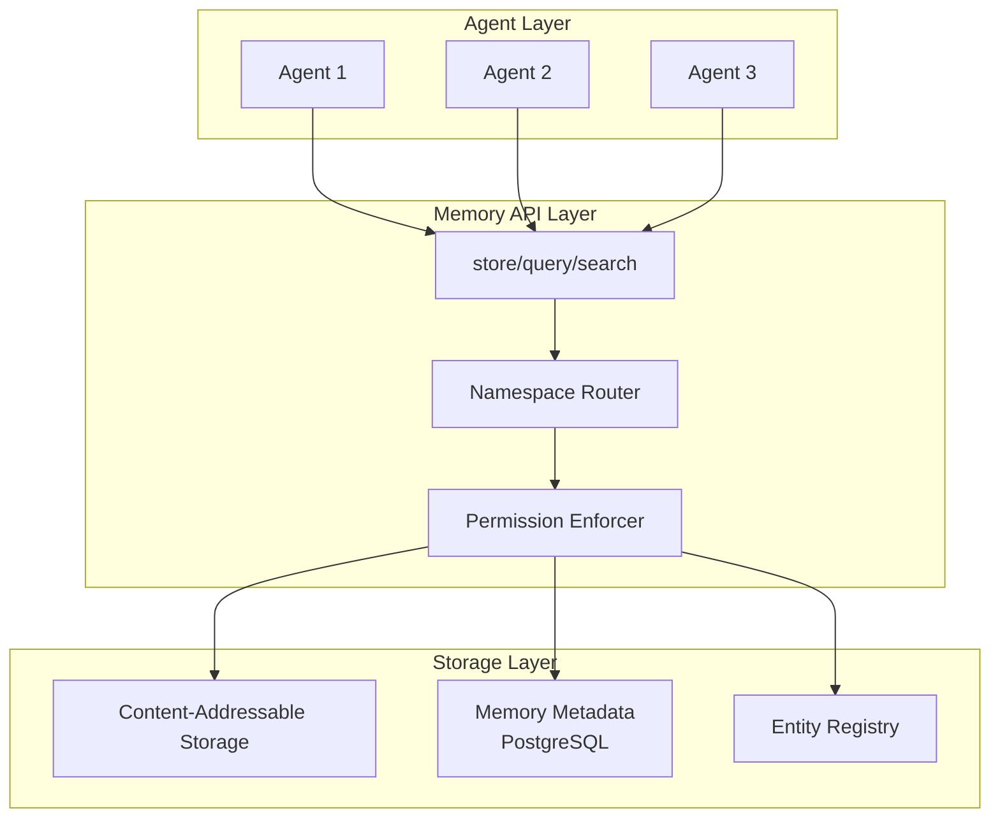
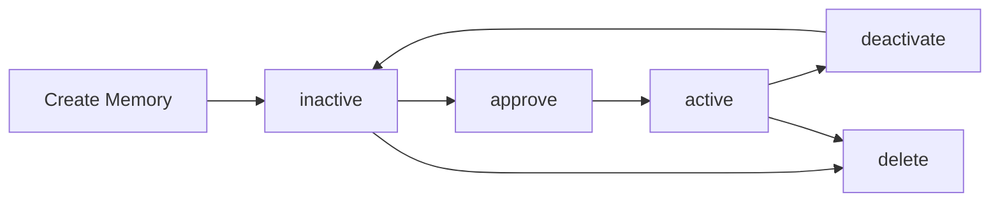
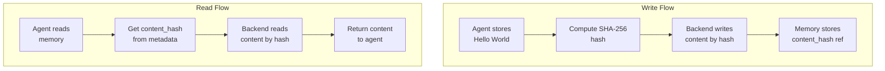

# Memory System

## What is Nexus Memory?

Nexus Memory is a **multi-layered identity-based memory system** designed specifically for AI agents. Unlike traditional key-value stores or databases, Nexus Memory provides:

- 🧠 **Persistent context** - Agents remember across sessions
- 👥 **Multi-agent sharing** - Scoped memory (agent, user, tenant, global)
- 🔒 **ReBAC permissions** - Fine-grained access control
- 📁 **Hierarchical organization** - Namespace-based like filesystems
- 🔍 **Semantic search** - Find memories by meaning, not just keywords
- ⏱️ **Session memory** - Temporary context with auto-cleanup
- 🎯 **Upsert semantics** - Update-or-insert for settings/preferences

---

## Architecture: Three Layers



### Layer 1: Agent Layer
Your agents (CrewAI, LangGraph, Claude SDK, OpenAI Agents) call simple memory APIs.

### Layer 2: Memory API Layer
- **Namespace Router**: Resolves hierarchical memory paths
- **Permission Enforcer**: Pure ReBAC access control
- **API Methods**: `store()`, `query()`, `search()`, `retrieve()`

### Layer 3: Storage Layer
- **Content-Addressable Storage (CAS)**: Deduplication by content hash
- **Metadata Store**: Memory relationships, scopes, namespaces
- **Entity Registry**: Identity hierarchy (tenant → user → agent)

---

## Core Concepts

### 1. Identity Triple: (tenant_id, user_id, agent_id)

Every memory has an **identity triple** that determines ownership and access:

```python
from nexus.remote import RemoteNexusFS

# Connect to server
nx = RemoteNexusFS(server_url="http://localhost:8080")

# Set identity context
nx.tenant_id = "acme"      # Organization
nx.user_id = "alice"       # Real user
nx.agent_id = "agent1"     # Agent that created it

# Identity automatically included in all operations
memory_id = nx.memory.store(content="User prefers Python")
```

**Key relationships:**
- `tenant_id`: Organization/workspace (e.g., "acme", "startup-xyz")
- `user_id`: Real user ownership (enables sharing across agent instances)
- `agent_id`: Which agent created the memory (for filtering/audit)

---

### 2. Memory Scopes: Who Can Access?

Scopes control sharing across organizational levels:

| Scope | Accessible By | Use Case | Example |
|-------|--------------|----------|---------|
| `agent` | Only creating agent | Agent-private memories | Agent's internal state |
| `user` | All agents owned by user | Shared across agent instances | User preferences |
| `tenant` | All users/agents in tenant | Organization-wide knowledge | Company policies |
| `global` | All tenants (if enabled) | System-wide facts | Public knowledge base |
| `session` | During session lifetime | Temporary context | Chat history |

**Real Usage Example:**

```python
from nexus.remote import RemoteNexusFS

# Connect and set identity
nx = RemoteNexusFS(server_url="http://localhost:8080")
nx.tenant_id = "acme"
nx.user_id = "alice"
nx.agent_id = "agent1"

# Store user-scoped memory (accessible by all agents of this user)
mem_id = nx.memory.store("Prefers dark mode", scope="user")

# Later: Any agent belonging to the same user can access it
result = nx.memory.get(mem_id)  # ✅ SUCCESS - inherits from user ownership

# But agents from different users cannot access it (permission denied)
```

**Understanding the Permission Model:**

The above works because:
- Agent1 (user="alice") stores with `scope="user"`
- Agent2 (user="alice") can read it - same user, inherits permission
- Agent3 (user="bob") cannot read it - different user, no permission

Identity is set once on the nx object, then automatically used in all memory operations.

---

### 3. Namespace-Based Organization

Organize memories hierarchically like filesystems:

```python
# Hierarchical structure
"knowledge/geography/facts"
"knowledge/history/events"
"user/preferences/ui"
"user/preferences/notifications"
```

**Two modes:**

#### Append Mode (default)
Creates new memory each time - useful for logs, events, facts.

```python
from nexus.remote import RemoteNexusFS

nx = RemoteNexusFS(server_url="http://localhost:8080")
nx.agent_id = "geography-agent"

# Creates 3 separate memories
nx.memory.store("Paris is capital of France", namespace="knowledge/geography/facts")
nx.memory.store("London is capital of UK", namespace="knowledge/geography/facts")
nx.memory.store("Berlin is capital of Germany", namespace="knowledge/geography/facts")
```

#### Upsert Mode (namespace + path_key)
Updates if exists, creates if new - perfect for settings, preferences.

```python
from nexus.remote import RemoteNexusFS

nx = RemoteNexusFS(server_url="http://localhost:8080")
nx.user_id = "alice"
nx.agent_id = "settings-agent"

# First call: creates memory
nx.memory.store(
    content={"theme": "dark", "font_size": 14},
    namespace="user/preferences/ui",
    path_key="settings"  # Unique key within namespace
)

# Second call with SAME path_key: updates existing memory
nx.memory.store(
    content={"theme": "light", "font_size": 16},
    namespace="user/preferences/ui",
    path_key="settings"  # UPDATES previous memory
)
```

---

### 4. Memory Types

Categorize memories by purpose:

| Type | Description | Example |
|------|-------------|---------|
| `fact` | Factual information | "Paris is capital of France" |
| `preference` | User/agent preferences | "User prefers Python over JS" |
| `experience` | Events, conversations, actions | "User asked about authentication" |
| `strategy` | Successful patterns | "Using Redis improved performance" |
| `anti_pattern` | Harmful patterns to avoid | "Don't hardcode API keys" |
| `observation` | Neutral observations | "Deployment took 2 hours" |
| `reflection` | Learned insights | "Breaking tasks into steps works better" |
| `consolidated` | Merged memories | Consolidation of 10 facts |

---

### 5. Memory State Management (Manual Approval)

**Issue #368**: Memories now support state-based lifecycle management for quality control and manual curation.

#### States

| State | Description | Use Case |
|-------|-------------|----------|
| `inactive` | Newly created, pending review | Manual approval workflow, quality control |
| `active` | Approved and available for retrieval | Production memories used by agents |

#### Default Behavior

- **New memories** default to `inactive` state (pending review)
- **Query/List operations** default to `active` state only (safe by default)
- **Explicit state filtering** available via `state` parameter

#### State Lifecycle



#### API Operations

```python
from nexus.remote import RemoteNexusFS

nx = RemoteNexusFS(server_url="http://localhost:8080")
nx.user_id = "alice"
nx.agent_id = "my-agent"

# Create memory (defaults to inactive)
memory_id = nx.memory.store("User prefers Python")

# List inactive memories (pending review)
pending = nx.memory.list(state='inactive')

# Approve a memory
nx.memory.approve(memory_id)

# Deactivate a memory (temporary disable)
nx.memory.deactivate(memory_id)

# Bulk operations
nx.memory.approve_batch([mem_id1, mem_id2, mem_id3])
nx.memory.deactivate_batch([mem_id4, mem_id5])
nx.memory.delete_batch([mem_id6, mem_id7])
```

#### State Filtering

```python
# List only active memories (default)
active_mems = nx.memory.list(state='active')

# List only inactive memories (pending review)
pending_mems = nx.memory.list(state='inactive')

# List all memories regardless of state
all_mems = nx.memory.list(state='all')

# Query with state filter
active_prefs = nx.memory.query(
    memory_type='preference',
    state='active'  # Defaults to 'active' if not specified
)
```

#### Use Cases

1. **Quality Control**: Review agent-generated memories before they affect behavior
2. **Memory Hygiene**: Temporarily disable outdated memories without deletion
3. **Privacy Protection**: Review and control what information becomes active
4. **Debugging**: Disable specific memories to test agent behavior
5. **Curation**: Maintain a clean, high-quality memory store

#### CLI Commands

```bash
# List inactive memories for review
nexus memory list --state inactive

# Approve a memory
nexus memory approve mem_123

# Deactivate a memory
nexus memory deactivate mem_123

# Bulk approve
nexus memory approve-batch mem_1 mem_2 mem_3

# Bulk deactivate
nexus memory deactivate-batch mem_4 mem_5

# Bulk delete
nexus memory delete-batch mem_6 mem_7
```

#### Permission Requirements

All state management operations require **WRITE** permission on the memory:
- User must own the memory, or
- Have explicit ReBAC permission, or
- Be an admin

---

### 6. Content-Addressable Storage (CAS)

Memory content is stored by **SHA-256 hash**, not in the database directly.



**Benefits:**
- ✅ **Deduplication**: Same content stored once
- ✅ **Immutability**: Content never changes (hash = identity)
- ✅ **Versioning**: Update = new hash + new memory record

---

## Memory API Methods

### Getting Started

**Server Mode (Recommended for Production):**

```bash
# 1. Start Nexus server first
nexus serve --host 0.0.0.0 --port 8080
```

```python
from nexus.remote import RemoteNexusFS

# Connect to server
nx = RemoteNexusFS(
    server_url="http://localhost:8080",
    api_key="your-api-key"  # Optional
)

# Set identity context (who is using the memory)
nx.tenant_id = "acme"      # Organization
nx.user_id = "alice"       # User
nx.agent_id = "agent1"     # Agent instance

# Now use memory API - identity is automatically included
memory_id = nx.memory.store("User prefers Python", scope="user")
```

**Using environment variables:**

```bash
# Set environment
export NEXUS_SERVER_URL=http://localhost:8080
export NEXUS_API_KEY=your-api-key
export NEXUS_TENANT_ID=acme
export NEXUS_AGENT_ID=agent1
```

```python
import os
from nexus.remote import RemoteNexusFS

# Load from environment
nx = RemoteNexusFS(
    server_url=os.getenv("NEXUS_SERVER_URL"),
    api_key=os.getenv("NEXUS_API_KEY")
)
nx.tenant_id = os.getenv("NEXUS_TENANT_ID", "default")
nx.agent_id = os.getenv("NEXUS_AGENT_ID", "my-agent")

# Use memory
memory_id = nx.memory.store("User prefers Python", scope="user")
```

**Embedded Mode (Development/Testing Only):**

```python
from nexus import NexusFS
from nexus.backends.local import LocalBackend

# No server needed - uses local SQLite database
backend = LocalBackend(root_path="./nexus-data")
nx = NexusFS(
    backend=backend,
    tenant_id="acme",
    user_id="alice",
    agent_id="agent1"
)

# Memory API works the same way
memory_id = nx.memory.store("User prefers Python", scope="user")
```

**Advanced: Direct Memory API (for library developers):**

```python
# Only use this if building custom integrations
from nexus.core.memory_api import Memory

memory = Memory(
    session=db_session,          # SQLAlchemy session
    backend=local_backend,       # Content storage backend
    tenant_id="acme",            # Organization context
    user_id="alice",             # Real user
    agent_id="agent1",           # Creating agent
    entity_registry=registry,    # Identity relationships
    llm_provider=llm             # Optional for reflection
)
```

---

### 1. store() - Store a Memory

```python
memory_id = nx.memory.store(
    content: str | bytes | dict[str, Any],  # Content to store
    scope: str = "user",                    # 'agent', 'user', 'tenant', 'global', 'session'
    memory_type: str | None = None,         # 'fact', 'preference', 'experience', etc.
    importance: float | None = None,        # 0.0-1.0 importance score
    namespace: str | None = None,           # "knowledge/geography/facts"
    path_key: str | None = None,            # For upsert mode
    context: OperationContext | None = None # Override identity
) -> str
```

**Examples:**

```python
from nexus.remote import RemoteNexusFS

nx = RemoteNexusFS(server_url="http://localhost:8080")
nx.user_id = "alice"
nx.agent_id = "my-agent"

# Simple fact (append mode)
memory_id = nx.memory.store(
    content="User prefers Python over JavaScript",
    scope="user",
    memory_type="fact",
    importance=0.9
)

# Structured data (dict auto-serialized to JSON)
memory_id = nx.memory.store(
    content={"language": "Python", "framework": "FastAPI"},
    namespace="user/preferences/coding"
)

# Upsert mode (updates if exists)
memory_id = nx.memory.store(
    content={"theme": "dark", "font_size": 14},
    namespace="user/preferences/ui",
    path_key="settings"  # Enables update-or-insert
)
```

---

### 2. query() - Query Memories by Filters

```python
memories = nx.memory.query(
    user_id: str | None = None,         # Filter by user
    agent_id: str | None = None,        # Filter by agent
    tenant_id: str | None = None,       # Filter by tenant
    scope: str | None = None,           # Filter by scope
    memory_type: str | None = None,     # Filter by type
    state: str | None = "active",       # Filter by state (inactive/active/all)
    limit: int | None = None,           # Max results
    context: OperationContext | None = None
) -> list[dict[str, Any]]
```

**Returns:**
```python
[
    {
        "memory_id": "mem_123",
        "content": "User prefers Python over JavaScript",
        "content_hash": "abc123...",
        "tenant_id": "acme",
        "user_id": "alice",
        "agent_id": "agent1",
        "scope": "user",
        "visibility": "private",
        "memory_type": "fact",
        "importance": 0.9,
        "state": "active",  # Memory state (inactive/active)
        "namespace": "user/preferences/coding",
        "path_key": None,
        "created_at": "2025-01-15T10:00:00Z",
        "updated_at": "2025-01-15T10:00:00Z"
    }
]
```

**Examples:**

```python
# Get all user-scoped memories
memories = nx.memory.query(scope="user")

# Get all facts created by agent1
memories = nx.memory.query(agent_id="agent1", memory_type="fact")

# Get recent preferences (limit 10)
memories = nx.memory.query(memory_type="preference", limit=10)
```

---

### 3. search() - Semantic Search

```python
results = nx.memory.search(
    query: str,                     # Search query text
    scope: str | None = None,       # Filter by scope
    memory_type: str | None = None, # Filter by type
    limit: int = 10                 # Max results
) -> list[dict[str, Any]]
```

**Returns:** List of memories with `score` field (0.0-1.0 relevance)

**Examples:**

```python
# Find Python-related preferences
results = nx.memory.search("Python programming preferences", limit=5)

for mem in results:
    print(f"Score: {mem['score']:.2f}")
    print(f"Type: {mem['memory_type']}")
    print(f"Content: {mem['content']}")
    print()
```

---

### 4. get() - Get Memory by ID

```python
mem = nx.memory.get(memory_id: str) -> dict[str, Any] | None
```

**Examples:**

```python
mem = nx.memory.get("mem_123")
if mem:
    print(f"Content: {mem['content']}")
    print(f"Scope: {mem['scope']}")
    print(f"Created: {mem['created_at']}")
```

---

### 5. retrieve() - Get by Namespace + Path Key

```python
mem = nx.memory.retrieve(
    namespace: str | None = None,
    path_key: str | None = None,
    path: str | None = None  # Alternative: "namespace/path_key"
) -> dict[str, Any] | None
```

**Examples:**

```python
# By namespace + path_key
mem = nx.memory.retrieve(
    namespace="user/preferences/ui",
    path_key="settings"
)

# By combined path (sugar syntax)
mem = nx.memory.retrieve(path="user/preferences/ui/settings")

if mem:
    print(mem['content'])  # {"theme": "dark", "font_size": 14}
```

---

### 6. list() - List Memories with Filtering

```python
memories = nx.memory.list(
    scope: str | None = None,
    memory_type: str | None = None,
    namespace: str | None = None,        # Exact match
    namespace_prefix: str | None = None, # Hierarchical prefix match
    state: str | None = "active",        # Filter by state (inactive/active/all)
    limit: int | None = 100,
    context: OperationContext | None = None
) -> list[dict[str, Any]]
```

**Examples:**

```python
# List all user preferences (active only by default)
prefs = nx.memory.list(
    scope="user",
    memory_type="preference"
)

# List memories in specific namespace
ui_prefs = nx.memory.list(namespace="user/preferences/ui")

# List all geography knowledge (hierarchical)
geo = nx.memory.list(namespace_prefix="knowledge/geography/")

# List all facts across all domains
facts = nx.memory.list(namespace_prefix="*/facts")

# List inactive memories (pending review)
pending = nx.memory.list(state="inactive")

# List all memories regardless of state
all_memories = nx.memory.list(state="all")
```

---

### 7. delete() - Delete a Memory

```python
deleted = nx.memory.delete(memory_id: str) -> bool
```

**Examples:**

```python
success = nx.memory.delete("mem_123")
if success:
    print("Memory deleted")
```

---

### 8. approve() - Approve a Memory (Issue #368)

Activate a memory to make it available for queries and retrieval.

```python
approved = nx.memory.approve(memory_id: str) -> bool
```

**Examples:**

```python
# Approve a pending memory
success = nx.memory.approve("mem_123")
if success:
    print("Memory approved and now active")
```

---

### 9. deactivate() - Deactivate a Memory (Issue #368)

Temporarily disable a memory without deleting it.

```python
deactivated = nx.memory.deactivate(memory_id: str) -> bool
```

**Examples:**

```python
# Deactivate an outdated memory
success = nx.memory.deactivate("mem_123")
if success:
    print("Memory deactivated")
```

---

### 10. Batch Operations (Issue #368)

Efficiently manage multiple memories at once.

```python
# Approve multiple memories
result = nx.memory.approve_batch(memory_ids: list[str]) -> dict[str, Any]

# Deactivate multiple memories
result = nx.memory.deactivate_batch(memory_ids: list[str]) -> dict[str, Any]

# Delete multiple memories
result = nx.memory.delete_batch(memory_ids: list[str]) -> dict[str, Any]
```

**Returns:**

```python
{
    "approved": 3,              # Number of successfully approved
    "failed": 1,                # Number that failed
    "approved_ids": [...],      # List of successful IDs
    "failed_ids": [...]         # List of failed IDs
}
```

**Examples:**

```python
# Review and approve multiple memories
pending = nx.memory.list(state='inactive')
pending_ids = [m['memory_id'] for m in pending]

result = nx.memory.approve_batch(pending_ids)
print(f"Approved {result['approved']} memories")
print(f"Failed {result['failed']} memories")

# Bulk deactivate outdated memories
old_ids = ["mem_1", "mem_2", "mem_3"]
result = nx.memory.deactivate_batch(old_ids)

# Bulk delete
unwanted_ids = ["mem_4", "mem_5"]
result = nx.memory.delete_batch(unwanted_ids)
```

---

## Use Cases and Patterns

### Pattern 1: Persistent Agent Preferences

```python
from nexus.remote import RemoteNexusFS

# Connect to server
nx = RemoteNexusFS(server_url="http://localhost:8080")
nx.user_id = "alice"
nx.agent_id = "chatbot1"

# Store user preferences (upsert mode)
nx.memory.store(
    content={
        "language": "Python",
        "framework": "FastAPI",
        "theme": "dark"
    },
    namespace="user/preferences/coding",
    path_key="settings",  # Updates if already exists
    scope="user",         # Shared across all user's agents
    memory_type="preference",
    importance=0.9
)

# Later session - retrieve preferences
prefs = nx.memory.retrieve(
    namespace="user/preferences/coding",
    path_key="settings"
)

print(prefs['content'])  # {"language": "Python", ...}
```

---

### Pattern 2: Multi-Agent Knowledge Sharing

```python
from nexus.remote import RemoteNexusFS

# Connect as research agent - stores organizational knowledge
nx = RemoteNexusFS(server_url="http://localhost:8080")
nx.tenant_id = "acme"
nx.user_id = "alice"
nx.agent_id = "research_agent"

# Store fact with tenant scope (accessible by all users/agents in org)
nx.memory.store(
    content="FastAPI uses Pydantic for validation",
    namespace="knowledge/python/frameworks",
    scope="tenant",  # Share across entire organization
    memory_type="fact",
    importance=0.8
)

# Connect as code assistant (different user, same tenant)
nx2 = RemoteNexusFS(server_url="http://localhost:8080")
nx2.tenant_id = "acme"
nx2.user_id = "bob"
nx2.agent_id = "code_assistant"

# Can access tenant-scoped memories from research agent
facts = nx2.memory.list(
    scope="tenant",
    namespace_prefix="knowledge/python/"
)

for fact in facts:
    print(fact['content'])  # "FastAPI uses Pydantic for validation"
```

---

### Pattern 3: Agent-Scoped Learning

```python
from nexus.remote import RemoteNexusFS

nx = RemoteNexusFS(server_url="http://localhost:8080")
nx.agent_id = "learning-agent"

# Store agent-private learning (only this agent can access)
nx.memory.store(
    content={"strategy": "Use caching for repeated queries", "success_rate": 0.95},
    scope="agent",  # Only this agent
    memory_type="strategy",
    namespace="agent/learning/strategies"
)

# Store what NOT to do
nx.memory.store(
    content={"mistake": "Forgot to validate input", "impact": "High"},
    scope="agent",
    memory_type="anti_pattern",
    namespace="agent/learning/anti_patterns"
)

# Retrieve agent's learned strategies
strategies = nx.memory.list(scope="agent", namespace_prefix="agent/learning/")
```

**Note**: Session-scoped memory (`scope="session"`) is planned but not yet fully implemented in the Memory API. Currently, you can use `agent`, `user`, `tenant`, or `global` scopes.

---

### Pattern 4: Learning from Experience

```python
from nexus import connect

nx = connect()

# Store successful strategy
nx.memory.store(
    content={
        "task": "Deploy microservice",
        "approach": "Used Docker + Kubernetes",
        "outcome": "Deployed in 30 minutes",
        "metrics": {"uptime": "99.9%", "latency_ms": 45}
    },
    namespace="agent/learning/strategies",
    scope="agent",
    memory_type="strategy",
    importance=0.95
)

# Store anti-pattern (what NOT to do)
nx.memory.store(
    content={
        "task": "Database migration",
        "mistake": "Ran migration without backup",
        "consequence": "Lost 1 hour rolling back"
    },
    namespace="agent/learning/anti_patterns",
    scope="agent",
    memory_type="anti_pattern",
    importance=0.9
)

# Later: retrieve strategies for similar task
strategies = nx.memory.list(
    namespace_prefix="agent/learning/strategies",
    memory_type="strategy"
)

# Filter by importance
high_value = [s for s in strategies if s['importance'] > 0.8]
```

---

### Pattern 5: Hierarchical Knowledge Organization

```python
from nexus import connect

nx = connect()

# Store geography facts in organized namespaces
nx.memory.store(
    "Paris is capital of France",
    namespace="knowledge/geography/capitals/europe"
)
nx.memory.store(
    "Tokyo is capital of Japan",
    namespace="knowledge/geography/capitals/asia"
)
nx.memory.store(
    "Nile is longest river in world",
    namespace="knowledge/geography/rivers"
)

# Query all European capitals
europe = nx.memory.list(namespace="knowledge/geography/capitals/europe")

# Query all geography knowledge
all_geo = nx.memory.list(namespace_prefix="knowledge/geography/")

# Query all capitals (across all continents)
capitals = nx.memory.list(namespace_prefix="knowledge/geography/capitals/")
```

---

### Pattern 6: Manual Memory Approval Workflow (Issue #368)

```python
from nexus.remote import RemoteNexusFS

# Setup
nx = RemoteNexusFS(server_url="http://localhost:8080")
nx.user_id = "alice"
nx.agent_id = "content_agent"

# Step 1: Agent creates memories (defaults to inactive)
for fact in ["Paris is in France", "Tokyo is in Japan", "London is in UK"]:
    nx.memory.store(
        content=fact,
        namespace="knowledge/geography/capitals",
        memory_type="fact"
    )

# Step 2: User reviews pending memories
pending = nx.memory.list(state='inactive')
print(f"Found {len(pending)} memories pending review")

for mem in pending:
    print(f"Review: {mem['content']}")
    # User decides to approve or reject
    if user_approves(mem['content']):
        nx.memory.approve(mem['memory_id'])
    else:
        nx.memory.delete(mem['memory_id'])

# Step 3: Agent only sees approved memories
active_facts = nx.memory.list(
    namespace_prefix="knowledge/geography/",
    state='active'  # Defaults to active
)

# Step 4: Later, deactivate outdated info without deleting
outdated = nx.memory.query(memory_type='fact', state='active')
for mem in outdated:
    if is_outdated(mem['content']):
        nx.memory.deactivate(mem['memory_id'])
```

**Benefits:**
- ✅ Quality control before memories affect agent behavior
- ✅ Privacy protection - review sensitive information
- ✅ Memory hygiene - disable without losing data
- ✅ Debugging - isolate problematic memories

---

## Permission Rules (ReBAC)

Memory access is controlled by **pure ReBAC** (Relationship-Based Access Control):

### Access Granted When:

1. **Admin/System Bypass**: Context has `is_admin=True`
2. **Direct Creator**: `context.user == memory.agent_id`
3. **User Ownership Inheritance**:
   - Memory scope is `user`, `tenant`, or `global`
   - Agent is owned by same user as memory (`agent.parent_id == memory.user_id`)
4. **Tenant-Scoped Sharing**:
   - Memory scope is `tenant`
   - Agent belongs to same tenant
5. **Explicit ReBAC Relations**: If `rebac_manager` grants access

### Examples:

```python
from nexus import connect

# Agent1 (alice) stores user-scoped memory
nx1 = connect(config={"user_id": "alice", "agent_id": "agent1"})
mem_id = nx1.memory.store("Data", scope="user")

# Agent2 (alice, different agent_id) - ✅ ALLOWED
nx2 = connect(config={"user_id": "alice", "agent_id": "agent2"})
mem = nx2.memory.get(mem_id)  # SUCCESS - inherits from user ownership

# Agent3 (bob, different user) - ❌ DENIED
nx3 = connect(config={"user_id": "bob", "agent_id": "agent3"})
mem = nx3.memory.get(mem_id)  # None - no permission

# Admin override - ✅ ALLOWED
from nexus.core.permissions import OperationContext
admin_ctx = OperationContext(user="admin", groups=[], is_admin=True)
mem = nx1.memory.get(mem_id, context=admin_ctx)  # SUCCESS - admin bypass
```

---

## Integration Examples

### CrewAI Integration

```python
from crewai import Agent, Task, Crew
from nexus import connect

nx = connect()

def store_memory(content: str, memory_type: str = "fact") -> str:
    """CrewAI tool: Store memory"""
    nx.memory.store(
        content=content,
        scope="agent",
        memory_type=memory_type
    )
    return f"✓ Stored {memory_type}"

def recall_memory(query: str, limit: int = 5) -> str:
    """CrewAI tool: Recall memories"""
    results = nx.memory.search(query, limit=limit)
    if not results:
        return "No memories found"

    output = []
    for mem in results:
        output.append(f"[{mem['memory_type']}] {mem['content']}")
    return "\n".join(output)

# Create agent with memory tools
researcher = Agent(
    role="Research Agent",
    goal="Remember important facts",
    tools=[store_memory, recall_memory]
)
```

---

### LangGraph Integration

```python
from langgraph.prebuilt import create_react_agent
from nexus import connect

nx = connect()

def store_fact(fact: str, importance: float = 0.7) -> str:
    """Store a fact in memory"""
    nx.memory.store(
        content=fact,
        scope="agent",
        memory_type="fact",
        importance=importance
    )
    return f"✓ Stored fact (importance: {importance})"

def search_memory(query: str) -> str:
    """Search stored memories"""
    results = nx.memory.search(query, limit=5)
    if not results:
        return "No relevant memories"

    return "\n".join([
        f"{i+1}. [{r['memory_type']}] {r['content']}"
        for i, r in enumerate(results)
    ])

# Create ReAct agent with memory tools
agent = create_react_agent(
    model,
    tools=[store_fact, search_memory]
)

# Run with memory
result = agent.invoke({
    "messages": [("user", "Remember: I prefer Python")]
})
```

---

### Claude SDK Integration

```python
from claude_agent_sdk import Agent, query
from nexus import connect

nx = connect()

async def store_preference(pref: str) -> str:
    """Store user preference"""
    nx.memory.store(
        content=pref,
        scope="user",
        memory_type="preference",
        importance=0.9
    )
    return "✓ Preference saved"

async def get_preferences() -> str:
    """Retrieve all preferences"""
    prefs = nx.memory.query(
        scope="user",
        memory_type="preference"
    )
    return "\n".join([p['content'] for p in prefs])

# Create Claude agent with memory
agent = Agent(
    name="MemoryAgent",
    tools=[store_preference, get_preferences]
)

result = await query(
    agent,
    "Remember that I prefer dark mode"
)
```

---

### OpenAI Agents Integration

```python
from agents import Agent, function_tool
from nexus import connect

nx = connect()

@function_tool
async def remember(fact: str) -> str:
    """Store information in persistent memory"""
    nx.memory.store(
        content=fact,
        scope="agent",
        memory_type="fact"
    )
    return f"✓ Remembered: {fact}"

@function_tool
async def recall(query: str) -> str:
    """Recall stored information"""
    results = nx.memory.search(query, limit=3)
    if not results:
        return "No memories found"

    return "\n".join([r['content'] for r in results])

# Create OpenAI agent with memory
agent = Agent(
    name="MemoryAgent",
    instructions="Use memory to remember important info",
    tools=[remember, recall],
    model="gpt-4o"
)
```

---

## Advanced: Learning Loops

Nexus Memory supports agent learning through **trajectory tracking** and **reflection**.

### Track Agent Trajectories

```python
from nexus import connect

nx = connect()

# Start tracking a task
traj_id = nx.memory.start_trajectory(
    task_description="Deploy caching strategy",
    task_type="optimization"
)

# Log steps during execution
nx.memory.log_step(traj_id, "action", "Analyzed cache hit rate: 45%")
nx.memory.log_step(traj_id, "decision", "Decided to implement Redis")
nx.memory.log_step(traj_id, "observation", "Deployment took 2 hours")

# Complete with outcome
nx.memory.complete_trajectory(
    trajectory_id=traj_id,
    status="success",
    success_score=0.95,
    metrics={"improvement": "30%", "duration_hours": 2}
)
```

### Reflect on Experience

```python
# Reflect on single trajectory
reflection = nx.memory.reflect(traj_id)
# Returns: {
#     "helpful_strategies": ["Using Redis for caching"],
#     "harmful_patterns": [],
#     "memory_id": "reflection_123"
# }

# Batch reflection across multiple trajectories
patterns = nx.memory.batch_reflect(
    agent_id="agent1",
    since="2025-10-01T00:00:00Z",
    min_trajectories=10
)
# Returns: {
#     "trajectories_analyzed": 50,
#     "common_patterns": [...],
#     "common_failures": [...],
#     "reflection_ids": [...]
# }
```

### Build Playbooks

```python
# Get agent's learned playbook
playbook = nx.memory.get_playbook("default")

# Update with new strategies
nx.memory.update_playbook([
    {
        'category': 'helpful',
        'pattern': 'Always validate input before processing',
        'context': 'Data processing tasks',
        'confidence': 0.9
    }
])

# Auto-curate from reflections
result = nx.memory.curate_playbook(
    reflections=["mem_123", "mem_456"],
    playbook_name="default"
)
```

---

## Best Practices

### 1. Choose the Right Scope

- **`agent`**: Agent-private state (internal reasoning, draft work)
- **`user`**: Shared across user's agent instances (preferences, user facts)
- **`tenant`**: Organization-wide (company policies, shared knowledge)
- **`global`**: System-wide (public knowledge base)
- **`session`**: Temporary context (chat history, form state)

### 2. Use Namespaces for Organization

```python
# Good: Hierarchical organization
"user/preferences/ui/theme"
"knowledge/python/frameworks/fastapi"
"agent/learning/strategies/deployment"

# Bad: Flat structure
"theme"
"fastapi_fact"
"deployment_strategy"
```

### 3. Use Upsert for Settings

```python
from nexus import connect

nx = connect()

# Settings/preferences: Use path_key
nx.memory.store(
    content={"theme": "dark"},
    namespace="user/preferences/ui",
    path_key="theme"  # Enables update
)

# Events/logs: Don't use path_key
nx.memory.store(
    content="User logged in",
    namespace="logs/user_activity"
    # No path_key = append mode
)
```

### 4. Set Importance Scores

```python
from nexus import connect

nx = connect()

# Critical facts
nx.memory.store(content="API key: ...", importance=1.0)

# Normal facts
nx.memory.store(content="User prefers Python", importance=0.7)

# Low-value observations
nx.memory.store(content="Page loaded", importance=0.2)
```

### 5. Clean Up Session Memory

```python
from nexus.core.sessions import cleanup_expired_sessions

# Run periodically (e.g., cron job)
result = cleanup_expired_sessions(db)
print(f"Deleted {result['sessions']} sessions")
print(f"Freed {result['resources']['memories']} memories")
```

---

## Performance Considerations

### Batch Operations

```python
# Good: Batch read content
content_hashes = [m['content_hash'] for m in memories]
contents = backend.batch_read_content(content_hashes)

# Bad: Individual reads
for mem in memories:
    content = backend.read_content(mem['content_hash'])  # N queries!
```

### Limit Results

```python
from nexus import connect

nx = connect()

# Good: Limit queries
memories = nx.memory.query(scope="user", limit=10)

# Bad: Fetch all (can be thousands)
memories = nx.memory.query(scope="user")  # Default limit: 100
```

### Use Namespace Prefixes

```python
# Good: Hierarchical prefix
prefs = nx.memory.list(namespace_prefix="user/preferences/")

# Bad: Fetch all then filter
all_mems = nx.memory.list()
prefs = [m for m in all_mems if m['namespace'].startswith("user/preferences/")]
```

---

## FAQ

### Q: How is memory different from files?

**A**: Memory is **metadata-rich** with identity, scopes, types, and importance. Files are raw bytes. Both use Content-Addressable Storage (CAS) for deduplication.

### Q: Can I query PostgreSQL data as memory?

**A**: Not directly. Memory is stored in `memory` table. For PostgreSQL data as files, use Virtual Views feature (see [Mounts & Backends](mounts-and-backends.md)).

### Q: What happens when session expires?

**A**: All session-scoped memories are auto-deleted. Use `cleanup_expired_sessions(db)` to free storage.

### Q: How do I share memory across frameworks?

**A**: Use `user` or `tenant` scope. All frameworks (CrewAI, LangGraph, Claude SDK) using same `user_id` can access shared memories.

### Q: Is semantic search using vectors?

**A**: Currently uses text matching. Vector search integration is planned for future release.

---

## Next Steps

- **[Agent Permissions](agent-permissions.md)** - How agents collaborate with ReBAC
- **[Learning Loops](learning-loops.md)** - Agent self-improvement patterns
- **[Content-Addressable Storage](content-addressable-storage.md)** - How CAS works
- **[API Reference: Memory API](/api/memory-api/)** - Complete API docs

---

## Related Files

- Core: `src/nexus/core/memory_api.py:1`
- Router: `src/nexus/core/memory_router.py:1`
- Permissions: `src/nexus/core/memory_permission_enforcer.py:1`
- Models: `src/nexus/storage/models.py:841`
- Tests: `tests/unit/core/test_memory_api.py:1`
- Examples: `examples/claude_agent_sdk/memory_agent_demo.py:1`
