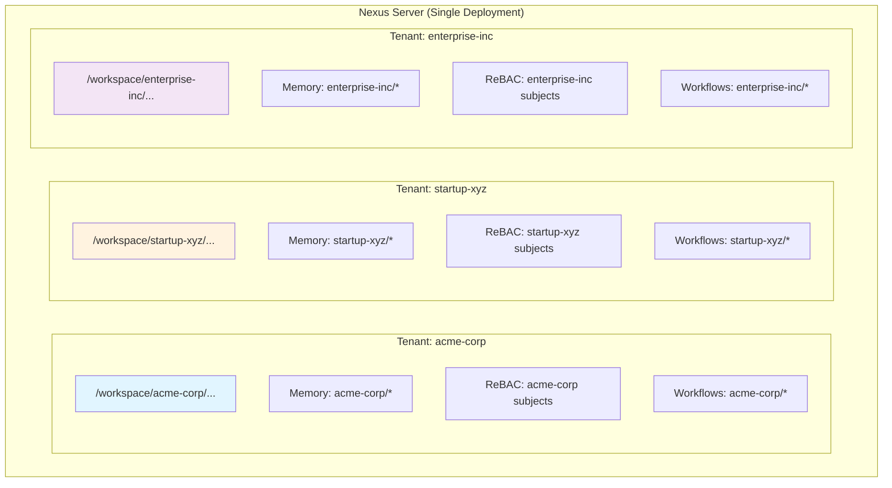
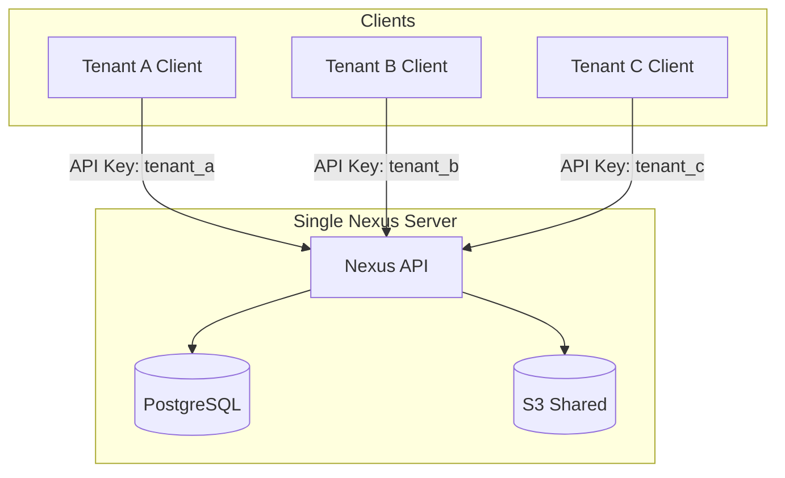
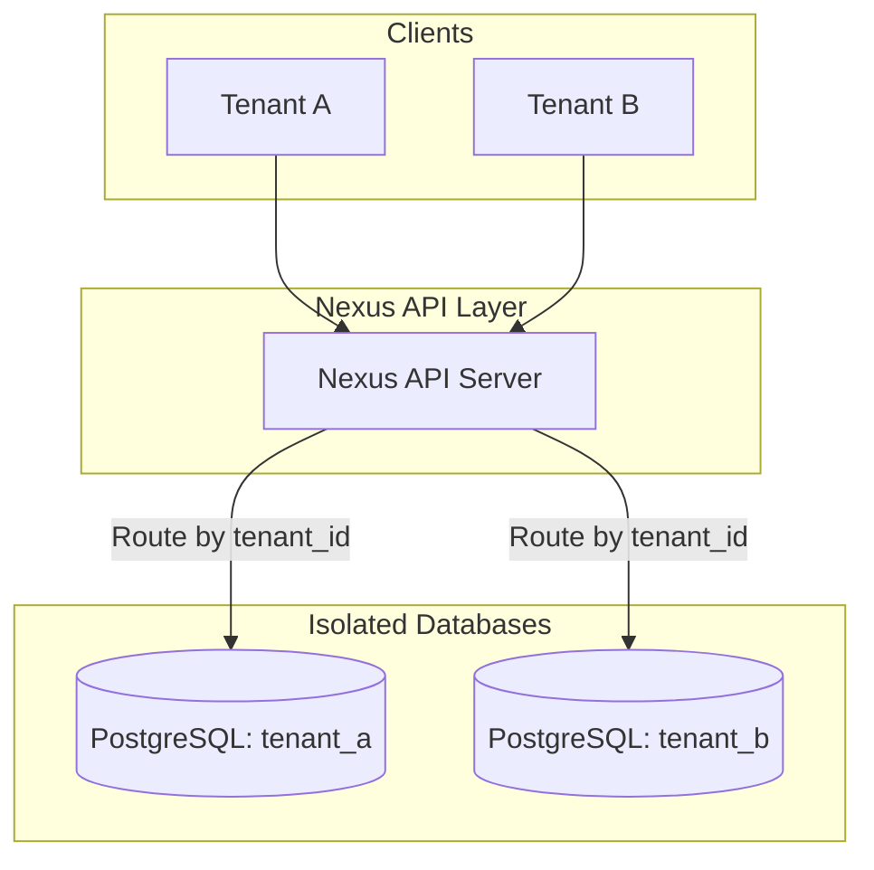
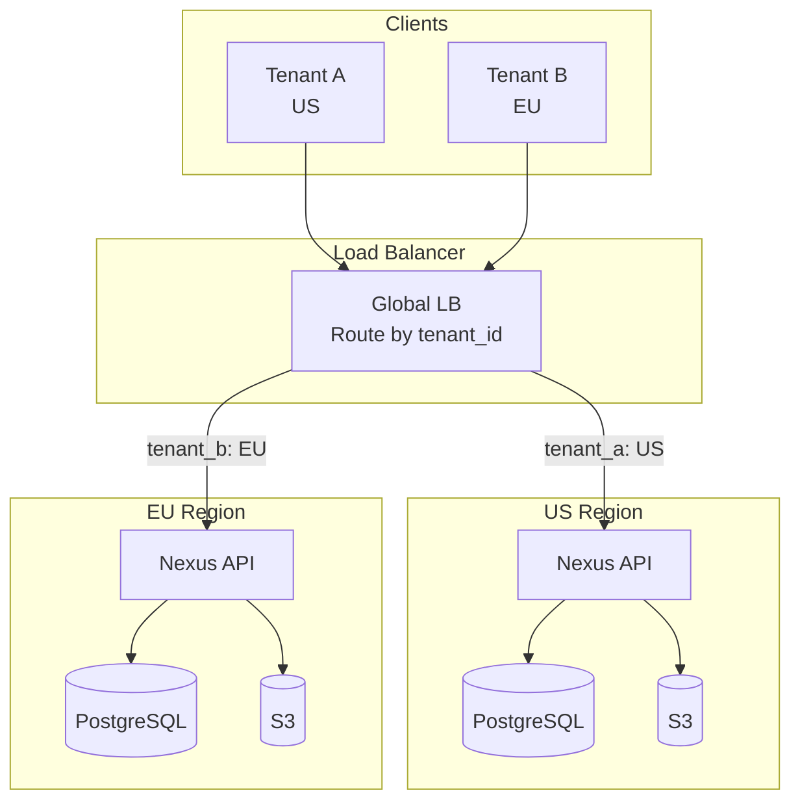

# Multi-Tenancy & Tenant Isolation

## The Big Picture

Multi-tenancy in Nexus allows you to serve multiple customers, teams, or agents from a single Nexus deployment with **complete isolation** of data, permissions, and resources. Think of it as running multiple "virtual Nexus instances" on shared infrastructure - like how AWS lets thousands of customers share the same physical servers but keeps their data completely separate.

## Why Multi-Tenancy Matters

### The Problem
Without proper multi-tenancy:
- ❌ Run separate Nexus servers per customer (expensive, complex)
- ❌ Mix tenant data in one namespace (security risk)
- ❌ Build custom isolation logic in your application (error-prone)
- ❌ Can't scale to thousands of tenants efficiently

### The Solution
With Nexus multi-tenancy:
- ✅ One deployment, unlimited tenants
- ✅ Guaranteed data isolation (enforced at API level)
- ✅ Per-tenant permissions, quotas, and billing
- ✅ Tenant-scoped memory, workflows, and search

---

## Mental Model: Tenant as Top-Level Namespace



**Key Insight**: Each tenant gets isolated:
- **Filesystem namespace**: `/workspace/{tenant_id}/...`
- **Memory**: `{tenant_id}:agent123:memory`
- **Permissions**: Tenant-scoped ReBAC subjects/objects
- **Workflows**: Tenant-specific triggers and actions

Tenants **cannot** read, write, or even discover each other's data.

---

## Tenant Isolation Patterns

### Pattern 1: Path-Based Isolation (Recommended)

**Use when**: You want simple, filesystem-based tenant separation

```python
from nexus import RemoteNexusFS

# Tenant A's agent
nx_tenant_a = RemoteNexusFS(
    server_url="https://nexus.example.com",
    api_key="tenant_a_key",  # Tenant-specific API key
    workspace_prefix="/workspace/tenant-a"
)

# Tenant B's agent
nx_tenant_b = RemoteNexusFS(
    server_url="https://nexus.example.com",
    api_key="tenant_b_key",
    workspace_prefix="/workspace/tenant-b"
)

# Tenant A can only access /workspace/tenant-a/*
nx_tenant_a.write("/data/report.txt", b"Tenant A data")

# Tenant B can only access /workspace/tenant-b/*
nx_tenant_b.write("/data/report.txt", b"Tenant B data")

# ❌ Tenant A CANNOT access /workspace/tenant-b/data/report.txt
# (Returns 403 Forbidden)
```

**How it works**:
1. Each tenant gets a unique API key
2. API key is bound to a workspace prefix (e.g., `/workspace/tenant-123/`)
3. Nexus enforces path isolation at the API layer
4. All operations (read, write, search, memory) are scoped to tenant prefix

**Pros**:
- ✅ Simple to implement
- ✅ Clear path-based separation
- ✅ Easy to debug (paths show tenant ownership)

**Cons**:
- ⚠️ Requires workspace prefix enforcement in client code
- ⚠️ API key management overhead

---

### Pattern 2: ReBAC-Based Isolation (Fine-Grained)

**Use when**: You need complex, dynamic permission hierarchies

```python
# Create tenant namespaces
nx.rebac.create_namespace("tenant:acme-corp")
nx.rebac.create_namespace("tenant:startup-xyz")

# Grant tenant admin permissions
nx.rebac.grant(
    "user:alice@acme.com",
    "admin",
    "namespace",
    "tenant:acme-corp"
)

nx.rebac.grant(
    "user:bob@startup.xyz",
    "admin",
    "namespace",
    "tenant:startup-xyz"
)

# Alice (tenant acme-corp) creates a file
nx.write("/workspace/acme-corp/data.txt", b"ACME data", context={
    "subject": "user:alice@acme.com",
    "namespace": "tenant:acme-corp"
})

# Bob (tenant startup-xyz) tries to read ACME's file
# ❌ Fails: No permission in tenant:acme-corp namespace
nx.read("/workspace/acme-corp/data.txt", context={
    "subject": "user:bob@startup.xyz",
    "namespace": "tenant:startup-xyz"
})
```

**How it works**:
1. Each tenant is a ReBAC **namespace**
2. Users/agents are subjects in their tenant namespace
3. Files/resources inherit tenant namespace
4. Cross-tenant access is blocked by default

**Pros**:
- ✅ Fine-grained, relationship-based permissions
- ✅ Supports complex org hierarchies (teams, departments)
- ✅ Dynamic permission changes without API key rotation

**Cons**:
- ⚠️ More complex to set up
- ⚠️ Requires understanding ReBAC model

---

### Pattern 3: User-Based Isolation (Per-Customer Agents)

**Use when**: Each tenant has their own agents/users

```python
# Tenant A: Create agents for customer "acme-corp"
nx.admin.create_user("agent-researcher-acme", subject_type="agent")
nx.admin.create_user("agent-writer-acme", subject_type="agent")

# Grant permissions scoped to tenant
nx.rebac.grant("agent-researcher-acme", "reader", "file", "/workspace/acme-corp/*")
nx.rebac.grant("agent-writer-acme", "owner", "file", "/workspace/acme-corp/*")

# Tenant B: Create agents for customer "startup-xyz"
nx.admin.create_user("agent-researcher-xyz", subject_type="agent")
nx.admin.create_user("agent-writer-xyz", subject_type="agent")

nx.rebac.grant("agent-researcher-xyz", "reader", "file", "/workspace/startup-xyz/*")
nx.rebac.grant("agent-writer-xyz", "owner", "file", "/workspace/startup-xyz/*")

# Agents can only access their tenant's workspace
# agent-researcher-acme can read /workspace/acme-corp/*
# agent-researcher-xyz can read /workspace/startup-xyz/*
```

**How it works**:
1. Each tenant gets dedicated agent users
2. Agent permissions are scoped to tenant paths
3. Agent API keys are issued per-tenant

**Pros**:
- ✅ Clear agent ownership
- ✅ Easy to audit (agent actions per tenant)
- ✅ Supports per-tenant agent configurations

**Cons**:
- ⚠️ Higher agent user count (1:1 mapping to tenants)

---

## Tenant-Scoped Features

### 1. Memory Isolation

Each tenant's agents have isolated memory namespaces:

```python
# Tenant A's agent stores memory
nx.memory.store(
    identity="user:alice@acme.com",
    key="preferences",
    value={"theme": "dark"},
    namespace="tenant:acme-corp"
)

# Tenant B's agent stores memory (same key, different namespace)
nx.memory.store(
    identity="user:bob@startup.xyz",
    key="preferences",
    value={"theme": "light"},
    namespace="tenant:startup-xyz"
)

# Recall is scoped to tenant namespace
acme_prefs = nx.memory.retrieve(
    identity="user:alice@acme.com",
    key="preferences",
    namespace="tenant:acme-corp"
)  # {"theme": "dark"}

xyz_prefs = nx.memory.retrieve(
    identity="user:bob@startup.xyz",
    key="preferences",
    namespace="tenant:startup-xyz"
)  # {"theme": "light"}
```

**Key**: Memory keys are automatically scoped by namespace, preventing cross-tenant leakage.

---

### 2. Search Isolation

Semantic and traditional search are tenant-scoped:

```python
# Tenant A: Index documents
nx.write("/workspace/acme-corp/docs/api.md", b"ACME API docs")
nx.write("/workspace/acme-corp/docs/auth.md", b"ACME Auth guide")

# Tenant B: Index documents
nx.write("/workspace/startup-xyz/docs/api.md", b"Startup XYZ API docs")

# Tenant A search: Only returns ACME results
results_a = nx.semantic_search(
    path="/workspace/acme-corp/docs",
    query="API documentation",
    context={"namespace": "tenant:acme-corp"}
)
# Results: ["/workspace/acme-corp/docs/api.md"]

# Tenant B search: Only returns Startup XYZ results
results_b = nx.semantic_search(
    path="/workspace/startup-xyz/docs",
    query="API documentation",
    context={"namespace": "tenant:startup-xyz"}
)
# Results: ["/workspace/startup-xyz/docs/api.md"]
```

---

### 3. Workflow Isolation

Workflows are scoped to tenant namespaces:

```python
# Tenant A: Workflow triggers on ACME files
nx.workflows.create(
    name="acme-csv-processor",
    trigger="write:/workspace/acme-corp/uploads/*.csv",
    action="process_csv",
    namespace="tenant:acme-corp"
)

# Tenant B: Workflow triggers on Startup XYZ files
nx.workflows.create(
    name="xyz-csv-processor",
    trigger="write:/workspace/startup-xyz/uploads/*.csv",
    action="process_csv",
    namespace="tenant:startup-xyz"
)

# Upload to Tenant A triggers ONLY acme-csv-processor
nx.write("/workspace/acme-corp/uploads/data.csv", b"...")
# ✅ Triggers: acme-csv-processor
# ❌ Does NOT trigger: xyz-csv-processor
```

---

## Deployment Architectures

### Architecture 1: Single-Server Multi-Tenant (Small Scale)

**Use when**: < 100 tenants, moderate load



**Characteristics**:
- One Nexus server handles all tenants
- Shared database (with tenant_id columns)
- Shared S3 bucket (with tenant prefixes)
- API key-based isolation

**Pros**: Simple, cost-effective
**Cons**: Noisy neighbor risk, limited scalability

---

### Architecture 2: Tenant-Isolated Databases (Medium Scale)

**Use when**: 100-1000 tenants, need stronger isolation



**Characteristics**:
- One Nexus server
- Per-tenant databases (schema isolation)
- Nexus routes queries by tenant_id

**Setup**:
```python
# Mount per-tenant databases
nx.mount("/workspace/tenant-a", PostgreSQLBackend(db="tenant_a"))
nx.mount("/workspace/tenant-b", PostgreSQLBackend(db="tenant_b"))
```

**Pros**: Strong isolation, easier compliance (data residency)
**Cons**: Database management overhead

---

### Architecture 3: Multi-Region with Tenant Routing (Enterprise Scale)

**Use when**: 1000+ tenants, global deployment



**Characteristics**:
- Multi-region Nexus deployments
- Tenant-aware load balancing
- Regional data residency (GDPR compliance)

**Pros**: Global scale, compliance, low latency
**Cons**: Complex infrastructure

---

## Security Best Practices

### 1. API Key Management

```python
# ✅ DO: Generate unique API keys per tenant
tenant_a_key = nx.admin.create_api_key(
    user_id="tenant-a-admin",
    scopes=["read", "write"],
    workspace_prefix="/workspace/tenant-a"
)

# ❌ DON'T: Share API keys across tenants
shared_key = nx.admin.create_api_key(
    user_id="shared-admin",
    scopes=["read", "write"],
    workspace_prefix="/workspace"  # Too broad!
)
```

### 2. Path Validation

Always validate tenant paths at the API layer:

```python
# Server-side validation
def validate_tenant_path(tenant_id: str, path: str):
    expected_prefix = f"/workspace/{tenant_id}/"
    if not path.startswith(expected_prefix):
        raise PermissionError(f"Path {path} not in tenant {tenant_id} workspace")
    return path

# Use in API handlers
@app.post("/api/files/write")
def write_file(path: str, content: bytes, tenant_id: str):
    validated_path = validate_tenant_path(tenant_id, path)
    nx.write(validated_path, content)
```

### 3. Namespace Enforcement

Use ReBAC namespaces for additional isolation:

```python
# Create tenant namespace on signup
nx.rebac.create_namespace(f"tenant:{tenant_id}")

# All operations include namespace context
nx.write("/workspace/tenant-123/data.txt", b"...", context={
    "subject": "user:alice@example.com",
    "namespace": "tenant:tenant-123"
})
```

### 4. Audit Logging

Log all cross-tenant access attempts:

```python
# Log tenant operations
def log_tenant_operation(tenant_id: str, operation: str, path: str, result: str):
    logger.info(f"Tenant {tenant_id}: {operation} {path} -> {result}")

# In API handlers
@app.post("/api/files/read")
def read_file(path: str, tenant_id: str):
    try:
        validated_path = validate_tenant_path(tenant_id, path)
        content = nx.read(validated_path)
        log_tenant_operation(tenant_id, "READ", path, "SUCCESS")
        return content
    except PermissionError as e:
        log_tenant_operation(tenant_id, "READ", path, f"DENIED: {e}")
        raise
```

---

## Quotas & Resource Limits

### Per-Tenant Storage Quotas

```python
# Set tenant storage quota
nx.admin.set_quota("tenant-a", max_bytes=10 * 1024**3)  # 10 GB

# Check quota before writes
def write_with_quota_check(tenant_id: str, path: str, content: bytes):
    quota = nx.admin.get_quota(tenant_id)
    current_usage = nx.admin.get_usage(tenant_id)

    if current_usage + len(content) > quota.max_bytes:
        raise QuotaExceededError(f"Tenant {tenant_id} quota exceeded")

    nx.write(path, content)
```

### Rate Limiting

```python
from nexus.middleware import RateLimiter

# Apply rate limits per tenant
rate_limiter = RateLimiter(
    max_requests_per_minute=1000,
    scope="tenant"  # Scope by tenant_id
)

@app.post("/api/files/write")
@rate_limiter.limit()
def write_file(path: str, content: bytes, tenant_id: str):
    nx.write(path, content)
```

---

## Billing & Metering

### Track Per-Tenant Usage

```python
# Track operations for billing
class TenantMeter:
    def __init__(self, tenant_id: str):
        self.tenant_id = tenant_id
        self.metrics = {
            "reads": 0,
            "writes": 0,
            "storage_bytes": 0,
            "search_queries": 0
        }

    def record_write(self, path: str, size: int):
        self.metrics["writes"] += 1
        self.metrics["storage_bytes"] += size
        # Store in database for billing
        db.insert("tenant_usage", {
            "tenant_id": self.tenant_id,
            "operation": "write",
            "bytes": size,
            "timestamp": datetime.now()
        })

# Use in API handlers
meter = TenantMeter("tenant-a")
meter.record_write("/workspace/tenant-a/data.txt", len(content))
```

### Generate Billing Reports

```python
# Generate monthly bill
def generate_tenant_bill(tenant_id: str, month: str):
    usage = db.query("""
        SELECT
            COUNT(*) FILTER (WHERE operation='read') as reads,
            COUNT(*) FILTER (WHERE operation='write') as writes,
            SUM(bytes) as total_bytes
        FROM tenant_usage
        WHERE tenant_id = %s AND month = %s
    """, (tenant_id, month))

    bill = {
        "tenant_id": tenant_id,
        "month": month,
        "reads": usage.reads,
        "writes": usage.writes,
        "storage_gb": usage.total_bytes / 1024**3,
        "total_cost": calculate_cost(usage)
    }
    return bill
```

---

## Testing Multi-Tenancy

### Test Isolation

```python
import pytest

def test_tenant_isolation():
    # Create two tenant clients
    nx_a = RemoteNexusFS(api_key="tenant_a_key", workspace_prefix="/workspace/tenant-a")
    nx_b = RemoteNexusFS(api_key="tenant_b_key", workspace_prefix="/workspace/tenant-b")

    # Tenant A writes data
    nx_a.write("/data/secret.txt", b"Tenant A secret")

    # Tenant B should NOT be able to read it
    with pytest.raises(PermissionError):
        nx_b.read("/workspace/tenant-a/data/secret.txt")

    # Tenant B writes their own data
    nx_b.write("/data/secret.txt", b"Tenant B secret")

    # Verify each tenant sees only their data
    assert nx_a.read("/data/secret.txt") == b"Tenant A secret"
    assert nx_b.read("/data/secret.txt") == b"Tenant B secret"
```

---

## Common Pitfalls

### ❌ Pitfall 1: Shared API Keys
```python
# BAD: All tenants use same API key
api_key = "shared-admin-key"
nx_a = RemoteNexusFS(api_key=api_key, workspace_prefix="/workspace/tenant-a")
nx_b = RemoteNexusFS(api_key=api_key, workspace_prefix="/workspace/tenant-b")
# ⚠️ Problem: Malicious tenant can change workspace_prefix
```

**Fix**: Generate unique API keys per tenant with workspace binding.

---

### ❌ Pitfall 2: Missing Path Validation
```python
# BAD: No path validation
@app.post("/api/files/read")
def read_file(path: str):
    return nx.read(path)  # ⚠️ Any tenant can read any path!
```

**Fix**: Always validate paths against tenant workspace.

---

### ❌ Pitfall 3: Leaky Search Results
```python
# BAD: Global search across all tenants
results = nx.semantic_search("/workspace", query="API key")
# ⚠️ Problem: Returns results from all tenants!
```

**Fix**: Scope search to tenant workspace.

---

## Migration from Single-Tenant to Multi-Tenant

### Step 1: Add Tenant ID to Paths

```python
# Before (single tenant)
nx.write("/data/report.txt", b"...")

# After (multi-tenant)
tenant_id = "acme-corp"
nx.write(f"/workspace/{tenant_id}/data/report.txt", b"...")
```

### Step 2: Migrate Existing Data

```python
def migrate_to_multi_tenant(default_tenant_id: str):
    # List all files in old single-tenant workspace
    files = nx.ls("/data", recursive=True)

    for file_path in files:
        # Read existing content
        content = nx.read(file_path)

        # Write to tenant-scoped path
        new_path = f"/workspace/{default_tenant_id}{file_path}"
        nx.write(new_path, content)

        # Delete old path
        nx.rm(file_path)
```

### Step 3: Update Client Code

```python
# Before
backend = LocalBackend(root_path="/tmp/nexus-data")
nx = NexusFS(backend=backend, is_admin=True)

# After
nx = RemoteNexusFS(
    server_url="https://nexus.example.com",
    api_key=get_tenant_api_key(tenant_id),
    workspace_prefix=f"/workspace/{tenant_id}"
)
```

---

## FAQ

### Q: How many tenants can Nexus support?
**A**: Depends on architecture:
- **Single-server**: 100-1000 tenants
- **Multi-region**: 10,000+ tenants
- **Database-per-tenant**: Limited by database management capacity

### Q: Can tenants share data?
**A**: Yes, via explicit ReBAC permissions:
```python
# Tenant A grants Tenant B read access
nx.rebac.grant(
    "user:bob@tenant-b.com",
    "reader",
    "file",
    "/workspace/tenant-a/shared/report.pdf"
)
```

### Q: How do I handle tenant offboarding?
**A**: Cascade delete tenant resources:
```python
# Delete tenant workspace
nx.rmdir(f"/workspace/{tenant_id}", recursive=True)

# Revoke API keys
nx.admin.revoke_api_key(tenant_api_key)

# Delete ReBAC namespace
nx.rebac.delete_namespace(f"tenant:{tenant_id}")
```

### Q: Can I enforce data residency per tenant?
**A**: Yes, use regional mounts:
```python
# EU tenant -> EU S3 bucket
nx.mount("/workspace/eu-tenant", S3Backend(bucket="nexus-eu-west-1"))

# US tenant -> US S3 bucket
nx.mount("/workspace/us-tenant", S3Backend(bucket="nexus-us-east-1"))
```

---

## Next Steps

- **[Agent Permissions](agent-permissions.md)** - Configure per-tenant agent permissions
- **[ReBAC Explained](rebac-explained.md)** - Fine-grained access control
- **[Mounts & Backends](mounts-and-backends.md)** - Set up tenant-isolated storage
- **[Production Deployment](../production/deployment.md)** - Multi-tenant deployment guide

For a hands-on example, see: **[Multi-Tenant SaaS Tutorial](../examples/multi-tenant-saas.md)**
