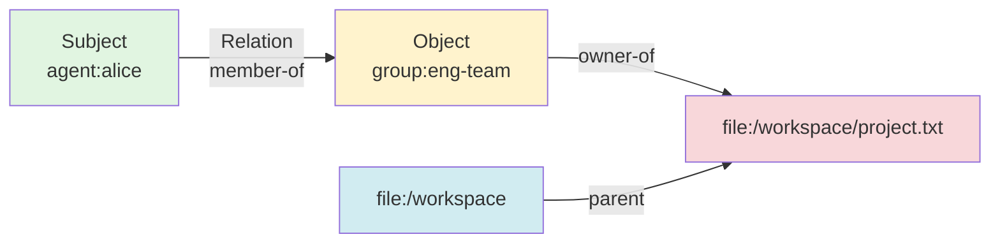
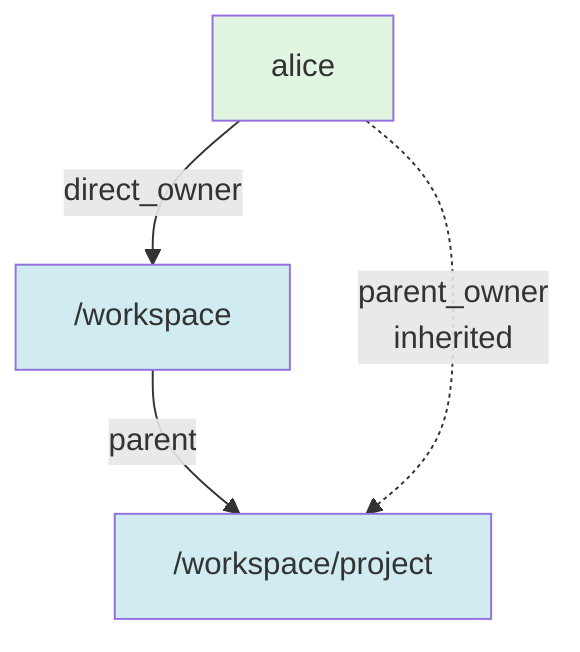
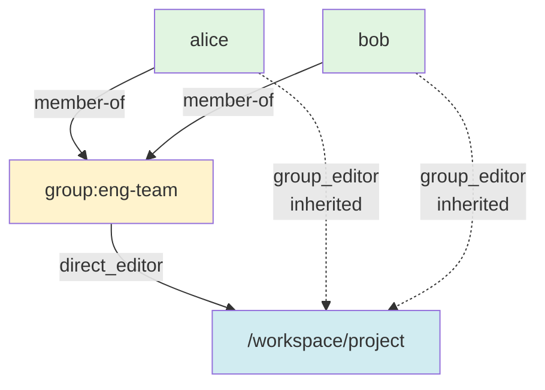

# ReBAC Explained

## What is ReBAC?

**ReBAC** (Relationship-Based Access Control) is a fine-grained permission system that controls access based on **relationships** between entities, not just roles. Nexus's ReBAC is inspired by Google's **Zanzibar** system, used at massive scale for Google Drive, Docs, Calendar, and more.

### Why ReBAC vs Traditional Permissions?

| Traditional (RBAC/ACL) | ReBAC (Zanzibar-style) |
|------------------------|------------------------|
| ❌ Fixed roles (admin, user, guest) | ✅ Dynamic relationships (owner, editor, viewer) |
| ❌ Can't express "share with team" | ✅ Groups, inheritance, delegation |
| ❌ No hierarchical permissions | ✅ Parent-child inheritance |
| ❌ Hardcoded access logic | ✅ Declarative relationship rules |
| ❌ Scales poorly (N users × M resources) | ✅ Graph-based, efficient checking |

**Key Innovation:** Permissions are **computed from relationships**, not stored directly.

---

## Core Concept: The ReBAC Tuple

A **ReBAC tuple** represents a relationship:

```
(subject, relation, object)
```

**Examples:**
```
(agent:alice, member-of, group:eng-team)
(group:eng-team, owner-of, file:/workspace/project.txt)
(file:/workspace, parent, file:/workspace/project.txt)
```



### Tuple Components

```python
@dataclass
class ReBACTuple:
    tuple_id: str                   # Unique ID
    subject: Entity                 # Who (agent, user, group)
    relation: str                   # Relationship type
    object: Entity                  # What (file, memory, skill)
    subject_relation: str | None    # For group expansion (member)
    created_at: datetime            # Creation time
    expires_at: datetime | None     # Optional expiration
    conditions: dict | None         # JSON conditions
```

**Entity Structure:**
```python
@dataclass
class Entity:
    entity_type: str  # "agent", "user", "group", "file", "memory"
    entity_id: str    # Unique identifier
    tenant_id: str | None  # Multi-tenant isolation
```

---

## Relationship Types

### Direct Relations (Explicit Grants)

| Relation | Description | Example |
|----------|-------------|---------|
| `direct_owner` | Full control (read, write, execute) | Alice owns her workspace |
| `direct_editor` | Read + write access | Bob can edit shared doc |
| `direct_viewer` | Read-only access | Guests can view public files |
| `member-of` | Group membership | Alice is in eng-team |
| `parent` | Hierarchical relationship | /workspace parent of /workspace/file.txt |

### Computed Relations (Inherited)

| Relation | Description | Computed From |
|----------|-------------|---------------|
| `parent_owner` | Owner via parent directory | Parent has owner permission |
| `group_owner` | Owner via group membership | Group has owner + user is member |
| `owner` | Any owner permission | Union of direct_owner, parent_owner, group_owner |
| `editor` | Any editor permission | Union of direct_editor, parent_editor, group_editor, owner |
| `viewer` | Any viewer permission | Union of direct_viewer, parent_viewer, group_viewer |

---

## Permission Checking: How It Works

### Check Algorithm

```
Question: Does alice have read permission on /workspace/file.txt?

Step 1: Get namespace config for "file"
Step 2: Map "read" permission → [viewer, editor, owner]
Step 3: Check each relation:

  Check viewer:
    ├─ Direct: (alice, direct_viewer, file.txt)? NO
    ├─ Parent: (alice, parent_viewer, file.txt)?
    │  └─ Find parent: /workspace parent-of file.txt
    │  └─ Check: (alice, viewer, /workspace)? NO
    └─ Group: (alice, group_viewer, file.txt)?
       └─ Find groups with direct_viewer on file.txt: eng-team
       └─ Check: (alice, member-of, eng-team)? NO

  Check editor:
    ├─ Direct: (alice, direct_editor, file.txt)? NO
    └─ ... (similar checks)

  Check owner:
    ├─ Direct: (alice, direct_owner, file.txt)? NO
    ├─ Parent: (alice, parent_owner, file.txt)?
    │  └─ Find parent: /workspace parent-of file.txt
    │  └─ Check: (alice, owner, /workspace)? YES! ✅
    │  └─ Result: alice has parent_owner on file.txt
    └─ Return: ✅ GRANTED (alice has read)

Step 4: Cache result for 5 minutes
```

---

## Namespace Configuration

Namespaces define how permissions work for each **object type** (file, memory, group, skill, etc.).

### Example: File Namespace

```python
DEFAULT_FILE_NAMESPACE = NamespaceConfig(
    object_type="file",
    config={
        "relations": {
            # Structural relation
            "parent": {},  # Parent directory

            # Direct relations (explicitly granted)
            "direct_owner": {},
            "direct_editor": {},
            "direct_viewer": {},

            # Parent inheritance (tupleToUserset)
            "parent_owner": {
                "tupleToUserset": {
                    "tupleset": "parent",       # Find parent
                    "computedUserset": "owner"  # Check owner on parent
                }
            },

            # Group inheritance (tupleToUserset)
            "group_owner": {
                "tupleToUserset": {
                    "tupleset": "direct_owner",  # Find groups with direct_owner
                    "computedUserset": "member"   # Check if subject is member
                }
            },

            # Union relations (OR logic)
            "owner": {
                "union": ["direct_owner", "parent_owner", "group_owner"]
            },
            "editor": {
                "union": ["direct_editor", "parent_editor", "group_editor", "owner"]
            },
            "viewer": {
                "union": ["direct_viewer", "parent_viewer", "group_viewer"]
            },
        },

        # Permission-to-relation mapping
        "permissions": {
            "read": ["viewer", "editor", "owner"],  # read = viewer OR editor OR owner
            "write": ["editor", "owner"],           # write = editor OR owner
            "execute": ["owner"],                   # execute = owner only
        }
    }
)
```

### Namespace Rules Explained

#### 1. Union (OR Logic)

```python
"owner": {
    "union": ["direct_owner", "parent_owner", "group_owner"]
}
```

**Meaning:** Subject has `owner` relation if they have **ANY** of:
- `direct_owner` (explicit grant)
- `parent_owner` (inherited from parent)
- `group_owner` (inherited from group)

---

#### 2. TupleToUserset (Expansion)

```python
"parent_owner": {
    "tupleToUserset": {
        "tupleset": "parent",       # Find objects where subject is parent
        "computedUserset": "owner"  # Check if subject has owner on that object
    }
}
```

**Meaning:** Subject has `parent_owner` relation if:
1. Find objects X where `(X, parent, object)` exists
2. Check if `(subject, owner, X)` exists
3. If yes → subject inherits owner via parent

**Example:**
```
Tuples:
  (file:/workspace, parent, file:/workspace/child.txt)
  (alice, direct_owner, file:/workspace)

Query: Does alice have parent_owner on /workspace/child.txt?
  1. Find parent: /workspace parent-of /workspace/child.txt
  2. Check owner: alice has owner on /workspace? YES
  3. Result: alice has parent_owner ✅
```

---

#### 3. Permission Mapping

```python
"permissions": {
    "read": ["viewer", "editor", "owner"],
    "write": ["editor", "owner"],
    "execute": ["owner"]
}
```

**Meaning:**
- `read` permission granted if subject has **viewer** OR **editor** OR **owner** relation
- `write` permission granted if subject has **editor** OR **owner** relation
- `execute` permission granted if subject has **owner** relation

---

## Real-World Examples

### Example 1: Directory Hierarchy

**Setup:**
```bash
# Alice owns /workspace
nexus rebac create user alice direct_owner file /workspace

# Create subdirectory
nexus mkdir /workspace/project

# Define parent relationship
nexus rebac create file /workspace parent file /workspace/project
```

**Permission Flow:**

```
Question: Does alice have write permission on /workspace/project?

1. Map write → [editor, owner]
2. Check owner:
   ├─ Union: [direct_owner, parent_owner, group_owner]
   ├─ Check direct_owner: NO
   ├─ Check parent_owner:
   │  ├─ Find parent: /workspace parent-of /workspace/project ✅
   │  └─ Check: alice has owner on /workspace? ✅ (direct_owner)
   │  └─ Result: alice has parent_owner ✅
   └─ Return: alice has owner ✅
3. Result: alice has write permission ✅
```

**Mermaid Diagram:**



---

### Example 2: Group-Based Sharing

**Setup:**
```bash
# Alice and Bob join eng-team
nexus rebac create agent alice member-of group eng-team
nexus rebac create agent bob member-of group eng-team

# Grant eng-team editor permission on project
nexus rebac create group eng-team direct_editor file /workspace/project
```

**Permission Flow:**

```
Question: Does alice have write permission on /workspace/project?

1. Map write → [editor, owner]
2. Check editor:
   ├─ Union: [direct_editor, parent_editor, group_editor, owner]
   ├─ Check group_editor:
   │  ├─ Find groups with direct_editor on /workspace/project: eng-team ✅
   │  └─ Check: alice member-of eng-team? ✅
   │  └─ Result: alice has group_editor ✅
   └─ Return: alice has editor ✅
3. Result: alice has write permission ✅
```

**Mermaid Diagram:**



---

### Example 3: Public File Access

**Setup:**
```bash
# Make file publicly readable
nexus rebac create '*' '*' direct_viewer file /workspace/public.txt --wildcard
```

**Permission Flow:**

```
Question: Does anyone have read permission on /workspace/public.txt?

1. Map read → [viewer, editor, owner]
2. Check viewer:
   ├─ Check direct_viewer: ('*', '*') wildcard matches ALL subjects ✅
   └─ Return: ANY subject has viewer ✅
3. Result: Public read access ✅
```

---

## Core Operations

### 1. Create Relationship (Write)

```bash
# Grant alice owner permission on file
nexus rebac create agent alice direct_owner file /workspace/data.txt

# Alice joins group
nexus rebac create agent alice member-of group eng-team

# Group gets editor permission
nexus rebac create group eng-team direct_editor file /shared/doc.txt

# Public viewer access
nexus rebac create '*' '*' direct_viewer file /public/readme.txt --wildcard
```

**Python API:**

```python
from nexus.core.rebac_manager import ReBACManager

manager = ReBACManager(engine)

# Create tuple
tuple_id = manager.rebac_write(
    subject=("agent", "alice"),
    relation="direct_owner",
    object=("file", "/workspace/data.txt"),
    tenant_id="acme",
    expires_at=None,  # Optional expiration
    conditions=None   # Optional JSON conditions
)
```

---

### 2. Check Permission

```bash
# Check if alice can write
nexus rebac check agent alice write file /workspace/data.txt

# Output:
# ✅ Granted
# or
# ❌ Denied
```

**Python API:**

```python
can_write = manager.rebac_check(
    subject=("agent", "alice"),
    permission="write",
    object=("file", "/workspace/data.txt"),
    tenant_id="acme"
)
# Returns: True or False
```

---

### 3. Expand (Who Has Permission?)

```bash
# Find all subjects with read permission
nexus rebac expand read file /workspace/data.txt

# Output:
# agent:alice
# agent:bob
# group:eng-team
```

**Python API:**

```python
subjects = manager.rebac_expand(
    permission="read",
    object=("file", "/workspace/data.txt"),
    tenant_id="acme"
)
# Returns: [("agent", "alice"), ("agent", "bob"), ("group", "eng-team")]
```

---

### 4. Explain (Why Does Alice Have Permission?)

```bash
# Explain why alice has read permission
nexus rebac explain agent alice read file /workspace/project/file.txt --verbose

# Output:
# ✅ alice has read permission on /workspace/project/file.txt
#
# Reason:
#   1. read permission requires: viewer OR editor OR owner
#   2. alice has owner relation via:
#      - parent_owner relation:
#        - /workspace is parent of /workspace/project/file.txt
#        - alice has direct_owner on /workspace
#        - ✅ Inherited owner permission
```

---

### 5. Delete Relationship

```bash
# Delete specific tuple
nexus rebac delete <tuple_id>

# Revoke alice's owner permission
nexus rebac list --subject-type agent --subject-id alice --object-id /workspace/data.txt
# Find tuple_id, then:
nexus rebac delete tuple_abc123
```

**Python API:**

```python
deleted = manager.rebac_delete(tuple_id)
# Returns: True if deleted, False otherwise
```

---

## Caching for Performance

ReBAC checks are **cached with TTL** for performance:

### Cache Strategy

```python
manager = ReBACManager(
    engine=engine,
    cache_ttl_seconds=300,  # 5 minutes (default)
    max_depth=50           # Max graph traversal depth
)
```

**Cache Entry:**
```
Key: (tenant_id, subject_type, subject_id, permission, object_type, object_id)
Value: (result: bool, expires_at: datetime)
```

**Cache Invalidation:**

When tuples are created/deleted, affected cache entries are **automatically invalidated**:

```
Tuple created: (alice, direct_owner, /workspace)
  → Invalidate all cache entries for:
    - subject=alice
    - object=/workspace
    - Any permission checks involving alice or /workspace
```

---

## Multi-Tenancy

All ReBAC operations are **tenant-scoped** for complete isolation:

```bash
# Create tuple in tenant "acme"
nexus rebac create agent alice direct_owner file /data.txt --tenant-id acme

# Create tuple in tenant "techcorp"
nexus rebac create agent alice direct_owner file /data.txt --tenant-id techcorp

# Different tuples, different permissions, complete isolation
```

**Cross-Tenant Protection:**

```python
# REJECTED: Cross-tenant relationships are not allowed
manager.rebac_write(
    subject=("agent", "alice", tenant_id="acme"),
    relation="member-of",
    object=("group", "eng", tenant_id="techcorp"),  # Different tenant!
    tenant_id="acme"
)
# Raises: ValueError("Cross-tenant relationships not allowed")
```

---

## Advanced: Custom Namespaces

You can define custom namespaces for your own object types:

```bash
# Create custom namespace for "document" type
nexus rebac namespace-create document \
  --relations owner --relations editor --relations viewer \
  --permission read:viewer,editor,owner \
  --permission write:editor,owner \
  --permission delete:owner
```

**Python API:**

```python
from nexus.core.rebac import NamespaceConfig

custom_namespace = NamespaceConfig(
    object_type="document",
    config={
        "relations": {
            "direct_owner": {},
            "direct_editor": {},
            "direct_viewer": {},
            "owner": {"union": ["direct_owner"]},
            "editor": {"union": ["direct_editor", "owner"]},
            "viewer": {"union": ["direct_viewer", "editor"]},
        },
        "permissions": {
            "read": ["viewer", "editor", "owner"],
            "write": ["editor", "owner"],
            "delete": ["owner"],
        }
    }
)

manager.register_namespace(custom_namespace)
```

---

## CLI Reference

### Tuple Management

```bash
# Create relationship
nexus rebac create <subject_type> <subject_id> <relation> <object_type> <object_id>

# Examples
nexus rebac create agent alice direct_owner file /workspace/data.txt
nexus rebac create agent alice member-of group eng-team
nexus rebac create group eng-team direct_editor file readme.md

# List tuples
nexus rebac list-tuples
nexus rebac list-tuples --subject-type agent --subject-id alice
nexus rebac list-tuples --object-type file --object-id /workspace/data.txt

# Delete tuple
nexus rebac delete <tuple_id>
```

---

### Permission Checking

```bash
# Check permission
nexus rebac check <subject_type> <subject_id> <permission> <object_type> <object_id>

# Examples
nexus rebac check agent alice read file /workspace/data.txt
nexus rebac check agent alice write file /workspace/data.txt

# Batch check from JSON
echo '[
  {"subject": ["agent", "alice"], "permission": "read", "object": ["file", "/data.txt"]},
  {"subject": ["agent", "bob"], "permission": "write", "object": ["file", "/data.txt"]}
]' | nexus rebac check-batch --format table

# Expand (who has permission?)
nexus rebac expand <permission> <object_type> <object_id>

# Example
nexus rebac expand read file /workspace/data.txt
# Output: agent:alice, agent:bob, group:eng-team

# Explain (why does subject have permission?)
nexus rebac explain <subject_type> <subject_id> <permission> <object_type> <object_id>

# Example
nexus rebac explain agent alice read file /workspace/project/file.txt --verbose
```

---

### Namespace Management

```bash
# Create namespace
nexus rebac namespace-create <object_type> \
  --relations <relation1> --relations <relation2> \
  --permission <perm>:<relations>

# List namespaces
nexus rebac namespace-list

# Get namespace config
nexus rebac namespace-get <object_type> --format yaml

# Delete namespace
nexus rebac namespace-delete <object_type> --yes
```

---

## Security Best Practices

### 1. Principle of Least Privilege

```bash
# ✅ Good: Grant specific permission
nexus rebac create agent alice direct_viewer file /logs/system.log

# ❌ Bad: Grant broad permission
nexus rebac create agent alice direct_owner file /
```

---

### 2. Use Groups for Team Permissions

```bash
# ✅ Good: Grant permission to group
nexus rebac create agent alice member-of group eng-team
nexus rebac create agent bob member-of group eng-team
nexus rebac create group eng-team direct_editor file /shared/project/

# ❌ Bad: Grant individually (hard to manage)
nexus rebac create agent alice direct_editor file /shared/project/
nexus rebac create agent bob direct_editor file /shared/project/
```

---

### 3. Use Expiring Tuples for Temporary Access

```bash
# Grant temporary access (1 hour)
nexus rebac create agent alice direct_viewer file /sensitive.txt \
  --expires 2025-12-31T23:59:59
```

---

### 4. Audit Permission Changes

ReBAC automatically logs all changes in `rebac_changelog` table:

```sql
SELECT * FROM rebac_changelog
WHERE subject_id = 'alice'
ORDER BY created_at DESC
LIMIT 10;
```

---

## Troubleshooting

### Permission Denied (Expected to Grant)

**Check:**
1. Verify tuple exists:
   ```bash
   nexus rebac list-tuples --subject-id alice --object-id /data.txt
   ```

2. Explain why permission denied:
   ```bash
   nexus rebac explain agent alice write file /data.txt --verbose
   ```

3. Check parent inheritance:
   ```bash
   nexus rebac list-tuples --object-id /workspace --subject-id alice
   ```

---

### Permission Granted (Expected to Deny)

**Check:**
1. Check for wildcard grants:
   ```bash
   nexus rebac list-tuples --subject-type '*'
   ```

2. Check group memberships:
   ```bash
   nexus rebac list-tuples --subject-id alice --relation member-of
   ```

3. Check parent inheritance:
   ```bash
   nexus rebac explain agent alice write file /data.txt --verbose
   ```

---

### Slow Permission Checks

**Solutions:**
1. Increase cache TTL:
   ```python
   manager = ReBACManager(engine, cache_ttl_seconds=600)  # 10 minutes
   ```

2. Check cache hit rate:
   ```sql
   SELECT COUNT(*) FROM rebac_check_cache WHERE computed_at > NOW() - INTERVAL '1 hour';
   ```

3. Reduce graph depth (limit nested groups):
   ```python
   manager = ReBACManager(engine, max_depth=20)  # Default: 50
   ```

---

## FAQ

### Q: How is this different from AWS IAM or Google Cloud IAM?

**A**: IAM is **policy-based** (roles with permissions). ReBAC is **relationship-based** (permissions computed from relationships). ReBAC is more flexible for fine-grained, dynamic permissions (e.g., "share with my team").

---

### Q: Can I use ReBAC with external auth (OAuth, LDAP)?

**A**: Yes! ReBAC handles **authorization** (what you can do). Authentication (who you are) is separate. After OAuth/LDAP authentication, map the user to a Nexus subject, then use ReBAC for authorization.

---

### Q: What's the performance at scale?

**A**: Google's Zanzibar handles **10 trillion checks/day** with 95th percentile latency <10ms. Nexus uses similar architecture:
- Caching with TTL (default 5 minutes)
- Version sequences for bounded staleness
- Database indexes on tuple queries

---

### Q: Can I implement custom permission logic?

**A**: Yes, via **namespace configuration**. Define custom relations, unions, and tupleToUserset rules for your object types.

---

## Next Steps

- **[Agent Permissions](agent-permissions.md)** - How agents use ReBAC
- **[Memory System](memory-system.md)** - ReBAC for agent memory
- **[Multi-Tenancy](multi-tenancy.md)** - Tenant isolation patterns
- **[API Reference: ReBAC API](/api/rebac-api/)** - Complete API docs

---

## Related Files

- Core: `src/nexus/core/rebac.py:1`
- Manager: `src/nexus/core/rebac_manager.py:1`
- Permissions: `src/nexus/core/permissions_enhanced.py:1`
- Models: `src/nexus/storage/models.py:977`
- CLI: `src/nexus/cli/commands/rebac.py:1`
- Tests: `tests/unit/core/test_rebac.py:1`
- Examples: `examples/cli/agent_permissions_inheritance_demo.sh:1`
