# Sandbox Management

## The Big Picture

Nexus **Sandbox Management** provides secure, isolated code execution environments for AI agents. Think of it as giving your agents a safe playground where they can run code, analyze data, and perform computations without affecting your main system.

## Why Sandboxes?

AI agents often need to:
- ✅ Execute Python/JavaScript/Bash code dynamically
- ✅ Analyze data files (CSV, JSON, logs)
- ✅ Run calculations and transformations
- ✅ Test code snippets before deployment
- ✅ Generate reports or visualizations

**The problem**: Running untrusted code is dangerous. You need isolation.

**The solution**: Nexus sandboxes provide ephemeral, cloud-based execution environments that automatically clean up.

## Architecture

```mermaid
graph TB
    subgraph "🤖 AI Agent Layer"
        A1[Your Agent Code]
        A2[CrewAI Agent]
        A3[LangGraph Node]
    end

    subgraph "🔧 Nexus Sandbox API"
        B1[sandbox_create<br/>Create ephemeral env]
        B2[sandbox_run<br/>Execute code]
        B3[sandbox_pause<br/>Save costs]
        B4[sandbox_stop<br/>Cleanup]
        B5[sandbox_list<br/>View all]
    end

    subgraph "☁️ Sandbox Providers"
        C1[E2B<br/>Fast cloud sandboxes]
        C2[Docker<br/>Local containers]
        C3[Modal<br/>Serverless compute]
    end

    A1 & A2 & A3 --> B1 & B2 & B3 & B4 & B5
    B1 & B2 & B3 & B4 & B5 --> C1 & C2 & C3
```



### Key Components

1. **Sandbox Manager**: Coordinates lifecycle (create, run, cleanup) across providers
2. **Provider Interface**: Pluggable backends (E2B, Docker, Modal)
3. **TTL Management**: Automatic cleanup of idle sandboxes
4. **Metadata Storage**: Track sandbox state, expiry, usage

---

## Core Concepts

### 1. Ephemeral Environments

Sandboxes are **temporary** by design:
- Created on-demand
- Automatically expire after TTL (default: 10 minutes)
- Extended TTL with each code execution
- Destroyed when stopped or expired

```python
# Create sandbox with 30-minute TTL
sandbox = nx.sandbox_create(name="data-analysis", ttl_minutes=30)

# TTL refreshes on each code execution
nx.sandbox_run(sandbox_id, "python", code="print('Hello')")
# ↑ TTL extended by 30 minutes from now
```

### 2. Multi-Language Support

Run code in multiple languages:
- **Python**: Data analysis, ML inference, scripting
- **JavaScript/Node.js**: Async operations, JSON processing
- **Bash**: System commands, file operations

```python
# Python
nx.sandbox_run(sandbox_id, "python", code="""
import pandas as pd
df = pd.read_csv('data.csv')
print(df.describe())
""")

# JavaScript
nx.sandbox_run(sandbox_id, "javascript", code="""
const data = [1, 2, 3, 4, 5];
console.log(data.map(x => x * 2));
""")

# Bash
nx.sandbox_run(sandbox_id, "bash", code="""
ls -la /home/user
df -h
""")
```

### 3. Provider Abstraction

Switch providers without changing agent code:

```python
# Development: Local Docker
nx = NexusFS(
    backend=LocalBackend(),
    sandbox_provider="docker"
)

# Production: E2B cloud sandboxes
nx = NexusFS(
    backend=LocalBackend(),
    sandbox_provider="e2b",
    e2b_api_key=os.getenv("E2B_API_KEY")
)

# Same API works for both
sandbox = nx.sandbox_create("my-sandbox")
result = nx.sandbox_run(sandbox["sandbox_id"], "python", "print('Hello')")
```

### 4. Lifecycle States

```mermaid
stateDiagram-v2
    [*] --> Creating
    Creating --> Active: ✓ Created
    Active --> Active: Run code (TTL reset)
    Active --> Paused: pause_sandbox()
    Paused --> Active: resume_sandbox()
    Active --> Stopped: stop_sandbox()
    Active --> Stopped: TTL expired
    Stopped --> [*]
```



- **Creating**: Provider is spinning up environment
- **Active**: Ready to execute code
- **Paused**: Saved state, no resource consumption (provider-dependent)
- **Stopped**: Destroyed, cannot be resumed

---

## Quick Start: Python API

### 1. Create and Use a Sandbox

```python
from nexus import NexusFS, LocalBackend

# Initialize with E2B provider
nx = NexusFS(backend=LocalBackend(), is_admin=True)

# Create sandbox
sandbox = nx.sandbox_create(
    name="my-python-sandbox",
    ttl_minutes=20
)

sandbox_id = sandbox["sandbox_id"]
print(f"Created: {sandbox_id}")

# Run Python code
result = nx.sandbox_run(
    sandbox_id=sandbox_id,
    language="python",
    code="""
import sys
print(f"Python {sys.version}")
print("2 + 2 =", 2 + 2)
""",
    timeout=30  # seconds
)

print("STDOUT:", result["stdout"])
print("Exit Code:", result["exit_code"])
print("Time:", result["execution_time"], "seconds")

# Cleanup
nx.sandbox_stop(sandbox_id=sandbox_id)
```

### 2. List and Monitor Sandboxes

```python
# List all sandboxes for current user
sandboxes = nx.sandbox_list()

for sb in sandboxes["sandboxes"]:
    print(f"{sb['name']}: {sb['status']} (expires: {sb['expires_at']})")

# Get detailed status
status = nx.sandbox_status(sandbox_id=sandbox_id)
print(f"Uptime: {status['uptime_seconds']} seconds")
print(f"Last active: {status['last_active_at']}")
```

---

## Quick Start: CLI

### Basic Commands

```bash
# Set E2B credentials
export E2B_API_KEY="your-e2b-key"
export E2B_TEMPLATE_ID="your-template-id"  # Optional

# Create sandbox
nexus sandbox create my-sandbox --ttl 30
# Output: Created sandbox: sb_abc123...

# Run Python code
nexus sandbox run sb_abc123 -c "print('Hello from sandbox!')"

# Run from file
nexus sandbox run sb_abc123 -f script.py

# Run from stdin
echo "console.log('test')" | nexus sandbox run sb_abc123 -l javascript -c -

# List all sandboxes
nexus sandbox list

# Get status
nexus sandbox status sb_abc123

# Stop sandbox
nexus sandbox stop sb_abc123
```

### JSON Output for Scripting

```bash
# Create and capture sandbox_id
SANDBOX_ID=$(nexus sandbox create test --json | jq -r '.sandbox_id')

# Run code and parse results
nexus sandbox run $SANDBOX_ID -c "print(42)" --json | jq -r '.stdout'
# Output: 42

# Check status
nexus sandbox status $SANDBOX_ID --json | jq '.status'
# Output: "active"
```

---

## Advanced Features

### 1. Timeout Control

Prevent runaway code with execution timeouts:

```python
# Quick timeout (5 seconds)
try:
    result = nx.sandbox_run(
        sandbox_id,
        "python",
        code="import time; time.sleep(10)",
        timeout=5  # Will timeout
    )
except Exception as e:
    print(f"Timeout: {e}")  # Code execution exceeded 5 second timeout
```

### 2. Code Input Methods

Multiple ways to provide code:

```python
# Inline code
nx.sandbox_run(sandbox_id, "python", code="print('inline')")

# From file (CLI)
# nexus sandbox run sb_123 -f data_analysis.py

# From stdin (CLI)
# cat script.py | nexus sandbox run sb_123 -c -
```

### 3. Error Handling

Capture and handle execution errors:

```python
result = nx.sandbox_run(
    sandbox_id,
    "python",
    code="print(1/0)"  # Division by zero
)

if result["exit_code"] != 0:
    print("Error occurred:")
    print(result["stderr"])
    # ZeroDivisionError: division by zero
```

### 4. Pause/Resume (Provider-Dependent)

Save costs by pausing idle sandboxes:

```python
# Pause sandbox (stops billing)
nx.sandbox_pause(sandbox_id)

# Resume later
nx.sandbox_resume(sandbox_id)

# Note: E2B doesn't support pause/resume
# Use stop instead for E2B
```

---

## Integration Examples

### Example 1: Data Analysis Agent

```python
from nexus import NexusFS, LocalBackend

nx = NexusFS(backend=LocalBackend(), is_admin=True)

# Agent analyzes CSV data
def analyze_csv_data(csv_path: str) -> dict:
    # Create temporary sandbox
    sandbox = nx.sandbox_create(name="csv-analyzer", ttl_minutes=15)
    sandbox_id = sandbox["sandbox_id"]

    try:
        # Read CSV from Nexus
        csv_content = nx.read(csv_path)

        # Run analysis code
        analysis_code = f"""
import pandas as pd
import io

# Load data
data = {repr(csv_content.decode())}
df = pd.read_csv(io.StringIO(data))

# Analyze
print("Rows:", len(df))
print("Columns:", list(df.columns))
print("\\nSummary:")
print(df.describe())
"""

        result = nx.sandbox_run(sandbox_id, "python", analysis_code)

        return {
            "success": result["exit_code"] == 0,
            "output": result["stdout"],
            "time": result["execution_time"]
        }

    finally:
        # Always cleanup
        nx.sandbox_stop(sandbox_id)

# Use it
report = analyze_csv_data("/workspace/data/sales.csv")
print(report["output"])
```

### Example 2: Multi-Language Code Execution

```python
def execute_multi_language(sandbox_id: str, tasks: list) -> list:
    """Execute tasks in different languages"""
    results = []

    for task in tasks:
        result = nx.sandbox_run(
            sandbox_id=sandbox_id,
            language=task["language"],
            code=task["code"],
            timeout=task.get("timeout", 30)
        )

        results.append({
            "task": task["name"],
            "language": task["language"],
            "success": result["exit_code"] == 0,
            "output": result["stdout"],
            "time": result["execution_time"]
        })

    return results

# Run mixed workload
sandbox = nx.sandbox_create("multi-lang", ttl_minutes=30)

tasks = [
    {
        "name": "process-json",
        "language": "javascript",
        "code": "console.log(JSON.stringify({result: 42}))"
    },
    {
        "name": "analyze-data",
        "language": "python",
        "code": "print(sum([1, 2, 3, 4, 5]))"
    },
    {
        "name": "check-env",
        "language": "bash",
        "code": "echo $USER && pwd"
    }
]

results = execute_multi_language(sandbox["sandbox_id"], tasks)
```

### Example 3: CrewAI Integration

```python
from crewai import Agent, Task, Crew
from nexus import NexusFS, LocalBackend

nx = NexusFS(backend=LocalBackend(), is_admin=True)

# Create long-lived sandbox for agent
sandbox = nx.sandbox_create("crewai-coder", ttl_minutes=60)
sandbox_id = sandbox["sandbox_id"]

# Python code executor agent
code_executor = Agent(
    role="Code Executor",
    goal="Execute Python code safely in sandboxes",
    backstory="I run code in isolated environments",
    tools=[],  # Add custom tools that use nx.sandbox_run()
    allow_delegation=False
)

# Task: Execute data analysis
analyze_task = Task(
    description="""
    Execute this Python code in sandbox {sandbox_id}:
    ```python
    import statistics
    data = [1, 2, 3, 4, 5, 100]
    print(f"Mean: {statistics.mean(data)}")
    print(f"Median: {statistics.median(data)}")
    ```
    """.format(sandbox_id=sandbox_id),
    agent=code_executor,
    expected_output="Analysis results"
)

# Run crew
crew = Crew(agents=[code_executor], tasks=[analyze_task])
result = crew.kickoff()

# Cleanup
nx.sandbox_stop(sandbox_id)
```

---

## Production Considerations

### 1. TTL Management

Choose appropriate TTLs based on use case:

```python
# Short-lived: One-off analysis
nx.sandbox_create("quick-task", ttl_minutes=5)

# Medium: Interactive sessions
nx.sandbox_create("user-session", ttl_minutes=30)

# Long: Background processing
nx.sandbox_create("batch-job", ttl_minutes=120)
```

### 2. Automatic Cleanup

Nexus automatically cleans up expired sandboxes:

```python
# Background task runs every 5 minutes
# Checks for sandboxes where: expires_at < now()
# Calls sandbox_stop() on expired sandboxes
```

### 3. Cost Optimization

**E2B Pricing**: Charged per second of sandbox runtime
- Use shorter TTLs for infrequent use
- Reuse sandboxes for multiple operations
- Stop sandboxes explicitly when done

```python
# GOOD: Reuse sandbox for batch
sandbox = nx.sandbox_create("batch-processor")
for task in tasks:
    nx.sandbox_run(sandbox["sandbox_id"], "python", task["code"])
nx.sandbox_stop(sandbox["sandbox_id"])

# BAD: Create new sandbox per task
for task in tasks:
    sandbox = nx.sandbox_create(f"task-{task['id']}")
    nx.sandbox_run(sandbox["sandbox_id"], "python", task["code"])
    nx.sandbox_stop(sandbox["sandbox_id"])
```

### 4. Error Recovery

Always wrap sandbox operations in try/finally:

```python
sandbox = nx.sandbox_create("critical-task")
try:
    result = nx.sandbox_run(
        sandbox["sandbox_id"],
        "python",
        code=dangerous_code
    )
    return result
except Exception as e:
    logger.error(f"Sandbox execution failed: {e}")
    raise
finally:
    # Always cleanup, even on error
    nx.sandbox_stop(sandbox["sandbox_id"])
```

### 5. Security Best Practices

- ✅ Never pass user credentials to sandbox code
- ✅ Validate and sanitize code before execution
- ✅ Use timeouts to prevent resource exhaustion
- ✅ Monitor sandbox usage for anomalies
- ✅ Use separate sandboxes for different tenants

---

## Provider Comparison

| Feature | E2B | Docker | Modal |
|---------|-----|--------|-------|
| **Speed** | Very fast (2-5s) | Medium (10-30s) | Fast (5-10s) |
| **Cost** | Pay-per-second | Free (local) | Pay-per-invocation |
| **Scalability** | High | Low (local only) | High |
| **Pause/Resume** | ❌ No | ✅ Yes | ❌ No |
| **Languages** | Python, Node, Bash | All | Python, custom |
| **Use Case** | Production, AI agents | Development, testing | Batch processing |

### Choosing a Provider

**Use E2B when:**
- Building production AI agents
- Need fast startup times (< 5 seconds)
- Want zero infrastructure management
- Okay with cloud-only deployment

**Use Docker when:**
- Developing locally
- Need full container customization
- Want pause/resume capability
- Have on-premise requirements

**Use Modal when:**
- Running batch jobs at scale
- Need GPU support
- Prefer serverless billing model

---

## Troubleshooting

### Problem: Sandbox creation fails

```python
# Error: E2B API key required
# Solution: Set environment variable
import os
os.environ["E2B_API_KEY"] = "your-key"
```

### Problem: Code execution times out

```python
# Error: Code execution exceeded 30 second timeout
# Solution: Increase timeout
result = nx.sandbox_run(sandbox_id, "python", code, timeout=60)
```

### Problem: Sandbox list is empty

```python
# Sandboxes are user-scoped
# Check you're authenticated as correct user
sandboxes = nx.sandbox_list()
print(f"User: {nx.current_user}")
```

### Problem: Cannot subtract offset-naive and offset-aware datetimes

```
# This is fixed in Nexus (see sandbox_manager.py:377-407)
# If you encounter this, upgrade to latest version
```

---

## Monitoring and Observability

### Track Sandbox Usage

```python
# Get all active sandboxes
sandboxes = nx.sandbox_list()
active = [s for s in sandboxes["sandboxes"] if s["status"] == "active"]

print(f"Active sandboxes: {len(active)}")
for sb in active:
    print(f"  {sb['name']}: {sb['uptime_seconds']}s uptime")
```

### Log Execution Results

```python
import logging

logger = logging.getLogger(__name__)

def run_with_logging(sandbox_id: str, code: str):
    result = nx.sandbox_run(sandbox_id, "python", code)

    logger.info(
        f"Sandbox execution",
        extra={
            "sandbox_id": sandbox_id,
            "exit_code": result["exit_code"],
            "execution_time": result["execution_time"],
            "stdout_length": len(result["stdout"])
        }
    )

    return result
```

---

## Next Steps

### Learn More
- **[E2B Documentation](https://e2b.dev/docs)** - E2B provider details
- **[Docker Integration](../examples/docker-sandbox/)** - Docker provider setup
- **[Agent Permissions](agent-permissions.md)** - Control sandbox access

### Examples
- **[Sandbox Comprehensive Demo](../../examples/cli/sandbox_comprehensive_demo.sh)** - Full CLI demo
- **[CrewAI + Sandboxes](../examples/crewai/sandbox-agent.py)** - Agent integration
- **[LangGraph Code Executor](../examples/langgraph/code-executor.py)** - LangGraph example

### Related Concepts
- **[Agent Permissions](agent-permissions.md)** - Multi-agent sandbox access
- **[Workflows](workflows-vs-triggers.md)** - Trigger sandboxes on events
- **[Multi-Tenancy](multi-tenancy.md)** - Isolated sandboxes per tenant

---

## API Reference

### Python API

```python
# Create sandbox
sandbox_create(name: str, ttl_minutes: int = 10, template_id: str | None = None) -> dict

# Run code
sandbox_run(sandbox_id: str, language: str, code: str, timeout: int = 30) -> dict

# Pause/resume
sandbox_pause(sandbox_id: str) -> dict
sandbox_resume(sandbox_id: str) -> dict

# Stop
sandbox_stop(sandbox_id: str) -> dict

# List/status
sandbox_list() -> dict
sandbox_status(sandbox_id: str) -> dict
```

### CLI Reference

```bash
nexus sandbox create <name> [--ttl MINUTES] [--template ID] [--json]
nexus sandbox run <sandbox_id> -c <code> [-l LANGUAGE] [--timeout SECONDS] [--json]
nexus sandbox pause <sandbox_id> [--json]
nexus sandbox resume <sandbox_id> [--json]
nexus sandbox stop <sandbox_id> [--json]
nexus sandbox list [--json]
nexus sandbox status <sandbox_id> [--json]
```

---

## Frequently Asked Questions

### Q: How long do sandboxes live?
**A**: Default TTL is 10 minutes. TTL resets on each code execution. Manually stopped or expired sandboxes are destroyed.

### Q: Can multiple agents share one sandbox?
**A**: Yes, but consider isolation. For multi-tenant systems, use separate sandboxes per tenant/user.

### Q: What happens if I don't stop a sandbox?
**A**: It will auto-expire after TTL. Background cleanup task destroys expired sandboxes every 5 minutes.

### Q: Can I install custom packages?
**A**: Yes, with custom E2B templates. See [E2B Custom Templates](https://e2b.dev/docs/templates).

### Q: Is there a limit on execution time?
**A**: Yes, configurable via `timeout` parameter (default: 30 seconds, max depends on provider).

### Q: Can I access the network from sandboxes?
**A**: Yes, sandboxes have full network access (for API calls, downloads, etc.).

### Q: How do I debug sandbox code?
**A**: Check `stdout`, `stderr`, and `exit_code` in execution results. Use print statements liberally.

---

## Summary

Nexus Sandbox Management provides:
✅ Secure, isolated code execution
✅ Multi-language support (Python, JavaScript, Bash)
✅ Automatic TTL-based cleanup
✅ Provider abstraction (E2B, Docker, Modal)
✅ Simple API for AI agents

**Start building**: [Quick Start Guide](../learning-paths/sandbox-quickstart.md)
