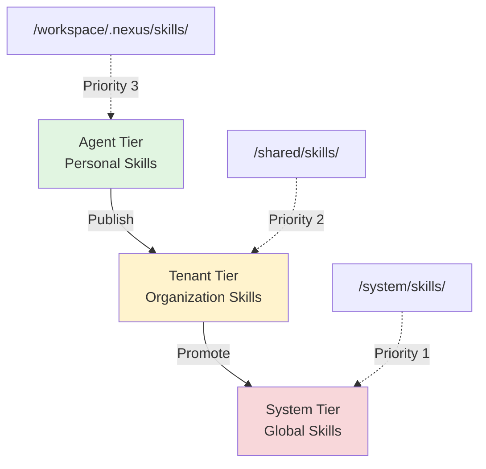
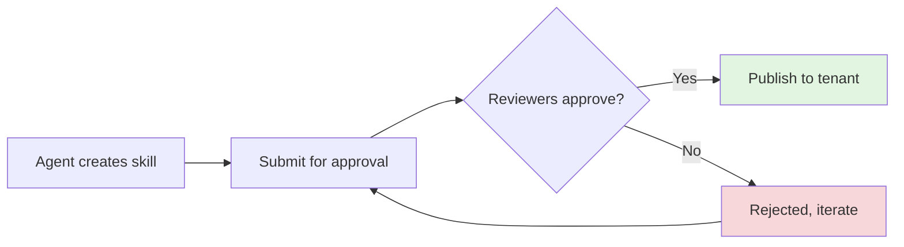

# Skills System

## What are Skills?

**Skills** are reusable AI capabilities that agents can discover, fork, customize, and share. Think of them as "packages" or "libraries" for AI agents - encapsulated knowledge about how to perform specific tasks.

### Why Skills?

| Without Skills | With Skills |
|----------------|-------------|
| ❌ Repeat prompts for common tasks | ✅ Reusable, versioned capabilities |
| ❌ No sharing between agents | ✅ Organization-wide skill libraries |
| ❌ No quality control | ✅ Governance and approvals |
| ❌ Knowledge silos | ✅ Collaborative improvement |

**Key Innovation:** Package AI knowledge into discoverable, forkable, governable skills.

---

## Three-Tier Hierarchy

Skills are organized in a **three-tier hierarchy** by scope:



### Tier Levels

| Tier | Path | Priority | Purpose | Visibility |
|------|------|----------|---------|------------|
| **Agent** | `/workspace/.nexus/skills/` | 3 (highest) | Personal customizations | Private to agent |
| **Tenant** | `/shared/skills/` | 2 | Organization-wide | Shared across org |
| **System** | `/system/skills/` | 1 (fallback) | Global capabilities | Public to all |

**Discovery order:** Agent → Tenant → System (highest priority first)

---

## Skill Structure

### Skill Format (SKILL.md)

Skills are stored as Markdown files with YAML frontmatter:

```markdown
---
name: analyze-code
description: Analyzes code quality and identifies issues
version: 1.0.0
author: Alice
created_at: 2025-10-01T12:00:00Z
modified_at: 2025-10-01T12:00:00Z
requires:
  - base-parser
  - ast-analyzer
---

# Code Analysis Skill

## Overview
Analyzes code quality and identifies potential issues.

## Capabilities
- Static analysis
- Code metrics
- Issue detection

## Usage
```python
# Example code analysis
analyzer.analyze(code)
```
```

---

### Metadata Fields

**Required:**
- `name` - Unique identifier (alphanumeric, `-`, `_`)
- `description` - What the skill does

**Optional:**
- `version` - Semantic version (e.g., `1.0.0`, `1.1.0`)
- `author` - Creator name
- `created_at` - Creation timestamp
- `modified_at` - Last modification timestamp
- `requires` - List of skill dependencies
- `forked_from` - Original skill name (for lineage tracking)
- `parent_skill` - Parent skill for collaboration
- `published_from` - Source tier when published
- `published_at` - Publication timestamp

---

## Creating Skills

### From Template

```bash
# Create from template
nexus skills create my-skill \
    --description "My custom skill" \
    --template basic \
    --tier agent
```

**Available templates:**
- `basic` - Simple skill template
- `data-analysis` - Data processing and analysis
- `code-generation` - Code generation tasks
- `document-processing` - Document parsing and extraction
- `api-integration` - External API integration

---

### From Content

```python
from nexus.skills import SkillManager

manager = SkillManager(filesystem=nx, registry=registry)

# Create skill from custom content
await manager.create_skill_from_content(
    name="stripe-api",
    description="Stripe API Documentation",
    content="""# Stripe API

## Overview
Complete Stripe payment processing documentation.

## Endpoints
- Create payment intent
- Retrieve customer
- List charges
""",
    source_url="https://docs.stripe.com/api",
    tier="agent"
)
```

---

### Python API

```python
# Create skill
path = await manager.create_skill(
    name="my-skill",
    description="My custom skill",
    template="basic",
    tier="agent",
    author="Alice",
    creator_id="alice-id",
    creator_type="agent",
    tenant_id="org-1"
)

print(path)  # /workspace/.nexus/skills/my-skill/SKILL.md
```

---

## Discovering and Using Skills

### List Skills

```bash
# List all skills
nexus skills list

# Filter by tier
nexus skills list --tier agent
nexus skills list --tier tenant
nexus skills list --tier system

# Output:
# my-analyzer (agent) - Custom code analyzer
# analyze-code (tenant) - Shared org analyzer
# base-parser (system) - System-wide parser
```

---

### Search Skills

```bash
# Search by keyword
nexus skills search "code analysis"

# Output (ranked by relevance):
# 1. analyze-code (0.95) - Analyzes code quality
# 2. my-analyzer (0.87) - Custom code analyzer
# 3. code-metrics (0.75) - Code complexity metrics
```

---

### Load Skill

```python
from nexus.skills import SkillRegistry

registry = SkillRegistry(filesystem=nx)

# Discover all skills (loads metadata only)
await registry.discover()

# Get specific skill (loads full content)
skill = await registry.get_skill("analyze-code")

print(skill.metadata.description)
print(skill.content)  # Full markdown content
```

---

## Forking and Collaboration

### Fork a Skill

**Forking** creates a personal copy you can customize:

```bash
# Fork skill to agent tier
nexus skills fork analyze-code my-analyzer
```

**Python API:**

```python
# Fork skill
await manager.fork_skill(
    source_name="analyze-code",
    target_name="my-analyzer",
    tier="agent",
    author="Bob",
    creator_id="bob-id"
)
```

**What happens when you fork:**

1. **Copy content** from source skill
2. **Increment version** (e.g., `1.0.0` → `1.1.0`)
3. **Add lineage metadata**:
   ```yaml
   forked_from: analyze-code
   parent_skill: analyze-code
   ```
4. **Preserve dependencies** from source
5. **Assign ownership** to fork creator (ReBAC)
6. **Deduplicate content** via CAS (if unchanged)

---

### Collaboration Pattern

```
1. Fork public skill
   ├─ nexus skills fork analyze-code my-analyzer
   │
2. Customize locally
   ├─ Edit /workspace/.nexus/skills/my-analyzer/SKILL.md
   │
3. Test and iterate
   ├─ Use in agents, refine
   │
4. Submit for approval (governance)
   ├─ nexus skills submit-approval my-analyzer
   │
5. Publish to tenant tier (after approval)
   └─ nexus skills publish my-analyzer
```

---

## Versioning

### Semantic Versioning

Skills use **semantic versioning** (`MAJOR.MINOR.PATCH`):

```
1.0.0 → Initial version
1.0.1 → Bug fix
1.1.0 → New feature (backward compatible)
2.0.0 → Breaking change
```

**Version bumping on fork:**
```python
# Source skill version: 1.0.0
# Fork increments minor: 1.1.0
# Next fork: 1.2.0
```

---

### Version Tracking

```yaml
# Version metadata
version: 1.2.0
created_at: 2025-10-01T12:00:00Z   # Original creation
modified_at: 2025-10-15T14:30:00Z  # Last modification
```

**CAS deduplication:**
- If fork doesn't modify content, CAS reuses same content blob
- Only metadata is duplicated
- Storage efficient!

---

## Governance and Approvals

### Why Governance?

Prevent unapproved or untested skills from spreading across organization.

**Governance workflow:**



---

### Submit for Approval

```bash
# Submit skill for review
nexus skills submit-approval my-analyzer \
    --reviewers bob,charlie \
    --comments "Ready for org-wide use"
```

**Python API:**

```python
from nexus.skills import SkillGovernance

gov = SkillGovernance(filesystem=nx, rebac_manager=rebac)

# Submit for approval
approval_id = await gov.submit_for_approval(
    skill_name="my-analyzer",
    submitted_by="alice",
    reviewers=["bob", "charlie"],
    comments="Ready for org-wide use"
)
```

---

### Review and Approve

```bash
# List pending approvals
nexus skills list-approvals --pending

# Approve skill
nexus skills approve-skill <approval_id> \
    --comments "Code quality is excellent!"

# Reject skill
nexus skills reject-skill <approval_id> \
    --reason "Needs better documentation"
```

**Python API:**

```python
# Reviewer approves
await gov.approve_skill(
    approval_id,
    reviewed_by="bob",
    comments="Looks great!",
    reviewer_type="user",
    tenant_id="org-1"
)

# Check approval status
is_approved = await gov.is_approved("my-analyzer")
```

---

### Approval Status

```python
@dataclass
class SkillApproval:
    approval_id: str
    skill_name: str
    submitted_by: str
    status: ApprovalStatus  # PENDING, APPROVED, REJECTED
    reviewers: list[str]
    comments: str | None
    submitted_at: datetime
    reviewed_at: datetime | None
    reviewed_by: str | None
```

---

## Publishing Skills

### Publish to Higher Tier

**Publishing** promotes a skill from lower tier to higher tier:

```bash
# Publish from agent → tenant (default)
nexus skills publish my-analyzer

# Publish from agent → system
nexus skills publish my-analyzer --to system
```

**Python API:**

```python
# Publish skill (requires approval)
await manager.publish_skill(
    name="my-analyzer",
    source_tier="agent",
    target_tier="tenant",
    publisher_id="alice-id",
    publisher_type="agent",
    tenant_id="org-1"
)
```

**Requirements:**
1. **Approval required** - Skill must be approved first
2. **Permission check** - Publisher must have "publish" permission
3. **Metadata update** - Adds `published_from` and `published_at`

---

## Permissions (ReBAC Integration)

### Skill Permissions

Skills use **ReBAC** for fine-grained access control:

| Permission | Who Can | Purpose |
|------------|---------|---------|
| `read` | Anyone (with access to tier) | View skill |
| `write` | Owner | Edit skill |
| `fork` | Any user | Create personal copy |
| `publish` | Approved users | Promote to higher tier |
| `approve` | Reviewers | Approve/reject submissions |

---

### Permission Examples

```python
# Grant Alice ownership of her skill
rebac.write(
    subject=("agent", "alice"),
    relation="owner-of",
    object=("skill", "my-analyzer"),
    tenant_id="org-1"
)

# Make system skill public
rebac.write(
    subject=("*", "*"),        # Wildcard = everyone
    relation="public",
    object=("skill", "base-parser"),
    tenant_id=None             # Global scope
)

# Grant tenant access
rebac.write(
    subject=("tenant", "org-1"),
    relation="tenant",
    object=("skill", "shared-analyzer"),
    tenant_id="org-1"
)
```

---

## Dependencies

### Declaring Dependencies

Skills can depend on other skills:

```yaml
---
name: advanced-analyzer
requires:
  - base-parser
  - ast-analyzer
  - code-metrics
---
```

---

### Loading with Dependencies

```python
# Load skill with all dependencies
skill = await registry.get_skill(
    "advanced-analyzer",
    load_dependencies=True
)

# Dependencies are loaded recursively
for dep in skill.metadata.requires:
    dep_skill = await registry.get_skill(dep)
```

**Dependency resolution:**
- **DAG (Directed Acyclic Graph)** - No circular dependencies allowed
- **Priority order** - Agent → Tenant → System
- **Recursive loading** - All transitive dependencies loaded

---

## Export and Packaging

### Export Skill

```bash
# Export skill as .zip
nexus skills export my-analyzer \
    --output ./my-analyzer.zip \
    --format claude \
    --include-dependencies
```

**Python API:**

```python
from nexus.skills import SkillExporter

exporter = SkillExporter(registry)

# Export with dependencies
zip_bytes = await exporter.export_skill(
    name="my-analyzer",
    output_path="/tmp/my-analyzer.zip",
    format="claude",              # Enforces 8MB limit
    include_dependencies=True
)
```

---

### Export Formats

| Format | Size Limit | Purpose |
|--------|------------|---------|
| `claude` | 8MB | Claude Skills API |
| `generic` | None | General export |

---

### Package Structure

```
my-analyzer.zip
├── SKILL.md                    # Main skill
├── dependencies/
│   ├── base-parser/
│   │   └── SKILL.md
│   └── ast-analyzer/
│       └── SKILL.md
└── manifest.json               # Export metadata
```

---

## Claude/Anthropic Integration

### Anthropic Plugin

The `nexus-plugin-anthropic` integrates with Claude Skills API:

```bash
# Upload skill to Claude
nexus anthropic upload-skill my-analyzer

# Download skill from Claude
nexus anthropic download-skill <skill-id>

# List skills on Claude
nexus anthropic list-skills

# Delete skill from Claude
nexus anthropic delete-skill <skill-id>
```

---

### Import from GitHub

```bash
# Browse Anthropic's official skills repo
nexus anthropic browse-github

# Import specific skill
nexus anthropic import-github text-analysis
```

---

### Claude Compatibility

The plugin filters SKILL.md for Claude API compatibility:

**Allowed fields:**
- `name`
- `description`
- `license`
- `allowed-tools`
- `metadata`

**Removed fields:**
- `version`, `author`, `created_at`, `modified_at`, `requires`, etc.

**Size limit:** 8MB (enforced during export)

---

## Analytics and Audit Logging

### Track Usage

```python
from nexus.skills import SkillAnalyticsTracker

tracker = SkillAnalyticsTracker()

# Track skill execution
await tracker.track_usage(
    skill_name="analyze-code",
    agent_id="agent-1",
    tenant_id="org-1",
    execution_time=2.5,
    success=True
)
```

---

### Analytics Data

```python
@dataclass
class SkillAnalytics:
    skill_name: str
    usage_count: int
    success_count: int
    failure_count: int
    success_rate: float           # success / total
    avg_execution_time: float
    unique_users: int
    last_used: datetime
```

---

### Audit Log

```python
@dataclass
class AuditLogEntry:
    audit_id: str
    skill_name: str
    action: AuditAction  # CREATED, EXECUTED, FORKED, PUBLISHED, DELETED
    agent_id: str
    tenant_id: str
    details: dict
    timestamp: datetime
```

---

## Best Practices

### 1. Use Descriptive Names

```yaml
# ✅ Good
name: analyze-python-code

# ❌ Bad
name: analyzer1
```

---

### 2. Document Dependencies

```yaml
# ✅ Good
requires:
  - base-parser  # Parses Python AST
  - code-metrics # Calculates complexity
```

---

### 3. Version Semantically

```yaml
# ✅ Good: Semantic versioning
version: 1.2.3

# ❌ Bad: Arbitrary versioning
version: v2-updated
```

---

### 4. Test Before Publishing

```bash
# ✅ Good: Test locally first
nexus skills create my-skill
# ... test in agents ...
nexus skills submit-approval my-skill

# ❌ Bad: Publish without testing
nexus skills publish my-skill  # Untested!
```

---

### 5. Use Templates

```bash
# ✅ Good: Start from template
nexus skills create my-skill --template data-analysis

# ❌ Bad: Write from scratch
# (Miss important structure)
```

---

## Troubleshooting

### Skill Not Found

**Problem:** `await registry.get_skill("my-skill")` returns None

**Solutions:**
1. Check skill exists:
   ```bash
   nexus skills list
   ```

2. Check tier:
   ```bash
   nexus skills list --tier agent
   ```

3. Rediscover:
   ```python
   await registry.discover()
   ```

---

### Fork Failed

**Problem:** Fork operation fails

**Check:**
1. Permission:
   ```python
   has_perm = await rebac.check(
       subject=("agent", "bob"),
       permission="fork",
       object=("skill", "analyze-code")
   )
   ```

2. Source skill exists:
   ```python
   skill = await registry.get_skill("analyze-code")
   ```

---

### Publish Rejected

**Problem:** Publish fails with "not approved"

**Solution:** Submit for approval first:
```bash
nexus skills submit-approval my-skill
nexus skills approve-skill <approval-id>
nexus skills publish my-skill
```

---

## FAQ

### Q: Can I use skills across tenants?

**A**: System-tier skills are global. Tenant-tier skills are scoped to that tenant only.

### Q: What happens if I delete a skill that others depend on?

**A**: Dependency checking prevents deletion of skills with dependents. You must remove dependents first.

### Q: Can I fork a system skill?

**A**: Yes! Fork to agent tier, customize, then optionally publish back.

### Q: How do I share skills with external teams?

**A**: Export as .zip, share file, they import into their Nexus.

### Q: Does forking copy dependencies?

**A**: Yes, the `requires` field is preserved. Dependencies are shared (not duplicated) via CAS.

---

## Next Steps

- **[Plugin System](plugin-system.md)** - Anthropic plugin for Claude integration
- **[Agent Permissions](agent-permissions.md)** - ReBAC for skills
- **[Content-Addressable Storage](content-addressable-storage.md)** - How skills are deduplicated
- **[API Reference: Skills API](/api/skills-api/)** - Complete API docs

---

## Related Files

- Models: `src/nexus/skills/models.py:1`
- Registry: `src/nexus/skills/registry.py:1`
- Manager: `src/nexus/skills/manager.py:1`
- Governance: `src/nexus/skills/governance.py:1`
- Templates: `src/nexus/skills/templates.py:1`
- Exporter: `src/nexus/skills/exporter.py:1`
- Analytics: `src/nexus/skills/analytics.py:1`
- CLI: `src/nexus/cli/commands/skills.py:1`
- Anthropic Plugin: `nexus-plugin-anthropic/src/nexus_anthropic/plugin.py:1`
- Tests: `tests/unit/skills/test_skill_manager.py:1`
