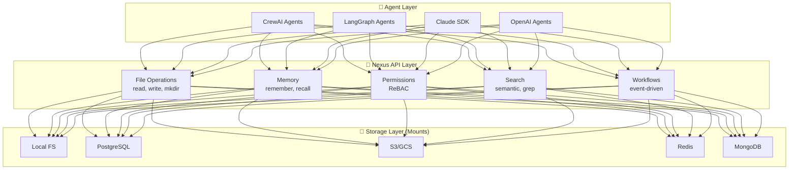
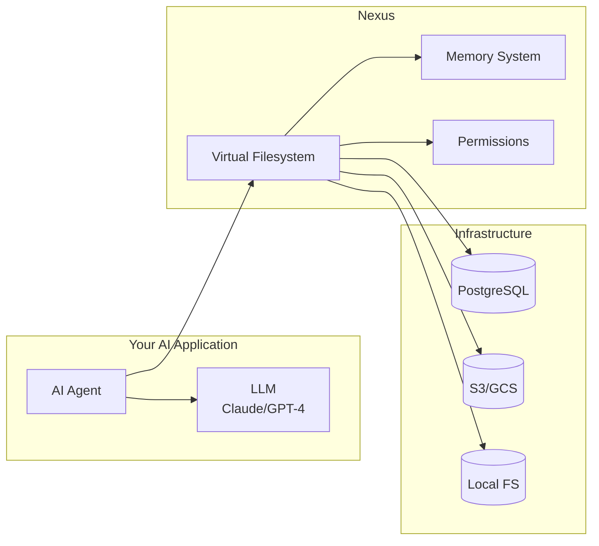

# What is Nexus?

## The Big Picture

Nexus is an **AI-Native Filesystem** - a programmable storage layer designed specifically for building intelligent agents. Think of it as a filesystem that "thinks" - combining traditional file operations with AI-specific capabilities like memory, permissions, and learning.

## Mental Model: Three Layers



### Layer 1: Agent Layer (Your Code)
Your AI agents (CrewAI, LangGraph, custom) interact with Nexus through simple APIs. They don't need to know about backends, permissions, or storage - just like your code doesn't need to know about disk sectors.

### Layer 2: Nexus API Layer (The Intelligence)
This is where Nexus adds AI-native capabilities:
- **File Operations**: POSIX-like API (read, write, mkdir, ls)
- **Memory**: Agents remember context across sessions
- **Permissions**: Fine-grained access control (ReBAC)
- **Search**: Semantic search + traditional grep/glob
- **Workflows**: Event-driven automation (triggers on file changes)

### Layer 3: Storage Layer (The Backends)
Nexus routes operations to different backends through **mounts**:
- `/workspace/local/*` → Local filesystem
- `/workspace/db/*` → PostgreSQL (query as files!)
- `/workspace/cloud/*` → S3/GCS
- `/workspace/cache/*` → Redis
- `/workspace/docs/*` → MongoDB

**Key insight**: One API, multiple backends. Switch from local to S3 without changing your agent code.

---

## Core Concepts at a Glance

| Concept | What It Does | Why It Matters |
|---------|-------------|----------------|
| **Virtual Filesystem (VFS)** | Unified API across all storage backends | Write once, run anywhere (local → cloud) |
| **Mounts** | Route paths to different backends | `/workspace/db/*` → PostgreSQL, `/workspace/s3/*` → S3 |
| **Sandboxes** | Secure code execution environments | Run Python/JS/Bash safely in isolated sandboxes |
| **ReBAC** | Relationship-Based Access Control | Multi-agent teams with fine-grained permissions |
| **Memory** | Agent context persistence | Agents remember across sessions |
| **CAS** | Content-Addressable Storage | Automatic deduplication, version history |
| **Workflows** | Event-driven automation | Trigger actions on file writes |
| **Skills** | Versioned agent capabilities | Agents improve and share knowledge |
| **Learning Loops** | Agent self-improvement | Agents learn from feedback |

---

## How Nexus Fits in Your Stack



**Nexus sits between your agents and infrastructure**, providing:
1. **Abstraction**: One API for all storage (local, cloud, databases)
2. **Intelligence**: Memory, search, permissions built-in
3. **Scalability**: Start local, scale to cloud without code changes

---

## Key Design Principles

### 1. **AI-First, Not Filesystem-First**
Traditional filesystems were designed for humans and applications. Nexus is designed for **AI agents**:
- ✅ Agents need memory → Built-in memory system
- ✅ Agents need context → Semantic search + citations
- ✅ Agents collaborate → Multi-agent permissions (ReBAC)
- ✅ Agents learn → Learning loops and feedback management

### 2. **Progressive Disclosure**
Start simple, grow complex:
```python
from nexus import NexusFS, LocalBackend, RemoteNexusFS

# Start: Local filesystem
backend = LocalBackend(root_path="/tmp/nexus-data")
nx = NexusFS(backend=backend, is_admin=True)

# Grow: Add remote server
nx = RemoteNexusFS(server_url="http://localhost:8080", api_key="...")

# Scale: Multi-backend mounts
nx.mount("/workspace/db", PostgreSQLBackend(...))
nx.mount("/workspace/s3", S3Backend(...))
```

### 3. **Backend-Agnostic**
Your agent code doesn't change when you switch backends:
```python
# Works the same whether backend is local, S3, or PostgreSQL
nx.write("/workspace/data/report.txt", content)
data = nx.read("/workspace/data/report.txt")
```

### 4. **Algorithm-Agnostic Learning**
Nexus doesn't dictate *how* your agents learn - it provides primitives:
- Memory storage (namespace-based, identity-based)
- Feedback tracking (thumbs up/down, corrections)
- Trajectory recording (agent action histories)
- You implement your learning algorithm (reinforcement, fine-tuning, RAG, etc.)

---

## Common Use Cases

### 🤖 Multi-Agent Systems
**Problem**: Agents need shared workspace + individual memory + permissions
**Solution**: Nexus provides isolated workspaces with ReBAC

```python
# Agent 1: Researcher (read-only access)
nx.rebac.grant("agent1", "reader", "file", "/workspace/research")

# Agent 2: Writer (full access)
nx.rebac.grant("agent2", "owner", "file", "/workspace/research")
```

### 🧠 Persistent Agent Memory
**Problem**: Chatbots forget context between sessions
**Solution**: Nexus memory API

```python
# Agent remembers user preferences
nx.memory.store("user123", "preferences", {"theme": "dark", "lang": "python"})

# Later session - agent recalls
prefs = nx.memory.retrieve("user123", "preferences")
```

### 🔍 Semantic Search
**Problem**: Agents need to find relevant documents
**Solution**: Built-in vector search

```python
# Find documents about "authentication"
results = nx.semantic_search("/workspace/docs", query="how to authenticate users")
```

### 🌊 Event-Driven Workflows
**Problem**: Trigger actions when files change
**Solution**: Workflow system

```python
# Auto-process CSV uploads
nx.workflows.create(
    trigger="write:/workspace/uploads/*.csv",
    action="process_csv"
)
```

---

## What Nexus Is NOT

| ❌ Not This | ✅ Actually This |
|------------|-----------------|
| A vector database | A filesystem with vector search built-in |
| A replacement for your LLM | A storage + memory layer for your LLM agents |
| Just object storage (S3) | Multi-backend VFS (S3 + PostgreSQL + local + Redis + MongoDB) |
| A learning algorithm | Primitives for building learning systems |
| A framework (like LangChain) | Infrastructure that frameworks integrate with |

---

## How to Think About Nexus

### Analogy 1: "Git for AI Agents"
- **Git**: Version control for code, branching, merging
- **Nexus**: Version control for agent workspaces, content-addressable storage, time travel

### Analogy 2: "POSIX + Memory + Permissions"
- **POSIX**: File API (open, read, write, mkdir)
- **+Memory**: Agents remember context
- **+Permissions**: Multi-agent access control (ReBAC)

### Analogy 3: "Kubernetes for Agent Storage"
- **Kubernetes**: Container orchestration, declarative, scales
- **Nexus**: Storage orchestration, declarative mounts, scales (local → cloud)

---

## Quick Example: 60 Seconds to Running Agent

```python
from nexus import NexusFS, LocalBackend

# 1. Create filesystem with local backend
backend = LocalBackend(root_path="/tmp/nexus-data")
nx = NexusFS(backend=backend, is_admin=True)  # Admin mode for quick start

# 2. Store data
nx.mkdir("/workspace/agent1")
nx.write("/workspace/agent1/notes.txt", b"Remember: user prefers Python")

# 3. Agent reads memory
notes = nx.read("/workspace/agent1/notes.txt")
print(notes)  # b"Remember: user prefers Python"

# 4. Agent updates memory
nx.write("/workspace/agent1/notes.txt", b"User prefers Python, uses VSCode")

# 5. Check version history
versions = nx.stat("/workspace/agent1/notes.txt").versions
print(f"File has {len(versions)} versions")
```

---

## Next Steps

### Understand the Fundamentals
1. **[Memory System](memory-system.md)** - How agents remember
2. **[Sandbox Management](sandbox-management.md)** - Secure code execution
3. **[Agent Permissions](agent-permissions.md)** - How agents collaborate
4. **[ReBAC Explained](rebac-explained.md)** - Fine-grained access control
5. **[Content-Addressable Storage](content-addressable-storage.md)** - Deduplication + versioning

### Explore Use Cases
- **[AI Agent Memory (Learning Path)](../learning-paths/ai-agent-memory.md)** - 15-minute tutorial
- **[Multi-Agent Collaboration](../learning-paths/multi-agent-collab.md)** - Build agent teams
- **[CrewAI Integration](../examples/crewai/)** - Production example

### Go Deep
- **[Mounts & Backends](mounts-and-backends.md)** - Multi-backend routing
- **[Workflows](workflows-vs-triggers.md)** - Event-driven automation
- **[Learning Loops](learning-loops.md)** - Agent self-improvement

---

## Frequently Asked Questions

### Q: Is Nexus a database?
**A**: No, but it can use databases as backends. Nexus is a **Virtual Filesystem** that routes operations to backends (PostgreSQL, S3, local FS, Redis, MongoDB). You can even query PostgreSQL databases as files!

### Q: Do I need to change my agent code to scale?
**A**: No. Start with local storage, add mounts to scale to S3/GCS. Your agent code stays the same:
```python
nx.read("/workspace/data.txt")  # Works on local, S3, PostgreSQL
```

### Q: How is this different from LangChain?
**A**: LangChain is a **framework** for building agents. Nexus is **infrastructure** - the storage + memory layer. They work together:
- LangChain: Chains, prompts, LLM orchestration
- Nexus: Persistent storage, memory, permissions

### Q: Can I use Nexus without AI agents?
**A**: Yes! Nexus is useful for any application needing:
- Multi-backend storage abstraction
- Content deduplication (CAS)
- Fine-grained permissions (ReBAC)
- Event-driven workflows

### Q: Is this production-ready?
**A**: Yes. Nexus is used in production for:
- Multi-tenant SaaS applications
- AI agent platforms
- Document processing pipelines
- See: [Production Deployment Guide](../production/deployment.md)

---

## Glossary Quick Reference

- **VFS**: Virtual Filesystem - unified API across backends
- **Mount**: Route a path prefix to a specific backend
- **Sandbox**: Ephemeral code execution environment (E2B, Docker, Modal)
- **ReBAC**: Relationship-Based Access Control (Zanzibar-style)
- **CAS**: Content-Addressable Storage - deduplicate by content hash
- **Workspace**: Isolated storage namespace for agents/tenants
- **Session**: Time-bound agent interaction context
- **Skill**: Versioned agent capability (with hierarchy: skill → versions → entries)
- **Trajectory**: Recorded history of agent actions
- **Learning Loop**: Agent self-improvement through feedback

For full definitions, see [Glossary](../glossary.md).
