# Agentic Context Engineering (ACE)

Learn how AI agents can learn from experience using Nexus ACE - an implementation of Agentic Context Engineering that enables agents to improve through self-reflection and memory.

## 🎯 What is ACE?

**Agentic Context Engineering (ACE)** is a framework that enables AI agents to:

- **Learn from experience** through self-reflection
- **Store learned strategies** in a persistent playbook
- **Improve over time** without retraining models
- **Adapt to new tasks** using accumulated knowledge

Nexus ACE provides a complete implementation with:

- **Trajectory tracking** - Record agent actions and outcomes
- **Reflection API** - Extract insights from experiences
- **Playbook curation** - Store and retrieve learned strategies
- **Memory consolidation** - Build knowledge over multiple iterations

## 📊 Demo: Data Validator

The ACE demo shows an agent learning data validation rules from scratch. Starting with **60% accuracy** and improving to **95%** through automated learning.

### What the Demo Shows

An AI agent that:

1. Starts with **zero validation knowledge**
2. Processes real-world data (Titanic dataset)
3. **Learns from mistakes** through reflection
4. Builds a comprehensive validation playbook
5. Achieves **+35% accuracy improvement** over 10 epochs

### Quick Start

```bash
# Install dependencies
cd examples/ace
pip install -r requirements.txt

# Run the demo (with fresh start)
python demo_3_data_validator.py --epochs 10 --reset

# Continue training from existing playbook
python demo_3_data_validator.py --epochs 10
```

!!! tip "First Run"
    Use the `--reset` flag to see learning from scratch. Without it, the agent reuses existing strategies and may start at 100% accuracy.

## 🔬 How It Works

### The ACE Learning Loop

```mermaid
graph TB
    Start([🎯 Start<br/>Accuracy: 60%]) --> Load[📖 Load Playbook<br/>Retrieve strategies]

    Load --> Execute[⚙️ Execute & Measure<br/>Process data<br/>Track trajectory]

    Execute --> Reflect[🤔 Reflect<br/>What worked?<br/>What failed?]

    Reflect --> Helpful[✅ Helpful Strategies<br/>Store successes]
    Reflect --> Harmful[❌ Harmful Patterns<br/>Mark failures]

    Helpful --> Curate[🎯 Curate Playbook<br/>Update memory]
    Harmful --> Curate

    Curate --> Next{Next<br/>Epoch?}

    Next -->|Yes| Improve([📈 Improved<br/>Accuracy: 95%])
    Next -->|No| Done([🎉 Complete])

    Improve --> Load

    style Start fill:#e1f5ff,stroke:#0288d1,stroke-width:3px
    style Execute fill:#e8f5e9,stroke:#388e3c,stroke-width:2px
    style Reflect fill:#fce4ec,stroke:#c2185b,stroke-width:2px
    style Curate fill:#b39ddb,stroke:#512da8,stroke-width:2px
    style Improve fill:#a5d6a7,stroke:#2e7d32,stroke-width:3px
```



### Core ACE APIs

#### 1. Start Trajectory

Track an agent's actions and context:

```python
import nexus

nx = nexus.connect(config={"data_dir": "./nexus-data"})

# Start tracking
traj_id = nx.memory.start_trajectory(
    task_description="Validate customer records",
    context={
        "dataset": "customers.csv",
        "agent": "validator-v1"
    }
)

# Agent performs work
results = validate_records(records)

# Complete with outcome
nx.memory.complete_trajectory(
    traj_id,
    status="success",
    success_score=0.85,
    metadata={"processed": 100, "valid": 85}
)
```

#### 2. Reflect on Experience

Extract insights from completed trajectories:

```python
# Agent reflects on what worked
reflection = nx.memory.reflect(
    trajectory_id=traj_id,
    reflection_prompt="What validation rules were most effective?"
)

print(reflection.summary)
# Output: "Checking for null values in required fields prevented 40% of errors"

print(reflection.helpful_strategies)
# ["Validate email format", "Check age range 0-120", ...]

print(reflection.harmful_strategies)
# ["Skip validation for trusted sources", ...]
```

#### 3. Curate Playbook

Store learned strategies for future use:

```python
# Add reflection to playbook
nx.memory.curate_playbook(
    reflection_ids=[reflection.id],
    playbook_name="data_validation",
    update_mode="merge"
)

# Retrieve strategies for next run
strategies = nx.memory.get_playbook("data_validation")

for strategy in strategies:
    print(f"[{strategy.confidence:.0%}] {strategy.content}")
# Output:
# [95%] Check required fields: Name, Email, Age
# [92%] Validate age range: 0-120 years
# [88%] Verify email format with regex
```

#### 4. Consolidate Memory

Merge similar strategies over time:

```python
# Consolidate after multiple epochs
nx.memory.consolidate(
    playbook_name="data_validation",
    similarity_threshold=0.8
)
```

## 📈 Expected Results

### Learning Progression

| Epoch | Accuracy | What Agent Learned |
|-------|----------|-------------------|
| 0 | 60% | No validation rules (baseline) |
| 2 | 72% | Required field checks |
| 4 | 84% | Range validation |
| 6 | 90% | Format validation |
| 8 | 94% | Edge case handling |
| 10 | 95% | Complete validation suite |

### Learned Validation Rules

After training, the agent's playbook contains:

✅ **Helpful Strategies**

- Check required fields: Name, Sex, Age
- Validate age range: 0-100 years
- Reject negative fare values
- Sex must be 'male' or 'female'
- Validate against empty strings

❌ **Harmful Patterns**

- AVOID accepting missing ages
- AVOID skipping numeric range checks
- AVOID accepting arbitrary categorical values

## 🛠️ Customization

### Use Your Own Dataset

```python
from datasets import load_dataset
import pandas as pd

# Load any HuggingFace dataset
dataset = load_dataset("your_org/your_dataset")
df = pd.DataFrame(dataset["train"])

# Define validation ground truth
ground_truth = create_ground_truth(df)

# Run ACE learning
run_validation_task(df, ground_truth, playbook_strategies)
```

### Adjust Learning Parameters

```python
# Customize the learning process
config = {
    "epochs": 20,                    # More training iterations
    "batch_size": 50,                # Process in batches
    "reflection_depth": "detailed",  # More thorough analysis
    "consolidation_threshold": 0.85  # Merge similar strategies
}
```

### Custom Reward Signal

```python
# Define your own success metric
def compute_reward(predictions, ground_truth):
    accuracy = compute_accuracy(predictions, ground_truth)
    precision = compute_precision(predictions, ground_truth)
    recall = compute_recall(predictions, ground_truth)

    # Weighted combination
    return 0.5 * accuracy + 0.3 * precision + 0.2 * recall
```

## 💡 Real-World Applications

### Customer Support Agent

Agent learns effective responses through ACE:

```python
# Track support interactions
traj_id = nx.memory.start_trajectory("Handle customer inquiry")

# Agent provides response
response = agent.generate_response(customer_query)
satisfaction_score = customer.rate_response()

# Complete trajectory with feedback
nx.memory.complete_trajectory(
    traj_id,
    status="success",
    success_score=satisfaction_score
)

# Reflect and improve
reflection = nx.memory.reflect(traj_id)
nx.memory.curate_playbook([reflection.id], "support_agent")
```

### Code Review Bot

Learn effective code review patterns:

```python
# Track review process
traj_id = nx.memory.start_trajectory("Review pull request #123")

# Generate review comments
comments = bot.review_code(pull_request)

# Get feedback from developer
feedback = developer.rate_review(comments)

# Learn from feedback
nx.memory.complete_trajectory(traj_id, success_score=feedback)
reflection = nx.memory.reflect(traj_id)
nx.memory.curate_playbook([reflection.id], "code_reviewer")
```

### Sales Lead Qualifier

Improve lead scoring over time:

```python
# Track qualification process
traj_id = nx.memory.start_trajectory("Qualify lead")

# Agent scores lead
score = agent.qualify_lead(lead_data)

# Get actual outcome (did they convert?)
actual_conversion = track_conversion(lead_data.id, days=30)

# Learn from outcome
success = 1.0 if actual_conversion else 0.0
nx.memory.complete_trajectory(traj_id, success_score=success)
nx.memory.curate_playbook([nx.memory.reflect(traj_id).id], "lead_qualifier")
```

## 📚 Learn More

- **ACE Paper**: [Agentic Context Engineering (arXiv)](https://arxiv.org/abs/2510.04618)
- **Nexus ACE Design**: See `docs/design/ACE_INTEGRATION.md` in the repository
- **Demo Code**: See `examples/ace/demo_3_data_validator.py`

## 🐛 Troubleshooting

### Dataset Download Issues

The demo automatically falls back to synthetic data if HuggingFace download fails:

```python
# Demo handles this automatically
# Or specify a local dataset
dataset_path = "./local_data.csv"
```

### Memory Issues with Large Datasets

Use sampling for large datasets:

```python
# Sample records for faster training
df = df.sample(n=500, random_state=42)
```

### Nexus Connection

Ensure Nexus is accessible:

```bash
# Start local Nexus
nexus serve --data-dir ./nexus_data

# Or connect to remote server
export NEXUS_URL=http://your-server:8080
export NEXUS_API_KEY=your-api-key
```

## 🎓 Understanding ACE

### Why It Works

1. **Clear Reward Signal** - Validation accuracy is objective and measurable
2. **Immediate Feedback** - Agent sees results instantly after each epoch
3. **Pattern Recognition** - ACE identifies consistently effective strategies
4. **Cumulative Learning** - Each epoch builds on previous knowledge

### Key Principles

- **Experience over Rules** - Learn from doing, not from predefined rules
- **Reflection over Fine-tuning** - Extract insights without model retraining
- **Memory over State** - Persist knowledge across sessions
- **Iteration over Perfection** - Improve gradually through multiple cycles

## 🚀 Next Steps

1. **Run the demo** - See ACE in action with `python demo_3_data_validator.py --reset`
2. **Try your data** - Replace Titanic with your validation task
3. **Build your agent** - Integrate ACE into your agent workflow
4. **Measure improvement** - Compare ACE vs. hard-coded rules

---

**Powered by Nexus ACE** 🧠 - Making agents learn from experience
