# CrewAI + Nexus Integration

Build collaborative multi-agent AI systems with CrewAI that leverage Nexus for persistent storage, memory, and coordination. Enable agents to work together, learn from experience, and maintain context across sessions.

## 🎯 What is CrewAI + Nexus?

**CrewAI** is a framework for orchestrating role-based AI agent teams. Combined with **Nexus**, it provides:

- **Persistent filesystem access** - Agents can search, read, and write files
- **Memory API** - Store and retrieve learnings across sessions
- **Semantic search** - Find relevant documents using natural language
- **Multi-agent collaboration** - Agents share data via Nexus namespaces
- **Remote execution** - Work with files on shared Nexus servers
- **Production-ready patterns** - ReBAC permissions and multi-tenancy

Nexus provides the infrastructure layer for CrewAI agents to:

- **Store long-term memories** that persist across sessions
- **Coordinate work** through shared file workspaces
- **Build knowledge** incrementally over time
- **Search semantically** across documents and memories
- **Collaborate securely** with fine-grained permissions

## 📊 Demo: Multi-Agent Collaboration

The CrewAI demo shows three collaborative scenarios demonstrating how agents can work together using Nexus as their shared infrastructure.

### What the Demo Shows

Three demo scenarios:

1. **File Analysis Agent** - Searches for code patterns, analyzes files, and creates reports
2. **Research Agent with Memory** - Uses semantic search to find documents, stores insights for future reference
3. **Multi-Agent Collaboration** - Two agents work together: one collects data, another analyzes and generates recommendations

### Quick Start

```bash
# Install dependencies
cd examples/crewai
pip install -r requirements.txt

# Terminal 1: Start Nexus server
./start_nexus_server.sh

# Terminal 2: Set your LLM API key (choose one)
export ANTHROPIC_API_KEY="sk-ant-..."
# or
export OPENAI_API_KEY="sk-..."
# or
export OPENROUTER_API_KEY="sk-or-v1-..."

# Run the demo
./run_demo.sh
```

!!! tip "Remote Mode by Default"
    This demo uses **remote mode** - the Nexus server runs separately and agents connect via the SDK. This demonstrates production deployment patterns.

## 🔬 How It Works

### Multi-Agent Collaboration Pattern

```mermaid
graph TB
    Start([🎯 Task: Analyze TODO comments]) --> Collector[👷 Data Collector Agent<br/>Search for TODOs]

    Collector --> Tools1[🔧 Uses Tools<br/>grep_files, list_files]

    Tools1 --> Write1[💾 Write to Nexus<br/>/workspace/todo-collection.txt]

    Write1 --> Analyst[👨‍💼 Senior Analyst Agent<br/>Analyze collected data]

    Analyst --> Tools2[🔧 Uses Tools<br/>read_file, semantic_search]

    Tools2 --> Categorize[📊 Categorize & Prioritize<br/>Security, Performance, Features]

    Categorize --> Write2[💾 Write Report<br/>/reports/todo-analysis.md]

    Write2 --> Memory[🧠 Store Insights<br/>Memory API]

    Memory --> Done([✅ Complete])

    style Start fill:#e1f5ff,stroke:#0288d1,stroke-width:3px
    style Collector fill:#fce4ec,stroke:#c2185b,stroke-width:2px
    style Analyst fill:#f3e5f5,stroke:#7b1fa2,stroke-width:2px
    style Write1 fill:#e8f5e9,stroke:#388e3c,stroke-width:2px
    style Write2 fill:#e8f5e9,stroke:#388e3c,stroke-width:2px
    style Memory fill:#b39ddb,stroke:#512da8,stroke-width:2px
    style Done fill:#a5d6a7,stroke:#2e7d32,stroke-width:3px
```



### Nexus Tools for CrewAI

The demo provides eight tools that wrap Nexus operations:

#### 1. File Operations

**read_file** - Read file content from Nexus:

```python
from crewai.tools import tool

@tool("Read File")
def read_file(path: str) -> str:
    """Read a file from Nexus filesystem.

    Args:
        path: File path to read (e.g., '/workspace/data.txt')

    Returns:
        File content as string
    """
    return call_nexus_mcp("nexus_read_file", path=path)
```

**write_file** - Write content to Nexus:

```python
@tool("Write File")
def write_file(path: str, content: str) -> str:
    """Write content to a file in Nexus filesystem."""
    return call_nexus_mcp("nexus_write_file", path=path, content=content)
```

**list_files** - List directory contents:

```python
@tool("List Files")
def list_files(path: str = "/", recursive: bool = False) -> str:
    """List files in a directory."""
    return call_nexus_mcp("nexus_list_files", path=path, recursive=recursive)
```

#### 2. Search Operations

**glob_files** - Pattern-based file search:

```python
@tool("Search Files by Pattern")
def glob_files(pattern: str, path: str = "/") -> str:
    """Find files matching a glob pattern.

    Examples:
        - glob_files("*.py", "/workspace")  # Find all Python files
        - glob_files("**/*.md", "/docs")    # Find all markdown recursively
    """
    return call_nexus_mcp("nexus_glob", pattern=pattern, path=path)
```

**grep_files** - Content-based search:

```python
@tool("Search File Contents")
def grep_files(pattern: str, path: str = "/") -> str:
    """Search file contents using regex pattern.

    Examples:
        - grep_files("async def", "/workspace")  # Find async functions
        - grep_files("TODO:", "/")               # Find TODO comments
    """
    return call_nexus_mcp("nexus_grep", pattern=pattern, path=path)
```

**semantic_search** - Natural language search:

```python
@tool("Semantic Search")
def semantic_search(query: str, limit: int = 10) -> str:
    """Search files semantically using natural language.

    Examples:
        - semantic_search("authentication setup")
        - semantic_search("error handling patterns")
    """
    return call_nexus_mcp("nexus_semantic_search", query=query, limit=limit)
```

#### 3. Memory Operations

**store_memory** - Persist agent learnings:

```python
@tool("Store Memory")
def store_memory(content: str, memory_type: str = None, importance: float = 0.5) -> str:
    """Store a memory in Nexus for long-term learning.

    Args:
        content: Memory content to store
        memory_type: Optional category (e.g., 'insight', 'fact')
        importance: Importance score 0.0-1.0 (default: 0.5)

    Examples:
        - store_memory("Always validate input", "security_insight", 0.9)
        - store_memory("Prefer async for I/O operations", "pattern", 0.7)
    """
    return call_nexus_mcp("nexus_store_memory",
                         content=content,
                         memory_type=memory_type,
                         importance=importance)
```

**query_memory** - Retrieve relevant memories:

```python
@tool("Query Memory")
def query_memory(query: str, limit: int = 5) -> str:
    """Retrieve relevant memories using semantic search.

    Examples:
        - query_memory("security best practices")
        - query_memory("performance optimization tips")
    """
    return call_nexus_mcp("nexus_query_memory", query=query, limit=limit)
```

## 🎬 Demo Scenarios

### Scenario 1: File Analysis Agent

A code analyst that systematically searches, reads, and analyzes files:

```python
from crewai import Agent, Task, Crew

# Create agent with file operation tools
analyst = Agent(
    role="Code Analyst",
    goal="Analyze Python files and identify patterns",
    backstory="""You are an expert code analyst who excels at finding
    patterns, identifying issues, and providing insights about codebases.""",
    tools=[glob_files, read_file, grep_files, write_file],
    verbose=True,
)

# Create task
task = Task(
    description="""Analyze Python files in /workspace:
    1. Find all Python files using glob
    2. Search for 'async def' patterns using grep
    3. Read a few example files to understand the patterns
    4. Create a summary report at /reports/async-analysis.md""",
    expected_output="A markdown report summarizing async patterns",
    agent=analyst,
)

# Execute
crew = Crew(agents=[analyst], tasks=[task], verbose=True)
result = crew.kickoff()
```

**Output**: The agent autonomously searches for files, reads content, analyzes patterns, and creates a comprehensive report saved to Nexus.

### Scenario 2: Research Agent with Memory

A researcher that learns and remembers insights across sessions:

```python
# Create researcher with memory tools
researcher = Agent(
    role="Research Analyst",
    goal="Research topics and build knowledge over time",
    backstory="""You are a diligent researcher who not only finds
    information but also remembers key insights for future reference.""",
    tools=[semantic_search, read_file, store_memory, query_memory],
    verbose=True,
)

# Task 1: Research and store insights
research_task = Task(
    description="""Research error handling patterns:
    1. Use semantic search to find files about error handling
    2. Read the most relevant files
    3. Store key insights in memory with high importance
    4. Tag memories with type 'error_handling_pattern'""",
    expected_output="Summary of findings with insights stored",
    agent=researcher,
)

# Task 2: Recall and synthesize
synthesis_task = Task(
    description="""Synthesize previous learnings:
    1. Query memory for 'error_handling_pattern' insights
    2. Combine with any new findings
    3. Create a comprehensive guide""",
    expected_output="Guide based on stored memories",
    agent=researcher,
)

# Execute both tasks
crew = Crew(
    agents=[researcher],
    tasks=[research_task, synthesis_task],
    verbose=True
)
result = crew.kickoff()
```

**Key Feature**: Memories persist in Nexus. Re-run the demo and the agent recalls previous learnings!

### Scenario 3: Multi-Agent Collaboration

Two specialized agents working together via shared Nexus workspace:

```python
# Agent 1: Data Collector
collector = Agent(
    role="Data Collector",
    goal="Collect and organize information from files",
    backstory="""You are a meticulous data collector who finds and
    organizes information systematically.""",
    tools=[glob_files, grep_files, list_files, write_file],
    verbose=True,
)

# Agent 2: Senior Analyst
analyst = Agent(
    role="Senior Analyst",
    goal="Analyze collected data and generate insights",
    backstory="""You are an experienced analyst who reads collected
    data, identifies patterns, and generates actionable insights.""",
    tools=[read_file, semantic_search, write_file, store_memory],
    verbose=True,
)

# Task 1: Collect TODOs
collect_task = Task(
    description="""Collect TODO comments from the codebase:
    1. Search for 'TODO' patterns in all files
    2. Organize findings by file
    3. Write collected data to /workspace/todo-collection.txt""",
    expected_output="Organized list of TODO items saved to file",
    agent=collector,
)

# Task 2: Analyze TODOs (depends on collect_task)
analyze_task = Task(
    description="""Analyze the collected TODO items:
    1. Read /workspace/todo-collection.txt
    2. Categorize TODOs by priority and type
    3. Generate recommendations
    4. Write report to /reports/todo-analysis.md
    5. Store key insights in memory""",
    expected_output="Analysis report with recommendations",
    agent=analyst,
)

# Execute sequential workflow
crew = Crew(
    agents=[collector, analyst],
    tasks=[collect_task, analyze_task],
    verbose=True,
)
result = crew.kickoff()
```

**Collaboration Pattern**: Collector writes to Nexus → Analyst reads from Nexus → Both agents share the same filesystem workspace.

## 💡 Key Features

### Long-Term Memory

Unlike ephemeral in-memory storage, Nexus Memory API provides:

```python
# Store insight
nx.memory.store(
    "Always use parameterized queries to prevent SQL injection",
    scope="user",
    memory_type="security_pattern",
    importance=0.95
)

# Later... retrieve relevant memories
memories = nx.memory.search(
    query="database security best practices",
    limit=5
)
```

**Benefits**:
- ✅ Persists across agent restarts
- ✅ Semantic search for retrieval
- ✅ Importance weighting
- ✅ Type categorization
- ✅ Scope management (agent, user, tenant, global)

### Multi-Agent Coordination

Agents collaborate through shared Nexus namespaces:

```
/workspace/
  ├── shared/          # All agents can access
  ├── agent-1/         # Agent 1's private workspace
  └── agent-2/         # Agent 2's private workspace

/reports/              # Published results
  ├── agent-1-analysis.md
  └── combined-report.md
```

With ReBAC permissions, you can:
- Give agents access to specific directories
- Create shared workspaces for collaboration
- Isolate sensitive data per tenant
- Implement read-only vs. read-write policies

### Production Deployment

The demo uses **remote mode** to demonstrate production patterns:

```python
# Terminal 1: Nexus server
./start_nexus_server.sh

# Terminal 2: CrewAI agents connect remotely
nx = nexus.connect(config={
    "remote_url": "http://localhost:8080",
    "api_key": os.getenv("NEXUS_API_KEY")
})
```

**Production Checklist**:
- ✅ PostgreSQL backend for scale
- ✅ API key authentication
- ✅ ReBAC permissions per agent
- ✅ Multi-tenancy for SaaS
- ✅ Horizontal scaling (multiple Nexus servers)

## 🚀 Getting Started

### Installation

```bash
cd examples/crewai
pip install -r requirements.txt
```

**Dependencies**:
- `crewai>=0.80.0` - Agent orchestration framework
- `crewai-tools>=0.15.0` - Tool integrations
- `anthropic>=0.40.0` or `openai>=1.0.0` - LLM provider
- `nexus-ai-fs>=0.5.0` - Nexus Python SDK

### Running the Demo

```bash
# Terminal 1: Start Nexus server
./start_nexus_server.sh

# Terminal 2: Run demo
export ANTHROPIC_API_KEY="your-key"
./run_demo.sh

# Run specific demo
./run_demo.sh 1  # File analysis
./run_demo.sh 2  # Research with memory
./run_demo.sh 3  # Multi-agent collaboration
```

### Environment Variables

```bash
# Required: LLM API key (choose one)
export ANTHROPIC_API_KEY="sk-ant-..."
export OPENAI_API_KEY="sk-..."
export OPENROUTER_API_KEY="sk-or-v1-..."

# Optional: Nexus server URL (default: http://localhost:8080)
export NEXUS_URL="http://your-nexus-server:8080"

# Optional: Nexus API key for authentication
export NEXUS_API_KEY="your-api-key"
```

## 📈 Use Cases

### Code Analysis & Documentation

Build agents that systematically analyze codebases and generate documentation:

- Find all API endpoints and document them
- Identify deprecated patterns and suggest migrations
- Generate architectural diagrams from code
- Create developer onboarding guides

### Research & Knowledge Management

Create researchers that build knowledge bases over time:

- Scan documentation and extract key concepts
- Store learnings in memory for future reference
- Answer questions using accumulated knowledge
- Continuously update understanding as new docs arrive

### Automated Workflows

Orchestrate multi-step workflows with specialized agents:

- **Data Collector** → Gathers raw data
- **Validator** → Checks data quality
- **Analyzer** → Generates insights
- **Reporter** → Creates executive summaries

Each agent specializes in one task, collaborating via Nexus.

### Multi-Tenant SaaS

Deploy agent teams for each customer with complete isolation:

```bash
# Create tenant workspace
nexus mkdir /tenant/acme-corp

# Grant access to tenant's agents
nexus rebac create user agent_acme_1 editor file /tenant/acme-corp

# Agents only see their tenant's data
nx = nexus.connect(config={"tenant_id": "acme-corp"})
```

## 🔗 Comparison: CrewAI vs Other Frameworks

| Framework | Level | Best For | Nexus Tools |
|-----------|-------|----------|-------------|
| **CrewAI** | High | Business workflows, agent teams | 8 tools (files + memory) |
| **LangGraph** | Low | Custom control flows, research | 4 tools (files only) |
| **Claude SDK** | High | Built-in ReAct, Anthropic models | Custom integration |
| **OpenAI SDK** | High | Production ReAct, OpenAI models | Custom integration |

**Why Choose CrewAI**:
- ✅ Role-based agent design (intuitive)
- ✅ Task delegation built-in
- ✅ Sequential and hierarchical workflows
- ✅ Higher-level abstractions
- ✅ Great for business automation

**When to Use LangGraph Instead**:
- Need fine-grained control over agent state
- Building complex conditional flows
- Research applications requiring flexibility
- Want lower-level graph-based orchestration

## 📚 Further Reading

- **[CrewAI Documentation](https://docs.crewai.com/)** - Official CrewAI docs
- **[LangGraph Example](langgraph.md)** - Alternative agent framework
- **[ACE Learning](ace.md)** - Agent learning patterns with Nexus
- **[Memory API](../api/memory-management.md)** - Nexus memory documentation
- **[Permissions Guide](../api/permissions.md)** - ReBAC for multi-agent systems

## 🎯 What's Next?

1. **Run the demo** - See agents collaborate in action
2. **Modify agent roles** - Create your own specialized agents
3. **Add custom tools** - Extend with domain-specific operations
4. **Enable permissions** - Add ReBAC for production security
5. **Deploy to production** - Use PostgreSQL backend and scale horizontally

---

**Ready to build multi-agent systems?** Start with the [Quick Start](#quick-start) or explore the [full example code](../../examples/crewai/).
