# DeepAgents Integration

Learn how to build autonomous research agents with Nexus + DeepAgents - seamlessly store agent outputs, trigger workflows automatically, and consolidate insights into persistent memory.

## 🎯 What is DeepAgents?

**DeepAgents** is a framework for building autonomous AI agents with:

- **Flexible tool integration** - Define custom tools for any task
- **Multiple backend support** - Works with various filesystems
- **Autonomous reasoning** - Agents plan and execute multi-step tasks
- **Built-in observability** - Track agent actions and decisions

**Nexus + DeepAgents** provides a complete solution for:

- **Persistent storage** - Agent outputs saved to Nexus filesystem (Tier 1)
- **Event-driven workflows** - Automatic processing of agent outputs (Tier 2)
- **Memory consolidation** - Long-term knowledge storage (Tier 3)
- **Multi-agent coordination** - Shared context and permissions

## 📊 Demo: Research Agent with Workflows

The DeepAgents demo shows an agent that researches topics, writes files, and automatically stores insights in memory - **zero prompt engineering required**.

### What the Demo Shows

An autonomous research agent that:

1. **Researches topics** using internet search (optional)
2. **Writes structured files** to Nexus workspace
3. **Triggers workflows automatically** on file write
4. **Extracts insights** from agent outputs
5. **Stores memories** for future retrieval

All without telling the agent to "save to memory" - workflows handle it automatically!

### Quick Start

```bash
# Install dependencies
pip install nexus-ai-fs deepagents-core

# Set API keys
export ANTHROPIC_API_KEY="your-key"
export TAVILY_API_KEY="your-key"  # Optional for internet search

# Run the workflow demo
cd examples/deepagents/research
python demo_2_workflows.py
```

!!! tip "Internet Search"
    Set `TAVILY_API_KEY` to enable internet search. Without it, the agent will still write files using its training data.

## 🔬 How It Works

### The Nexus-DeepAgents Architecture

```mermaid
graph TB
    User([👤 User<br/>Give Task]) --> Agent[🤖 DeepAgents<br/>Research & Write]

    Agent -->|Write Files| Nexus[📁 Nexus Filesystem<br/>Tier 1 Storage]

    Nexus -->|Fire Event| Workflow[⚡ Workflow Engine<br/>Tier 2 Processing]

    Workflow -->|Python Action| Extract[🔍 Extract Insights<br/>Read & Analyze]

    Extract -->|Store| Memory[🧠 Memory System<br/>Tier 3 Knowledge]

    Memory --> Query[🔎 Query API<br/>Retrieve Context]

    Query -.->|Next Task| Agent

    style User fill:#e1f5ff,stroke:#0288d1,stroke-width:3px
    style Agent fill:#e8f5e9,stroke:#388e3c,stroke-width:2px
    style Nexus fill:#fff3e0,stroke:#f57c00,stroke-width:2px
    style Workflow fill:#fce4ec,stroke:#c2185b,stroke-width:2px
    style Memory fill:#b39ddb,stroke:#512da8,stroke-width:2px
```



### Three-Tier Knowledge Management

#### Tier 1: File Storage
Agent outputs stored in Nexus filesystem with versioning, permissions, and metadata.

```python
# DeepAgents writes to Nexus automatically
agent.invoke({
    "messages": [{
        "role": "user",
        "content": "Research transformer architecture and save to transformers.md"
    }]
})
# File appears in: /workflow-demo/transformers.md
```

#### Tier 2: Event-Driven Workflows
Nexus workflows trigger automatically on file operations - no polling required.

```python
# Define workflow (runs on file write)
workflow = {
    "name": "agent-output-processor",
    "triggers": [{"type": "file_write", "pattern": "/workspace/*.md"}],
    "actions": [{
        "type": "python",
        "code": """
# Extract insights from file
content = nx.read(context.file_path).decode()
insight = analyze_content(content)

# Store in memory
nx.memory.store(insight, scope="user", memory_type="research")
        """
    }]
}

# Register once - runs automatically forever
workflows = WorkflowAPI()
workflows.load(workflow, enabled=True)
```

#### Tier 3: Memory Consolidation
Structured insights stored for semantic search and retrieval.

```python
# Query memories later
memories = nx.memory.search(
    query="transformer architecture",
    scope="user",
    limit=10
)

for mem in memories:
    print(f"{mem['content']} (score: {mem['score']})")
```

## 🚀 Core Integration APIs

### 1. Create DeepAgents Backend

Connect DeepAgents to Nexus filesystem:

```python
import nexus
from deepagents import create_deep_agent
from examples.deepagents.nexus_backend import NexusBackend

# Connect to Nexus
nx = nexus.connect(config={"enable_workflows": True})

# Create agent with Nexus backend
agent = create_deep_agent(
    model="anthropic:claude-sonnet-4-20250514",
    backend=NexusBackend(nx, base_path="/agent-workspace"),
    tools=[internet_search, calculator]  # Your custom tools
)

# Agent uses Nexus for all file operations
agent.invoke({"messages": [{"role": "user", "content": "Research AI safety"}]})
```

### 2. Register Workflows

Define event-driven processing pipelines:

```python
from nexus.workflows import WorkflowAPI

workflows = WorkflowAPI()

# Workflow triggers on any .md file write
workflow_def = {
    "name": "research-processor",
    "version": "1.0",
    "description": "Auto-process research outputs",
    "triggers": [
        {
            "type": "file_write",
            "pattern": "/agent-workspace/*.md"
        }
    ],
    "actions": [
        {
            "name": "extract-insights",
            "type": "python",
            "code": """
import nexus

nx = nexus.connect()

# Get file info from context
file_path = context.file_path
content = nx.read(file_path).decode('utf-8')

# Extract key insights
insight = f"Agent researched: {file_path} ({len(content)} bytes)"

# Store in memory
nx.memory.store(
    content=insight,
    scope="user",
    memory_type="research",
    importance=0.8
)
nx.memory.session.commit()

result = f"✓ Processed: {file_path}"
            """
        }
    ]
}

# Register workflow (runs automatically on file writes)
workflows.load(workflow_def, enabled=True)
```

### 3. Query Agent Memory

Retrieve consolidated knowledge:

```python
# Semantic search across all agent memories
memories = nx.memory.search(
    query="machine learning architectures",
    scope="user",
    memory_type="research",
    limit=10
)

# Use in agent context
context = "\n".join([m["content"] for m in memories])

agent.invoke({
    "messages": [{
        "role": "user",
        "content": f"Based on previous research:\n{context}\n\nWhat are the latest trends?"
    }]
})
```

### 4. Custom Tools with Nexus

Give agents direct access to Nexus operations:

```python
from langchain_core.tools import tool

@tool
def save_to_nexus(path: str, content: str):
    """Save content to Nexus filesystem."""
    nx.write(path, content.encode())
    return f"Saved to {path}"

@tool
def search_previous_work(query: str):
    """Search previous agent outputs."""
    results = nx.search("/agent-workspace", query=query, limit=5)
    return [{"path": r.path, "score": r.score} for r in results]

# Add to agent
agent = create_deep_agent(
    model="anthropic:claude-sonnet-4",
    backend=NexusBackend(nx, base_path="/workspace"),
    tools=[save_to_nexus, search_previous_work]
)
```

## 📈 Example Workflow Output

### Agent Task
```
Research transformer architecture basics and write to 'transformers.md'
```

### Automatic Processing

```
[WORKFLOW] File written: /workspace/transformers.md
[WORKFLOW] Extracting insights...
[WORKFLOW] Insight: "Agent researched transformers (1847 bytes)"
[WORKFLOW] Stored to memory with type 'transformers'
✓ Workflow completed in 0.5s
```

### Memory Query
```python
>>> memories = nx.memory.search("transformers", scope="user")
>>> print(memories[0]["content"])
"Agent created transformers.md (1847 bytes) about transformers"
```

## 🛠️ Advanced Patterns

### Multi-Agent Coordination

Multiple agents sharing context through Nexus:

```python
# Research agent
researcher = create_deep_agent(
    model="claude-sonnet-4",
    backend=NexusBackend(nx, base_path="/research"),
)

# Writer agent
writer = create_deep_agent(
    model="gpt-4",
    backend=NexusBackend(nx, base_path="/drafts"),
)

# Researcher finds information
researcher.invoke({
    "messages": [{"role": "user", "content": "Research AI trends"}]
})

# Writer reads researcher's work
research_files = nx.list("/research")
research_content = "\n".join([
    nx.read(f).decode() for f in research_files
])

writer.invoke({
    "messages": [{
        "role": "user",
        "content": f"Write blog post based on: {research_content}"
    }]
})
```

### Conditional Workflows

Different processing based on file type:

```python
workflow_def = {
    "name": "smart-processor",
    "triggers": [
        {"type": "file_write", "pattern": "/workspace/*"}
    ],
    "actions": [{
        "type": "python",
        "code": """
import nexus

nx = nexus.connect()
file_path = context.file_path

# Route based on file extension
if file_path.endswith('.md'):
    # Process markdown research
    content = nx.read(file_path).decode()
    nx.memory.store(content, memory_type="research")

elif file_path.endswith('.py'):
    # Process code
    code = nx.read(file_path).decode()
    nx.memory.store(f"Code: {file_path}", memory_type="code")

elif file_path.endswith('.json'):
    # Process data
    import json
    data = json.loads(nx.read(file_path))
    nx.memory.store(f"Data: {len(data)} records", memory_type="data")

result = f"✓ Processed {file_path}"
        """
    }]
}
```

### Workflow Chains

Chain multiple workflows for complex processing:

```python
# Workflow 1: Extract insights
workflow_extract = {
    "name": "extract",
    "triggers": [{"type": "file_write", "pattern": "/raw/*.txt"}],
    "actions": [{
        "type": "python",
        "code": """
# Extract and write to processed/
content = nx.read(context.file_path).decode()
insights = extract_insights(content)
nx.write("/processed/insights.md", insights.encode())
        """
    }]
}

# Workflow 2: Consolidate (triggers on workflow 1 output)
workflow_consolidate = {
    "name": "consolidate",
    "triggers": [{"type": "file_write", "pattern": "/processed/*.md"}],
    "actions": [{
        "type": "python",
        "code": """
# Read all processed files and consolidate
files = nx.list("/processed")
all_insights = []
for f in files:
    all_insights.append(nx.read(f).decode())

# Store consolidated memory
nx.memory.store("\\n".join(all_insights), memory_type="consolidated")
        """
    }]
}

# Register both workflows
workflows.load(workflow_extract, enabled=True)
workflows.load(workflow_consolidate, enabled=True)
```

## 💡 Real-World Applications

### 1. Research Assistant

Agent researches topics and builds knowledge base automatically:

```python
# Agent researches and writes files
researcher.invoke({
    "messages": [{
        "role": "user",
        "content": "Research quantum computing for beginners"
    }]
})

# Workflow automatically:
# 1. Extracts key concepts
# 2. Stores in memory with topic tags
# 3. Updates knowledge graph

# Later queries leverage accumulated knowledge
memories = nx.memory.search("quantum computing basics")
```

### 2. Code Documentation Bot

Agent documents code and workflows consolidate into API docs:

```python
# Agent analyzes code files
doc_agent.invoke({
    "messages": [{
        "role": "user",
        "content": "Document all Python files in /src"
    }]
})

# Workflow generates consolidated API reference
# from individual file documentation
```

### 3. Customer Support Knowledge Base

Agents handle tickets, workflows extract patterns:

```python
# Support agent processes tickets
support_agent.invoke({
    "messages": [{
        "role": "user",
        "content": f"Respond to: {customer_message}"
    }]
})

# Workflow analyzes interaction:
# - Extracts successful responses
# - Identifies common issues
# - Builds FAQ automatically
# - Stores patterns in memory
```

### 4. Content Pipeline

Multi-agent content creation with automatic quality checks:

```python
# Research → Write → Review → Publish pipeline
# Each step triggers next via workflows
# All outputs versioned and searchable in Nexus
```

## 🎓 Design Principles

### Why This Architecture Works

1. **Separation of Concerns**
   - Agents focus on reasoning and output
   - Workflows handle processing and storage
   - No need to prompt "save to memory"

2. **Event-Driven Reliability**
   - Workflows trigger on filesystem events
   - No polling or manual coordination
   - Guaranteed execution (not LLM-dependent)

3. **Composable Components**
   - DeepAgents: Reasoning engine
   - Nexus: Storage and permissions
   - Workflows: Event processing
   - Memory: Knowledge consolidation

4. **Production Ready**
   - Automatic versioning
   - Multi-tenancy support
   - Permission enforcement
   - Audit trails

### Best Practices

✅ **DO:**
- Use workflows for all agent output processing
- Store structured data in Nexus filesystem
- Use memory system for searchable insights
- Version control critical agent outputs
- Implement proper error handling in workflows

❌ **DON'T:**
- Don't prompt agents to "save to memory" (use workflows)
- Don't poll for file changes (use event triggers)
- Don't hardcode processing in agent prompts
- Don't bypass Nexus for agent storage

## 🐛 Troubleshooting

### Workflows Not Triggering

Check workflow registration:

```python
# Verify workflows are loaded
workflows = WorkflowAPI()
loaded = workflows.list()
print(f"Loaded workflows: {[w['name'] for w in loaded]}")

# Check if workflow is enabled
for wf in loaded:
    if wf['name'] == 'your-workflow':
        print(f"Enabled: {wf['enabled']}")
```

### Memory Not Storing

Ensure commit is called:

```python
# Always commit after store
nx.memory.store(content, scope="user")
nx.memory.session.commit()  # Don't forget this!
```

### Agent Can't Write Files

Check permissions and workspace:

```python
# Ensure workspace exists
nx.mkdir("/agent-workspace", parents=True)

# Verify agent has write access
can_write = nx.rebac_check(
    "user", "agent-id", "write", "file", "/agent-workspace"
)
print(f"Can write: {can_write}")
```

### Workflow Action Errors

Add error handling and logging:

```python
workflow_action = {
    "type": "python",
    "code": """
import nexus
import traceback

try:
    nx = nexus.connect()
    # Your workflow logic
    result = "Success"
except Exception as e:
    result = f"Error: {e}\\n{traceback.format_exc()}"
    print(result)  # Visible in workflow logs
    """
}
```

## 📚 Learn More

- **DeepAgents**: [deepagents-ai.github.io](https://deepagents-ai.github.io/)
- **Nexus Workflows**: See `docs/api/workflows.md`
- **Demo Code**: See `examples/deepagents/research/`
- **NexusBackend**: See `examples/deepagents/nexus_backend.py`

## 🚀 Next Steps

1. **Run the demo** - See it in action with `python demo_2_workflows.py`
2. **Create custom tools** - Extend agent capabilities
3. **Design workflows** - Automate your agent pipelines
4. **Build multi-agent systems** - Coordinate via Nexus

---

**Powered by Nexus + DeepAgents** 🤖 - Build autonomous agents with production infrastructure
