# Google ADK + Nexus Integration

Build production-ready AI agents with Google's Agent Development Kit that interact with a persistent Nexus filesystem. Enable multi-agent coordination, code analysis, and intelligent file operations with session management.

## 🎯 What is Google ADK + Nexus?

**Google ADK** (Agent Development Kit) is Google's framework for building, deploying, and managing AI agents. Combined with **Nexus**, it provides:

- **Persistent filesystem access** - Agents can search, read, and write files
- **Session management** - Built-in conversation state tracking
- **Multi-agent coordination** - Specialized agents working together
- **Production-ready** - Designed for Cloud Run and Vertex AI deployment
- **Workflow patterns** - Sequential, Parallel, and Loop execution

Nexus provides the infrastructure layer for Google ADK agents to:

- **Search codebases** with pattern matching (grep, glob)
- **Analyze files** with full content access
- **Generate reports** that persist across sessions
- **Coordinate** through shared filesystem namespaces

## 📊 Demo: ReAct Agent with File Operations

The Google ADK demo shows an agent performing code analysis tasks with automatic test data generation and cleanup.

### What the Demo Shows

A ReAct agent that:

1. **Searches** for code patterns using grep
2. **Finds** files by name using glob patterns
3. **Reads** file content for analysis
4. **Writes** analysis reports to the filesystem
5. **Manages sessions** automatically with Google ADK

### Quick Start

```bash
# Install dependencies
pip install google-adk nexus-ai-fs

# Set your Google API key
export GOOGLE_API_KEY="your-gemini-key"

# Get API key at: https://makersuite.google.com/app/apikey

# Run the demo (creates test data automatically)
python examples/google_adk/basic_adk_agent.py

# Keep test data after demo (optional)
KEEP=1 python examples/google_adk/basic_adk_agent.py
```

!!! tip "Automatic Test Data"
    The demo automatically creates Python files with async/await patterns, runs the agent to analyze them, and cleans up afterwards. No setup needed!

## 🔬 How It Works

### The ReAct Loop with Google ADK

```mermaid
graph TB
    Start([🎯 Task: Analyze async patterns]) --> Setup[📦 Setup Test Data<br/>4 Python files created]

    Setup --> Runner[🚀 Runner Initialized<br/>Session service + Agent]

    Runner --> Think[🤔 LLM Reasoning<br/>Plan search strategy]

    Think --> Act1[⚙️ Tool Call: grep_files<br/>Search for 'async def']

    Act1 --> Observe1[👀 Tool Response<br/>Found 3 matches]

    Observe1 --> Think2[🤔 LLM Reasoning<br/>Read matched files]

    Think2 --> Act2[⚙️ Tool Call: read_file<br/>Read async_utils.py]

    Act2 --> Observe2[👀 Tool Response<br/>File content retrieved]

    Observe2 --> Think3[🤔 LLM Reasoning<br/>Write analysis report]

    Think3 --> Act3[⚙️ Tool Call: write_file<br/>Save to /reports/]

    Act3 --> Cleanup[🧹 Cleanup<br/>Remove test data]

    Cleanup --> Done([✅ Complete])

    style Start fill:#e1f5ff,stroke:#0288d1,stroke-width:3px
    style Setup fill:#fff3e0,stroke:#f57c00,stroke-width:2px
    style Think fill:#fce4ec,stroke:#c2185b,stroke-width:2px
    style Think2 fill:#fce4ec,stroke:#c2185b,stroke-width:2px
    style Think3 fill:#fce4ec,stroke:#c2185b,stroke-width:2px
    style Act1 fill:#e8f5e9,stroke:#388e3c,stroke-width:2px
    style Act2 fill:#e8f5e9,stroke:#388e3c,stroke-width:2px
    style Act3 fill:#e8f5e9,stroke:#388e3c,stroke-width:2px
    style Done fill:#a5d6a7,stroke:#2e7d32,stroke-width:3px
```



### Nexus File Tools

The demo provides four tools that wrap Nexus filesystem operations:

#### 1. grep_files - Content Search

Search file content using grep-style patterns:

```python
def grep_files(pattern: str, path: str, case_insensitive: bool) -> str:
    """Search file content for pattern."""
    results = nx.grep(pattern, path, ignore_case=case_insensitive)
    # Returns formatted matches with file:line:content
```

**Example**: Find all async function definitions
```python
grep_files("async def", "/workspace", False)
# Returns: Found 3 matches for 'async def'
#   /workspace/async_utils.py:5: async def fetch_data(url: str):
#   /workspace/database.py:7: async def connect(self):
```

#### 2. glob_files - Name Pattern Search

Find files by name pattern:

```python
def glob_files(pattern: str, path: str) -> str:
    """Find files by name pattern."""
    files = nx.glob(pattern, path)
    # Returns list of matching file paths
```

**Example**: Find all Python files
```python
glob_files("*.py", "/workspace")
# Returns: Found 4 files:
#   /workspace/async_utils.py
#   /workspace/database.py
#   /workspace/web_scraper.py
#   /workspace/sync_utils.py
```

#### 3. read_file - Read Content

Read file content from Nexus:

```python
def read_file(path: str, preview_only: bool) -> str:
    """Read file content."""
    content = nx.read(path).decode('utf-8')
    # Returns file content as string
```

**Example**: Read a specific file
```python
read_file("/workspace/async_utils.py", False)
# Returns full file content
```

#### 4. write_file - Write Content

Write reports and results:

```python
def write_file(path: str, content: str) -> str:
    """Write content to file."""
    nx.write(path, content.encode('utf-8'))
    # Returns success message
```

**Example**: Save analysis report
```python
write_file("/reports/async-patterns.md", "# Analysis\n...")
# Returns: Successfully wrote 233 bytes to /reports/async-patterns.md
```

## 🏗️ Integration Architecture

### Google ADK Components

```python
from google.adk.agents import LlmAgent
from google.adk import Runner
from google.adk.sessions import InMemorySessionService

# 1. Create agent with Nexus tools
agent = LlmAgent(
    name="file_agent",
    model="gemini-2.5-flash",
    instruction="You are a filesystem assistant",
    tools=[grep_files, glob_files, read_file, write_file]
)

# 2. Create session service
session_service = InMemorySessionService()

# 3. Create runner
runner = Runner(
    app_name="nexus-file-agent",
    agent=agent,
    session_service=session_service
)

# 4. Create session
session = session_service.create_session_sync(
    app_name="nexus-file-agent",
    user_id="demo-user",
    session_id="session-001"
)

# 5. Run agent
message = types.Content(
    role="user",
    parts=[types.Part(text="Analyze async patterns")]
)

for event in runner.run(
    user_id="demo-user",
    session_id="session-001",
    new_message=message
):
    # Process events...
    pass
```

### Key Differences from LangGraph

| Aspect | LangGraph | Google ADK |
|--------|-----------|------------|
| **Setup** | Manual StateGraph | Agent + Runner + Session |
| **Session Management** | Optional | Built-in (required) |
| **Tool Definition** | `@tool` decorator | Plain functions |
| **Execution** | `agent.invoke()` | `runner.run()` event stream |
| **Multi-Agent** | Complex nested graphs | Native `sub_agents` |
| **Deployment** | Custom | Cloud Run, Vertex AI |

## 💡 Example Tasks

### Task 1: Code Analysis

Find and analyze async patterns in a codebase:

```python
task = """
Find all Python files that contain 'async def' or 'await'.
Read a couple of them to understand the async patterns being used.
Then write a summary report to /reports/async-patterns.md that includes:
1. Number of files using async/await
2. Common async patterns you observed
3. List of files reviewed
"""
```

**Agent Actions**:
1. Calls `grep_files("async def", "/", False)`
2. Calls `grep_files("await", "/", False)`
3. Calls `read_file("/workspace/async_utils.py", False)`
4. Calls `read_file("/workspace/database.py", False)`
5. Calls `write_file("/reports/async-patterns.md", report_content)`

**Result**: Complete analysis report saved to Nexus

### Task 2: TODO Analysis

Find and categorize TODO comments:

```python
task = """
Search for all TODO and FIXME comments in the codebase.
Categorize them by priority or type if possible.
Write a task list to /reports/todo-list.md.
"""
```

### Task 3: Documentation Generation

Generate overview documentation:

```python
task = """
Find all Python files in /workspace.
Generate a brief documentation overview in /reports/code-structure.md
that lists the main modules and their apparent purposes.
"""
```

## 🚀 Production Deployment

### Deploy to Google Cloud Run

```bash
# Build container
docker build -t gcr.io/PROJECT/nexus-adk-agent .

# Push to GCR
docker push gcr.io/PROJECT/nexus-adk-agent

# Deploy to Cloud Run
gcloud run deploy nexus-adk-agent \
  --image gcr.io/PROJECT/nexus-adk-agent \
  --platform managed \
  --region us-central1 \
  --set-env-vars GOOGLE_API_KEY=your-key,NEXUS_URL=your-nexus-url
```

### Deploy to Vertex AI

```python
from google.cloud import aiplatform

aiplatform.init(project="YOUR_PROJECT", location="us-central1")

# Upload agent
agent = aiplatform.Agent.upload(
    display_name="nexus-file-agent",
    agent_source="gs://bucket/agent.py"
)

# Deploy endpoint
endpoint = agent.deploy()
```

## 📝 Configuration

### Environment Variables

```bash
# Required: Google API Key
export GOOGLE_API_KEY="your-gemini-api-key"

# Optional: Nexus Server (default: local)
export NEXUS_URL="http://localhost:8080"
export NEXUS_API_KEY="your-nexus-key"

# Optional: Keep test data after demo
export KEEP=1
```

### Session Management

Google ADK requires session management:

```python
# In-memory sessions (demo/testing)
session_service = InMemorySessionService()

# Database sessions (production)
from google.adk.sessions import DatabaseSessionService
session_service = DatabaseSessionService(connection_string="...")

# Vertex AI sessions (cloud)
from google.adk.sessions import VertexAiSessionService
session_service = VertexAiSessionService(project_id="...")
```

## 🔧 Troubleshooting

### Import Errors

Google ADK uses namespace packages which can conflict in virtual environments:

```bash
# Option 1: Use global Python
/opt/anaconda3/bin/python examples/google_adk/basic_adk_agent.py

# Option 2: Fresh conda environment
conda create -n adk python=3.12
conda activate adk
pip install google-adk nexus-ai-fs
```

### API Key Errors

Make sure your Gemini API key is valid:

```bash
# Get key at: https://makersuite.google.com/app/apikey
export GOOGLE_API_KEY="your-key"

# Verify it's set
echo $GOOGLE_API_KEY
```

### Empty Results

The demo creates test data automatically. If running with your own data:

```python
import nexus
nx = nexus.connect()

# Add your files to Nexus
with open("your_file.py", "rb") as f:
    nx.write("/workspace/your_file.py", f.read())
```

## 📚 Additional Resources

- **Google ADK Docs**: https://google.github.io/adk-docs/
- **Google ADK GitHub**: https://github.com/google/adk-python
- **ADK Samples**: https://github.com/google/adk-samples
- **Example Code**: `examples/google_adk/basic_adk_agent.py`
- **Comparison with LangGraph**: `examples/google_adk/comparison_with_langgraph.md`

## 🎓 Next Steps

1. **Run the demo**: `python examples/google_adk/basic_adk_agent.py`
2. **Try multi-agent**: `examples/google_adk/multi_agent_demo.py` (conceptual)
3. **Compare with LangGraph**: `python examples/langgraph/langgraph_react_demo.py`
4. **Deploy to production**: Follow Google Cloud Run deployment guide

## 📊 When to Use Google ADK

**Choose Google ADK + Nexus when you need:**

✅ Production-ready session management
✅ Multi-agent coordination
✅ Google Cloud deployment (Cloud Run, Vertex AI)
✅ Gemini model optimization
✅ Enterprise-grade agent infrastructure

**Choose LangGraph + Nexus when you need:**

✅ Complex state machines
✅ Multi-LLM support (GPT-4, Claude, Gemini)
✅ Fine-grained control over execution
✅ State checkpointing and replay

Both integrate with Nexus identically - wrap Nexus operations as Python functions and pass them as tools!
