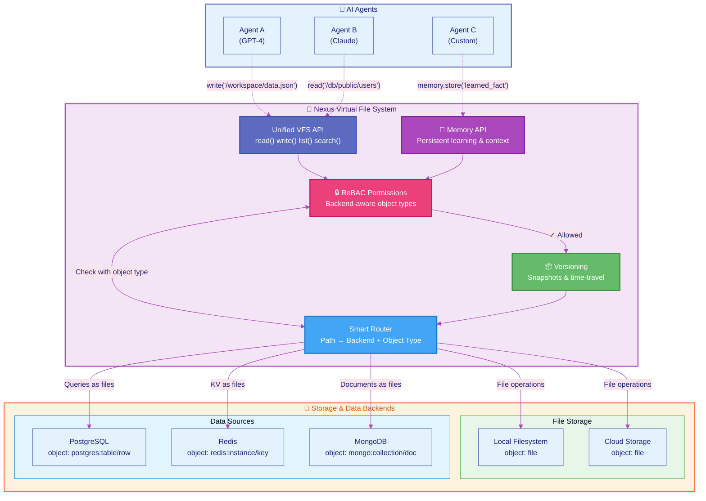

---
hide:
  - navigation
  - toc
---

<div class="hero-section">
  <div class="hero-content">
    <h1 class="hero-title">Nexus</h1>
    <p class="hero-subtitle">AI-Native Filesystem for Building Intelligent Agents</p>
    <p class="hero-description"><strong>Store files. Remember context. Control access. Scale instantly.</strong></p>
    <p class="hero-tagline">Give your AI agents a filesystem that thinks—with memory, permissions, and learning built in.</p>
    <div class="hero-buttons">
      <a href="#quick-start-in-30-seconds" class="md-button md-button--primary hero-cta">
        Try in 30 Seconds
      </a>
      <a href="#is-nexus-for-me" class="md-button hero-secondary">
        Is This For Me?
      </a>
      <a href="https://github.com/nexi-lab/nexus" class="md-button hero-tertiary">
        GitHub
      </a>
    </div>
  </div>
</div>

## ⚡ What is Nexus? (10-second pitch)

Nexus is a **programmable filesystem for AI agents** that combines:

- **📁 File Storage** - Store and version files (local, S3, GCS)
- **🧠 Agent Memory** - Agents remember and learn across sessions
- **🔒 Smart Permissions** - Fine-grained access control (ReBAC/Zanzibar-style)
- **🔍 Semantic Search** - Find anything with natural language
- **🚀 Zero→Production** - Start local (`pip install`), scale without code changes

**One API. Multiple backends. Built for AI agents.**

## Quick Start in 30 Seconds

=== "Python SDK"

    ```python
    # Install
    pip install nexus-ai-fs

    # Use it
    import nexus

    # Just works - no auth needed in embedded mode
    nx = nexus.connect(config={"data_dir": "./nexus-data"})

    # Write and read files
    nx.write("/hello.txt", b"Hello, Nexus!")
    content = nx.read("/hello.txt")
    print(content.decode())  # "Hello, Nexus!"
    ```

=== "CLI"

    ```bash
    # Install
    pip install nexus-ai-fs

    # Initialize workspace
    nexus init ./my-project

    # Use with server (see Server Mode tab)
    export NEXUS_URL=http://localhost:8080
    export NEXUS_API_KEY=your-key
    nexus write /workspace/hello.txt "Hello from CLI!"
    nexus cat /workspace/hello.txt
    ```

=== "Server Mode"

    ```bash
    # Start server with authentication
    nexus serve --host 0.0.0.0 --port 8080

    # Connect from Python
    import nexus
    nx = nexus.connect(
        remote_url="http://localhost:8080",
        api_key="your-api-key"
    )
    nx.write("/workspace/hello.txt", b"Remote write!")
    ```

    👉 **Learn more:** [Administration & Operations (25 min)](learning-paths/administration-operations.md)

## 🎯 Is Nexus For Me?

**Answer 2 quick questions to find your path:**

### 1. What are you building?

=== "🤖 AI Agent Systems"

    **Perfect fit!** Nexus is built specifically for AI agents.

    ✅ **You need:** Agent memory, persistent storage, multi-agent collaboration
    👉 **Start here:** [AI Agent Memory (15 min)](learning-paths/ai-agent-memory.md)

    **Use cases:**
    - **Multi-agent teams** (CrewAI, LangGraph workflows)
    - **Chatbots** with long-term memory across sessions
    - **Code assistants** that learn from your codebase
    - **Research agents** that build knowledge over time

    **Frameworks supported:** CrewAI, LangGraph, Claude SDK, OpenAI Agents, Google ADK

=== "📄 Document Intelligence"

    **Excellent choice!** LLM-powered reading and semantic search built-in.

    ✅ **You need:** Document search, AI-powered Q&A, content processing
    👉 **Start here:** [Document Q&A System (10 min)](learning-paths/document-qa.md)

    **Use cases:**
    - **Knowledge bases** with natural language search
    - **Document processing** pipelines with batch uploads
    - **Content analysis** with LLM-powered insights
    - **RAG systems** with semantic search

=== "🏢 Multi-Tenant SaaS"

    **Great choice!** Built-in multi-tenancy and fine-grained permissions.

    ✅ **You need:** Workspace isolation, ReBAC permissions, audit trails
    👉 **Start here:** [Multi-Tenant SaaS (30 min)](learning-paths/multi-tenant-saas.md)

    **Use cases:**
    - **Collaboration platforms** with team workspaces
    - **Enterprise apps** with tenant isolation
    - **Data platforms** with row-level access control
    - **AI-powered SaaS** with agent workspace sharing

=== "🔄 Workflow Automation"

    **Perfect!** Event-driven workflows and plugin extensibility.

    ✅ **You need:** Automated pipelines, custom integrations, event triggers
    👉 **Start here:** [Workflow Automation (15 min)](learning-paths/workflow-automation.md)

    **Use cases:**
    - **Data pipelines** with automatic processing
    - **File-based triggers** (e.g., invoice → extract → store)
    - **Custom integrations** via plugin system
    - **ML experiment tracking** with versioned checkpoints

=== "📚 Skills & Knowledge Management"

    **Excellent!** Package and share AI capabilities as reusable skills.

    ✅ **You need:** Skill discovery, documentation-to-skill conversion, team sharing
    👉 **Start here:** [Skills Management (20 min)](learning-paths/skills-management.md)

    **Use cases:**
    - **Team skill libraries** from internal/external documentation
    - **Auto-generate skills** from any docs URL
    - **Skill discovery** across agent/tenant/system tiers
    - **Knowledge sharing** with ReBAC permissions
    - **AI agent enhancement** with contextual skills

### 2. What's your experience level?

=== "🌱 New to Nexus"

    **Recommended Path:**

    1. [Quick Start (30 sec)](#quick-start-in-30-seconds) - Copy-paste working code
    2. [Core Concepts (5 min)](concepts/what-is-nexus.md) - Understand the mental model
    3. [Choose Your Learning Path](#-choose-your-learning-path) - Pick based on use case

    💡 **Tip:** Start with embedded mode, switch to server later (same code!)

=== "🚀 Ready to Build"

    **Jump straight to examples:**

    - [Build Agent with Memory (15 min)](learning-paths/ai-agent-memory.md)
    - [Add Permissions (20 min)](learning-paths/team-collaboration.md)
    - [Deploy to Production (30 min)](production/deployment-patterns.md)

    📚 **Reference:** [Complete API Docs](api/api.md)

=== "⚙️ Production Integration"

    **Advanced guides:**

    - [Administration & Operations (25 min)](learning-paths/administration-operations.md) - User management, API keys, monitoring
    - [Multi-Backend Setup (20 min)](learning-paths/multi-backend-storage.md) - Configure S3, GCS, databases
    - [Building Plugins (30 min)](learning-paths/building-plugins.md) - Extend Nexus with custom functionality
    - [Security Hardening](production/security-checklist.md) - Production security best practices
    - [Performance Tuning](how-to/optimize/performance-tuning.md) - Optimize for scale

---

**Still not sure?** Check out [Why Nexus?](why-nexus.md) for detailed comparisons with S3, Vector DBs, and traditional filesystems.

## How It Works



**Backend Abstraction:**

Nexus presents everything as files to users, while backends provide appropriate object types for permission control:

- **File Storage** (Local, GCS, S3): Standard file objects
- **Databases** (PostgreSQL, Redis, MongoDB): Backend-specific objects (tables, keys, documents)
- **Unified Interface**: All accessed through the same VFS API (read/write/list)
- **Fine-Grained Permissions**: ReBAC uses backend-appropriate object types (e.g., grant access to a PostgreSQL schema vs. individual rows)

<div class="benefits-grid" markdown>

<div class="benefit-card" markdown>

### 🎯 One API

Agents use simple file operations, regardless of where data lives. No cloud SDKs to learn.

</div>

<div class="benefit-card" markdown>

### 🔒 Built-in Security

Every operation checks permissions automatically. Google Zanzibar-style ReBAC included.

</div>

<div class="benefit-card" markdown>

### 💾 Agent Memory

Persistent learning across sessions. Agents remember context and improve automatically.

</div>

<div class="benefit-card" markdown>

### 📦 Versioning

Time-travel debugging with snapshots. Roll back to any point in history instantly.

</div>

<div class="benefit-card" markdown>

### 🔄 Backend Flexibility

Switch from local to cloud without changing agent code. Zero vendor lock-in.

</div>

<div class="benefit-card" markdown>

### 🚀 Production Ready

Multi-tenancy, workspace isolation, and complete audit trails out of the box.

</div>

<div class="benefit-card" markdown>

### ⚡ Workflow Automation

Event-driven workflows fire automatically on file operations. No manual triggering needed.

</div>

</div>

## 🧠 Core Concepts

**New to Nexus?** Start here to understand how it works:

<div class="grid cards" markdown>

-   :material-lightbulb:{ .lg .middle } __What is Nexus?__

    ---

    Mental model and architecture overview. Understand the three-layer system and key design principles.

    [:octicons-arrow-right-24: Read Concept](concepts/what-is-nexus.md)

-   :material-brain:{ .lg .middle } __Memory System__

    ---

    How agents remember context across sessions. Learn about namespaces, identity-based memory, and persistence.

    [:octicons-arrow-right-24: Read Concept](concepts/memory-system.md)

-   :material-shield-account:{ .lg .middle } __Agent Permissions__

    ---

    How agents authenticate and inherit permissions from users. ReBAC for multi-agent collaboration.

    [:octicons-arrow-right-24: Read Concept](concepts/agent-permissions.md)

-   :material-lock:{ .lg .middle } __ReBAC Explained__

    ---

    Deep dive into Relationship-Based Access Control. Zanzibar-style permissions with tuples and expansion.

    [:octicons-arrow-right-24: Read Concept](concepts/rebac-explained.md)

-   :material-content-save:{ .lg .middle } __Content-Addressable Storage__

    ---

    How CAS works with SHA-256 hashing. Automatic deduplication and immutable version history.

    [:octicons-arrow-right-24: Read Concept](concepts/content-addressable-storage.md)

-   :material-sync:{ .lg .middle } __Learning Loops__

    ---

    Algorithm-agnostic learning primitives. Trajectories, reflection, playbooks, and feedback collection.

    [:octicons-arrow-right-24: Read Concept](concepts/learning-loops.md)

-   :material-lightning-bolt:{ .lg .middle } __Workflows & Triggers__

    ---

    Event-driven automation with file patterns. Auto-process documents, validate data, and send webhooks.

    [:octicons-arrow-right-24: Read Concept](concepts/workflows-vs-triggers.md)

</div>

## 🎓 Choose Your Learning Path

**Progressive learning from beginner to advanced.** Pick based on your use case and experience level.

### 🌱 Beginner Paths (5-15 minutes)

<div class="grid cards" markdown>

-   **📁 Simple File Storage**

    ---

    Master basic read/write operations with local and cloud backends.

    ⏱️ **5 min** | 💡 **Difficulty:** Easy

    [:octicons-arrow-right-24: Start Learning](learning-paths/simple-file-storage.md)

-   **🔍 Document Q&A System**

    ---

    Build semantic search and LLM-powered document reading.

    ⏱️ **10 min** | 💡 **Difficulty:** Easy

    [:octicons-arrow-right-24: Start Learning](learning-paths/document-qa.md)

-   **🧠 AI Agent Memory**

    ---

    Add persistent memory and learning to your agents.

    ⏱️ **15 min** | 💡 **Difficulty:** Medium

    [:octicons-arrow-right-24: Start Learning](learning-paths/ai-agent-memory.md)

-   **🔄 Workflow Automation**

    ---

    Build event-driven workflows that trigger automatically.

    ⏱️ **15 min** | 💡 **Difficulty:** Medium

    [:octicons-arrow-right-24: Start Learning](learning-paths/workflow-automation.md)

</div>

### 🚀 Intermediate Paths (15-25 minutes)

<div class="grid cards" markdown>

-   **👥 Team Collaboration**

    ---

    Multi-user access with permissions and workspace isolation.

    ⏱️ **20 min** | 💡 **Difficulty:** Medium

    [:octicons-arrow-right-24: Start Learning](learning-paths/team-collaboration.md)

-   **🤖 Agent Framework Integration**

    ---

    Connect LangGraph, CrewAI, Claude SDK, and OpenAI Agents.

    ⏱️ **20 min** | 💡 **Difficulty:** Medium

    [:octicons-arrow-right-24: Start Learning](learning-paths/agent-framework-integration.md)

-   **💾 Multi-Backend Storage**

    ---

    Mount and federate S3, GCS, and database backends.

    ⏱️ **20 min** | 💡 **Difficulty:** Medium

    [:octicons-arrow-right-24: Start Learning](learning-paths/multi-backend-storage.md)

-   **🧠 Agent Memory & Learning**

    ---

    Build agents that learn and improve over time.

    ⏱️ **20 min** | 💡 **Difficulty:** Medium

    [:octicons-arrow-right-24: Start Learning](learning-paths/ai-agent-memory.md)

</div>

### ⚙️ Advanced Paths (25-30+ minutes)

<div class="grid cards" markdown>

-   **🏢 Multi-Tenant SaaS**

    ---

    Build production SaaS with complete tenant isolation.

    ⏱️ **30 min** | 💡 **Difficulty:** Hard

    [:octicons-arrow-right-24: Start Learning](learning-paths/multi-tenant-saas.md)

-   **⚡ Skills Management**

    ---

    Create, version, and publish reusable agent skills.

    ⏱️ **15 min** | 💡 **Difficulty:** Medium

    [:octicons-arrow-right-24: Start Learning](learning-paths/skills-management.md)

-   **🔧 Administration & Operations** 🆕

    ---

    User management, API keys, monitoring, and backup.

    ⏱️ **25 min** | 💡 **Difficulty:** Hard | 📡 **Server Mode**

    [:octicons-arrow-right-24: Start Learning](learning-paths/administration-operations.md)

-   **🔌 Building Plugins** 🆕

    ---

    Extend Nexus with custom functionality and lifecycle hooks.

    ⏱️ **30 min** | 💡 **Difficulty:** Hard

    [:octicons-arrow-right-24: Start Learning](learning-paths/building-plugins.md)

</div>

**Not sure where to start?** Use the [Is Nexus For Me?](#-is-nexus-for-me) quiz above to find your recommended path.

## What Makes Nexus Different?

### For AI Agent Developers

<div class="comparison-table" markdown>

| Feature | Vector DB (Pinecone) | Object Storage (S3) | Traditional FS | **Nexus** |
|---------|---------------------|---------------------|----------------|----------|
| **Agent Memory** | 🟡 Embeddings only | ❌ | ❌ | ✅ Memory + Learning |
| **File Operations** | ❌ | 🟡 Object-only | ✅ | ✅ Full POSIX-like API |
| **Semantic Search** | ✅ | ❌ | ❌ | ✅ Vector + metadata |
| **Multi-Agent Collaboration** | ❌ | ❌ | ❌ | ✅ Shared workspaces |
| **Permissions & ReBAC** | 🟡 Basic | 🟡 IAM policies | 🟡 UNIX perms | ✅ Zanzibar-style ReBAC |
| **Multi-Tenancy** | 🟡 Collections | 🟡 Manual buckets | ❌ | ✅ Native isolation |
| **Event-Driven Workflows** | ❌ | 🟡 S3 notifications | ❌ | ✅ Auto-trigger on writes |
| **Time Travel & Versioning** | ❌ | 🟡 Versioning only | ❌ | ✅ Full history + diffs |
| **Database Access as Files** | ❌ | ❌ | ❌ | ✅ PostgreSQL, Redis, MongoDB |
| **LLM Document Reading** | ❌ | ❌ | ❌ | ✅ Query docs with citations |

</div>

**Why AI Developers Choose Nexus:**

- **🤖 Multi-Agent Native**: Built-in workspace sharing and collaboration for CrewAI, LangGraph teams
- **🧠 Memory + Storage Combined**: Not just embeddings—full agent memory with automatic consolidation
- **🔄 Event-Driven Automation**: Workflows trigger automatically when agents write files (no manual event firing)
- **🗄️ Unified Data Access**: Access files, databases (PostgreSQL/Redis/MongoDB), and vectors through one API
- **🔒 Production-Ready Security**: Fine-grained ReBAC permissions with multi-tenancy out of the box
- **📚 LLM-Powered Intelligence**: Ask questions about stored documents, get AI answers with citations
- **⚡ Framework Integrations**: First-class support for CrewAI, LangGraph, Claude SDK, OpenAI Agents, Google ADK

## 🆘 Need Help?

<div class="grid cards" markdown>

-   **📖 Quickstart Guide**

    ---

    Step-by-step setup in under 10 minutes

    [:octicons-arrow-right-24: Get Started](getting-started/quickstart.md)

-   **🔧 Troubleshooting**

    ---

    Common issues and solutions

    [:octicons-arrow-right-24: Troubleshooting 101](getting-started/troubleshooting-101.md)

-   **💡 Core Concepts**

    ---

    Understand how Nexus works

    [:octicons-arrow-right-24: Learn Concepts](concepts/what-is-nexus.md)

-   **📚 Glossary**

    ---

    Complete A-Z reference: ReBAC, CAS, ACE, and all Nexus terminology

    [:octicons-arrow-right-24: View Glossary](glossary.md)

</div>

---

<div class="footer-links" markdown>

<div class="footer-grid" markdown>

<div markdown>
**📚 Learn**

- [Quickstart Guide](getting-started/quickstart.md)
- [Core Concepts](concepts/what-is-nexus.md)
- [Learning Paths](#-choose-your-learning-path)
- [API Reference](api/api.md)
- [CLI Reference](api/cli-reference.md)
</div>

<div markdown>
**🚀 Deploy**

- [Server Setup](getting-started/server-setup.md)
- [Production Guide](production/deployment-patterns.md)
- [Docker Deployment](how-to/deploy/docker-compose.md)
- [Security Checklist](production/security-checklist.md)
- [Performance Tuning](how-to/optimize/performance-tuning.md)
</div>

<div markdown>
**🤝 Community**

- [GitHub](https://github.com/nexi-lab/nexus)
- [Issues & Bugs](https://github.com/nexi-lab/nexus/issues)
- [Discussions](https://github.com/nexi-lab/nexus/discussions)
- [Contributing](development/development.md)
- [Changelog](https://github.com/nexi-lab/nexus/releases)
</div>

<div markdown>
**🔗 More**

- [PyPI Package](https://pypi.org/project/nexus-ai-fs/)
- [Examples](https://github.com/nexi-lab/nexus/tree/main/examples)
- [Why Nexus?](why-nexus.md)
- [License](https://github.com/nexi-lab/nexus/blob/main/LICENSE)
- [Security](https://github.com/nexi-lab/nexus/security)
</div>

</div>

</div>

---

<div style="text-align: center; padding: 2rem 0;">

**Ready to build?** Start with our [30-second quickstart](#quick-start-in-30-seconds) or [find your learning path](#-is-nexus-for-me).

⭐ **If Nexus helps your project, please [star us on GitHub](https://github.com/nexi-lab/nexus)!**

</div>
