# ACE Demo: Data Validator - Learning from Experience

This demo shows **Agentic Context Engineering (ACE)** in action. An agent learns data validation rules by processing real-world data and learning from its mistakes.

## 🎯 What This Demo Shows

An AI agent that starts with **zero** validation knowledge and learns comprehensive validation rules through experience:

- **Epoch 0**: ~60% accuracy (no validation rules)
- **Epoch 10**: ~95% accuracy (learned comprehensive validation)

**Improvement: +35 percentage points** through automated learning!

## 📊 Dataset

**Source**: Titanic passenger dataset (from HuggingFace)
- 200+ passenger records with real data quality issues
- Missing values (20% of ages)
- Invalid ranges (ages > 100, negative fares)
- Inconsistent categorical values


## 🚀 Quick Start

### Prerequisites

```bash
# Install Nexus
pip install nexus-ai-fs

# Install demo dependencies
cd examples/ace
pip install -r requirements.txt
```

### Run the Demo

```bash
# First run or to see learning from scratch (recommended)
python demo_3_data_validator.py --epochs 10 --reset

# Continue with existing playbook
python demo_3_data_validator.py --epochs 10

# Run longer training
python demo_3_data_validator.py --epochs 20 --reset

# Specify data cache directory
python demo_3_data_validator.py --data-dir ./data_cache --reset
```

**Important**: Use `--reset` flag to clear previous learning data. Without it, the demo reuses existing strategies and may start at 100% accuracy (no learning visible).

## 📈 Expected Output

```
═══ ACE Demo 3: Data Validator - Learning from Experience ═══

Step 1: Loading Dataset
Loading Titanic dataset from HuggingFace...
✓ Loaded 200 passenger records
  Total records: 200
  Valid records: 164 (82.0%)
  Invalid records: 36

  Issue types:
    • missing_age: 12
    • invalid_age_range: 8
    • negative_fare: 6
    • missing_name: 5
    • invalid_sex_value: 5

Step 2: Connecting to Nexus ACE
✓ Connected to Nexus
  Using playbook: data_validator

Step 3: Training for 10 Epochs

Training ━━━━━━━━━━━━━━━━━━━━━ 100%

Step 4: Training Results

┏━━━━━━━┳━━━━━━━━━━┳━━━━━━━━━━━┳━━━━━━━━┳━━━━━━━━━━┓
┃ Epoch ┃ Accuracy ┃ Precision ┃ Recall ┃ F1 Score ┃
┡━━━━━━━╇━━━━━━━━━━╇━━━━━━━━━━━╇━━━━━━━━╇━━━━━━━━━━┩
│ 0     │ 58.0%    │ 0.82      │ 0.58   │ 0.68     │
│ 2     │ 72.5%    │ 0.88      │ 0.72   │ 0.79     │
│ 4     │ 84.0%    │ 0.91      │ 0.84   │ 0.87     │
│ 6     │ 90.5%    │ 0.94      │ 0.90   │ 0.92     │
│ 8     │ 93.5%    │ 0.95      │ 0.93   │ 0.94     │
│ 10    │ 95.0%    │ 0.96      │ 0.95   │ 0.95     │
└───────┴──────────┴───────────┴────────┴──────────┘

✨ Improvement: 58.0% → 95.0% (+37.0%)

Learned Validation Rules:
  [✓] Check required fields: Name, Sex, Age (confidence: 95%)
  [✓] Validate age range: 0-100 years (confidence: 92%)
  [✓] Reject negative fare values (confidence: 90%)
  [✓] Validate Sex in ['male', 'female'] (confidence: 88%)
  [✓] Check for missing critical fields (confidence: 86%)

═══ Demo Complete ═══
```

## 🔬 How It Works

### The ACE Auto-Improvement Loop

```mermaid
graph TB
    Start([🎯 Epoch Start<br/>Accuracy: 58%]) --> LoadPlaybook[📖 Load Playbook<br/>Retrieve learned strategies]

    LoadPlaybook --> Execute[⚙️ Execute & Measure<br/>nx.memory.start_trajectory<br/>Validate 200 records<br/>Calculate accuracy: 72%]

    Execute --> Reflect[🤔 Reflect & Extract<br/>nx.memory.reflect<br/>Analyze what worked/failed]

    Reflect -->|What Worked| Helpful[✅ Helpful Strategies<br/>• Check age 0-100<br/>• Require Name field<br/>• Reject negative fare]

    Reflect -->|What Failed| Harmful[❌ Harmful Patterns<br/>• Skip validation<br/>• Accept missing data<br/>• Ignore ranges]

    Helpful --> Curate[🎯 Curate & Update<br/>nx.memory.curate_playbook<br/>Store learned rules in memory]

    Harmful --> Curate

    Curate --> NextEpoch{Next<br/>Epoch?}

    NextEpoch -->|Yes| Improve([📈 Accuracy: 95%<br/>+37% improvement])

    NextEpoch -->|No| Complete([🎉 Training Complete])

    Improve --> LoadPlaybook

    style Start fill:#e1f5ff,stroke:#0288d1,stroke-width:3px
    style LoadPlaybook fill:#f3e5f5,stroke:#7b1fa2,stroke-width:2px
    style Execute fill:#e8f5e9,stroke:#388e3c,stroke-width:3px
    style Reflect fill:#fce4ec,stroke:#c2185b,stroke-width:3px
    style Helpful fill:#c8e6c9,stroke:#2e7d32,stroke-width:3px
    style Harmful fill:#ffcdd2,stroke:#c62828,stroke-width:3px
    style Curate fill:#b39ddb,stroke:#512da8,stroke-width:3px
    style NextEpoch fill:#fff59d,stroke:#f9a825,stroke-width:2px
    style Improve fill:#a5d6a7,stroke:#2e7d32,stroke-width:3px
    style Complete fill:#81c784,stroke:#1b5e20,stroke-width:4px
```



### The Auto-Improvement Process

**1. Trajectory Tracking**
Every validation run is tracked as a trajectory:
```python
traj_id = nx.memory.start_trajectory("Validate Titanic dataset")
# ... validate records ...
nx.memory.complete_trajectory(traj_id, "success", success_score=0.95)
```

**2. Reward Signal**
**Accuracy** = percentage of records correctly validated
- Correctly accept valid records ✓
- Correctly reject invalid records ✓

**3. Reflection**
Agent analyzes what worked:
```python
reflection = nx.memory.reflect(traj_id)
# Extracts: "Check age range 0-100", "Require Name field", etc.
```

**4. Playbook Update**
Learned rules are stored in a playbook:
```python
nx.memory.curate_playbook([reflection_id], "data_validator")
```

**5. Continuous Improvement**
Next epoch uses learned rules → higher accuracy → learns more rules → repeat

### 📈 The Learning Curve

The diagram above shows one complete learning cycle. Over multiple epochs:

- **Epoch 0** (58% accuracy): No validation rules, mostly guessing
- **Epochs 1-3**: Learn required field checks → 72% accuracy
- **Epochs 4-6**: Learn range validation → 90% accuracy
- **Epochs 7-10**: Refine edge cases → 95% accuracy

Each cycle strengthens the playbook with proven strategies and marks failing approaches as harmful.

## 📋 What the Agent Learns

Through ACE, the agent discovers these validation rules:

### ✅ **Helpful Strategies** (What Works)
- "Check required fields: Name, Sex, Age"
- "Validate age range: must be 0-100 years"
- "Reject negative fare values"
- "Sex must be 'male' or 'female'"
- "Check for empty string values"

### ❌ **Harmful Patterns** (What Doesn't Work)
- "AVOID accepting records with missing ages"
- "AVOID skipping range validation on numeric fields"
- "AVOID accepting any value for categorical fields"


## 🛠️ Customization

### Use Your Own Dataset

```python
# Load any dataset from HuggingFace
from datasets import load_dataset

dataset = load_dataset("your_org/your_dataset")
df = pd.DataFrame(dataset["train"])

# Run validation learning
run_validation_task(df, ground_truth, playbook_strategies)
```

### Adjust Validation Rules

Modify `DataValidator.validate_record()` to check for:
- Email format validation
- Phone number patterns
- Date range constraints
- Custom business rules

### Change Reward Signal

```python
# Use different metrics
reward_signal = {
    "accuracy": 0.5,      # Weight for overall accuracy
    "precision": 0.3,     # Weight for avoiding false positives
    "recall": 0.2,        # Weight for catching all issues
}
```

## 📚 Learn More

- **ACE Paper**: https://arxiv.org/abs/2510.04618
- **Nexus ACE Design**: `docs/design/ACE_INTEGRATION.md`
- **Nexus Documentation**: https://docs.nexus-ai.com

## 🐛 Troubleshooting

### Dataset Download Issues

If HuggingFace dataset fails to download:
```python
# The demo automatically falls back to synthetic Titanic-like data
# Or specify a different dataset in TitanicDataLoader.load()
```

### Memory Issues

For large datasets, use sampling:
```python
df = df.sample(n=500, random_state=42)  # Use 500 records only
```

### Nexus Connection

Ensure Nexus is running:
```bash
# Start local Nexus server
nexus serve --data-dir ./nexus_data

# Or connect to remote server
export NEXUS_URL=http://your-server:8080
export NEXUS_API_KEY=your-api-key
```

## 🎓 Understanding the Results

### Accuracy Progression
- **Epochs 0-2**: Learning basic rules (required fields)
- **Epochs 3-5**: Learning ranges and patterns
- **Epochs 6-8**: Refining edge cases
- **Epochs 9+**: Fine-tuning for high accuracy

### Why It Works
1. **Clear Reward Signal**: Validation accuracy is objective
2. **Immediate Feedback**: Agent sees results instantly
3. **Pattern Recognition**: ACE identifies what consistently works
4. **Cumulative Learning**: Each epoch builds on previous knowledge

## 🚀 Next Steps

1. **Try with your data**: Replace Titanic with your dataset
2. **Add more rules**: Extend validation logic
3. **Production use**: Integrate learned playbooks into pipelines
4. **Compare baselines**: Measure improvement vs. hard-coded rules

---

**Made with Nexus ACE** 🧠 - Making agents learn from experience
