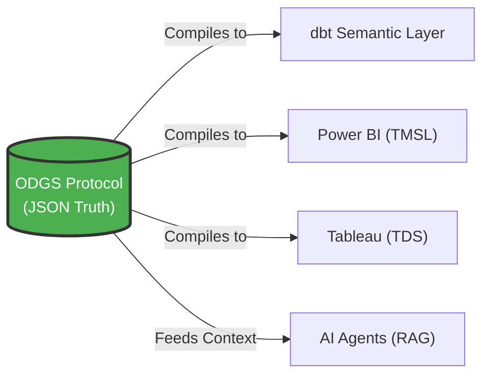

# Open Data Governance Schema (ODGS)

[](https://opensource.org/licenses/Apache-2.0)
[]()
[]()

> **"The Protocol for Algorithmic Accountability"**

---

## What is ODGS?

**ODGS** is an open-source, vendor-neutral JSON protocol that serves as the **single source of truth** for your business logic. It solves the "Metric Drift" problem—where "Revenue" means three different things in three different tools—by defining metrics **once** and compiling them to **Snowflake**, **Power BI**, **dbt**, and **AI Agents** automatically.

Think of it as the **"Universal Remote for Data"**. Instead of programming the same metric into multiple tools, you define it once in ODGS, and it syncs everywhere.

### Why It Matters

- **For Enterprises**: Achieve **EU AI Act compliance** through Metric Provenance
- **For Data Teams**: Write definitions once, eliminate copy-paste SQL across tools  
- **For AI Engineers**: Prevent "Semantic Hallucinations" by grounding LLMs in structured, verifiable context


---

## Architecture



**Headless Governance** means decoupling the *Definition* (your business rules) from the *Tool* (Tableau, Power BI, etc.). ODGS acts as the compilation layer that transforms abstract logic into tool-native code.

### Authentic vs. Artificial Intelligence

We believe AI is only as good as the rules you give it.

- **Artificial Intelligence** guesses the answer based on probability
- **Authentic Intelligence** knows the answer based on codified human expertise

ODGS captures the *Authentic Intelligence* of your domain experts—the nuances, the exceptions, the business rules—and codifies them into a standard that AI can respect.

> **"The Table Format War is over. The Semantic War has just begun. Don't build another silo. Build on the Standard."**


---

## Quick Start

```bash
# Install
pip install odgs

# Initialize a project
odgs init my-governance-layer
cd my-governance-layer

# Validate your schemas
odgs validate

# Build artifacts for all downstream tools
odgs build --target all
```

---

## Documentation

📘 **[Complete Guide](guide.md)**  
End-to-end journey from concept to implementation. Includes quickstart, schema reference, CLI commands, and adapter examples.

🎯 **[Strategic Vision](vision.md)**  
The business case for ODGS: Market opportunity, AI Safety compliance, academic partnerships, and the "Swiss Army Knife" thesis.

---

## The 7 Core Schemas

| Schema | Purpose |
|:---|:---|
| [standard_metrics.json](../protocol/lib/standard_metrics.json) | KPI definitions (logic, ownership, compliance tags) |
| [standard_data_rules.json](../protocol/lib/standard_data_rules.json) | Validation rules (regex, nulls, ranges) |
| [standard_dq_dimensions.json](../protocol/lib/standard_dq_dimensions.json) | Data quality categories (Accuracy, Timeliness) |
| [root_cause_factors.json](../protocol/lib/root_cause_factors.json) | Taxonomy for data failures (Process Gap, Integration Failure) |
| [business_process_maps.json](../protocol/lib/business_process_maps.json) | Process workflows (Order-to-Cash, Procure-to-Pay) |
| [physical_data_map.json](../protocol/lib/physical_data_map.json) | Mapping logic to database tables/columns |
| [ontology_graph.json](../protocol/lib/ontology_graph.json) | Knowledge graph (Customer *has* Orders) |

---

## Contributing

We welcome contributions! Whether you're:
- **Researchers**: Expanding the DQ Dimensions taxonomy  
- **Engineers**: Building adapters for new tools (Looker, Qlik)  
- **Domain Experts**: Refining the Root Cause taxonomy

Please see [CONTRIBUTING.md](CONTRIBUTING.md) for guidelines.

---

## License

Apache License 2.0 - see [LICENSE](LICENSE) for details.

**Copyright © 2025 [Authentic Intelligence Labs](https://github.com/Authentic-Intelligence-Labs)**