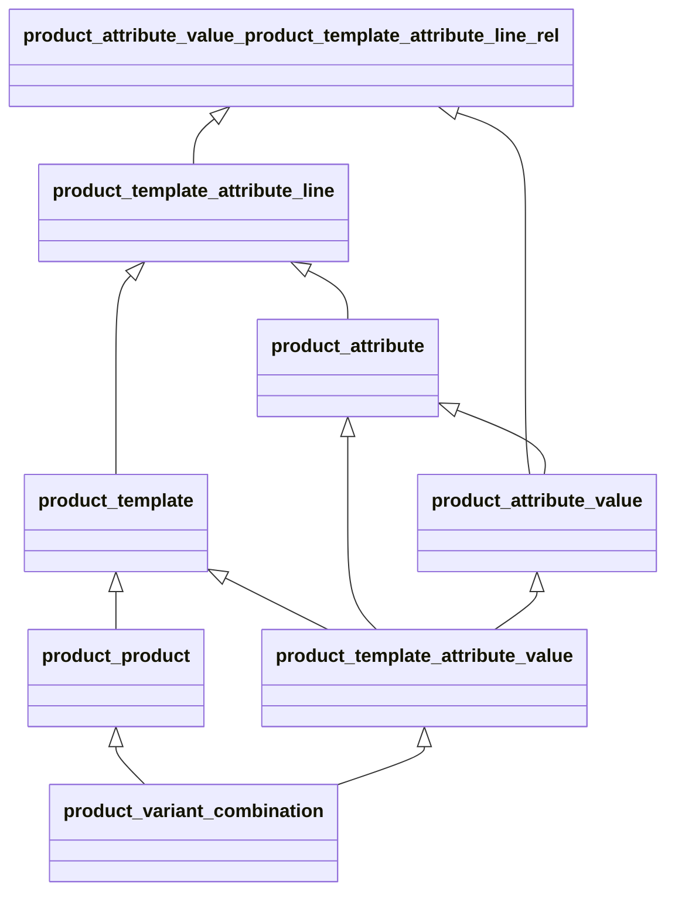

# Diario de migración del modulo SomConnexio
## Pasos
1. Montar entorno Odoo 16.0 con el inventory.
2. Modificar el manifest del modulo.
3. Instalar el modulo somconnexio en una DB
  3-1. Fallan las dependencias.
  3-2. Instalar modulos necesarios
  3-3. Repetir

## Modelos que fallan
### Porque no existen

* Invoice
* InvoiceLine
* StockProductionLot


## Investigaciones
### Revisando StockProductionLot
Vemos que en OCB > stock, que era donde antes teniamos el StockProductionLot.
Revisamos en la db de producción si se esta utilizando el StockProductionLot en los contratos de ADSL, que es donde vemos en el codigo que se utiliza.

Vemos que se utiliza tanto en ADSL como en XOLN para guardar el router mac. Para esto se añade un campo router_mac_address en el modelo de stock production lot.

Para que el stockProductionLot se pueda utilizar en los contratos de XOLN, se añade un campo router_product_id en el modelo de stock production lot.

Tenemos 490 contratos de ADSL con router_lot_id no nulo y 86 con router_lot_id no nulo en XOLN:

```
odoo=> select count(*) from adsl_service_contract_info where router_lot_id is not null;
 count
-------
   490
(1 row)

odoo=> select count(*) from xoln_ where router_lot_id is not null;
xoln_fiber_service_contract_info         xoln_fiber_service_contract_info_id_seq  xoln_project                             xoln_project_id_seq
odoo=> select count(*) from xoln_fiber_service_contract_info where router_lot_id is not null;
 count
-------
    86
(1 row)
```

Podriamos prescindir de utilizar el stockProductionLot y utilizar directamente el router_lot_id en el modelo de XOLN y de ADSL, esto implicaria una migración de datos.

TODO: Revisar que no se puedan utilizar directamente el router_lot_id en el modelo de XOLN y de ADSL.




Ejemplo de producto:
Product Template: Customizable Mesa

Product Attribute:
 - Patas
 - Color

Product Attribute Value:
  - Pata
    - Acero
    - Aluminio
  - Color
    - Blanco
    - Negro

Product Template 

Product Product:
- Customizable Mesa Patas Acero Color Blanco
- Customizable Mesa Patas Acero Color Negro
- Customizable Mesa Patas Aluminio Color Blanco
- Customizable Mesa Patas Aluminio Color Negro

Tabla de productos de SC:

### Mobile

| Data\Min   | SenseMinuts | 100Min | 150Min | 200Min | TrucadesIllimitades |
| ---------- | ----------- | ------ | ------ | ------ | ------------------- |
| SenseDades | X           | X      | X      | X      | X                   |
| 200MB      | X           | X      |        | X      |                     |
| 500MB      | X           |        | X      | X      | X                   |
| 1GB        | X           |        | X      | X      | X                   |
| 2GB        | X           |        | X      | X      | X                   |
| 3GB        | X           |        |        |        |                     |
| 5GB        | X           |        |        |        | X                   |
| 10GB       | X           |        | X      |        | X                   |
| 12GB       |             |        |        |        | X                   |
| 20GB       |             |        |        |        | X                   |
| 30GB       |             |        |        |        | X                   |
| 50GB       |             |        |        |        | X                   |
| 100GB      |             |        |        |        | X                   |
| 150GB      |             |        |        |        | X                   |

### Fibra

| Velocidad \ Min | SenseFix | Inclos |
| --------------- | -------- | ------ |
| 100 Mb          | X        | X      |
| 300 Mb          | X        | X      |
| 600 Mb          |          | X      |
| 1Gb             | X        | X      |

### Añadir un nuevo producto

#### Añadir Sin Datos 300 Min

1. Crear attribute_value de 300 min de tipo Min
2. Añadir al product_template_attribute_line MobileProduct_product_template_Min_attribute_line el value_id creado en el paso anterior.
3. Darle un external_id al product_template_attribute_value que acabamos de crear.
4. Darle un external_id al product_product utilizando el external_id del product_template_attribute_value.
5. Creamos las exclusiones de productos creando reglas por product_template_attribute_value de Min, indicando que valores del Data queremos excluir.
6. Modificamos el product_product para añadirle el code, custom_name y si esta activo o no.
