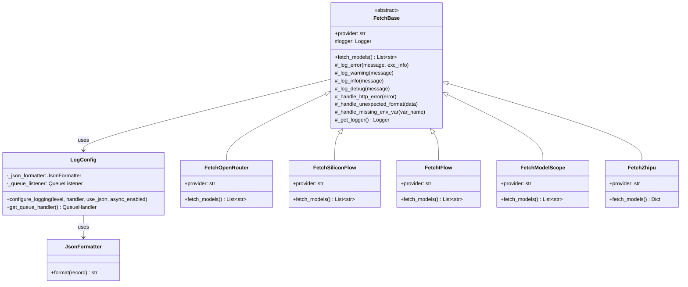
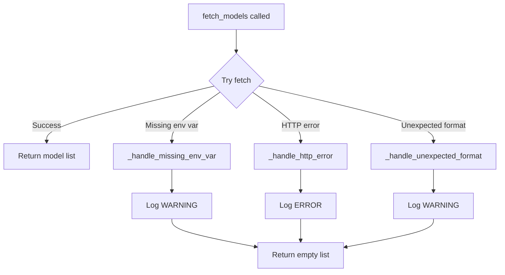

# Design Document

## Overview

本设计文档描述了统一错误处理和日志记录系统的架构和实现方案。核心思路是在 `FetchBase` 基类中引入集中式日志配置和通用错误处理方法，所有 provider 子类继承这些能力，从而消除重复代码并提供一致的日志输出。

## Architecture



## Components and Interfaces

### 1. LogConfig 模块

负责全局日志配置，提供统一的日志初始化接口。

```python
# src/oiiai/fetchModelList/log_config.py

def configure_logging(
    level: int = logging.WARNING,
    handler: logging.Handler = None,
    use_json: bool = True,
    async_enabled: bool = False
) -> None:
    """配置全局日志设置"""
    pass

def get_queue_handler() -> logging.handlers.QueueHandler:
    """获取异步日志处理器"""
    pass
```

### 2. JsonFormatter 类

提供 JSON 格式的日志输出。

```python
class JsonFormatter(logging.Formatter):
    def format(self, record: logging.LogRecord) -> str:
        """将日志记录格式化为 JSON 字符串"""
        pass
```

### 3. FetchBase 基类增强

在基类中添加日志和错误处理方法。

```python
class FetchBase(ABC):
    @property
    def _logger(self) -> logging.Logger:
        """获取以 provider 名称为标识的 logger"""
        pass
    
    def _log_error(self, message: str, exc_info: bool = False) -> None:
        """记录 ERROR 级别日志"""
        pass
    
    def _log_warning(self, message: str) -> None:
        """记录 WARNING 级别日志"""
        pass
    
    def _handle_http_error(self, error: Exception) -> List[str]:
        """处理 HTTP 请求错误，记录日志并返回空列表"""
        pass
    
    def _handle_unexpected_format(self, data: Any) -> List[str]:
        """处理意外的数据格式，记录日志并返回空列表"""
        pass
    
    def _handle_missing_env_var(self, var_name: str) -> List[str]:
        """处理缺失的环境变量，记录日志并返回空列表"""
        pass
```

## Data Models

### LogRecord 扩展字段

JSON 格式日志输出包含以下字段：

| 字段 | 类型 | 描述 |
|------|------|------|
| timestamp | string | ISO 8601 格式时间戳 |
| level | string | 日志级别 (DEBUG/INFO/WARNING/ERROR/CRITICAL) |
| provider | string | Provider 标识符 |
| message | string | 日志消息 |
| module | string | 模块名称 |
| function | string | 函数名称 |
| line | int | 行号 |
| exc_info | string | 异常堆栈信息（可选） |


## Correctness Properties

*A property is a characteristic or behavior that should hold true across all valid executions of a system-essentially, a formal statement about what the system should do. Properties serve as the bridge between human-readable specifications and machine-verifiable correctness guarantees.*

### Property 1: Logger naming consistency

*For any* FetchBase subclass with any provider name, the logger instance name SHALL match the provider identifier.

**Validates: Requirements 1.1**

### Property 2: Log level filtering

*For any* configured log level L and any log message at level M, the message SHALL be recorded if and only if M >= L.

**Validates: Requirements 1.4**

### Property 3: Error handling returns empty list

*For any* error that occurs during `fetch_models()` execution, the method SHALL return an empty list and SHALL NOT raise an exception.

**Validates: Requirements 2.4**

### Property 4: Error log contains provider context

*For any* provider and any error condition (HTTP error, unexpected format, missing env var), the logged message SHALL contain the provider name.

**Validates: Requirements 2.1, 2.2, 2.3, 3.4**

### Property 5: JSON log structure completeness

*For any* log record formatted with JsonFormatter, the output SHALL be valid JSON containing timestamp, level, provider, and message fields.

**Validates: Requirements 4.4**

## Error Handling

### Error Categories and Log Levels

| Error Type | Log Level | Handler Method |
|------------|-----------|----------------|
| Missing environment variable | WARNING | `_handle_missing_env_var()` |
| Unexpected API response format | WARNING | `_handle_unexpected_format()` |
| HTTP request failure | ERROR | `_handle_http_error()` |
| Network timeout | ERROR | `_handle_http_error()` |
| Critical system error | CRITICAL | `_log_critical()` |

### Error Handling Flow



## Testing Strategy

### Property-Based Testing

使用 `hypothesis` 库进行属性测试。

**测试框架配置：**
- 每个属性测试运行最少 100 次迭代
- 使用 `@given` 装饰器生成随机测试数据

**属性测试标注格式：**
```python
# **Feature: unified-error-handling, Property {number}: {property_text}**
```

### Unit Tests

单元测试覆盖以下场景：
- LogConfig 初始化行为
- JsonFormatter 输出格式验证
- 各 provider 错误处理路径
- 异步日志 QueueHandler 配置

### Test Structure

```
tests/
└── fetchModelList/
    ├── test_log_config.py      # LogConfig 单元测试
    ├── test_json_formatter.py  # JsonFormatter 单元测试
    ├── test_base_logging.py    # FetchBase 日志方法测试
    └── test_logging_properties.py  # 属性测试
```
