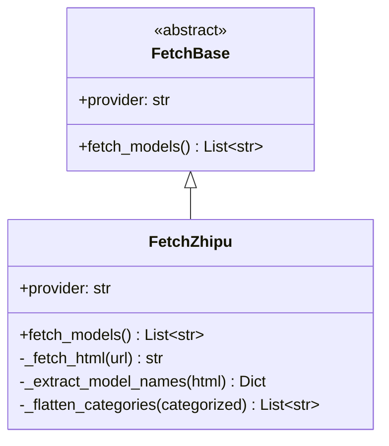

# Design Document

## Overview

本设计文档描述了统一智谱AI返回格式的实现方案。核心变更是修改 `FetchZhipu.fetch_models()` 方法，将原本按分类组织的 dict 格式转换为与其他 provider 一致的 list 格式。

## Architecture

变更范围较小，仅涉及 `FetchZhipu` 类：



## Components and Interfaces

### FetchZhipu 类修改

```python
class FetchZhipu(FetchBase):
    """Zhipu AI model list fetcher"""

    def fetch_models(self) -> List[str]:
        """
        Fetch available model list from Zhipu official documentation page.
        
        Returns:
            List of model ID strings (flattened from all categories)
        """
        pass
    
    def _flatten_categories(self, categorized: Dict[str, List[str]]) -> List[str]:
        """
        Flatten categorized model dict into a single list.
        
        Args:
            categorized: Dict mapping category names to lists of model IDs
            
        Returns:
            Flattened list containing all model IDs
        """
        pass
```

## Data Models

### 输入格式（当前智谱AI解析结果）

```python
{
    "文本模型": ["glm-4.6", "glm-4.5", ...],
    "视觉模型": ["glm-4.6v", "glm-4.5v", ...],
    "图像生成模型": ["cogview-4", ...],
    ...
}
```

### 输出格式（统一后）

```python
["glm-4.6", "glm-4.5", "glm-4.6v", "glm-4.5v", "cogview-4", ...]
```

## Correctness Properties

*A property is a characteristic or behavior that should hold true across all valid executions of a system-essentially, a formal statement about what the system should do. Properties serve as the bridge between human-readable specifications and machine-verifiable correctness guarantees.*

### Property 1: Return type consistency

*For any* provider instance (including FetchZhipu), calling `fetch_models()` SHALL return a value of type `List[str]`.

**Validates: Requirements 1.1, 2.1**

### Property 2: Flattening preserves all models

*For any* categorized dict with string keys and list values, flattening SHALL produce a list containing exactly the same set of model IDs as the union of all category lists (no loss, no unexpected additions).

**Validates: Requirements 1.2, 1.3**

## Error Handling

错误处理逻辑保持不变：
- HTTP 请求失败：返回空列表 `[]`
- HTML 解析失败：返回空列表 `[]`
- 使用基类的 `_log_error()` 记录错误

## Testing Strategy

### Property-Based Testing

使用 `hypothesis` 库进行属性测试。

**测试框架配置：**
- 每个属性测试运行最少 100 次迭代
- 使用 `@given` 装饰器生成随机测试数据

**属性测试标注格式：**
```python
# **Feature: unified-response-format, Property {number}: {property_text}**
```

### Unit Tests

- 验证 `FetchZhipu.fetch_models()` 返回 `List[str]`
- 验证空分类 dict 返回空列表
- 验证单分类 dict 正确扁平化
- 验证多分类 dict 正确扁平化

### Test Files

```
tests/
└── fetchModelList/
    ├── test_zhipu_format.py           # 智谱AI格式统一测试
    └── test_format_properties.py      # 属性测试
```
