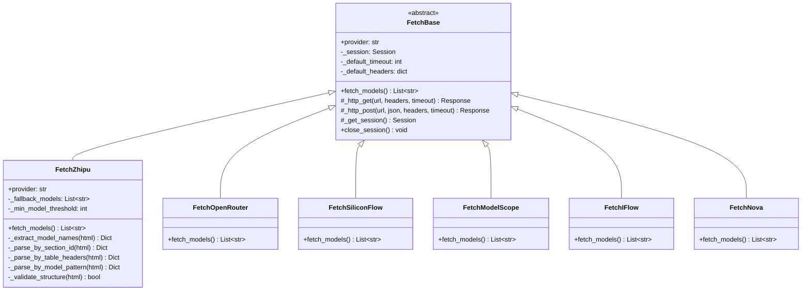

# Design Document: Fetcher Robustness Improvements

## Overview

本设计文档描述了对模型列表抓取器的健壮性改进，分为两个层面：

1. **FetchBase 层面**: 在基类中实现共享 HTTP Session，所有 Fetcher 子类自动获得连接复用能力
2. **FetchZhipu 层面**: 实现多策略 HTML 解析、结构变化检测和静态 fallback 机制

## Architecture



## Components and Interfaces

### 1. FetchBase Session Management

```python
class FetchBase(ABC):
    _session: ClassVar[Optional[requests.Session]] = None
    _session_lock: ClassVar[threading.Lock] = threading.Lock()
    _default_timeout: int = 30
    _default_headers: Dict[str, str] = {
        "User-Agent": "Mozilla/5.0 (Windows NT 10.0; Win64; x64) AppleWebKit/537.36"
    }
    
    @classmethod
    def _get_session(cls) -> requests.Session:
        """Get or create shared Session instance (thread-safe)"""
        
    @classmethod
    def close_session(cls) -> None:
        """Close shared Session and release resources"""
        
    def _http_get(self, url: str, headers: Optional[Dict] = None, 
                  timeout: Optional[int] = None) -> requests.Response:
        """Make GET request using shared Session"""
        
    def _http_post(self, url: str, json: Any = None, 
                   headers: Optional[Dict] = None,
                   timeout: Optional[int] = None) -> requests.Response:
        """Make POST request using shared Session"""
```

### 2. FetchZhipu Multi-Strategy Parser

```python
class FetchZhipu(FetchBase):
    def __init__(self, fallback_models: Optional[List[str]] = None,
                 min_model_threshold: int = 5):
        """Initialize with optional fallback and threshold"""
    
    def _extract_model_names(self, html: str) -> Dict[str, List[str]]:
        """Try strategies in order: section_id -> table_headers -> pattern"""
        
    def _parse_by_section_id(self, html: str) -> Dict[str, List[str]]:
        """Strategy 1: Parse using h2/h3 section IDs (current approach)"""
        
    def _parse_by_table_headers(self, html: str) -> Dict[str, List[str]]:
        """Strategy 2: Parse by detecting table headers containing '模型'"""
        
    def _parse_by_model_pattern(self, html: str) -> Dict[str, List[str]]:
        """Strategy 3: Extract using regex patterns for known model names"""
        
    def _validate_structure(self, html: str) -> bool:
        """Check if HTML contains expected structural markers"""
```

### 3. Strategy Interface

每个解析策略遵循统一接口：

```python
def _parse_by_xxx(self, html: str) -> Dict[str, List[str]]:
    """
    Args:
        html: Raw HTML content
        
    Returns:
        Dict mapping category names to lists of model IDs.
        Empty dict if strategy fails to extract any models.
    """
```

## Data Models

### ParseResult

```python
@dataclass
class ParseResult:
    models: Dict[str, List[str]]  # category -> model list
    strategy_used: str            # name of successful strategy
    model_count: int              # total models extracted
    warnings: List[str]           # any warnings generated
```

### Known Model Patterns (for Strategy 3)

```python
ZHIPU_MODEL_PATTERNS = [
    r'glm-\d+[a-z]*(?:-[a-z]+)*',      # glm-4, glm-4-plus, glm-4-flash
    r'chatglm[_-]?\d*[a-z]*',           # chatglm, chatglm3, chatglm_turbo
    r'codegeex-\d+[a-z]*',              # codegeex-4
    r'cogview-\d+[a-z]*',               # cogview-3, cogview-3-plus
    r'cogvideo[a-z]*-\d*[a-z]*',        # cogvideox-2
    r'embedding-\d+',                    # embedding-2, embedding-3
    r'charglm-\d+',                      # charglm-3
]
```

## Correctness Properties

*A property is a characteristic or behavior that should hold true across all valid executions of a system-essentially, a formal statement about what the system should do. Properties serve as the bridge between human-readable specifications and machine-verifiable correctness guarantees.*

Based on the prework analysis, the following properties have been identified after eliminating redundancy:

### Property 1: Session Sharing

*For any* set of Fetcher instances (regardless of subclass type), all HTTP requests SHALL use the same underlying Session object.

**Validates: Requirements 1.1**

### Property 2: Header Merging

*For any* custom headers provided to `_http_get` or `_http_post`, the resulting request SHALL contain both the custom headers and the default Session headers, with custom headers taking precedence on conflicts.

**Validates: Requirements 2.3**

### Property 3: Strategy Cascade

*For any* HTML input, the FetchZhipu parser SHALL attempt strategies in order (section_id → table_headers → pattern) until one succeeds or all fail. If all strategies fail, an empty dict SHALL be returned.

**Validates: Requirements 3.1, 3.2, 3.3**

### Property 4: Degradation Detection

*For any* HTML input that either lacks expected structural markers OR yields fewer models than the configured threshold, the FetchZhipu SHALL log a warning.

**Validates: Requirements 4.1, 4.2**

### Property 5: Success Logging

*For any* successful parse (at least one model extracted), the FetchZhipu SHALL log at DEBUG level the strategy name used and the model count.

**Validates: Requirements 3.4, 4.3**

### Property 6: Fallback Behavior

*For any* FetchZhipu instance with a configured fallback list, when all parsing strategies fail, the fallback list SHALL be returned and a warning SHALL be logged. When no fallback is configured and all strategies fail, an empty list SHALL be returned.

**Validates: Requirements 6.1, 6.2, 6.3**

### Property 7: Strategy Independence

*For any* parsing strategy method, it SHALL be callable independently with HTML input and return a Dict[str, List[str]] without side effects on other strategies.

**Validates: Requirements 5.3**

## Error Handling

| Scenario | Handling |
|----------|----------|
| Session creation fails | Log error, fall back to creating new session per request |
| HTTP connection timeout | Raise `requests.Timeout`, let caller handle |
| HTTP connection error | Raise `requests.ConnectionError`, let caller handle |
| All parsing strategies fail | Return empty dict, log warning with diagnostic info |
| HTML structure changed | Log warning, continue with fallback strategies |
| Model count below threshold | Log warning, return extracted models anyway |

## Testing Strategy

### Unit Tests

1. **Session Management**
   - Verify `_get_session()` returns same instance across calls
   - Verify `close_session()` properly cleans up
   - Verify default headers and timeout are set

2. **HTTP Methods**
   - Verify `_http_get` and `_http_post` use shared session
   - Verify header merging behavior
   - Verify timeout defaults

3. **Parsing Strategies**
   - Test each strategy with known HTML fixtures
   - Test strategy cascade with progressively degraded HTML
   - Test fallback list behavior

### Property-Based Tests

Using `hypothesis` library for property-based testing:

1. **Property 1 (Session Sharing)**: Generate random sequences of fetcher instantiations and verify session identity
2. **Property 2 (Header Merging)**: Generate random header dicts and verify merge behavior
3. **Property 3 (Strategy Cascade)**: Generate HTML variants and verify cascade order
4. **Property 6 (Fallback Behavior)**: Generate fallback configs and verify behavior consistency

Each property-based test MUST:
- Run minimum 100 iterations
- Be tagged with format: `**Feature: zhipu-fetcher-robustness, Property {N}: {property_text}**`
- Reference the correctness property it implements
