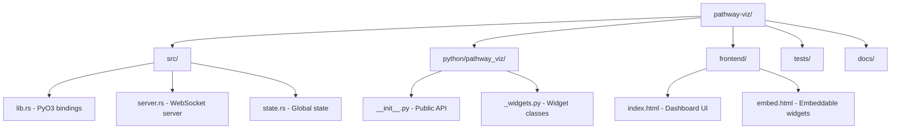

# Development Guide

## Prerequisites

- **Python 3.11+**
- **Rust** — install via [rustup.rs](https://rustup.rs/)
- **uv** — install via `curl -LsSf https://astral.sh/uv/install.sh | sh`
- **Docker** — only needed for Kafka demos

## Setup

```bash
git clone https://github.com/mvfolino68/pathway-viz.git
cd pathway-viz

uv venv && source .venv/bin/activate
uv pip install maturin
maturin develop                # Build Rust extension
uv pip install -e ".[dev]"     # Install dev dependencies
pytest                         # Verify everything works
```

## Project Structure



## Building

```bash
maturin develop              # Fast debug build
maturin develop --release    # Optimized build (for perf testing)
maturin build --release      # Build distributable wheels → target/wheels/
```

After any Rust changes, run `maturin develop` to rebuild.

## Testing & Linting

```bash
pytest                        # Run tests
ruff check . && ruff format . # Lint and format Python
cargo fmt && cargo clippy     # Lint Rust
```

## Common Tasks

| Task               | Command                                                       |
| ------------------ | ------------------------------------------------------------- |
| Add widget type    | Edit `_widgets.py` → `index.html` → `__init__.py` → add tests |
| Modify Rust server | Edit `src/` → `maturin develop`                               |
| Update frontend    | Edit `frontend/` → refresh browser                            |

## Releasing

Tag-triggered releases. Push a `v*` tag → GitHub Actions builds and publishes to PyPI.

```bash
# 1. Update version in pyproject.toml AND Cargo.toml
# 2. Regenerate locks
uv lock && cargo check

# 3. Commit and tag
git add -A
git commit -m "Release vX.Y.Z"
git tag vX.Y.Z
git push origin master && git push origin vX.Y.Z
```

## Docker

```bash
docker build -t pathway-viz .
docker run -p 3000:3000 pathway-viz pathway-viz demo
```

## Contributing

1. Fork and create a feature branch from `main`
2. Make changes, ensure tests pass (`pytest`)
3. Lint with `ruff check . && ruff format .`
4. Open a PR with a clear description

### Reporting Issues

Include:

- Python/Rust versions (`python --version`, `rustc --version`)
- OS and version
- Steps to reproduce
- Expected vs actual behavior

## Troubleshooting

| Problem                             | Solution                                                     |
| ----------------------------------- | ------------------------------------------------------------ |
| Module not found after Rust changes | `maturin develop`                                            |
| Lock file conflicts                 | `uv lock && cargo check`                                     |
| Docker build fails                  | `docker pull python:3.12-slim && docker pull rust:1.83-slim` |

## Resources

- [Maturin](https://www.maturin.rs/) — Rust Python extensions
- [PyO3](https://pyo3.rs/) — Rust bindings for Python
- [uv](https://docs.astral.sh/uv/) — Fast Python package manager
