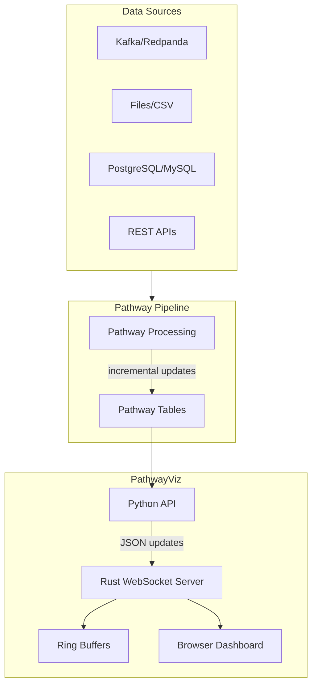

# PathwayViz

[](https://pypi.org/project/pathway-viz/)
[](https://opensource.org/licenses/MIT)

Real-time dashboards for streaming data pipelines.

Building dashboards for streaming pipelines is typically a choice between bad options:

- **Jupyter notebooks** - Good for exploration, but not suitable for production
- **Grafana** - Requires learning PromQL and running additional services
- **Custom React app** - Adds frontend development and WebSocket management to your workload

PathwayViz provides a simpler approach: add a few lines to your Python pipeline to get a embedable dashboard.

```python
import pathway as pw
import pathwayviz as pv

# Stream data from Kafka, files, databases, APIs
orders = pw.io.kafka.read(...)
revenue = orders.reduce(revenue=pw.reducers.sum(pw.this.amount))

# Dashboard widgets
pv.stat(revenue, "revenue", title="Revenue", unit="$")
pv.start()
pw.run()
```

Visit `http://localhost:3000` to view your dashboard.

## What is Pathway?

Pathway is a Python framework for building streaming data pipelines. Somewhat like pandas for real-time data:

- **Read from anywhere**: Kafka, files, databases, APIs
- **Process like pandas**: Use familiar operations like `groupby()`, `filter()`, `reduce()`
- **Incremental computation**: Only recompute what changed when new data arrives

```python
# This looks familiar, right?
orders = pw.io.kafka.read("orders", format="json")
hourly_sales = orders.groupby(pw.this.category).reduce(
    category=pw.this.category,
    total=pw.reducers.sum(pw.this.amount)
)
```

Pathway handles the hard stuff: backpressure, state management, exactly-once processing. You write the logic that matters.

## Architecture



The Rust server handles the heavy lifting - WebSockets, caching, serving assets. No Python GIL bottlenecks, no async nightmares.

## Quick Start

```bash
pip install pathway-viz
```

### Basic Example

```python
import pathway as pw
import pathwayviz as pv

# Read from Kafka (or files, databases, etc.)
orders = pw.io.kafka.read(
    {"bootstrap.servers": "localhost:9092"},
    topic="orders",
    format="json"
)

# Calculate metrics
totals = orders.reduce(
    revenue=pw.reducers.sum(pw.this.amount),
    count=pw.reducers.count()
)

# Create dashboard
pv.stat(totals, "revenue", title="Revenue", unit="$")
pv.stat(totals, "count", title="Orders")
pv.start()
pw.run()
```

Visit `http://localhost:3000` - your dashboard is live.

### Embed in Your App

Need a widget in your existing app? Use an iframe:

```html
<iframe src="http://localhost:3000/embed/revenue"></iframe>
```

Or use the React/Svelte components (see [embedding docs](./docs/embedding.md)).

## Real Example: E-Commerce Dashboard

Here's what a production setup looks like:

```python
import pathway as pw
import pathwayviz as pv

# Stream orders from Kafka
orders = pw.io.kafka.read(kafka_settings, topic="orders", format="json")

# Real-time aggregations
revenue_by_region = orders.groupby(pw.this.region).reduce(
    region=pw.this.region,
    revenue=pw.reducers.sum(pw.this.total),
    orders=pw.reducers.count()
)

# Time-based metrics (orders per minute)
orders_per_min = orders.windowby(
    pw.this.timestamp,
    window=pw.temporal.tumbling(duration=timedelta(minutes=1))
).reduce(
    window_end=pw.this._pw_window_end,
    count=pw.reducers.count()
)

# Dashboard layout
pv.title("Live E-Commerce Metrics")
pv.stat(orders.reduce(revenue=pw.reducers.sum(pw.this.total)), "revenue", title="Revenue", unit="$")
pv.chart(orders_per_min, "count", x_column="window_end", title="Orders/Min")
pv.table(revenue_by_region, title="Revenue by Region")

pv.start()
pw.run()
```

Run the demo to see it in action:

```bash
python -m pathway_viz
```

## Why Rust?

The hot path needed speed. Python's great for logic, but WebSockets + high throughput = pain points:

- **Tokio async runtime**: Handles thousands of concurrent connections
- **Ring buffers**: New clients catch up instantly without replaying the entire stream
- **Zero-copy**: Serve frontend assets directly from the binary
- **No GIL**: Actual parallelism when you need it

The Python API stays simple. The Rust does the heavy lifting.

## Install

```bash
# Basic install
pip install pathway-viz

# With demo dependencies (Kafka, etc.)
pip install pathway-viz[all]
```

## Documentation

- [Getting Started](./docs/getting-started.md) - Full setup guide
- [Widgets](./docs/widgets.md) - All available dashboard components
- [Embedding](./docs/embedding.md) - React/Svelte components and iframes
- [Deployment](./docs/deployment.md) - Production deployment patterns
- [Concepts](./docs/concepts.md) - Deep dive on architecture and patterns

## What's Next

- [x] Core widgets: stat, chart, gauge, table
- [x] Pathway integration
- [x] Embed mode for iframes
- [ ] Theme customization
- [ ] Prometheus metrics endpoint
- [ ] Authentication/SSO

## License

MIT - build cool stuff with it.
