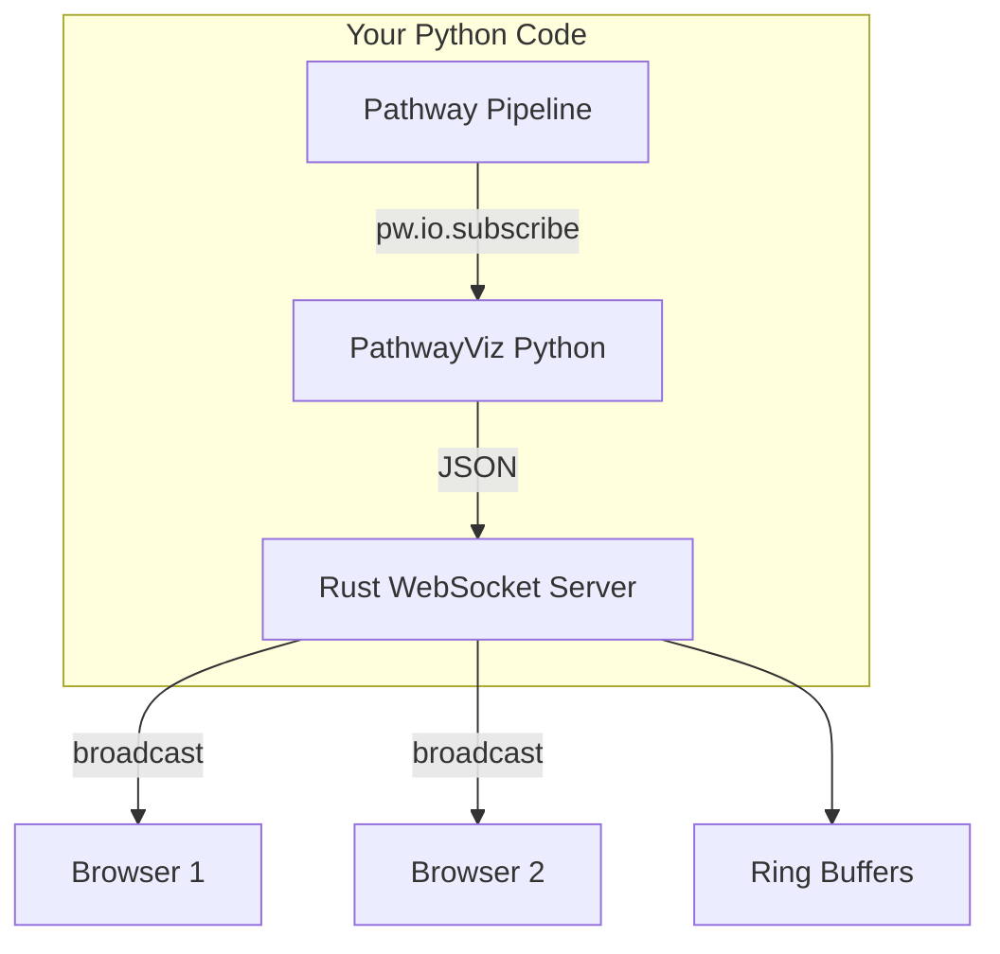

# Core Concepts

## Architecture



### Components

| Component             | Role                                                                                                                                                 |
| --------------------- | ---------------------------------------------------------------------------------------------------------------------------------------------------- |
| **Pathway**           | Stream processing engine. Reads from Kafka/files, transforms data, computes aggregations. Uses incremental computation—only recomputes what changed. |
| **PathwayViz Python** | Subscribes to Pathway tables via `pw.io.subscribe()`, converts updates to JSON, forwards to Rust server.                                             |
| **Rust Server**       | High-throughput WebSocket fan-out. Maintains ring buffers for history. Serves embedded frontend. No Python GIL bottleneck.                           |
| **Browser**           | Renders dashboard with uPlot charts, tables, gauges.                                                                                                 |

## How It Works

Pass Pathway tables directly. PathwayViz auto-subscribes via `pw.io.subscribe()` and updates widgets when data changes.

```python
import pathway as pw
import pathwayviz as pv

orders = pw.io.kafka.read(...)
totals = orders.reduce(revenue=pw.reducers.sum(pw.this.amount))

pv.stat(totals, "revenue", title="Revenue")
pv.start()
pw.run()
```

## Aggregations

| Type     | Code                                          | Result                       | Best Widget     |
| -------- | --------------------------------------------- | ---------------------------- | --------------- |
| Global   | `orders.reduce(revenue=pw.reducers.sum(...))` | Single row, updates in place | `stat`, `gauge` |
| Grouped  | `orders.groupby(pw.this.region).reduce(...)`  | One row per group            | `table`         |
| Windowed | `orders.windowby(...).reduce(...)`            | One row per time bucket      | `chart`         |

## Windowing

Groups data into time buckets for questions like "orders per minute" or "hourly revenue."

```mermaid
gantt
    title Window Types
    dateFormat X
    axisFormat %s

    section Tumbling
    W1 :0, 5
    W2 :5, 10
    W3 :10, 15

    section Sliding
    W1 :0, 8
    W2 :3, 11
    W3 :6, 14
```



### Tumbling Windows

Fixed, non-overlapping buckets:

```python
from datetime import timedelta

orders_per_minute = orders.windowby(
    pw.this.event_time,
    window=pw.temporal.tumbling(duration=timedelta(minutes=1)),
).reduce(
    window_end=pw.this._pw_window_end,
    count=pw.reducers.count(),
)
```

### Sliding Windows

Overlapping windows for smoothed metrics:

```python
orders_5min = orders.windowby(
    pw.this.event_time,
    window=pw.temporal.sliding(
        duration=timedelta(minutes=5),
        hop=timedelta(minutes=1),
    ),
).reduce(count=pw.reducers.count())
```

### With PathwayViz

```python
pv.chart(orders_per_minute, "count", x_column="window_end", title="Orders/min")
```

## Event Time vs Processing Time

| Type            | Column               | Use Case                                 |
| --------------- | -------------------- | ---------------------------------------- |
| Event time      | `pw.this.event_time` | Data has meaningful timestamps           |
| Processing time | `pw.this._pw_time`   | Real-time buckets, no timestamps in data |
