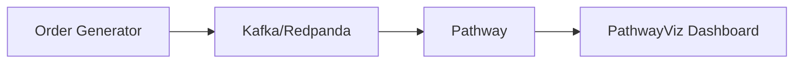

# E-Commerce Demo

Full streaming pipeline: Kafka/Redpanda → Pathway → PathwayViz.



## Run

```bash
pip install pathway-viz[all]
pathway-viz demo
```

**Requirements:** Python 3.11+, Docker

Opens dashboard at `http://localhost:3000`

## Widget IDs

For embedding:

| Widget    | ID          |
| --------- | ----------- |
| Revenue   | `revenue`   |
| Orders    | `orders`    |
| Avg Order | `avg_order` |

Embed at `http://localhost:3000/embed/{widget_id}`
