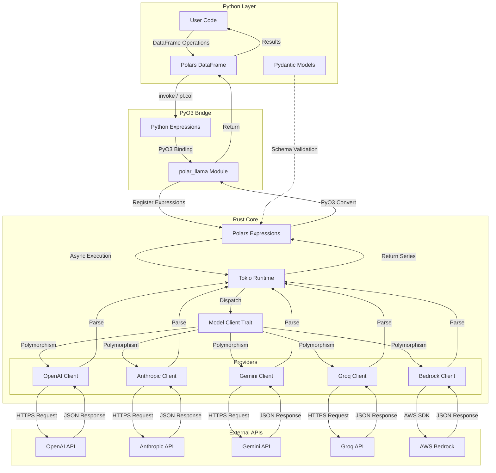
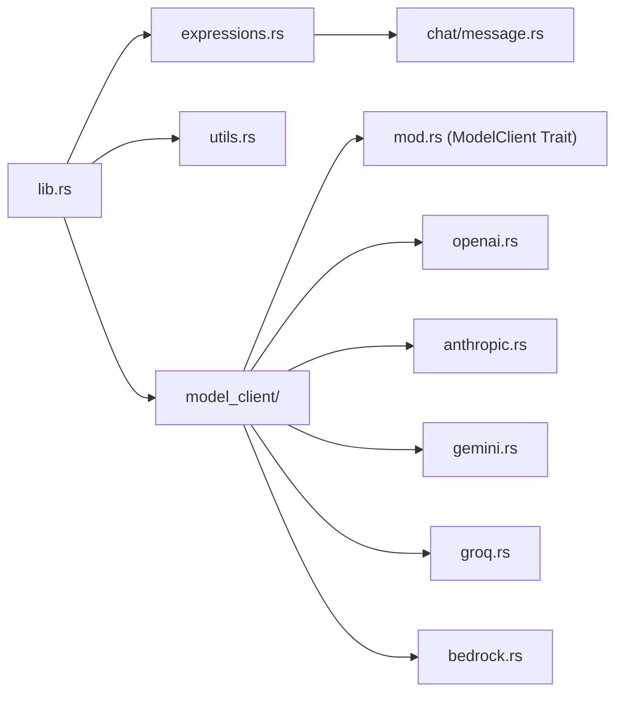
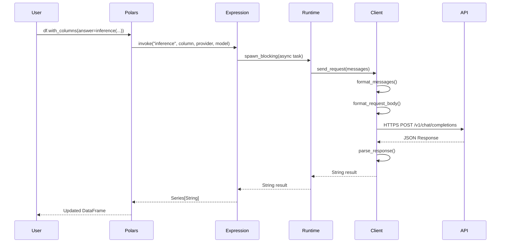
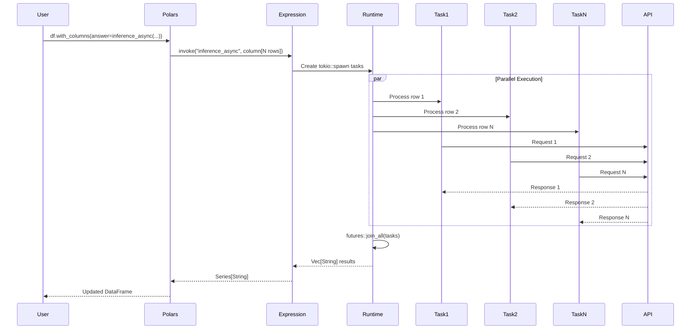
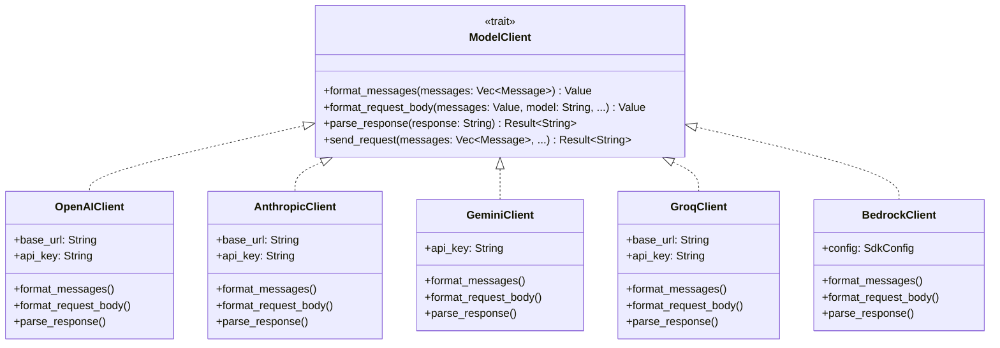
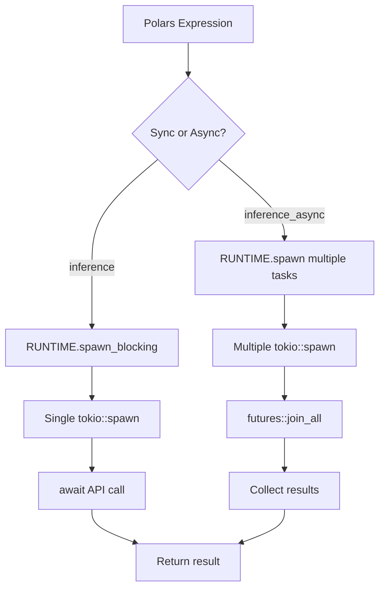
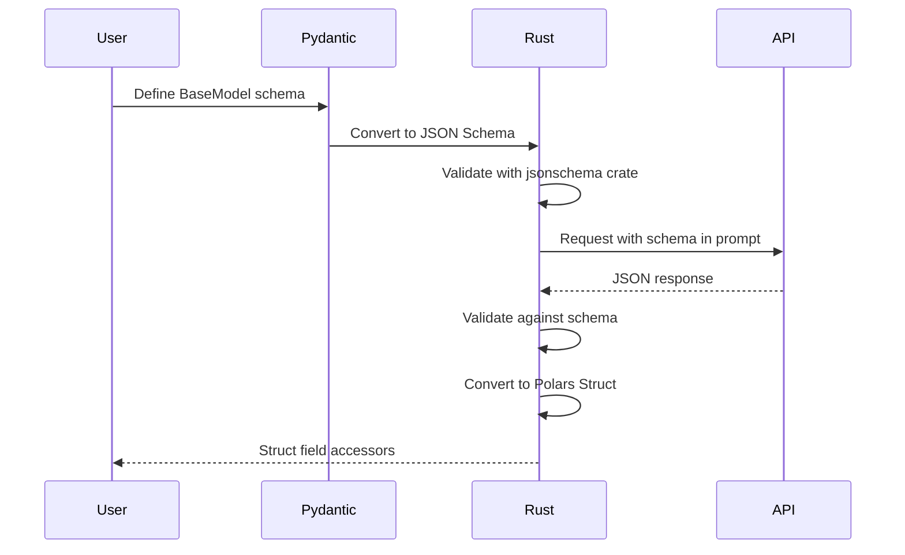
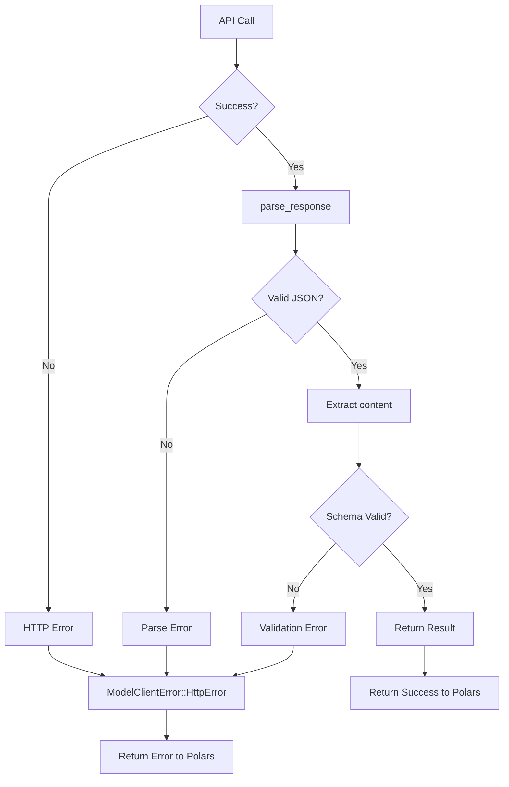
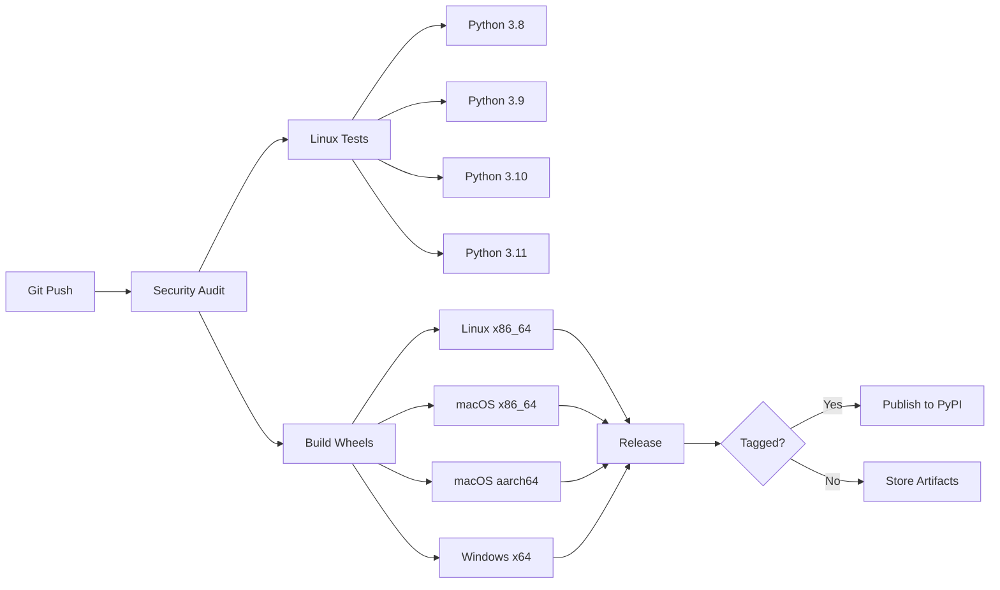

# Polar Llama Architecture

This document provides a comprehensive overview of the Polar Llama architecture, design patterns, and data flow.

## Table of Contents

- [Overview](#overview)
- [High-Level Architecture](#high-level-architecture)
- [Component Architecture](#component-architecture)
- [Data Flow](#data-flow)
- [Provider Abstraction](#provider-abstraction)
- [Async Runtime](#async-runtime)
- [Python Integration](#python-integration)
- [Performance Optimizations](#performance-optimizations)

## Overview

Polar Llama is a hybrid Rust/Python library that integrates Large Language Model (LLM) inference capabilities into the Polars dataframe ecosystem. The library is designed for:

- **Performance**: Rust core with async parallel execution
- **Ease of Use**: Python API with Polars expression syntax
- **Flexibility**: Support for multiple LLM providers
- **Type Safety**: Structured outputs with Pydantic validation

## High-Level Architecture



## Component Architecture

### 1. Python Layer (`Python`)

The user-facing interface where developers interact with Polar Llama through familiar Polars syntax.

```python
# Example: User code
df = pl.DataFrame({'questions': ['What is AI?']})
df = df.with_columns(
    answer=inference_async(
        pl.col('questions'),
        provider=Provider.OPENAI,
        model='gpt-4'
    )
)
```

### 2. PyO3 Bridge (`src/lib.rs`)

The bridge between Python and Rust, using PyO3 for zero-copy interop.

```rust
#[pymodule]
fn polar_llama(_py: Python, m: &PyModule) -> PyResult<()> {
    m.add_class::<PyProvider>()?;
    Ok(())
}
```

**Key Components**:
- Module registration
- Provider enum wrapper
- Expression function exports

### 3. Rust Core

The performance-critical components implemented in Rust.

#### Module Structure



**File Responsibilities**:

| File | Lines | Responsibility |
|------|-------|----------------|
| `lib.rs` | ~100 | Module exports, PyModule setup, Provider enum |
| `expressions.rs` | ~600 | Polars expression implementations |
| `utils.rs` | ~150 | HTTP utilities, API call helpers |
| `model_client/mod.rs` | ~469 | ModelClient trait, error types, shared logic |
| `model_client/openai.rs` | ~168 | OpenAI API implementation |
| `model_client/anthropic.rs` | ~225 | Anthropic/Claude API implementation |
| `model_client/gemini.rs` | ~182 | Google Gemini API implementation |
| `model_client/groq.rs` | ~166 | Groq API implementation |
| `model_client/bedrock.rs` | ~194 | AWS Bedrock API implementation |
| `chat/message.rs` | ~50 | Message type definitions |

## Data Flow

### Sequential Flow: Single Inference



### Parallel Flow: Async Batch Inference



## Provider Abstraction

The `ModelClient` trait provides a unified interface for all LLM providers.



### Trait Methods

1. **`format_messages()`**: Converts internal Message format to provider-specific JSON
2. **`format_request_body()`**: Creates the full request payload
3. **`parse_response()`**: Extracts the text response from provider JSON
4. **`send_request()`**: Orchestrates the full request/response cycle

### Adding a New Provider

To add a new provider:

1. Create `src/model_client/new_provider.rs`
2. Implement the `ModelClient` trait
3. Add to `src/model_client/mod.rs` exports
4. Add enum variant in `src/lib.rs`
5. Update provider dispatch in `src/expressions.rs`

## Async Runtime

Polar Llama uses a global Tokio runtime for efficient async operations.

```rust
use once_cell::sync::Lazy;
use tokio::runtime::Runtime;

static RUNTIME: Lazy<Runtime> = Lazy::new(|| {
    Runtime::new().expect("Failed to create Tokio runtime")
});
```

### Why Global Runtime?

- **Performance**: Avoid runtime creation overhead per-request
- **Resource Management**: Single thread pool for all async operations
- **PyO3 Compatibility**: Works around Python GIL constraints

### Async Execution Model



## Python Integration

### Expression Registration

Polars expressions are registered at module initialization:

```rust
#[pymodule]
fn polar_llama(_py: Python, m: &PyModule) -> PyResult<()> {
    // Register expressions
    polars_expressions::register_plugin_function::<inference>()?;
    polars_expressions::register_plugin_function::<inference_async>()?;
    // ...
    Ok(())
}
```

### Type Conversions

| Python Type | Rust Type | Conversion |
|-------------|-----------|------------|
| `str` | `String` | Direct |
| `List[Dict]` | `Vec<Message>` | JSON deserialize |
| `polars.Series` | `Series` | PyO3 Polars integration |
| `pydantic.BaseModel` | `serde_json::Value` | JSON schema |
| `Provider` enum | `PyProvider` | PyO3 enum wrapper |

### Pydantic Integration



## Performance Optimizations

### 1. Memory Allocator

**Linux**: Uses jemalloc for better performance

```toml
[target.'cfg(target_os = "linux")'.dependencies]
jemallocator = { version = "0.5", features = ["disable_initial_exec_tls"] }
```

### 2. Link-Time Optimization (LTO)

```toml
[profile.release]
codegen-units = 1
lto = true
```

**Benefits**:
- Smaller binary size
- Better runtime performance
- Cross-crate inlining

### 3. Async Parallel Execution

```rust
// Parallel execution with tokio
let tasks: Vec<_> = rows
    .iter()
    .map(|row| tokio::spawn(async move { process_row(row).await }))
    .collect();

let results = futures::join_all(tasks).await;
```

**Benefits**:
- Non-blocking I/O
- Efficient thread pool usage
- Scales to hundreds of concurrent requests

### 4. Zero-Copy PyO3

PyO3 enables zero-copy data sharing between Python and Rust for Polars Series.

### 5. Lazy Static Runtime

The global Tokio runtime is initialized once and reused across all requests.

## Error Handling



### Error Types

```rust
pub enum ModelClientError {
    HttpError(String),
    ParseError(String),
    ValidationError(String),
    ApiKeyMissing(String),
    // ...
}
```

## Configuration

### Environment Variables

| Variable | Provider | Required |
|----------|----------|----------|
| `OPENAI_API_KEY` | OpenAI | For OpenAI calls |
| `ANTHROPIC_API_KEY` | Anthropic | For Claude calls |
| `GEMINI_API_KEY` | Google | For Gemini calls |
| `GROQ_API_KEY` | Groq | For Groq calls |
| `AWS_ACCESS_KEY_ID` | AWS Bedrock | For Bedrock calls |
| `AWS_SECRET_ACCESS_KEY` | AWS Bedrock | For Bedrock calls |
| `AWS_REGION` | AWS Bedrock | For Bedrock calls |

### Provider Selection

```python
from polar_llama import Provider

# Available providers
Provider.OPENAI
Provider.ANTHROPIC
Provider.GEMINI
Provider.GROQ
Provider.BEDROCK
```

## Testing Architecture

### Test Organization

```
tests/
├── test_parallel_inference.py    # API integration tests
├── test_imports.py               # Module structure tests
├── test_taxonomy_tagging.py      # Taxonomy feature tests
├── test_structured_outputs.py    # Pydantic schema tests
├── test_message_arrays.py        # Multi-message tests
└── model_client_tests.rs         # Rust unit tests
```

### CI Pipeline



## Future Enhancements

1. **Streaming Responses**: Support for streaming LLM outputs
2. **Caching Layer**: Response caching for repeated queries
3. **Batch API Support**: Use provider batch APIs where available
4. **Custom Providers**: Plugin system for custom LLM providers
5. **Observability**: OpenTelemetry integration for tracing

---

**Last Updated**: 2025-12-17
**Version**: 0.2.2
